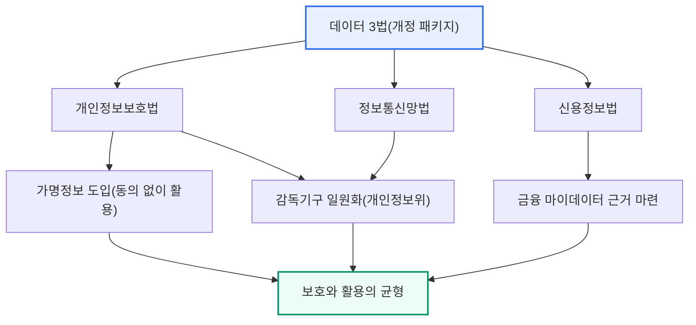
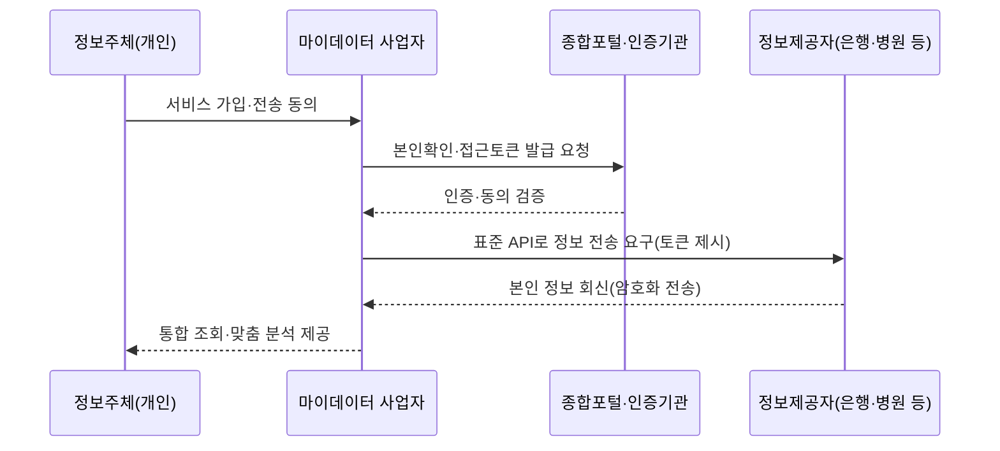

# 데이터 3법과 마이데이터

## 1. 개요

### 가. 정의
> **데이터 3법**은 개인정보보호법·정보통신망법·신용정보법을 통칭하며, 개인정보 보호를 강화하면서도 **가명정보 개념 도입 등으로 데이터 활용의 길을 연** 법 개정(2020년 시행)이다. **마이데이터(MyData)** 는 정보주체가 여러 기관에 흩어진 자신의 개인정보를 **직접 관리하고, 원하는 곳으로 전송을 요구(전송요구권)** 하여 통합·활용하도록 하는 **개인정보 자기결정권** 기반 서비스다.

데이터 3법 개정의 핵심 취지는 '**보호와 활용의 균형(Balance between Protection and Utilization)**'이다. 4차 산업혁명 시대에 데이터는 원유에 비유될 만큼 핵심 생산요소가 되었지만, 개인정보 규제가 지나치게 엄격하면 데이터 기반 산업이 위축되고, 반대로 규제가 느슨하면 프라이버시가 침해되는 딜레마가 있었다. 개정 이전 한국은 개인정보를 활용하려면 원칙적으로 정보주체의 사전 동의를 받아야 했는데(옵트인), 빅데이터·AI 학습처럼 대량의 데이터를 결합·분석해야 하는 산업에서는 이 동의 획득 비용이 사실상 활용을 가로막는 장벽으로 작용했다. 데이터 3법은 이 딜레마를 **가명정보(Pseudonymized Data)** 라는 제도적 장치로 풀었다. 개인을 직접 특정할 수 없도록 가명 처리한 정보는 통계 작성·과학적 연구·공익적 기록보존 목적에 한해 정보주체의 동의 없이 활용할 수 있게 열어 주되, 특정 개인을 다시 알아보는 **재식별을 엄격히 금지**하고 위반 시 과징금·형벌로 제재하는 방식이다.

동시에 분산되어 있던 개인정보 감독기구를 **개인정보보호위원회(개인정보위)** 로 일원화해 규율 체계의 중복과 사각지대를 정비했다. 개정 이전에는 개인정보보호법(행정안전부)·정보통신망법(방송통신위원회)·신용정보법(금융위원회)이 유사한 사안을 각기 다른 기준으로 규율해 수범자 혼란이 컸는데, 이를 하나의 독립 감독기구로 모은 것이다. 마이데이터는 바로 이 정비된 기반 위에서 작동한다. 여러 기관에 파편화된 '내 정보'를 내가 지정한 사업자에게 모아, 자산 통합조회·맞춤 금융추천·건강관리 같은 개인화 서비스를 받게 하는 **데이터 주권(Data Sovereignty)** 의 구체적 실현이 마이데이터다.

### 나. 개정 배경과 필요성
데이터 3법 개정은 세 갈래의 상반·중첩된 요구가 맞물린 결과다. 첫째는 **데이터 경제 활성화** 요구로, EU가 2018년 GDPR과 함께 데이터 이동권을 제도화하며 데이터 산업 기반을 닦자 한국도 국제 정합성과 산업 경쟁력을 위해 활용 근거가 필요했다. 둘째는 **프라이버시 보호 강화** 요구로, 데이터 결합이 늘수록 재식별·유출 위험이 커지므로 활용을 여는 만큼 안전장치도 강화해야 했다. 셋째는 앞서 말한 **감독기구 분산의 해소**다. 이 세 요구를 하나의 개정 패키지로 묶어, '동의 없는 활용의 길(가명정보)'과 '재식별 금지·감독 일원화(보호)'를 맞바꾸는 균형점을 제도화한 것이 데이터 3법의 본질이다.

## 2. 데이터 3법의 구조와 주요 개정 내용

### 가. 전체 구조
아래 전체 구조도는 데이터 3법이 세 법률을 어떻게 아우르며, 가명정보와 감독 일원화라는 두 축으로 귀결되는지를 보여준다.

```mermaid
flowchart TB
  D["데이터 3법(개정 패키지)"] --> P["개인정보보호법"]
  D --> N["정보통신망법"]
  D --> C["신용정보법"]
  P --> G1["가명정보 도입(동의 없이 활용)"]
  P --> G2["감독기구 일원화(개인정보위)"]
  N --> G2
  C --> G3["금융 마이데이터 근거 마련"]
  G1 --> BAL["보호와 활용의 균형"]
  G2 --> BAL
  G3 --> BAL
  style D fill:#e8f0fe,stroke:#2f6fed,stroke-width:2px
  style BAL fill:#ecfdf5,stroke:#059669,stroke-width:2px
```

이 그림의 핵심은 세 법률이 각기 다른 영역(일반 개인정보·온라인·신용정보)을 다루면서도 결국 '보호와 활용의 균형'이라는 하나의 목표로 수렴한다는 점이다. 정보통신망법의 개인정보 조항이 개인정보보호법으로 이관되어 중복이 해소되고, 신용정보법이 금융 마이데이터의 법적 근거를 마련하면서, 흩어져 있던 규율이 정합성을 갖추게 되었다.

### 나. 법률별 주요 개정 내용
아래 표는 세 법률의 개정 요지를 정리한 보조 자료이며, 각 항목의 배경은 위·아래 산문에서 설명한다.

| 법 | 주요 개정 내용 |
|---|---|
| **개인정보보호법** | 가명정보 개념 도입(통계·연구·공익 목적 동의 없이 활용), 개인정보보호위원회로 감독 일원화, 재식별 금지·처벌 신설 |
| **정보통신망법** | 개인정보 관련 규정을 개인정보보호법으로 이관(규율 중복 해소), 온라인 개인정보 특례 통합 |
| **신용정보법** | 금융 마이데이터(본인신용정보관리업) 근거 마련, 가명정보·데이터 결합 활용 허용, 정보전송요구권 도입 |

개정의 실무적 무게중심은 **가명정보 활용 허용**과 **데이터 결합 제도화**에 있다. 서로 다른 기관이 보유한 가명정보를 결합하려면 임의로 합칠 수 없고, 국가가 지정한 **데이터전문기관(결합전문기관)** 을 거쳐 안전하게 결합한 뒤 재식별 위험을 검증받아야 한다. 예컨대 의료기관의 진료 데이터와 보험사의 청구 데이터를 결합해 질병 예측 모델을 만드는 연구가 이 절차를 통해 합법적으로 가능해졌다. 이처럼 '누구나 마음대로'가 아니라 '지정된 기관을 통해 통제된 조건에서'라는 안전판을 두어, 활용을 열되 오·남용을 막는 구조를 취한 것이 개정의 특징이다.

### 다. 개인정보의 3분류
데이터 3법 이후 개인정보는 처리 가능 범위에 따라 세 단계로 구분된다. 이 분류를 이해하는 것이 가명정보 제도의 핵심이다.

| 구분 | 식별 가능성 | 활용 |
|---|---|---|
| **개인정보** | 직접 식별 가능 | 원칙적으로 동의 필요 |
| **가명정보** | 추가 정보 결합 시에만 식별 | 통계·연구·공익 목적 동의 없이 활용(재식별 금지) |
| **익명정보** | 복원 불가(식별 불가능) | 개인정보 아님, 자유 활용 |

가명정보가 '동의 없는 활용'과 '완전한 보호' 사이의 절충 지대라는 점이 중요하다. 익명정보는 자유롭게 쓸 수 있지만 복원이 불가능해 분석 가치가 크게 떨어지고, 원본 개인정보는 활용에 동의가 필요해 비용이 크다. 가명정보는 분석 가치를 상당 부분 유지하면서도 재식별을 금지해 위험을 통제하는, 활용과 보호의 접점에 놓인 제도적 발명이다.

## 3. 마이데이터의 개념과 동작 구조

### 가. 전송요구권과 데이터 흐름
마이데이터의 법적 심장은 **전송요구권(정보전송요구권)** 이다. 정보주체가 특정 기관(정보제공자)에 보관된 자신의 정보를 다른 기관(마이데이터 사업자)으로 보내라고 요구할 수 있는 권리로, GDPR의 '데이터 이동권(Right to Data Portability)'에 대응한다. 아래 세부 아키텍처도는 마이데이터의 실제 데이터 흐름을 나타낸다.

```mermaid
sequenceDiagram
  participant U as 정보주체(개인)
  participant M as 마이데이터 사업자
  participant CA as 종합포털·인증기관
  participant P as 정보제공자(은행·병원 등)
  U->>M: 서비스 가입·전송 동의
  M->>CA: 본인확인·접근토큰 발급 요청
  CA-->>M: 인증·동의 검증
  M->>P: 표준 API로 정보 전송 요구(토큰 제시)
  P-->>M: 본인 정보 회신(암호화 전송)
  M-->>U: 통합 조회·맞춤 분석 제공
```

이 흐름의 핵심은 '개인이 자기 정보의 이동을 지시하고, 그 이동이 표준 API·인증·암호화로 안전하게 매개된다'는 점이다. 정보제공자는 개인의 동의와 유효한 접근토큰이 확인되어야만 정보를 회신하며, 동의는 목적·항목·기간이 특정되어야 하고 언제든 철회할 수 있다. 즉 마이데이터는 단순한 데이터 복사가 아니라, **정보주체의 통제권을 절차적으로 보장한 전송 체계**다.

### 나. 산업별 제공정보
마이데이터는 산업별로 제공 정보의 범위와 시행 시점이 다르다. 금융 분야가 2022년 1월 전면 시행으로 가장 앞서 나갔고, 의료·공공 분야로 확산되고 있다.

| 산업 | 주요 제공정보 | 활용 예시 |
|---|---|---|
| **금융** | 계좌·카드·대출·투자·보험 내역 | 여러 금융사 자산 통합 조회, 맞춤 대출·상품 추천 |
| **의료** | 진료·처방·건강검진·투약 기록 | 개인 건강관리(PHR), 만성질환 관리 |
| **공공** | 세금·복지·자격·행정 정보 | 복지 수급 자격 자동 안내, 행정서류 간소화 |
| **통신·유통** | 통신 이용·소비·구독 내역 | 요금제 최적화, 소비 패턴 기반 추천 |

금융 마이데이터가 선도한 이유는 신용정보법이 **본인신용정보관리업**이라는 허가 업종과 표준 API 체계를 먼저 제도화했기 때문이다. 여러 은행·카드사에 흩어진 자산을 하나의 앱에서 통합 조회하고 순자산·소비를 분석해 주는 서비스가 대표 사례로, 시행 후 수천만 명 규모의 가입자가 형성되며 개인화 금융의 표준으로 자리 잡았다. 반면 의료 마이데이터(예: '건강정보 고속도로')는 데이터 표준화와 민감정보 보호 요건이 까다로워 확산 속도가 상대적으로 완만한데, 이는 산업별 데이터 특성과 규제 수준의 차이가 시행 순서에 반영된 결과다.

## 4. 국내외 비교와 시사점

마이데이터의 사상적 원류는 유럽·핀란드의 MyData 운동과 GDPR의 데이터 이동권이다. 다만 GDPR의 이동권이 개인이 자신의 데이터를 '내려받거나 옮길 수 있다'는 권리 선언에 가깝다면, 한국의 마이데이터는 신용정보법을 통해 **표준 API·허가 사업자·과금 체계까지 갖춘 산업형 모델**로 구체화한 점이 차별적이다. 이 차이가 생긴 이유는, 한국이 권리 보장에 더해 '작동하는 시장'을 만들기 위해 정보제공자-사업자 간 표준 전송 규격과 비용 정산 구조를 제도로 강제했기 때문이다. 그 결과 서비스 확산은 빨랐지만, 정보제공자의 API 구축 부담과 데이터 제공 대가를 둘러싼 이해 조정이라는 실무적 과제도 함께 안게 되었다.

## 5. 심화 — 마이데이터 2.0과 전 분야 확산

최근 정책 흐름은 금융에 국한되던 마이데이터를 전 산업으로 넓히는 방향이다. 2023년 개정 개인정보보호법에 **개인정보 전송요구권**이 일반 규정으로 도입되면서, 금융뿐 아니라 의료·공공·통신 등 모든 분야에 마이데이터를 적용할 법적 토대가 마련되었다(시행령·표준화 후속 추진 중). 이른바 '마이데이터 2.0'은 ① 정보제공 범위 확대, ② 정보주체 통제권 강화(전송 이력·철회의 실효성 제고), ③ 데이터 표준화·상호운용성 확대, ④ 마이데이터 사업자의 겸영·결합 서비스 확대를 지향한다.

다만 전 분야 확산에는 해결 과제도 뚜렷하다. 분야마다 데이터 형식·의미가 달라 **표준화(온톨로지·API 규격)** 가 선결되어야 하고, 의료·통신 같은 민감정보는 유출 시 피해가 커 **강화된 보안·동의 관리**가 필요하다. 또한 소수 대형 플랫폼이 데이터를 과점하면 오히려 데이터 주권이 형해화될 수 있어, **정보주체 중심성**을 제도적으로 지키는 것이 관건이다. 이 대목은 정보관리기술사 관점에서 '기술 표준화·보안 아키텍처·거버넌스'가 어떻게 유기적으로 맞물려야 하는지를 보여주는 좋은 사례다.

## 6. 고려사항 및 시사점

1. **표준화와 안전한 전송 인프라가 활성화의 전제**다. 기관마다 다른 데이터를 API로 표준화하고, 인증·암호화·접근토큰 기반의 안전한 전송 규격을 갖추어야 마이데이터가 실제로 작동한다. 표준이 없으면 각 기관이 임의 방식으로 데이터를 제공해 상호운용성이 무너지고 확산이 정체된다.

2. **보안·프라이버시가 신뢰의 기반**이다. 흩어진 정보를 한곳에 모을수록 유출·재식별 시 피해가 집중되므로, 최소수집·강력한 인증(MFA)·전송 및 저장 암호화·동의 철회의 실효적 보장이 필수다. 마이데이터의 편익은 '안전하다는 신뢰' 위에서만 성립한다.

3. **가명정보 재식별 위험 관리와 거버넌스**가 병행되어야 한다. 데이터 결합·가명처리가 늘수록 결합 데이터로부터의 재식별 가능성을 상시 점검해야 하며, 데이터전문기관을 통한 결합 통제·재식별 금지 준수·정기 위험평가가 오·남용을 막는 제도적 안전판으로 작동해야 한다.

4. **정보주체 중심의 데이터 주권 실현**으로 나아가야 한다. 기술과 제도가 결국 지향하는 것은 개인이 자기 데이터의 주인이 되어 그 가치를 되찾는 것이므로, 소수 플랫폼의 데이터 과점을 견제하고 전송 이력·통제권을 개인이 실질적으로 행사할 수 있는 설계가 요구된다.

5. **국제 정합성과 데이터 국경 이슈**를 고려해야 한다. GDPR 등 글로벌 규제와의 정합성, 국경 간 데이터 이전(적정성 결정) 문제는 데이터 산업의 국제 경쟁력과 직결되므로, 마이데이터·가명정보 제도를 설계·운영할 때 국제 표준·상호인정 체계와의 연계를 함께 고려한 거버넌스가 필요하다.

## 참고자료
- 개인정보보호위원회, "개인정보 보호법 및 가명정보 처리 가이드라인"
- 금융위원회·금융보안원, "금융분야 마이데이터 표준 API 규격"
- EU, "General Data Protection Regulation (GDPR)", Art. 20 Right to data portability

---

> **한 줄 요약**: 데이터 3법은 *가명정보 도입과 감독 일원화로 보호와 활용의 균형* 을 제도화한 개정이고, 마이데이터는 *전송요구권으로 흩어진 본인 정보를 표준 API·인증·암호화로 통합·활용* 하는 데이터 주권 서비스이며, 표준화·보안·재식별 관리·정보주체 중심성이 활성화의 전제다.
