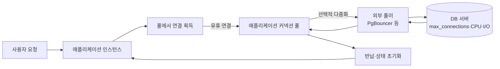
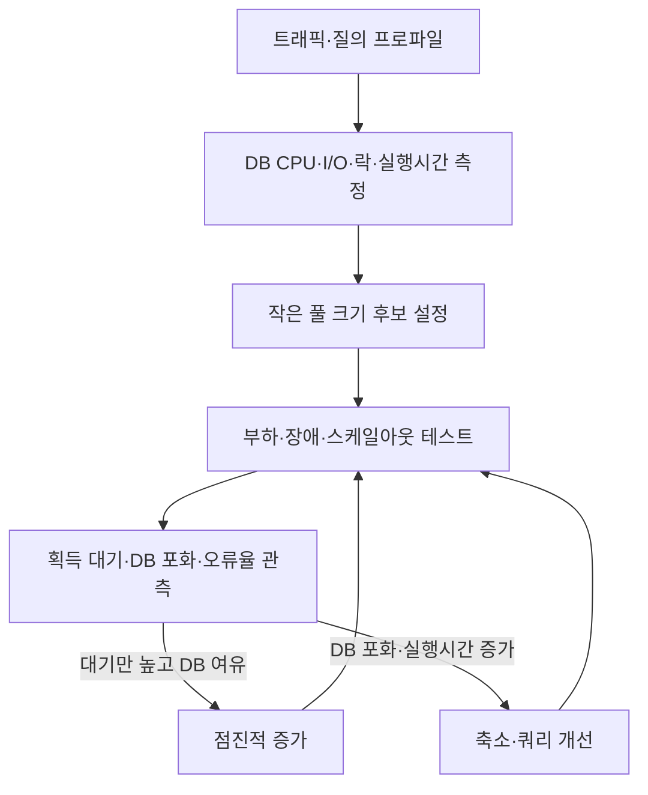

# 데이터베이스 커넥션 풀(Connection Pool) 설계와 튜닝

## 1. 개요

> **데이터베이스 커넥션 풀(Connection Pool)**은 애플리케이션이 데이터베이스 연결을 요청할 때마다 새 연결을 만드는 대신, 미리 생성하거나 사용 후 반환한 연결을 제한된 집합으로 재사용하는 자원 관리 기법이다.

애플리케이션과 데이터베이스 사이의 연결은 단순한 소켓 하나가 아니다. DNS 조회, TCP 연결, TLS 협상, 사용자 인증, 세션 초기화, 드라이버·서버의 프로토콜 협상이 순서대로 수행된다. 짧은 SQL 한 건을 실행하기 위해 매번 이 절차를 반복하면 쿼리 자체보다 연결 설립 비용이 커질 수 있다. 풀은 이 비용을 요청 경로에서 분리하고, 이미 인증된 연결을 빌려주었다가 반납받아 평균 지연과 연결 폭주를 줄인다.

그러나 풀은 연결을 무한히 제공하는 장치가 아니다. 풀의 연결 수는 데이터베이스의 CPU·메모리·디스크·락 처리 능력과 함께 결정해야 한다. 풀을 크게 만들면 대기열은 짧아 보이지만 데이터베이스에 동시에 실행되는 작업이 늘어 컨텍스트 스위칭, 버퍼 경쟁, 락 경합, 캐시 적중률 저하가 나타날 수 있다. 반대로 너무 작게 만들면 애플리케이션 스레드가 풀을 기다리므로 사용자는 타임아웃을 경험한다.

따라서 기술사 답안에서는 커넥션 풀을 단순한 프레임워크 옵션으로 설명하지 않고, **수요를 유한한 DB 자원에 안전하게 입장시키는 제어면**으로 해석해야 한다. 크기 산정, 대기·타임아웃, 연결 검증, 반환 시 상태 초기화, 장애 전환, 관측성, 보안까지 하나의 운영 설계로 묶는 것이 핵심이다.

커넥션 풀의 목표는 다음 네 가지로 정리된다. 첫째 연결 설립 비용을 상각한다. 둘째 데이터베이스의 동시 실행량을 상한으로 제한한다. 셋째 피크 트래픽을 짧은 대기열로 흡수하되 무한 대기는 차단한다. 넷째 장애·누수·세션 상태 오염이 전체 서비스로 확산되지 않게 한다.

## 2. 동작 원리와 전체 구조

커넥션 풀은 애플리케이션 프로세스 안에 위치할 수도 있고, 여러 인스턴스 앞단의 외부 풀러로 분리될 수도 있다. 애플리케이션 풀은 요청 스레드와 실제 DB 연결을 분리해 빠르게 재사용하고, 외부 풀러는 많은 클라이언트 연결을 더 적은 서버 연결로 다중화한다. 두 계층을 함께 쓸 때에는 각 계층의 상한을 곱셈으로 보지 말고 전체 연결 예산으로 계산해야 한다.

요청이 들어오면 애플리케이션은 먼저 풀에서 유휴 연결을 찾는다. 유휴 연결이 있으면 즉시 대여하고, 없으면 풀의 최대 크기에 도달했는지를 확인한다. 아직 확장 여지가 있다면 새 연결을 만들고, 상한에 도달했다면 대기열에 들어간다. 대기 시간은 반드시 `connectionTimeout` 같은 제한을 가져야 하며, 제한을 넘으면 실패를 반환해 상위 계층의 재시도·대체 경로가 작동하도록 해야 한다.

연결을 빌린 뒤에는 트랜잭션을 시작하고 SQL을 실행한 다음 커밋 또는 롤백을 수행한다. 애플리케이션은 연결 객체를 닫는다는 표현을 사용하더라도 실제로는 물리 연결을 종료하지 않고 풀에 반환하는 경우가 많다. 따라서 `close()` 호출을 누락하면 물리 연결이 계속 살아 있는 것이 아니라 풀 입장에서는 대여 중인 연결로 남아 풀 고갈이 발생한다.

반납 과정은 단순한 큐 삽입이 아니다. 트랜잭션 종료, 자동 커밋 모드 복원, 세션 변수 초기화, 롤백 여부 확인, 경고·에러 상태 폐기, 준비된 문장 정리, 사용자·테넌트 컨텍스트 제거가 필요하다. 상태 초기화가 빠지면 다음 요청이 이전 요청의 권한이나 격리 수준을 물려받는 세션 오염 문제가 발생한다.

## 3. 구성요소와 생명주기

### 가. 풀 관리자와 연결 상태

풀 관리자는 연결 객체를 생성·대여·검증·반납·폐기하는 상태 머신이다. 일반적으로 연결은 `생성 중`, `유휴`, `대여 중`, `검증 중`, `폐기 예정` 상태를 거친다. 상태를 명시적으로 관리하면 장애가 난 연결을 유휴 목록에 다시 넣거나, 이미 반납된 연결을 중복 반환하는 오류를 줄일 수 있다.

유휴 연결은 즉시 사용할 수 있는 정상 연결이다. 대여 중인 연결은 하나의 요청 또는 트랜잭션이 소유하며, 최대 대여 시간을 감시해야 한다. 생성 중 연결이 실패하면 해당 요청만 실패시키고 풀 전체가 잠기지 않도록 실패 횟수와 재시도 간격을 제어한다. 폐기 예정 연결은 사용 중인 요청이 끝난 뒤 재사용하지 않고 닫는다.

풀의 최소 유휴 수와 최대 크기는 다른 의미를 가진다. 최소 유휴 수를 크게 하면 피크 직전의 연결 생성 지연을 줄이지만, 평상시에도 DB 연결과 메모리를 점유한다. 최대 크기는 동시에 DB에 연결될 수 있는 상한이므로 데이터베이스의 자원 예산과 직접 연결된다. HikariCP 공식 문서도 일반적으로 고정 크기 풀을 우선 검토하고, 연결 수를 크게 잡는 것이 성능을 보장하지 않는다고 설명한다.

### 나. 대여·반납과 타임아웃

`connectionTimeout`은 풀이 연결을 빌려주기 위해 기다리는 최대 시간이다. 이 값은 SQL 실행 타임아웃과 구분해야 한다. 연결을 얻은 뒤 느린 쿼리가 계속 실행되면 풀은 고갈되므로, 쿼리 타임아웃·트랜잭션 타임아웃·대여 타임아웃을 계층적으로 설계한다.

대기열이 무한히 늘어나면 사용자 요청, 스레드, 메시지 소비자가 모두 묶이는 연쇄 장애가 된다. 따라서 대기열 길이와 최대 대기 시간을 제한하고, 초과 시 빠른 실패나 우선순위별 거절을 선택한다. 재시도는 지수 백오프와 지터를 적용하지 않으면 동시에 재시도하는 요청이 다시 풀을 압박한다.

반납 시 예외가 발생한 연결은 정상 유휴 연결로 간주하지 않는다. 네트워크 단절, 프로토콜 오류, 트랜잭션 롤백 실패, 세션 리셋 실패가 확인되면 폐기하고 새 연결을 비동기로 보충한다. 요청의 성공만 보고 연결을 재사용하면 잠복한 오류가 다음 요청으로 전파된다.

### 다. 연결 검증과 수명 관리

유휴 시간이 긴 연결은 방화벽·로드밸런서·DB의 idle timeout 때문에 이미 끊겼을 수 있다. 검증 방법에는 대여 시 ping 또는 검증 쿼리, 주기적 keepalive, 드라이버의 소켓 예외 감지가 있다. 매번 검증하면 안전하지만 왕복 비용이 생기므로, 최근 사용 시각과 네트워크 특성을 반영해 정책을 정한다.

`maxLifetime`은 연결을 영원히 재사용하지 않도록 하는 상한이다. DB나 프록시가 먼저 연결을 끊기 직전에 풀이 교체하면 요청 중단을 줄일 수 있다. 여러 인스턴스가 같은 시각에 연결을 폐기하면 재연결 폭풍이 생길 수 있으므로, 실제 구현에서는 만료 시점에 작은 변동을 주는 것이 유리하다.

연결 누수는 대여 후 반환되지 않은 상태를 뜻한다. 누수 탐지 임계값은 정상적인 장시간 트랜잭션보다 짧게 설정하되, 단순 경고를 장애로 오인하지 않도록 호출 스택·요청 ID·트랜잭션 ID를 함께 기록한다. 누수 방지는 코드의 `try-finally` 또는 언어별 자동 자원관리와 운영 지표를 함께 사용해야 한다.

## 4. 풀 크기 산정과 용량 계획

풀 크기는 사용자 수나 애플리케이션 스레드 수를 그대로 복사해 정하는 값이 아니다. 먼저 DB가 실제로 동시에 처리할 수 있는 CPU·I/O 작업 수를 측정하고, 질의의 평균·백분위 실행 시간과 목표 처리량을 이용해 시작점을 만든다. 큐잉 관점에서 처리량은 대략 동시 실행량을 서비스 시간으로 나눈 값에 제한되므로, 연결을 추가해도 DB 서비스 시간이 악화되면 전체 처리량은 오히려 줄어든다.

실무에서 자주 언급되는 `(CPU 코어 수 × 2) + 유효 디스크 수` 식은 출발점일 뿐 보편 법칙이 아니다. SSD, 캐시 적중률, 쿼리 유형, 복제 구조, CPU 오버프로비저닝, 컨테이너 제한에 따라 최적점이 다르다. HikariCP의 풀 크기 안내는 전면 사용자의 수보다 DB가 동시에 처리할 수 있는 작업량을 중심으로 작게 시작해야 한다는 점을 강조한다.

다중 인스턴스에서는 다음처럼 총 연결량을 계산한다.

`총 연결 상한 = 인스턴스 수 × 인스턴스별 최대 풀 크기 + 배치·관리·복제 연결`

예를 들어 12개 파드가 각각 최대 20개 연결을 열면 애플리케이션만 240개다. DB의 `max_connections`가 300이어도 관리자·모니터링·복제·마이그레이션 연결을 위한 여유가 없으므로 안전하지 않다. 오토스케일링으로 파드 수가 두 배가 되는 순간 연결 수가 함께 두 배가 된다는 점도 용량 계획에 반영해야 한다.

풀 크기 조정은 단계적으로 해야 한다. 먼저 최대 풀을 작게 설정하고 획득 대기 시간, DB CPU, 디스크 대기, 락 대기, 요청 지연의 p95·p99를 측정한다. DB에 여유가 있고 대기 시간만 높다면 조금 늘릴 수 있지만, DB 실행 시간이 함께 증가하면 연결 수가 병목이 아니라 쿼리·인덱스·스토리지 병목일 가능성이 높다.

작은 풀은 나쁜 설정이 아니다. 동시 실행을 제한해 DB가 안정적으로 처리할 수 있게 하고, 과도한 경쟁을 대기열로 흡수하는 백프레셔가 될 수 있다. 다만 풀 하나를 모든 업무가 공유하면 긴 배치 쿼리가 온라인 요청 연결을 독점할 수 있으므로, 업무 중요도에 따라 풀을 분리하거나 읽기·쓰기·배치 자원을 격리한다.

## 5. 트랜잭션·세션 상태와 일관성

풀 재사용의 가장 큰 논리적 위험은 물리 연결이 유지되는 동안 세션 상태도 유지된다는 점이다. `SET search_path`, 시간대, 격리 수준, 역할, 임시 테이블, 서버 측 prepared statement, advisory lock은 요청이 끝나도 남을 수 있다. 따라서 애플리케이션은 세션 상태를 명시적으로 초기화하고, 테넌트 식별자나 권한을 세션 변수에 저장할 때 특히 엄격한 반환 정책을 적용한다.

트랜잭션 경계는 연결 경계와 같지 않다. 연결을 풀에 반환하기 전 반드시 커밋 또는 롤백이 완료되어야 하며, 예외 경로에서도 롤백해야 한다. 미완료 트랜잭션을 가진 연결을 재사용하면 다음 요청이 이전 요청의 잠금과 스냅샷을 이어받아 데이터 오염이나 장기 대기를 일으킨다.

읽기 전용 복제본을 사용하는 경우에도 풀마다 대상과 장애 전환 정책을 구분해야 한다. 쓰기 풀은 현재 리더를 향하고 읽기 풀은 복제 지연을 감시하며, 장애 전환 후 기존 연결을 신속하게 폐기해야 한다. 단순히 DNS만 바꾸면 이미 맺어진 소켓과 풀 내부 객체는 즉시 새 리더로 이동하지 않는다.

외부 풀러의 트랜잭션 풀링은 연결을 트랜잭션 사이에 재배치하므로 세션 기반 기능의 의미가 달라진다. 세션 변수, 세션 수준 advisory lock, 일부 임시 테이블과 prepared statement를 사용한다면 호환성부터 검증해야 한다. 기능을 포기하고 연결 효율을 얻는 선택이므로, 운영 중 모드만 바꾸는 것은 위험하다.

## 6. 애플리케이션 풀과 외부 풀러 비교

애플리케이션 풀은 요청 코드와 가까워 대여·반납·트랜잭션·메트릭을 자연스럽게 연결할 수 있다. 하지만 인스턴스마다 독립적으로 존재하므로 서비스 인스턴스가 늘면 DB 연결도 선형으로 증가한다. 반면 외부 풀러는 여러 인스턴스의 클라이언트 연결을 중앙에서 다중화해 DB의 실제 연결 수를 줄이지만, 네트워크 홉과 별도 운영 장애 지점을 추가한다.

| 구분 | 애플리케이션 내 풀 | 외부 풀러 |
|---|---|---|
| 위치 | 각 프로세스·파드 내부 | 애플리케이션과 DB 사이 | 
| 장점 | 지연이 낮고 코드·트랜잭션 연계가 쉬움 | 다수 인스턴스의 연결을 중앙에서 제한 | 
| 한계 | 인스턴스 증가 시 연결 수가 곱셈으로 증가 | 세션 기능 호환성과 운영 복잡성 | 
| 장애 영향 | 해당 인스턴스 중심 | 구성에 따라 여러 서비스 동시 영향 | 
| 적용 | 일반적인 서비스·소수 인스턴스 | 서버리스·대규모 파드·연결 폭주 | 

차이를 단순히 성능 우열로 보면 안 된다. 애플리케이션 풀은 이미 존재하는 연결을 빠르게 재사용해 로컬 경로를 최적화하고, 외부 풀러는 연결 수의 전역 상한을 제공한다. 대규모 환경에서는 둘을 계층화할 수 있지만, 애플리케이션 풀의 크기를 외부 풀러의 크기보다 무조건 크게 잡으면 외부 대기열로 병목을 옮기는 것뿐이다.

예를 들어 서버리스 함수가 짧은 시간에 수백 개로 확장되면 각 함수가 DB에 직접 연결하는 구조는 연결 폭풍을 만든다. 이때 외부 풀러가 클라이언트 연결을 받아 DB 서버 연결을 제한하면 DB의 연결 자원을 보호할 수 있다. 대신 트랜잭션 풀링과 세션 기능의 호환성, 풀러 자체의 고가용성, TLS 구간, 장애 시 재접속 정책을 함께 검토해야 한다.

## 7. 관측성·장애 대응·보안

커넥션 풀의 핵심 지표는 단순한 현재 연결 수가 아니다. 최대 풀 크기, 활성 연결, 유휴 연결, 대기 중 요청 수, 연결 획득 시간, 타임아웃 수, 생성·폐기 수, 누수 의심 수, 연결 검증 실패 수를 요청 지연과 함께 수집해야 한다. 외부 풀러를 쓴다면 클라이언트 대기와 서버 연결 대기를 구분해 어느 계층이 병목인지 보여줘야 한다.

다음과 같은 증상은 원인별로 분리한다. 활성 연결이 최대치이고 획득 대기가 증가하면 쿼리 지연·트랜잭션 장기화·풀 크기 부족을 함께 본다. 활성 연결은 적은데 대기가 많으면 풀 관리자 락, 연결 생성 실패, 잘못된 상태 추적을 의심한다. DB CPU가 포화되고 실행 시간이 늘면 풀 확장은 금물이며 쿼리와 인덱스를 먼저 점검한다.

장애 시에는 재시도 폭풍을 막는 것이 우선이다. DB가 복구 중일 때 모든 요청이 즉시 재연결하면 연결 생성과 인증이 장애를 확대한다. 지수 백오프, 지터, 회로 차단기, 준비 상태 확인, 읽기 전용 대체 경로를 조합하고, 관리자 접속을 위한 예약 연결을 남겨야 한다. 복구 후에도 풀을 한꺼번에 채우지 않고 점진적으로 워밍업하는 것이 안전하다.

보안 측면에서는 자격 증명을 코드나 로그에 남기지 않고 비밀관리 시스템에서 주입한다. TLS 검증, 최소 권한 계정, 테넌트별 권한 경계, 연결 문자열의 노출 방지, 유휴 연결의 암호화 상태를 점검한다. 연결 풀은 인증을 재사용하므로 자격 증명 회전 때 기존 연결을 언제 폐기할지 명확히 정해야 한다.

## 8. 비교·사례와 예상 장애 시나리오

### 가. 풀 고갈과 연결 누수

온라인 주문 서비스가 요청마다 연결을 대여한 뒤 예외 경로에서 반환하지 않는다고 가정하자. 정상 요청에서는 문제가 드러나지 않지만, 결제 실패가 늘어나는 날에는 대여 중 연결이 누적된다. 결국 DB가 살아 있어도 새 요청은 풀 대기 타임아웃으로 실패한다.

대응은 `finally` 기반 반환, 트랜잭션 자동 롤백, 누수 탐지 로그, 대여 시간 대시보드, 부하 테스트의 예외 경로 검증을 함께 적용하는 것이다. 최대 풀을 키우는 것은 증상을 늦출 뿐 누수를 해결하지 않는다. 긴 대여의 호출 스택을 확보해 실제 코드 수정으로 연결해야 한다.

### 나. 오토스케일링에 따른 연결 폭증

파드가 10개이고 풀 상한이 20이면 정상 최대 연결은 200개다. 장애로 CPU 사용률 기반 오토스케일러가 40개 파드까지 늘리면 DB 연결은 800개가 될 수 있다. DB가 연결을 수용하더라도 작업 스케줄링과 메모리 경쟁으로 실제 처리량은 떨어질 수 있다.

이 경우 인스턴스별 풀 상한을 낮추고 전체 연결 예산을 오토스케일링 정책에 반영한다. 필요하면 외부 풀러를 두고 DB 서버 연결 수를 고정하며, 애플리케이션의 클라이언트 대기와 DB 서버 대기를 별도 모니터링한다. 스케일아웃이 곧 DB 처리량 증가라는 가정을 부하 테스트로 검증해야 한다.

### 다. 장애 전환 후 오래된 연결

리더 DB가 장애로 교체되었는데 애플리케이션 풀이 기존 TCP 연결을 계속 보유하면 새 요청이 오래된 소켓에 전달된다. 연결 오류가 발생한 뒤에도 즉시 재시도하면 새 리더가 연결 폭주를 맞을 수 있다.

해결책은 장애 신호를 감지한 연결의 즉시 폐기, 논리 엔드포인트 사용, 재연결 백오프, 트랜잭션의 안전한 재시도, 중복 실행 방지다. 이미 커밋되었는지 알 수 없는 요청은 무조건 재실행하지 말고 멱등 키와 결과 조회를 사용해 이중 주문을 방지한다.

## 9. 심화: 클라우드·컨테이너 환경의 설계 방향

컨테이너 환경에서는 CPU limit과 실제 노드 CPU가 다를 수 있으므로, 풀 크기 공식에 물리 서버 전체 코어를 넣으면 과대 산정될 수 있다. 서비스별 CPU quota, 실제 질의 유형, DB의 공유 자원, 파드 수 변화를 함께 사용해야 한다. 특히 짧은 수명의 작업이 많은 서버리스에서는 연결을 오래 유지하는 전통적 풀과 외부 풀러의 역할을 분리한다.

클라우드 관리형 DB는 `max_connections`를 직접 크게 올리기보다 프록시나 풀러, 읽기 복제본, 워크로드별 엔드포인트를 제공하는 경우가 많다. 연결 수를 늘리는 것이 비용과 성능 모두에 유리한지, 프록시의 추가 홉과 장애 도메인이 허용되는지 평가한다. 운영자는 연결 수뿐 아니라 연결당 메모리와 로그·감사 비용도 예산에 넣어야 한다.

관측성은 애플리케이션 메트릭과 DB 메트릭의 상관관계를 보아야 한다. 풀 획득 지연이 증가하는 시점에 DB의 lock wait가 증가하는지, 쿼리 p99가 증가하는지, 파드 수가 변했는지 추적한다. OpenTelemetry 같은 추적 체계에서 `pool.acquire`, `db.query`, `pool.release` 구간을 구분하면 애플리케이션 대기와 DB 실행 시간을 분리할 수 있다.

최근의 실무 방향은 무조건 큰 풀보다 **작은 고정 풀, 명시적 타임아웃, 계층별 백프레셔, 워크로드 격리, 수평 확장 전 연결 예산 검증**을 중시하는 쪽이다. 이는 연결 수가 성능의 원인이 아니라 DB 작업 경쟁의 결과라는 인식에 기반한다.

## 10. 고려사항 및 시사점

1. **용량 계획의 기준을 사용자 수에서 DB 처리능력으로 전환해야 한다.** 사용자가 많다는 이유만으로 연결을 늘리면 DB 내부 경쟁이 커질 수 있다. 부하 테스트에서 CPU·I/O·락·실행시간의 변화를 확인하고 작은 값에서 단계적으로 조정한다.

2. **타임아웃을 계층화해야 한다.** 풀 획득 타임아웃, SQL 실행 타임아웃, 트랜잭션 타임아웃, HTTP 요청 타임아웃의 순서를 설계해 한 계층이 영원히 다음 계층을 점유하지 않게 한다. 타임아웃만 늘리는 방식은 장애를 숨길 뿐이다.

3. **연결의 논리 상태를 물리 생명주기와 함께 관리해야 한다.** 반환 전 롤백과 세션 초기화를 보장하고, 테넌트 권한·세션 변수·임시 객체가 다음 요청에 남지 않는지 테스트한다. 데이터 격리와 개인정보 보호의 문제로도 연결되는 항목이다.

4. **오토스케일링과 연결 예산을 하나의 정책으로 묶어야 한다.** 파드 수가 늘어날 때 총 연결 상한도 늘어난다는 사실을 반영하고, 예약 연결과 관리 연결을 제외한 실제 가용량을 계산한다. 필요하면 외부 풀러로 DB 측 상한을 고정한다.

5. **장애 전환은 DNS 변경만으로 끝나지 않는다.** 기존 소켓 폐기, 풀 재충전 속도, 재시도 백오프, 중복 실행 방지, 예약 관리자 연결을 포함한 실패 시나리오를 리허설해야 한다. RTO는 DB 승격 시간과 애플리케이션 재연결 시간이 합쳐진 결과다.

6. **풀을 업무별로 격리하는 것이 가용성을 높인다.** 배치와 온라인 트랜잭션이 같은 풀을 공유하면 긴 작업이 핵심 요청을 굶길 수 있다. 읽기·쓰기·배치·관리 풀을 분리하고 각자의 우선순위와 상한을 설정한다.

7. **표준 설정값보다 관측 가능한 근거가 중요하다.** 프레임워크의 기본값을 그대로 적용하지 말고 획득 대기, 활성·유휴 비율, 누수, 생성 실패, DB 포화, p95·p99를 기준으로 변경한다. 변경 전후의 부하와 장애 결과를 기록해 설정의 재현성을 확보한다.

8. **기술사 관점에서는 연결 풀을 백프레셔·회복탄력성·보안의 교차점으로 답안화할 수 있다.** 단순 재사용 효과에서 멈추지 않고 자원 상한, 실패 격리, 세션 상태, 관측성, 비용과 운영 조직까지 연결하면 시스템 전체의 설계 판단을 제시할 수 있다.

## 참고자료

- HikariCP 공식 저장소 및 설정 문서: https://github.com/brettwooldridge/HikariCP
- HikariCP 공식 풀 크기 안내: https://github.com/brettwooldridge/HikariCP/wiki/About-Pool-Sizing
- PgBouncer 공식 사용 설명서: https://www.pgbouncer.org/usage.html
- PgBouncer 공식 기능 및 풀링 모드: https://www.pgbouncer.org/features.html
- PostgreSQL 공식 연결 설정 문서: https://www.postgresql.org/docs/current/runtime-config-connection.html

---

> **한 줄 요약**: 커넥션 풀은 연결을 많이 만드는 기술이 아니라, DB가 감당할 수 있는 동시성을 측정해 대기·타임아웃·상태 초기화·장애 전환까지 통제하는 자원관리 장치다.
