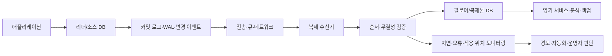
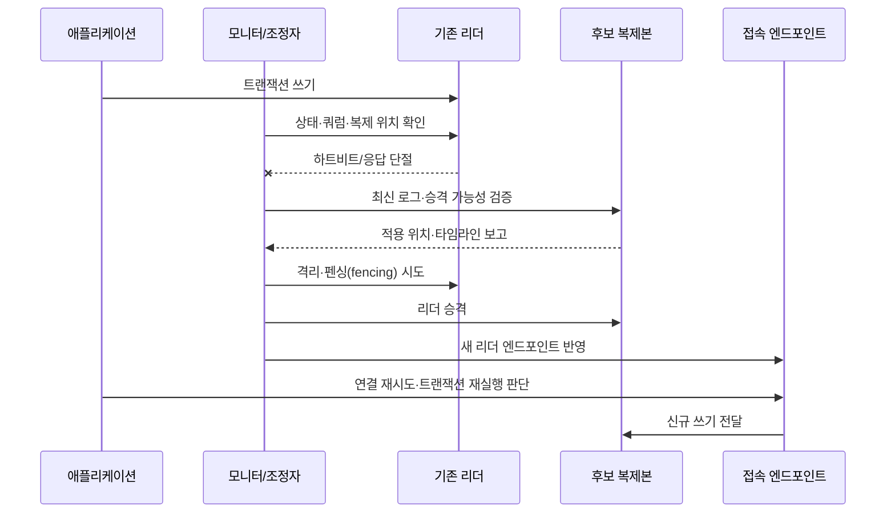

# 데이터베이스 복제(Replication)와 고가용성 설계

## 1. 개요

> **정의**: 데이터베이스 복제(Replication)는 하나의 논리적 데이터 변경을 다른 데이터베이스 인스턴스에 전달·재생하여 복수의 복제본을 유지하는 기술이며, 고가용성(High Availability)은 장애가 발생해도 합의된 시간과 데이터 손실 한도 안에서 서비스를 계속 제공하는 운영 목표이다.

온라인 서비스가 단일 데이터베이스에 의존하면 서버 고장, 스토리지 손상, 네트워크 단절, 운영자 실수, 과부하가 곧 업무 중단으로 이어진다. 복제는 데이터를 여러 위치에 두어 장애 도메인을 분리하고 읽기 부하를 분산하는 수단이지만, 복제만 구성했다고 자동으로 고가용성이 달성되는 것은 아니다. 복제 지연, 장애 감지, 리더 선출, 연결 전환, 데이터 정합성, 백업과 복구 검증이 함께 설계되어야 한다.

기술사 답안에서는 “주 서버와 대기 서버를 둔다”는 나열을 넘어서, 어떤 장애를 어떤 시간 안에 감지하고 어느 시점의 데이터를 어느 정도까지 보존할 것인지부터 정의해야 한다. 예를 들어 금융 원장의 목표가 RPO 0에 가까우면 동기 복제가 적합할 수 있지만, 광역 네트워크를 사이에 둔 동기 복제는 지연과 가용성 사이의 대가를 만든다. 반대로 비동기 복제는 성능과 지리적 분산에는 유리하지만 장애 순간 마지막 변경분이 유실될 수 있다.

복제의 목적은 크게 세 가지로 구분한다. 첫째, 장애 시 대체 인스턴스로 전환하는 **가용성 확보**다. 둘째, 읽기 전용 복제본이나 분석 복제본으로 업무 부하를 분리하는 **확장성 확보**다. 셋째, 다른 리전에 사본을 유지해 재해에 대비하고 백업·감사·데이터 활용을 지원하는 **복원력과 활용성 확보**다. 동일한 기술을 사용하더라도 목표가 다르면 토폴로지와 일관성 정책이 달라진다.

### 1.1 등장 배경과 필요성

데이터베이스의 CPU와 메모리를 증설하는 수직 확장은 빠른 초기 대응이지만, 하드웨어 상한과 단일 장애점이라는 한계가 있다. 읽기 요청이 많은 서비스는 쓰기 주체를 하나로 유지하면서 여러 복제본으로 조회를 보내는 방식이 비용 대비 효과적일 수 있다. 다만 애플리케이션이 방금 저장한 데이터를 곧바로 읽어야 하는 경우에는 읽기 일관성을 보장할 경로가 필요하다.

서비스의 가용성은 데이터베이스 프로세스가 살아 있는지로만 판단하지 않는다. 애플리케이션이 올바른 리더에 연결되는지, 트랜잭션이 중복 실행되지 않는지, DNS·커넥션 풀·로드밸런서가 전환을 인지하는지, 모니터링과 온콜 체계가 복구를 완료할 수 있는지까지 포함한다. 따라서 복제는 데이터 계층 기술이면서 동시에 운영 아키텍처와 조직 절차의 문제다.

### 1.2 핵심 목표와 평가 지표

- **RPO(Recovery Point Objective)**: 장애 시 허용되는 데이터 손실 시점의 범위다. 비동기 복제 지연이 5초라면 최악의 경우 최근 5초 변경이 유실될 수 있다는 의미이지, 항상 5초가 유실된다는 뜻은 아니다.
- **RTO(Recovery Time Objective)**: 장애 인지부터 서비스 정상화까지 허용되는 시간이다. 자동 전환을 사용해도 연결 재시도와 캐시 무효화 시간을 포함해 측정해야 한다.
- **복제 지연(Replication Lag)**: 소스의 변경이 복제본에 반영되기까지 걸린 시간 또는 미처리 변경량이다. 시간과 로그 위치 중 무엇을 측정하는지 명확히 해야 한다.
- **가용성**: 계획·비계획 중단을 포함한 서비스 제공 비율이다. 복제본 수보다 장애 도메인과 실제 전환 성공률이 더 중요하다.
- **정합성**: 하나의 논리적 데이터에 대해 읽기와 쓰기가 업무 규칙을 위반하지 않는 정도다. 모든 화면이 강한 일관성을 필요로 하는 것은 아니므로 업무별 정책으로 분해한다.

## 2. 복제의 원리와 구성요소

### 2.1 논리적 흐름

복제는 일반적으로 소스 데이터베이스에서 변경 이벤트를 기록하고, 복제 전송 계층이 이를 복제본으로 전달하며, 복제본의 적용 프로세스가 순서와 무결성을 확인한 후 반영하는 흐름을 가진다. 구현 방식에 따라 변경 이벤트는 트랜잭션 로그, 변경 데이터 캡처 레코드, 논리적 행 변경, 문서 이벤트 등으로 표현된다.

리더는 쓰기 순서를 결정하는 기준점이다. 하나의 트랜잭션이 여러 테이블을 변경하면 복제본은 개별 행을 임의의 순서로 반영해서는 안 되며, 트랜잭션 경계와 커밋 순서를 보존해야 한다. 이 특성은 단순 파일 복사와 복제의 차이를 만든다.

커밋 로그는 장애 복구와 복제 모두의 기반이다. 리더가 커밋 응답을 반환하기 전에 어느 위치까지 복제본이 받아야 하는지에 따라 동기·비동기 의미가 정해진다. 로그 보존 기간이 짧으면 복제본이 잠시 중단되었을 때 재동기화가 불가능해져 전체 복사로 전환될 수 있으므로 디스크와 보존 정책도 용량 계획에 포함한다.

복제 수신기는 네트워크에서 이벤트를 읽고, 적용기는 이를 실제 데이터 파일이나 저장 엔진에 반영한다. 수신 위치와 적용 위치를 분리하면 네트워크는 정상이지만 CPU·잠금·디스크 I/O 때문에 적용이 늦는 상황을 구분할 수 있다. 운영자는 “연결됨”이라는 상태만 보고 정상이라고 판단해서는 안 된다.

### 2.2 복제 토폴로지 유형

가장 일반적인 구조는 단일 리더와 하나 이상의 팔로어를 두는 **primary-replica** 방식이다. 쓰기 충돌이 단순하고 리더 선출 절차를 설계하기 쉽지만, 쓰기 확장과 리더 장애 시 전환이 핵심 과제가 된다. 팔로어를 읽기 전용으로 사용할 때는 복제 지연을 감안해 트래픽 라우팅을 제어해야 한다.

다중 리더 구조는 여러 노드가 쓰기를 받을 수 있어 지역별 쓰기 수용과 지연 단축에 유리하다. 그러나 동일 키를 서로 다른 리더에서 변경하면 충돌이 발생하므로 충돌 방지 키 설계, 충돌 해결 규칙, 최종 일관성의 사용자 경험을 명시해야 한다. “여러 곳에서 쓸 수 있다”는 장점만 보고 적용하면 재고·잔액처럼 충돌 비용이 큰 데이터에서 문제가 커진다.

체인 또는 계층형 복제는 리더가 여러 복제본에 직접 전송하지 않고 중간 복제본이 하위 복제본으로 전달하는 방식이다. 지역 간 회선이나 연결 수를 줄일 수 있지만, 중간 노드가 병목 또는 추가 장애점이 되므로 전환 시 계보와 로그 위치를 확인해야 한다.

| 유형 | 쓰기 방식 | 장점 | 주요 위험 | 적합한 상황 |
|---|---|---|---|---|
| 단일 리더-팔로어 | 리더 중심 | 충돌이 적고 운영 모델이 단순 | 리더 장애, 복제 지연 | 일반 OLTP, 읽기 확장 |
| 동기 다중 복제 | 커밋 전 다수 확인 | 낮은 RPO, 강한 보호 | 지연 증가, 네트워크 단절 시 쓰기 제한 | 손실 비용이 큰 핵심 업무 |
| 비동기 복제 | 리더 커밋 후 전달 | 낮은 쓰기 지연, 광역 분산 | 장애 시 미전달 로그 유실 | 분석, 재해복구, 읽기 확장 |
| 다중 리더 | 여러 노드 쓰기 | 지역 쓰기 수용, 지역 지연 감소 | 충돌과 해결 복잡도 | 충돌이 제한된 분산 업무 |
| 계층형 복제 | 중간 노드 릴레이 | 연결 수·회선 부담 감소 | 중간 장애·지연 전파 | 리전·지점이 많은 환경 |

표의 유형은 제품 이름이 아니라 의사결정 축으로 이해해야 한다. 예를 들어 단일 리더 구조도 동기 복제본을 둘 수 있고, 비동기 복제본을 재해복구용으로 별도 운영할 수 있다. 따라서 한 시스템에 하나의 복제 정책만 존재한다고 단정하지 말고, 핵심 원장·조회 모델·분석 저장소별로 요구사항을 분리한다.

### 2.3 동기 복제와 비동기 복제

동기 복제는 리더가 커밋을 확정하기 전에 지정된 복제본이 변경을 수신하고 기록했다는 확인을 요구한다. 이 방식은 리더가 갑자기 소실되어도 확인된 복제본에서 최신 데이터를 이어갈 가능성을 높인다. 그러나 왕복 네트워크 지연이 모든 쓰기 지연에 영향을 주고, 복제본 장애를 허용하는 설정이 없으면 복제본 문제 때문에 리더의 쓰기까지 멈출 수 있다.

비동기 복제는 리더가 자체 로그 기록 후 응답하고, 이후 복제본으로 변경을 전달한다. 사용자 응답성이 좋고 장거리 복제에 적합하지만, 리더 장애 시 아직 전송되지 않은 로그가 사라질 가능성이 있다. “비동기=안전하지 않음”은 정확하지 않다. 로그 보존, 다중 복제본, 재해복구, 애플리케이션 재처리 설계를 결합하면 업무상 허용 가능한 RPO를 달성할 수 있다.

반동기 방식은 모든 복제본이 아니라 최소 하나의 지정된 복제본이 로그 수신을 확인하면 커밋을 허용하는 절충안이다. 여기서 “수신”이 메모리 도달인지 디스크 영속화인지, 네트워크 단절 시 몇 초 후 비동기로 전환하는지에 따라 보호 수준이 달라진다. 설계서에는 용어보다 확인 지점과 장애 시 동작을 구체적으로 적어야 한다.

### 2.4 복제본 읽기와 일관성

리더에 쓰고 팔로어에서 읽는 구조에서는 사용자가 방금 변경한 값을 다시 조회했는데 이전 값이 보이는 현상이 발생할 수 있다. 이를 read-after-write 불일치라고 하며, 결제 완료 화면·주문 상태·권한 변경처럼 즉시성이 필요한 흐름에서 특히 문제가 된다. 해결책은 일정 시간 리더 읽기를 강제하는 것, 세션의 읽기 위치를 복제본이 따라잡을 때까지 대기하는 것, 변경 직후의 값을 애플리케이션이 보유하는 것 등이다.

모든 조회를 리더로 보내면 일관성은 단순해지지만 읽기 확장의 이점이 사라진다. 반대로 모든 조회를 복제본으로 보내면 지연과 장애 시 stale read가 증가한다. 업무 기능별로 강한 일관성, 세션 일관성, 최종 일관성의 허용 범위를 분류하고 라우팅 정책을 코드·미들웨어·데이터 접근 계층에 일관되게 반영해야 한다.

## 3. 고가용성 전환과 장애 처리

### 3.1 장애 전환 구조

고가용성은 정상 경로보다 실패 경로를 먼저 그려야 한다. 상태 확인기가 리더의 프로세스, 포트, 트랜잭션 응답, 복제 상태를 관찰하고, 조정자 또는 합의 그룹이 장애를 판정한 뒤 후보 복제본의 승격 여부를 결정한다. 이후 접속점이 새 리더를 가리키고 애플리케이션 커넥션 풀이 재연결해야 하며, 이전 리더가 복귀했을 때 다시 쓰기를 받지 않도록 격리해야 한다.

장애 감지는 빠르다고 좋은 것만은 아니다. 네트워크가 잠시 끊겼는데 리더가 살아 있는 경우를 장애로 오판하면 두 노드가 각각 쓰기를 받는 split-brain이 발생할 수 있다. 따라서 단일 모니터의 판단보다 쿼럼, 임대(lease), 펜싱 장치, 클라우드의 인스턴스 격리 등 상호 배타성을 확보하는 수단이 필요하다.

승격 대상은 단순히 가장 가까운 서버가 아니라 데이터 손실과 복구 가능성을 종합해 선택한다. 복제 적용 위치가 최신인지, 필요한 로그가 보존되어 있는지, 애플리케이션이 요구하는 스키마 버전과 호환되는지, 다른 리전과 네트워크가 정상인지 확인해야 한다. 자동 승격 기준과 수동 승인 기준을 구분하면 긴급 상황에서도 통제 가능한 운영이 된다.

### 3.2 RPO·RTO와 복제 설계

RPO가 0에 가까운 업무는 커밋 완료와 동시에 최소 하나의 장애 도메인에 데이터가 남아야 한다. 그렇다고 모든 리전에 동기 복제를 적용하면 광역 지연과 단절 시 가용성 저하가 발생할 수 있다. 현실적인 설계는 같은 리전 내 동기 복제와 다른 리전의 비동기 복제를 조합하고, 재해 시 허용할 RPO를 별도로 정의하는 것이다.

RTO는 데이터 복제만으로 줄어들지 않는다. DNS TTL, 서비스 디스커버리, 커넥션 풀의 재시도 백오프, 트랜잭션 타임아웃, 캐시와 메시지 소비자의 재처리, 운영자 승인 시간이 모두 합쳐진 결과다. 예를 들어 데이터베이스 승격이 30초 안에 끝나도 애플리케이션이 오래된 커넥션을 2분 동안 유지하면 실제 RTO는 2분 이상이다.

| 요구사항 | 설계 선택 | 검증 질문 |
|---|---|---|
| 거의 무손실 | 동기 또는 반동기 복제, 다중 장애 도메인 | 확인된 커밋 지점은 어디이며 단절 시 쓰기는 어떻게 되는가? |
| 수 초 손실 허용 | 비동기 복제, 로그 보존, 재처리 | 최대 복제 지연과 최악의 로그 손실량을 어떻게 측정하는가? |
| 수 분 내 복구 | 자동 전환, 고정 접속점, 짧은 재연결 정책 | 클라이언트와 커넥션 풀이 새 리더를 얼마나 빨리 찾는가? |
| 지역 재해 대응 | 다른 리전 복제·백업·복구 런북 | 리전 전체 장애를 가정한 복구 리허설을 했는가? |

### 3.3 장애 유형별 대응

프로세스 장애는 같은 호스트에서 재시작할 수 있지만, 저장장치 손상은 해당 노드를 복제 집합에서 격리하고 재동기화해야 한다. 네트워크 분할은 가장 어렵다. 노드가 서로를 보지 못하더라도 클라이언트가 어느 쪽에 연결되는지에 따라 쓰기 경로가 달라질 수 있으므로, 쿼럼과 펜싱을 통해 하나의 쓰기 권위만 남겨야 한다.

복제 지연이 증가한 경우 즉시 복제본을 제거하는 것보다 원인을 분해한다. 네트워크 대역폭 부족인지, 복제본의 디스크 쓰기 지연인지, 대형 트랜잭션·DDL·잠금 경합인지, 인덱스와 쿼리 패턴이 다른지에 따라 조치가 달라진다. 지연이 임계치를 넘은 복제본을 읽기 트래픽에서 제외하는 회로 차단을 두면 사용자에게 오래된 결과를 제공하는 위험을 낮출 수 있다.

장애 복구 후에는 이전 리더를 바로 재투입하지 않는다. 이전 리더가 분리된 동안 어떤 로그를 받았는지, 타임라인이 새 리더와 일치하는지, 데이터 무결성 검사를 통과했는지 확인한 후 복제본으로 다시 붙인다. 이 절차를 생략하면 과거 리더가 다시 쓰기를 수용하는 이중 리더 문제가 재발할 수 있다.

## 4. 설계 및 구축 절차

### 4.1 업무 요구사항과 데이터 분류

첫 단계는 데이터베이스 제품을 고르는 일이 아니라 업무 트랜잭션을 분류하는 일이다. 주문·재고·잔액·권한처럼 손실과 중복 처리의 비용이 큰 데이터는 강한 보호와 명확한 전환 정책이 필요하다. 추천·검색·통계처럼 약간의 지연을 허용하는 데이터는 비동기 복제나 별도 분석 파이프라인이 더 효율적일 수 있다.

데이터 객체별로 RPO, RTO, 읽기 일관성, 지역성, 보존 기간, 개인정보 위치 제한을 기록한다. 데이터베이스 전체를 하나의 정책으로 묶으면 중요하지 않은 조회 때문에 핵심 쓰기 성능이 저하되거나, 핵심 원장에 필요한 보호 수준을 일반 로그 데이터가 희석시킬 수 있다.

### 4.2 토폴로지와 장애 도메인 설계

서버를 두 대 같은 랙에 두는 것만으로는 랙 전원·스위치·스토리지 장애를 막지 못한다. 최소한 호스트, 가용 영역, 리전, 계정 또는 프로젝트 경계를 장애 도메인으로 분석하고, 복제본을 어디에 배치할지 결정한다. 물리적으로 떨어진 위치는 재해 보호에 유리하지만 네트워크 지연과 규제·비용을 함께 고려해야 한다.

리더와 복제본의 수는 많을수록 좋은 것이 아니다. 복제본이 늘면 로그 전송, 모니터링, 패치, 백업, 보안 권한, 전환 후보 검증의 운영 비용이 커진다. 업무의 읽기량과 장애 허용 수준을 근거로 최소 구성을 정하고, 용량 증가와 리전 확장을 위한 증설 절차를 자동화한다.

### 4.3 초기 동기화와 재동기화

신규 복제본은 기준 시점의 스냅샷을 만든 뒤 그 이후의 로그를 순서대로 적용하는 방식으로 초기화할 수 있다. 초기화 동안 리더에 부하가 생기지 않도록 백업본·스냅샷·전용 복제 소스를 활용하고, 데이터베이스 버전·확장 모듈·인코딩·시간대 설정이 일치하는지 점검한다.

복제본이 잠시 중단된 경우 보존 중인 로그만으로 따라잡을 수 있다. 로그가 삭제되었거나 데이터 파일이 손상되었다면 부분 재동기화 대신 전체 기준 복사본을 새로 만들어야 한다. 재동기화 중인 노드를 읽기 트래픽에 사용하면 일부 테이블이나 파티션만 최신인 상태가 노출될 수 있으므로 서비스 상태를 명확히 표시한다.

### 4.4 접속·라우팅·재시도 설계

애플리케이션은 특정 IP를 리더로 하드코딩하지 않고 논리적 엔드포인트, 프록시, 서비스 디스커버리 등 추상화된 접속점을 사용해야 한다. 다만 엔드포인트가 바뀌어도 이미 맺어진 TCP 연결과 커넥션 풀은 자동으로 바뀌지 않으므로 연결 수명, 유휴 연결 검증, 재연결 시간, DNS 캐시를 함께 설정한다.

재시도는 만능이 아니다. 커밋 응답을 받기 전에 연결이 끊긴 경우 트랜잭션이 실제로 반영되었을 수 있어 무조건 재실행하면 주문·결제 중복이 발생한다. 요청 식별자와 멱등 키를 사용하고, 재시도 가능한 오류·확인 후 재시도해야 하는 오류·재시도 금지 오류를 구분한다.

### 4.5 관측성과 알림

필수 지표는 복제 연결 상태, 전송 지연, 적용 지연, 로그 보존 여유, 복제본 디스크 사용량, 리더 선출 횟수, 전환 성공률, 읽기 라우팅 비율, 커넥션 오류율이다. 단일 값보다 추세와 상관관계를 보는 것이 중요하다. 예를 들어 CPU가 낮아도 디스크 fsync 지연이 증가하면 적용 지연이 누적될 수 있다.

알림은 복제 지연 임계치 하나만 두지 말고 업무 영향과 연결한다. 핵심 주문 복제본이 10초 지연되었는지, 분석 복제본이 10분 지연되었는지의 심각도는 다를 수 있다. 알림에는 현재 리더, 후보, 마지막 적용 위치, 예상 RPO, 담당 런북 링크를 포함해 운영자가 바로 판단하도록 한다.

### 4.6 테스트와 운영 런북

정상 상태에서 장애를 일으키는 것보다 먼저 재현 가능한 테스트 환경에서 리더 프로세스 종료, 네트워크 단절, 디스크 가득 참, 복제 지연, 잘못된 자격 증명, 시계 오차, 리전 연결 단절을 검증한다. 테스트 결과에는 감지 시간, 승격 시간, 애플리케이션 오류율, 데이터 손실량, 수동 조치와 자동 조치를 기록한다.

런북에는 장애 판정, 쓰기 중지 여부, 펜싱, 후보 검증, 승격, 엔드포인트 전환, 애플리케이션 재연결, 데이터 검증, 이전 리더 격리 해제, 사후 분석의 순서를 명시한다. 자동화가 실패할 때 사람이 개입할 지점과 승인권자를 정하지 않으면 긴급 상황에서 서로 다른 판단이 동시에 실행될 수 있다.

## 5. 복제 방식 비교와 실무적 판단

복제와 백업은 목적이 다르다. 복제본은 리더의 삭제·오염·잘못된 업데이트도 빠르게 따라갈 수 있어 논리적 오류의 보호 수단이 아니다. 백업은 특정 시점으로 되돌릴 수 있는 별도 복구 경로이며, 복제와 백업을 서로 대체재로 보면 랜섬웨어나 운영자 실수에 취약해진다.

동기 복제는 데이터 손실을 줄이지만 장애 도메인 간 네트워크 품질에 의존한다. 비동기 복제는 서비스 응답성과 지역 확장에 유리하지만 복제 지연을 RPO로 관리해야 한다. 다중 리더는 지역 사용자에게 가까운 쓰기 지점을 제공할 수 있지만 충돌 해결의 업무 규칙을 데이터 모델에 반영해야 한다.

| 비교 축 | 동기 복제 | 비동기 복제 | 다중 리더 |
|---|---|---|---|
| 커밋 지연 | 복제 확인에 따라 증가 | 상대적으로 낮음 | 지역별로 낮을 수 있음 |
| 데이터 손실 | 확인된 지점 이후 낮음 | 지연분 손실 가능 | 충돌·순서 문제 가능 |
| 네트워크 단절 | 쓰기 중단 또는 정책 전환 | 쓰기 지속 가능 | 양쪽 쓰기 후 충돌 가능 |
| 운영 복잡도 | 전환·쿼럼 관리 | 지연·RPO 관리 | 충돌·재조정 관리 |
| 대표 판단 | 손실 비용이 지연 비용보다 큼 | 지연 비용이 일부 손실보다 큼 | 지역 자율성과 충돌 규칙이 명확함 |

수평 읽기 확장을 위해 복제본을 사용할 때에는 데이터가 최신이라는 가정을 제거해야 한다. 상품 목록처럼 약간 오래된 값이 허용되는 조회와 결제 직전 재고처럼 최신성이 중요한 조회를 같은 라우팅 정책으로 처리하지 않는다. 애플리케이션에 읽기 일관성 힌트를 전달하거나, 강한 일관성 경로와 최종 일관성 경로를 명시적으로 분리한다.

## 6. 산업·업무 적용 사례

### 6.1 전자상거래 주문과 재고

주문 생성은 리더에서 처리하고, 주문 이력·상품 조회는 읽기 복제본으로 분산할 수 있다. 그러나 재고 차감은 경쟁 트랜잭션과 직결되므로 복제본의 오래된 재고 값을 근거로 최종 차감 판단을 해서는 안 된다. 재고 차감 트랜잭션은 리더에서 조건부 갱신하고, 결과 이벤트를 검색·추천 시스템에 비동기 전달하는 방식이 안전하다.

장애 전환 중 주문 요청이 타임아웃되면 클라이언트가 다시 요청할 수 있다. 주문번호나 결제 승인번호를 멱등 키로 저장하고, 동일 키가 이미 처리되었는지 확인하면 중복 주문을 줄일 수 있다. 이 사례는 복제 기술과 애플리케이션 수준 중복 방지의 결합이 필요함을 보여준다.

### 6.2 금융 원장과 잔액 조회

원장과 잔액은 손실·중복·순서 오류의 비용이 크므로 동기 복제 또는 그에 준하는 커밋 확인 정책을 고려한다. 원장 쓰기와 고객 화면의 조회를 모두 하나의 강한 일관성 경로로 보내면 안전하지만, 조회량이 증가할 때 비용이 커질 수 있다. 따라서 잔액 조회는 원장 커밋 위치를 확인한 후 해당 위치 이상을 적용한 복제본에서 읽거나, 중요한 거래 직후에는 리더에서 읽는 정책을 둔다.

재해복구 리전의 비동기 복제는 지역 장애를 대비하지만, 리전 전환 시 마지막 미전달 원장 이벤트를 식별하고 재처리할 절차가 필요하다. 전환 후 두 리전이 동시에 원장을 쓰지 않도록 업무 권위를 하나의 리전으로 제한해야 한다. 복구 리허설에서 잔액 합계·원장 순번·중복 거래를 검증해야 실효성을 확인할 수 있다.

### 6.3 분석·리포팅 분리

OLTP 리더에서 대규모 집계 쿼리를 실행하면 잠금과 I/O가 업무 트랜잭션을 방해할 수 있다. 분석 전용 복제본이나 변경 데이터 캡처 기반 분석 저장소를 사용하면 업무 DB와 조회 부하를 분리할 수 있다. 이때 분석 데이터는 최신 시점이 아니라는 점을 대시보드에 표시하고, 보고서 마감 시점과 복제 기준 시점을 함께 기록한다.

분석 복제본이 지연되더라도 주문 서비스 자체가 중단되어서는 안 된다. 분석 파이프라인을 업무 요청 경로와 분리하고, 복제본 지연이 일정 수준을 넘으면 분석 작업을 늦추거나 별도 스냅샷으로 전환하는 격리 정책을 적용한다.

## 7. 심화: 분산·클라우드 환경의 최신 설계 관점

클라우드에서는 관리형 데이터베이스가 복제와 자동 전환을 제공하더라도, 애플리케이션 연결·권한·백업 보존·리전 전환은 사용자의 책임으로 남는 경우가 많다. 서비스가 제공하는 “고가용성 옵션”의 실제 의미가 동기 복제인지, 장애 감지와 자동 승격 범위가 어디까지인지, 계획된 유지보수와 리전 재해를 모두 다루는지 확인해야 한다.

컨테이너 환경에서는 데이터베이스를 단순한 무상태 워크로드처럼 취급하면 안 된다. 영속 볼륨, 노드 장애, 스케줄링, 스토리지 복제, 종료 순서, 백업 오퍼레이터의 권한을 함께 설계해야 한다. 데이터베이스 전환을 오케스트레이터의 재시작 정책만으로 해결하려 하면 데이터 계보와 쿼럼을 보장하지 못할 수 있다.

변경 데이터 캡처는 복제 로그를 이벤트 스트림으로 활용하는 방법이다. 운영 DB의 변경을 데이터 웨어하우스, 검색 인덱스, 캐시, 메시지 시스템으로 전달할 수 있지만, 이벤트 순서·중복·스키마 변경·재처리 위치를 관리해야 한다. “한 번만 전달”을 가정하기보다 적어도 한 번 전달과 멱등 소비를 기본으로 설계하고, 원장 이벤트와 파생 모델의 재생 가능성을 확보한다.

다중 리전 액티브-액티브는 지연과 지역 장애에 강해 보이지만, 전역 순서와 충돌 해결에 대한 비용이 크다. 사용자를 지역에 고정하거나 데이터 소유권을 키 범위별로 나누면 충돌을 줄일 수 있다. 그래도 전역 재고·잔액·권한처럼 단일 권위가 필요한 데이터는 별도 조정 계층이나 단일 쓰기 리전을 유지하는 것이 현실적일 수 있다.

## 8. 고려사항 및 시사점

### 8.1 가용성 목표와 정합성의 우선순위

가용성·일관성·지연을 동시에 최대로 얻을 수 없으므로 업무별 우선순위를 의사결정 문서에 남긴다. “무중단”이라는 표현을 쓰기보다 어느 장애에서 어떤 기능이 몇 초 동안 제한될 수 있는지 정의한다. 기술사는 복제 모드와 사용자 경험을 연결해 트레이드오프를 설명해야 한다.

### 8.2 장애 도메인과 펜싱

복제본을 여러 대 두는 것보다 서로 다른 장애 도메인에 배치하는 것이 중요하다. 특히 네트워크 분할 시 이전 리더를 확실히 쓰기 금지하는 펜싱이 없으면 데이터 손상이 자동화될 수 있다. 펜싱 장치의 실패 자체와 수동 대체 절차도 검증한다.

### 8.3 복제 지연을 SLO로 관리

복제 지연은 단순한 운영 지표가 아니라 읽기 정확성과 RPO를 좌우하는 신뢰성 지표다. 중요 복제본별 지연 SLO와 경보, 읽기 제외 기준, 복구 담당자를 정한다. 평균값만 보지 말고 최대값·백분위·지연 지속시간을 함께 본다.

### 8.4 백업·복구와 복제의 분리

복제본에서 백업을 수행하면 리더 부하를 줄일 수 있지만, 논리적 오류가 이미 복제된 경우 함께 오염될 수 있다. 오프라인·불변 백업, 시점 복구, 복구 계정 분리, 정기 복구 테스트를 운영한다. 복구 테스트에서 애플리케이션이 실제로 업무를 처리하는지까지 확인해야 한다.

### 8.5 애플리케이션 멱등성과 재시도

데이터베이스 장애 전환은 경계 시점의 타임아웃을 만든다. 커밋 여부가 불명확한 요청을 안전하게 반복하려면 멱등 키, 비즈니스 중복 검사, 이벤트 중복 소비 처리가 필요하다. 재시도 횟수만 늘리는 접근은 장애를 증폭시키므로 지수 백오프와 회로 차단을 함께 둔다.

### 8.6 보안과 접근권한

복제 채널은 전송 구간 암호화와 상호 인증을 적용하고, 복제 계정은 필요한 로그·스키마 권한만 가진 최소 권한으로 운영한다. 복제본이 다른 리전에 있으면 개인정보 국외 이전·보존 기간·접근 감사 요구를 확인한다. 복제본을 분석에 개방할 때 원장보다 넓은 사용자에게 민감정보가 노출되지 않도록 마스킹과 권한 분리를 적용한다.

### 8.7 변경 관리와 버전 호환성

스키마 변경은 리더와 복제본의 적용 순서, 이전 애플리케이션과 새 애플리케이션의 호환성을 고려한 단계적 배포가 필요하다. 파괴적 컬럼 삭제나 대형 인덱스 생성은 복제 지연과 전환 가능성을 악화시킬 수 있다. 온라인 변경, 확장 후 전환, 롤백 경로를 사전에 검토한다.

### 8.8 조직·운영 역량과 자동화

자동 승격은 운영자의 부담을 줄이지만 잘못된 장애 판정의 파급효과를 키울 수 있다. 자동화에는 사전 조건, 승인 단계, 감사 로그, 중단 스위치, 사후 검증을 포함한다. 개발·DBA·인프라·보안 담당자가 동일한 장애 시나리오와 용어를 공유하도록 정기적인 게임데이와 복구 훈련을 실시한다.

## 9. 결론

데이터베이스 복제는 데이터를 여러 곳에 복사하는 기능을 넘어, 쓰기 권위·커밋 확인·복제 지연·읽기 일관성·장애 전환·복구 검증을 하나의 운영 체계로 묶는 아키텍처다. 동기와 비동기, 단일 리더와 다중 리더 중 어느 하나가 항상 우월한 것이 아니라 데이터의 손실 비용, 지연 허용도, 지역 요구, 충돌 가능성에 따라 선택해야 한다.

기술사 관점에서는 RPO·RTO와 업무 영향도를 먼저 수치화하고, 장애 도메인 분리, 펜싱, 엔드포인트 전환, 멱등 재시도, 백업·시점 복구, 보안·규제, 운영 훈련까지 연결된 로드맵을 제시해야 한다. 또한 “복제본이 있다”가 아니라 “장애 시 어느 데이터를 어느 시간 안에 검증된 상태로 제공하는가”를 성공 기준으로 삼아야 한다.

## 참고자료

- PostgreSQL Documentation, “High Availability, Load Balancing, and Replication”: https://www.postgresql.org/docs/current/high-availability.html
- PostgreSQL Documentation, “Streaming Replication”: https://www.postgresql.org/docs/current/warm-standby.html
- MySQL Documentation, “Replication”: https://dev.mysql.com/doc/refman/8.4/en/replication.html
- MongoDB Documentation, “Replica Set Members”: https://www.mongodb.com/docs/manual/core/replica-set-members/
- NIST, “Contingency Planning Guide for Federal Information Systems (SP 800-34 Rev. 1)”: https://csrc.nist.gov/pubs/sp/800/34/r1/final
- Google SRE Book, “Addressing Cascading Failures”: https://sre.google/sre-book/addressing-cascading-failures/

---

> **한 줄 요약**: 데이터베이스 복제 기반 고가용성은 동기·비동기 복제 선택만이 아니라 RPO·RTO, 장애 도메인, 펜싱, 일관성, 멱등 재시도, 백업·복구와 운영 훈련을 함께 설계하는 데이터 서비스 복원력 전략이다.
