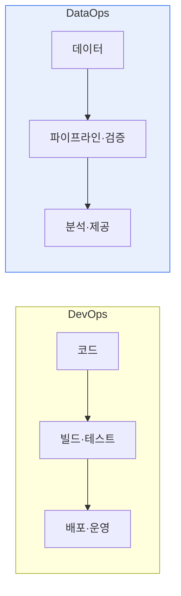

# 데이터옵스(DataOps)와 데브옵스(DevOps)

## 1. 개요

### 가. 정의
> **데브옵스(DevOps)** 는 개발(Dev)과 운영(Ops)을 통합해 소프트웨어 배포를 자동화·가속하는 방법론이고, **데이터옵스(DataOps)** 는 이 원리를 **데이터 파이프라인·분석**에 적용해 데이터 제공의 속도·품질을 높이는 방법론이다.

DataOps가 등장한 배경은, DevOps가 코드 배포를 혁신했듯 '**데이터 제공도 자동화·협업으로 혁신**'할 필요가 생겼기 때문이다. 데이터 수집·정제·분석이 수작업이면 느리고 오류가 잦다. DataOps는 데이터 파이프라인에 CI/CD·테스트·모니터링·협업을 도입해 신뢰할 수 있는 데이터를 빠르게 공급한다.

## 2. DataOps와 DevOps 비교 (1)

| 구분 | DevOps | DataOps |
|---|---|---|
| **대상** | 애플리케이션 코드 | 데이터·파이프라인·분석 |
| **목표** | 빠르고 안정적인 SW 배포 | 신뢰할 수 있는 데이터 신속 제공 |
| **협업** | 개발+운영 | 데이터엔지니어+분석가+운영 |
| **핵심** | CI/CD, IaC | 데이터 파이프라인 자동화·품질 |
| **테스트** | 코드 테스트 | 데이터 품질·검증 |

## 3. 데이터옵스 아키텍처 및 주요 기술 (2)

| 구성 | 주요 기술 |
|---|---|
| **수집·저장** | Kafka, 데이터레이크/웨어하우스 |
| **처리·변환** | Spark, dbt, ETL/ELT |
| **오케스트레이션** | Airflow, 워크플로 자동화 |
| **품질·테스트** | 데이터 검증·프로파일링, 계보(Lineage) |
| **모니터링·거버넌스** | 데이터 관측성(Observability), 카탈로그 |

## 4. 시사점
- DataOps는 DevOps + **데이터 품질·거버넌스**의 결합
- 데이터 관측성(신선도·품질·계보)으로 신뢰성 확보
- MLOps·데이터 메시와 연계해 데이터 중심 조직으로 진화

---

> **한 줄 요약**: DevOps는 코드 배포를, DataOps는 데이터 파이프라인·분석을 자동화·협업으로 혁신하며, DataOps는 수집→변환→품질검증→오케스트레이션→제공 아키텍처와 데이터 관측성으로 신뢰할 수 있는 데이터를 신속 공급한다.
