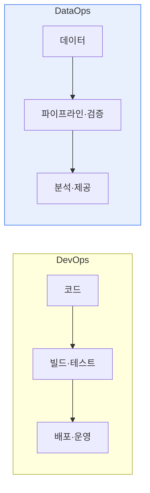

# 데이터옵스(DataOps)와 데브옵스(DevOps)

## 1. 개요

### 가. 정의
> **데브옵스(DevOps)** 는 개발(Dev)과 운영(Ops)을 통합해 소프트웨어 배포를 자동화·가속하는 방법론이고, **데이터옵스(DataOps)** 는 이 원리를 **데이터 파이프라인·분석**에 적용해 데이터 제공의 속도와 품질을 높이는 방법론이다.

DataOps가 등장한 배경은, DevOps가 코드 배포를 혁신했듯 '**데이터 제공도 자동화·협업으로 혁신할 필요**'가 생겼기 때문이다. 데이터 분석 현장에서는 데이터 엔지니어가 파이프라인을 만들고, 분석가가 이를 받아 분석하고, 운영이 이를 관리하는데, 이 과정이 수작업이고 단절되어 있으면 데이터 제공이 느리고 오류가 잦다. 분석가가 "데이터가 이상하다"고 하면 원인을 찾는 데 며칠이 걸리기도 한다. DataOps는 DevOps의 CI/CD·자동화·협업 문화를 데이터 파이프라인에 도입해, 신뢰할 수 있는 데이터를 빠르게 공급한다. 핵심 차이는 관리 대상이다. DevOps는 애플리케이션 코드를 다루지만, DataOps는 코드에 더해 **끊임없이 변하는 데이터 자체의 품질**까지 관리해야 한다는 점이 근본적으로 다르다.

### 나. 필요성
데이터 기반 의사결정·AI가 확산되면서, 데이터를 얼마나 빠르고 정확하게 공급하느냐가 경쟁력이 되었다. DataOps 없이 수작업에 의존하면 데이터 병목과 품질 저하가 발생해 분석·AI의 신뢰가 무너진다.

## 2. DataOps와 DevOps 비교

두 방법론은 목표와 대상이 다르다. DevOps는 애플리케이션 코드를 빠르고 안정적으로 배포하는 것이 목표이고, DataOps는 신뢰할 수 있는 데이터를 신속히 제공하는 것이 목표다. DevOps의 협업이 개발+운영이라면, DataOps는 데이터 엔지니어+분석가+운영으로 확장된다. 테스트 대상도 DevOps는 코드, DataOps는 데이터 품질까지 포함한다.

| 구분 | DevOps | DataOps |
|---|---|---|
| **대상** | 애플리케이션 코드 | 데이터·파이프라인·분석 |
| **목표** | 빠르고 안정적인 SW 배포 | 신뢰할 수 있는 데이터 신속 제공 |
| **협업** | 개발+운영 | 데이터엔지니어+분석가+운영 |
| **핵심** | CI/CD, IaC | 데이터 파이프라인 자동화·품질 |
| **테스트** | 코드 테스트 | 데이터 품질·검증 |

## 3. 데이터옵스 아키텍처 및 주요 기술

DataOps 아키텍처는 데이터가 수집되어 분석에 제공되기까지의 파이프라인을 자동화·모니터링한다. 데이터를 수집·저장(Kafka·데이터레이크)하고, 처리·변환(Spark·dbt)하며, 품질을 검증하고, 워크플로를 오케스트레이션(Airflow)한 뒤, 분석에 제공한다. 이 전 과정을 데이터 관측성(Observability)으로 감시해, 데이터의 신선도·품질·계보(어디서 와서 어떻게 변했는지)를 추적한다.

| 구성 | 주요 기술 |
|---|---|
| **수집·저장** | Kafka, 데이터레이크/웨어하우스 |
| **처리·변환** | Spark, dbt, ETL/ELT |
| **오케스트레이션** | Airflow, 워크플로 자동화 |
| **품질·테스트** | 데이터 검증·프로파일링, 계보(Lineage) |
| **모니터링·거버넌스** | 데이터 관측성(Observability), 카탈로그 |

## 4. 고려사항 및 시사점

1. **DataOps는 DevOps에 데이터 품질·거버넌스를 결합**한 것이다. 코드 자동화를 넘어, 데이터 검증·품질·계보 관리가 더해져야 신뢰할 수 있는 데이터를 지속 공급할 수 있다.
2. **데이터 관측성이 신뢰성의 핵심**이다. 데이터의 신선도·품질·계보를 실시간 감시해, 문제가 하류(분석·AI)로 번지기 전에 조기에 잡아야 한다.
3. **MLOps·데이터 메시와 연계**해 진화한다. DataOps로 확보한 고품질 데이터 파이프라인은 MLOps의 기반이 되고, 데이터를 도메인별로 분산 소유·관리하는 데이터 메시와 결합해 데이터 중심 조직으로 발전한다.

---

> **한 줄 요약**: DevOps는 코드 배포를, DataOps는 데이터 파이프라인·분석을 자동화·협업으로 혁신하며, DataOps는 수집→변환→품질검증→오케스트레이션→제공 아키텍처와 데이터 관측성으로 신뢰할 수 있는 데이터를 신속 공급해 MLOps·데이터 메시의 기반이 된다.
