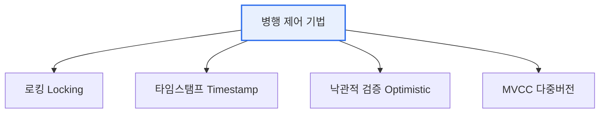

# 데이터베이스 병행 제어(Concurrency Control)

## 1. 개요

### 가. 정의 및 필요성
> 여러 트랜잭션이 **동시에 같은 데이터에 접근**할 때 발생하는 상호 간섭을 제어하여, 데이터의 **일관성과 격리성을 보장**하는 기법.

병행 제어가 필요한 이유는 동시 실행이 성능(처리량)을 높이는 대신 **데이터 정합성을 위협**하기 때문이다. 두 트랜잭션이 통제 없이 같은 계좌 잔액을 동시에 수정하면 갱신이 사라지는 등 이상현상이 발생한다. 병행 제어는 동시성의 이점을 유지하면서 이런 문제를 막는다.

### 나. 병행 제어 부재 시 이상현상
| 이상현상 | 내용 |
|---|---|
| **갱신 손실** | 한 트랜잭션의 갱신이 다른 것에 덮여 사라짐 |
| **오손 읽기(Dirty Read)** | 커밋 안 된 데이터를 읽음 |
| **비일관성(Inconsistent)** | 일부만 반영된 상태를 읽음 |
| **연쇄 복귀** | 한 롤백이 연쇄적으로 다른 트랜잭션 롤백 |

## 2. 병행 제어 기법

| 기법 | 원리 | 특징 |
|---|---|---|
| **로킹(Locking)** | 접근 전 잠금(공유·배타), 2PL | 직관적이나 교착상태(Deadlock) 위험 |
| **타임스탬프** | 트랜잭션 순서를 타임스탬프로 결정 | 교착 없으나 롤백 잦음 |
| **낙관적 검증** | 실행 후 커밋 시점 충돌 검사 | 충돌 적은 환경에 효율 |
| **MVCC** | 데이터 버전(스냅샷) 유지 | 읽기-쓰기 충돌 최소화(Oracle·PostgreSQL) |

## 3. 시사점
- 로킹의 교착상태는 예방·회피·탐지·복구로 관리(2PL·타임아웃)
- MVCC가 현대 DBMS의 주류 — 읽기 성능·동시성 우수
- 격리 수준과 연계해 일관성·성능 트레이드오프 조절

---

> **한 줄 요약**: 병행 제어는 동시 트랜잭션의 간섭으로 인한 이상현상(갱신손실·오손읽기)을 막아 일관성을 보장하며, *로킹·타임스탬프·낙관적 검증·MVCC* 로 동시성과 정합성을 조율한다.
