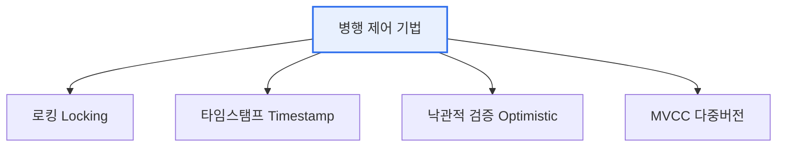

# 데이터베이스 병행 제어(Concurrency Control)

## 1. 개요

### 가. 정의 및 필요성
> 여러 트랜잭션이 **동시에 같은 데이터에 접근**할 때 발생하는 상호 간섭을 제어하여, 데이터의 **일관성과 트랜잭션의 격리성을 보장**하는 기법.

병행 제어가 필요한 이유는 동시성이 성능과 정합성이라는 두 가치를 충돌시키기 때문이다. 여러 사용자가 동시에 DB에 접근하게 하면 처리량(성능)은 크게 올라가지만, 통제가 없으면 **데이터 정합성이 무너진다**. 예를 들어 잔액 100만 원 계좌에서 두 창구가 동시에 "잔액을 읽어(100) → 50 출금 → 50으로 갱신"을 수행하면, 실제로는 두 번 출금됐는데 잔액은 50만 원이 되어 한 번의 출금이 사라진다(갱신 손실). 병행 제어는 이런 이상현상을 막으면서도 동시성의 이점을 최대한 살리는 것이 목표다. 즉 "가능한 한 많이 동시에 처리하되, 정합성은 지킨다"는 균형을 맞춘다.

### 나. 병행 제어 부재 시 이상현상
통제 없는 동시 실행은 네 가지 대표적 이상현상을 낳는다. 이를 이해해야 왜 병행 제어가 필요한지가 분명해진다.

| 이상현상 | 내용 |
|---|---|
| **갱신 손실(Lost Update)** | 한 트랜잭션의 갱신이 다른 것에 덮여 사라짐 |
| **오손 읽기(Dirty Read)** | 아직 커밋 안 된 데이터를 읽음 |
| **비일관성 읽기** | 일부만 반영된 중간 상태를 읽음 |
| **연쇄 복귀(Cascading Rollback)** | 한 롤백이 연쇄적으로 다른 트랜잭션 롤백 유발 |

## 2. 병행 제어 기법

병행 제어에는 접근 방식이 다른 여러 기법이 있다. **로킹** 은 데이터 접근 전에 잠금을 걸어 다른 트랜잭션의 접근을 막는 가장 직관적인 방식으로, 읽기용 공유 락과 쓰기용 배타 락을 구분하며 2단계 로킹(2PL)으로 직렬성을 보장한다. 다만 서로가 상대의 락을 기다리는 **교착상태(Deadlock)** 위험이 있다. **타임스탬프** 는 트랜잭션에 시간표를 부여해 순서를 강제하므로 교착은 없지만 순서를 어기면 롤백이 잦다. **낙관적 검증** 은 일단 실행하고 커밋 시점에 충돌을 검사하는 방식으로, 충돌이 드문 환경에서 효율적이다. **MVCC** 는 데이터의 여러 버전(스냅샷)을 유지해 읽기가 쓰기를 막지 않게 한다.

| 기법 | 원리 | 특징 |
|---|---|---|
| **로킹(2PL)** | 접근 전 잠금(공유·배타) | 직관적, 교착상태 위험 |
| **타임스탬프** | 트랜잭션 순서를 시간표로 결정 | 교착 없음, 롤백 잦음 |
| **낙관적 검증** | 실행 후 커밋 시 충돌 검사 | 충돌 적은 환경에 효율 |
| **MVCC** | 데이터 버전(스냅샷) 유지 | 읽기-쓰기 충돌 최소화 |

## 3. MVCC와 격리 수준

현대 DBMS(Oracle·PostgreSQL 등)가 주로 채택한 **MVCC(다중 버전 동시성 제어)** 는 데이터를 수정할 때 기존 버전을 남기고 새 버전을 만든다. 그러면 읽는 트랜잭션은 자신이 시작한 시점의 스냅샷(일관된 과거 버전)을 보므로, 쓰기 트랜잭션에 막히지 않고 읽기 성능과 동시성이 크게 향상된다. 병행 제어는 트랜잭션 격리 수준(Read Committed·Repeatable Read·Serializable)과 함께 작동해, 어느 정도의 이상현상까지 허용할지를 조절한다.

## 4. 고려사항 및 시사점

1. **로킹의 교착상태는 별도 관리**가 필요하다. 예방(자원 순서화)·회피·탐지(대기 그래프)·복구(희생자 롤백)나 타임아웃으로 교착을 다룬다.
2. **MVCC가 현대 DBMS의 주류**가 된 이유는 읽기 위주 워크로드에서 읽기와 쓰기가 서로를 막지 않아 동시성이 뛰어나기 때문이다.
3. **격리 수준과 연계한 균형 조절**이 실무의 핵심이다. 강한 일관성이 필요하면 Serializable을, 성능이 중요하면 낮은 격리 수준을 선택해 일관성과 성능의 트레이드오프를 조정한다.

---

> **한 줄 요약**: 병행 제어는 동시 트랜잭션의 간섭으로 인한 이상현상(갱신손실·오손읽기)을 막아 일관성을 보장하며, *로킹(2PL)·타임스탬프·낙관적 검증·MVCC* 로 동시성과 정합성의 균형을 맞추고 격리 수준과 연계해 조절한다.
