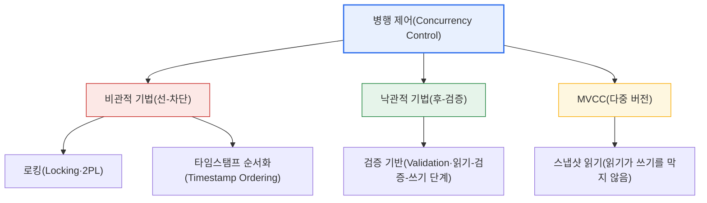
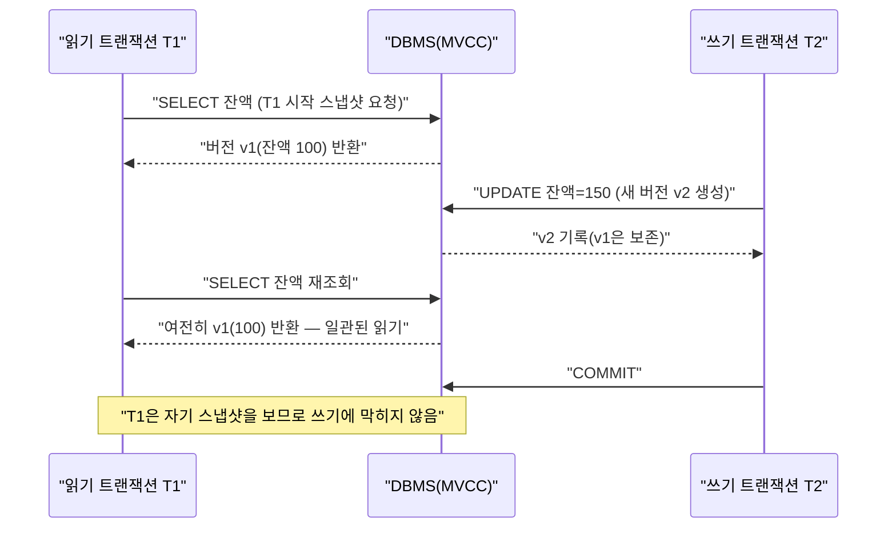

# 데이터베이스 병행 제어(Concurrency Control)

## 1. 개요

### 가. 정의 및 필요성
> 병행 제어(Concurrency Control)란 여러 트랜잭션이 **동시에 같은 데이터에 접근**할 때 발생하는 상호 간섭을 통제하여, 데이터의 **일관성(Consistency)과 트랜잭션의 격리성(Isolation)을 보장**하면서도 동시성(Concurrency)의 이점을 최대한 살리는 기법이다.

병행 제어가 필요한 근본 이유는 동시성이 '성능'과 '정합성'이라는 두 가치를 정면으로 충돌시키기 때문이다. 하나의 DBMS에 여러 사용자·응용이 동시에 접근하도록 허용하면 CPU·디스크 유휴 시간이 줄어 처리량(throughput)과 응답성이 크게 올라간다. 그러나 아무 통제 없이 연산을 뒤섞으면 트랜잭션들이 서로의 중간 결과를 침범해 **데이터 정합성이 무너진다**. 즉 병행 제어의 목표는 "가능한 한 많은 트랜잭션을 동시에 처리하되, 마치 한 번에 하나씩 순서대로 실행한 것과 같은 결과(직렬성, Serializability)를 보장한다"는 균형점을 찾는 데 있다.

대표적 사례가 은행 계좌의 갱신 손실이다. 잔액 100만 원 계좌에 대해 두 창구(트랜잭션 T1·T2)가 동시에 "잔액을 읽어(100) → 50만 원 출금 → 50으로 갱신"을 수행한다고 하자. 두 트랜잭션이 모두 원래 잔액 100을 읽은 뒤 각자 50으로 갱신하면, 실제로는 100만 원이 출금됐는데도 최종 잔액은 50만 원이 되어 한 번의 출금이 통째로 사라진다. 이처럼 동시성은 방치하면 곧바로 금전적 오류로 이어지므로, 병행 제어는 트랜잭션 처리 시스템의 안전을 지키는 필수 장치다.

### 나. 트랜잭션 ACID와의 관계
병행 제어는 트랜잭션의 4대 성질인 **ACID(원자성·일관성·격리성·지속성)** 중 특히 **격리성(Isolation)** 을 구현하는 메커니즘이다. 원자성이 로그·복구로, 지속성이 디스크 반영·로그로 보장된다면, 격리성은 병행 제어가 담당한다. 격리성이 이상적으로 지켜지면 각 트랜잭션은 자신이 시스템을 독점한 것처럼 동작하고, 그 결과 일관성이 유지된다. 따라서 병행 제어는 격리성을 통해 일관성을 지탱하는, ACID의 핵심 축이다.

### 다. 병행 제어 부재 시 이상현상
통제 없는 동시 실행은 네 가지 대표적 이상현상(anomaly)을 낳는다. 이 현상들을 이해해야 왜 병행 제어와 격리 수준이 필요한지가 분명해진다. 갱신 손실은 앞서 본 대로 한 갱신이 다른 갱신에 덮여 사라지는 것이고, 오손 읽기는 아직 커밋되지 않아 언제든 취소될 수 있는 값을 읽어 그것을 근거로 잘못된 판단을 내리는 것이다. 비반복 읽기·유령 읽기는 한 트랜잭션 안에서 같은 조건으로 두 번 읽었는데 그 사이 다른 트랜잭션이 값이나 행을 바꿔 결과가 달라지는 현상이며, 연쇄 복귀는 한 트랜잭션의 롤백이 그 중간값을 읽어간 다른 트랜잭션들의 연쇄 롤백을 유발해 낭비를 키우는 문제다.

| 이상현상 | 내용 | 예시 상황 |
|---|---|---|
| **갱신 손실(Lost Update)** | 한 트랜잭션의 갱신이 다른 것에 덮여 사라짐 | 동시 출금·재고 차감 |
| **오손 읽기(Dirty Read)** | 아직 커밋 안 된(취소 가능) 데이터를 읽음 | 미확정 잔액 기반 승인 |
| **비반복·유령 읽기** | 같은 조회를 반복했는데 중간에 값·행이 바뀜 | 집계 중 데이터 변경 |
| **연쇄 복귀(Cascading Rollback)** | 한 롤백이 다른 트랜잭션 롤백을 연쇄 유발 | 미커밋 값 참조 후 취소 |

## 2. 병행 제어 기법의 전체 구조

병행 제어에는 접근 철학이 서로 다른 여러 기법이 있다. 크게 보면 **충돌을 미리 막는 비관적(pessimistic) 접근**(로킹·타임스탬프)과 **일단 진행하고 나중에 검사하는 낙관적(optimistic) 접근**, 그리고 **버전을 나눠 읽기와 쓰기를 분리하는 다중 버전(MVCC) 접근**으로 나뉜다. 아래 구조도는 이 분류를 나타낸다.

```mermaid
flowchart TB
  C["병행 제어(Concurrency Control)"] --> P["비관적 기법(선-차단)"]
  C --> O["낙관적 기법(후-검증)"]
  C --> M["MVCC(다중 버전)"]
  P --> L["로킹(Locking·2PL)"]
  P --> T["타임스탬프 순서화(Timestamp Ordering)"]
  O --> V["검증 기반(Validation·읽기-검증-쓰기 단계)"]
  M --> S["스냅샷 읽기(읽기가 쓰기를 막지 않음)"]
  style C fill:#e8f0fe,stroke:#2f6fed,stroke-width:2px
  style P fill:#fce8e6,stroke:#c5221f
  style O fill:#e6f4ea,stroke:#188038
  style M fill:#fef7e0,stroke:#f9ab00
```

### 가. 로킹(Locking)과 2단계 로킹(2PL)
로킹은 데이터에 접근하기 전에 잠금을 걸어 다른 트랜잭션의 접근을 통제하는 가장 직관적인 방식이다. 읽기용으로는 여러 트랜잭션이 함께 걸 수 있는 **공유 락(Shared Lock)**, 쓰기용으로는 혼자만 걸 수 있는 **배타 락(Exclusive Lock)** 을 구분한다. 공유 락끼리는 양립하지만, 배타 락은 어떤 락과도 양립하지 않으므로 쓰기 중에는 다른 접근이 대기한다.

단순히 락을 걸고 푸는 것만으로는 직렬성이 보장되지 않아, **2단계 로킹(Two-Phase Locking, 2PL)** 규약을 쓴다. 2PL은 트랜잭션이 락을 획득하기만 하는 '확장 단계(growing phase)'와 락을 해제하기만 하는 '축소 단계(shrinking phase)'로 나뉘며, 한 번 락을 풀기 시작하면 새 락을 얻을 수 없다는 규칙이다. 이 규칙이 직렬 가능성을 보장한다. 다만 커밋 전에 락을 일찍 풀면 연쇄 복귀가 생길 수 있어, 실무에서는 커밋·롤백 시점까지 모든 락을 쥐고 있는 **엄격한 2PL(Strict 2PL)** 을 표준으로 채택한다.

로킹의 대표 부작용은 **교착상태(Deadlock)** 다. 두 트랜잭션이 서로가 쥔 락을 기다리며 영원히 멈추는 상황으로, 예컨대 T1이 A에 락을 걸고 B를 기다리는데 T2가 B에 락을 걸고 A를 기다리면 둘 다 진행하지 못한다. 또한 락 범위를 행·페이지·테이블 중 어디로 잡느냐(락 단위, granularity)에 따라 동시성과 오버헤드가 달라지는 트레이드오프가 있다. 락 단위가 작으면 동시성은 높지만 관리 부담이 커진다.

락 단위의 트레이드오프는 실무에서 자주 부딪히는 문제다. 행 수준 락은 서로 다른 행을 다루는 트랜잭션들이 방해받지 않아 동시성이 높지만, 수십만 행을 갱신하는 배치가 행마다 락을 쥐면 락 관리 오버헤드가 커진다. 이때 DBMS는 락 개수가 임계치를 넘으면 다수의 행 락을 하나의 테이블 락으로 승격하는 **락 에스컬레이션(lock escalation)** 을 수행하는데, 이는 관리 비용을 줄이는 대신 동시성을 떨어뜨린다. 그래서 대량 갱신 배치와 온라인 거래가 같은 테이블을 다투는 경우, 배치를 잘게 나눠 커밋하거나 실행 시간대를 분리해 락 충돌을 줄이는 설계가 중요하다.

### 나. 타임스탬프 순서화(Timestamp Ordering)
타임스탬프 기법은 각 트랜잭션에 시작 시각(타임스탬프)을 부여하고, 데이터 접근이 항상 그 시간 순서를 따르도록 강제하는 방식이다. 각 데이터에는 마지막으로 읽은 트랜잭션의 시각(read-TS)과 쓴 트랜잭션의 시각(write-TS)이 기록되며, 더 늦은 트랜잭션이 이미 처리된 순서를 거스르려 하면 그 트랜잭션을 **롤백(abort) 후 재시작**시킨다.

이 방식의 장점은 락을 쓰지 않으므로 **교착상태가 원천적으로 발생하지 않는다**는 점이다. 트랜잭션이 서로를 기다릴 일이 없기 때문이다. 그러나 순서를 어긴 트랜잭션을 즉시 되돌리므로, 경합이 심한 환경에서는 **롤백과 재시작이 잦아 낭비**가 커진다는 단점이 있다. 또한 이미 커밋한 값에 근거해 진행한 트랜잭션이 뒤늦게 취소되지 않도록 관리(연쇄 복귀 방지)가 필요하다.

### 다. 낙관적 검증(Optimistic Validation)
낙관적 기법은 "충돌은 드물다"는 가정에서 출발한다. 트랜잭션을 일단 자유롭게 실행하되(읽기 단계), 실제 DB에는 즉시 반영하지 않고 지역 사본에 작업한 뒤, 커밋 직전에 다른 트랜잭션과 충돌했는지 확인하고(검증 단계), 충돌이 없을 때만 결과를 실제로 반영한다(쓰기 단계). 검증에서 충돌이 발견되면 그 트랜잭션을 롤백한다.

낙관적 기법은 읽기 위주이고 충돌 빈도가 낮은 환경에서 락 오버헤드 없이 높은 동시성을 낸다는 장점이 있다. 반대로 쓰기 경합이 잦은 환경에서는 검증 실패로 인한 재실행이 폭증해 오히려 비효율적이다. 웹·NoSQL·분산 시스템에서 흔히 쓰이는 '버전 번호로 충돌을 감지하는 낙관적 락(optimistic lock)'이 이 사상의 실무 구현이다.

구체적으로 낙관적 락은 각 행에 버전 컬럼(예: `version`)을 두고, 갱신 시 `UPDATE ... SET version=version+1 WHERE id=? AND version=?` 형태로 읽었던 버전을 조건에 건다. 다른 트랜잭션이 먼저 갱신해 버전이 올라갔다면 이 UPDATE의 영향 행 수가 0이 되어 충돌을 즉시 감지하고, 애플리케이션은 최신 값을 다시 읽어 재시도한다. JPA·Hibernate의 `@Version`이 대표적 구현이며, 사용자가 화면을 오래 열어둔 뒤 저장하는 웹 환경처럼 트랜잭션을 길게 락으로 잡기 곤란한 상황에서 특히 유용하다. 이는 DB 엔진의 물리적 락 대신 애플리케이션 계층에서 논리적으로 충돌을 다루는 방식이다.

### 라. MVCC(다중 버전 동시성 제어)
**MVCC(Multi-Version Concurrency Control)** 는 데이터를 수정할 때 기존 버전을 덮어쓰지 않고 남긴 채 새 버전을 만들어, 읽기 트랜잭션이 자신이 시작한 시점의 일관된 스냅샷(과거 버전)을 보게 하는 기법이다. 그 결과 **읽기가 쓰기를 막지 않고, 쓰기가 읽기를 막지 않는다.** 오늘날 Oracle·PostgreSQL·MySQL InnoDB 등 대다수 상용·오픈소스 DBMS가 MVCC를 근간으로 삼는다.

MVCC의 핵심 가치는 읽기 위주 워크로드에서의 압도적 동시성이다. 다만 옛 버전을 계속 쌓아두므로 이를 정리하는 비용이 든다. 예를 들어 PostgreSQL은 더 이상 참조되지 않는 죽은 튜플(dead tuple)을 회수하는 **VACUUM** 작업이 필요하고, Oracle은 옛 이미지를 담는 **언두(undo) 세그먼트**를 관리해야 한다. 이 저장·정리 비용이 MVCC가 지불하는 대가다.

## 3. MVCC와 트랜잭션 격리 수준

병행 제어는 홀로 작동하지 않고 **트랜잭션 격리 수준(Isolation Level)** 과 함께 조율된다. 격리 수준은 "어느 정도의 이상현상까지 허용할 것인가"를 정하는 정책이며, 표준 SQL은 네 단계를 정의한다. 아래 시퀀스도는 MVCC 환경에서 읽기 트랜잭션이 쓰기 트랜잭션에 막히지 않고 스냅샷을 읽는 과정을 보여준다.

```mermaid
sequenceDiagram
  participant R as "읽기 트랜잭션 T1"
  participant DB as "DBMS(MVCC)"
  participant W as "쓰기 트랜잭션 T2"
  R->>DB: "SELECT 잔액 (T1 시작 스냅샷 요청)"
  DB-->>R: "버전 v1(잔액 100) 반환"
  W->>DB: "UPDATE 잔액=150 (새 버전 v2 생성)"
  DB-->>W: "v2 기록(v1은 보존)"
  R->>DB: "SELECT 잔액 재조회"
  DB-->>R: "여전히 v1(100) 반환 — 일관된 읽기"
  W->>DB: "COMMIT"
  Note over R,DB: "T1은 자기 스냅샷을 보므로 쓰기에 막히지 않음"
```

격리 수준은 낮을수록 동시성이 높고 이상현상을 더 허용하며, 높을수록 정합성이 강하지만 동시성이 떨어진다. **Read Uncommitted**는 오손 읽기까지 허용하는 가장 느슨한 단계, **Read Committed**는 커밋된 값만 읽어 오손 읽기를 막는 단계로 Oracle·PostgreSQL의 기본값이다. **Repeatable Read**는 한 트랜잭션 안 반복 읽기의 일관성을 보장하며 MySQL InnoDB의 기본값이고, **Serializable**은 마치 순차 실행한 것과 같은 완전한 격리를 제공하되 동시성은 가장 낮다.

| 격리 수준 | 오손 읽기 | 비반복 읽기 | 유령 읽기 | 특징 |
|---|---|---|---|---|
| **Read Uncommitted** | 허용 | 허용 | 허용 | 가장 느슨·최고 동시성 |
| **Read Committed** | 방지 | 허용 | 허용 | 실무 기본값(Oracle·PG) |
| **Repeatable Read** | 방지 | 방지 | 허용(엔진따라 방지) | InnoDB 기본값 |
| **Serializable** | 방지 | 방지 | 방지 | 최강 정합성·최저 동시성 |

## 4. 교착상태(Deadlock) 관리

로킹 기반 병행 제어에서 교착상태는 별도의 전략으로 다뤄야 하는 핵심 과제다. 표준적으로 예방(Prevention)·회피(Avoidance)·탐지(Detection)·복구(Recovery) 네 갈래로 접근한다. **예방**은 자원 요청 순서를 미리 정하거나(자원 순서화) 모든 락을 한꺼번에 확보하게 해 순환 대기를 원천 차단하는 방식이고, **회피**는 Wait-Die·Wound-Wait처럼 타임스탬프로 대기를 허용할지 롤백할지를 결정해 순환을 막는 방식이다.

**탐지**는 트랜잭션 간 대기 관계를 그린 **대기 그래프(Wait-for Graph)** 에서 사이클을 찾아 교착을 발견하는 방식이며, 사이클이 있으면 그중 롤백 비용이 가장 작은 트랜잭션을 **희생자(victim)** 로 골라 되돌린다(복구). 실무 DBMS는 주기적으로 대기 그래프를 검사하거나, 더 단순하게는 일정 시간 이상 락을 얻지 못하면 트랜잭션을 자동 취소하는 **락 타임아웃(lock timeout)** 을 병용한다. 예컨대 대량 배치와 온라인 거래가 같은 테이블을 반대 순서로 갱신하다 교착이 반복되면, 접근 순서를 통일하거나 배치 시간대를 분리해 근본 해결한다.

## 5. 심화: 분산·클라우드 환경에서의 병행 제어

전통적 병행 제어가 단일 노드 DBMS를 전제했다면, 오늘날의 분산·클라우드 데이터베이스는 노드를 넘나드는 동시성을 다뤄야 하므로 새로운 기법이 부상했다. Google Spanner는 **TrueTime**이라는 시계 동기화(불확실 구간 포함) 위에서 전역 타임스탬프를 부여해 지리적으로 분산된 노드 간에도 외부 일관성(external consistency)을 갖춘 직렬성을 구현한다. 이는 타임스탬프 순서화 사상을 지구 규모로 확장한 사례다.

또 하나의 흐름은 **SSI(Serializable Snapshot Isolation)** 다. 스냅샷 격리(MVCC 기반)는 성능이 좋지만 '쓰기 스큐(write skew)'라는 미묘한 이상을 허용하는데, PostgreSQL은 스냅샷 격리에 충돌 감지를 더한 SSI로 완전한 Serializable을 저비용에 제공한다. 분산 트랜잭션에서는 **2단계 커밋(2PC)** 으로 원자적 커밋을 보장하되, 조율자 장애 시 블로킹 문제를 완화하기 위한 변형·합의 프로토콜(Paxos·Raft)이 함께 쓰인다. 기술사 관점에서 중요한 통찰은, 분산 환경에서는 **CAP·PACELC 이론**이 말하듯 일관성과 가용성·지연 사이의 트레이드오프가 불가피하며, 그래서 많은 시스템이 강한 직렬성 대신 목적에 맞는 완화된 일관성 모델을 의도적으로 선택한다는 점이다.

## 6. 고려사항 및 시사점

1. **동시성과 정합성의 균형이 본질이다.** 병행 제어의 목표는 무조건 강한 격리가 아니라, 업무가 요구하는 정합성 수준을 만족시키는 선에서 동시성을 최대화하는 것이다. 결제·회계처럼 강한 일관성이 필요하면 Serializable을, 조회·통계처럼 성능이 중요하면 Read Committed 등 낮은 격리를 선택해 트레이드오프를 조정해야 한다.

2. **교착상태는 설계·운영 차원에서 선제 관리한다.** 예방·회피·탐지·복구와 타임아웃을 상황에 맞게 조합하고, 애플리케이션에서 자원 접근 순서를 통일하며 트랜잭션을 짧게 유지해 락 보유 시간을 줄이는 것이 근본 처방이다. 교착은 알고리즘만이 아니라 트랜잭션 설계로 줄인다.

3. **MVCC가 현대 DBMS의 주류가 된 이유를 이해한다.** 읽기 위주 워크로드에서 읽기와 쓰기가 서로를 막지 않아 동시성이 탁월하기 때문이며, 그 대가로 옛 버전 정리(VACUUM·언두 관리) 비용을 지불한다. MVCC 환경에서는 롱 트랜잭션이 옛 버전 누적을 유발해 성능을 떨어뜨릴 수 있으므로 트랜잭션 수명 관리가 중요하다.

4. **격리 수준을 워크로드별로 차등 적용한다.** 하나의 시스템 안에서도 트랜잭션 성격에 따라 격리 수준을 달리 설정해, 정합성이 결정적인 소수 거래만 높은 격리로 보호하고 나머지는 낮은 격리로 처리량을 확보하는 전략이 실무적으로 유효하다.

5. **분산·클라우드로의 확장을 염두에 둔다.** 단일 노드 기법을 그대로 분산에 적용할 수 없으며, TrueTime·SSI·합의 프로토콜과 CAP·PACELC 트레이드오프를 고려해 목표 일관성 모델을 의식적으로 설계해야 한다. 아키텍처 선택 단계에서 병행 제어·일관성 요구사항을 함께 정의하는 것이 바람직하다.

## 참고자료

- PostgreSQL Documentation — Transaction Isolation / Concurrency Control: https://www.postgresql.org/docs/current/mvcc.html
- Oracle Database Concepts — Data Concurrency and Consistency: https://docs.oracle.com/en/database/oracle/oracle-database/
- ANSI/ISO SQL 표준 격리 수준(Read Committed·Repeatable Read·Serializable) 개요: https://en.wikipedia.org/wiki/Isolation_(database_systems)

---

> **한 줄 요약**: 병행 제어는 동시 트랜잭션의 간섭으로 인한 이상현상(갱신손실·오손읽기 등)을 막아 격리성·일관성을 보장하는 기법으로, *로킹(2PL)·타임스탬프·낙관적 검증·MVCC* 로 동시성과 정합성의 균형을 맞추고 교착상태 관리와 격리 수준 조절, 나아가 분산 환경의 일관성 모델까지 함께 설계해야 한다.
