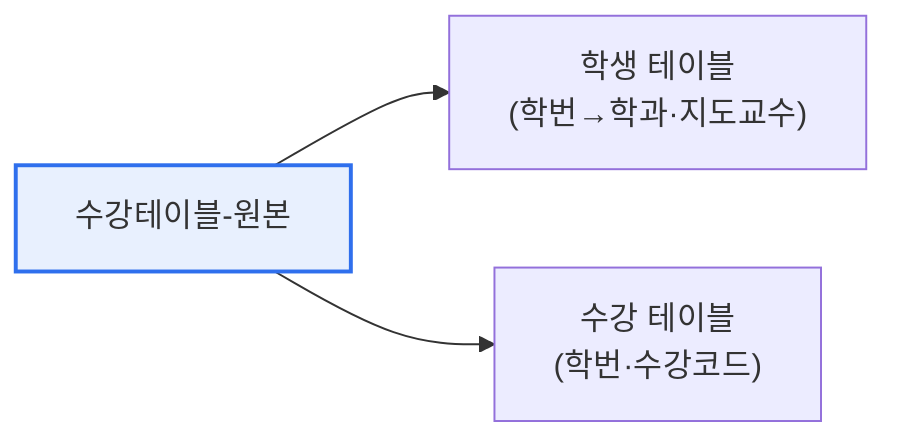

# 데이터베이스 정규화(Normalization)

## 1. 개요

### 가. 정의
> **정규화**는 관계형 데이터베이스에서 **데이터 중복을 제거하고 이상현상(Anomaly)을 방지**하기 위해, 릴레이션(테이블)을 함수적 종속성에 따라 여러 개로 분해하는 과정이다.

정규화가 필요한 근본 이유는 '**한 테이블에 여러 정보를 몰아넣으면 중복이 생기고, 그 중복이 이상현상을 부른다**'는 데 있다. 예를 들어 학생의 학과·지도교수 정보를 수강 테이블에 함께 넣으면, 같은 학생이 여러 과목을 들을 때마다 학과·지도교수가 반복 저장된다. 이 중복은 데이터를 넣고·지우고·바꿀 때 문제를 일으킨다. 정규화는 서로 다른 주제의 데이터를 별도 테이블로 분리하고 관계(외래키)로 연결함으로써, 각 정보를 한 곳에만 저장(한 사실은 한 곳에)해 이상현상을 원천 제거한다. 즉 정규화는 '데이터를 논리적으로 올바른 자리에 배치하는' 설계 원칙이다.

### 나. 필요성
중복이 방치되면 저장 공간 낭비를 넘어, 갱신 시 일부만 바뀌어 데이터가 모순되는 심각한 무결성 문제가 생긴다. 정규화는 데이터 일관성과 무결성을 보장하는 설계의 기초다.

## 2. 이상현상 3가지와 발생 이유

아래 <수강테이블>(기본키: {학번, 수강코드})을 보면, 학번·학과·지도교수·수강코드가 한 테이블에 섞여 있어 이상현상이 발생한다.

| 학번 | 학과 | 지도교수 | 수강코드 |
|---|---|---|---|
| 221571 | 컴퓨터과 | K1 | C412 |
| 221572 | 컴퓨터과 | M1 | C412 |
| 211561 | 수학과 | P2 | C324 |

이상현상의 근본 원인은 **기본키가 아닌 속성(학과·지도교수)이 기본키의 일부(학번)에만 종속** 되어 있는데도 한 테이블에 함께 있기 때문이다(부분 함수 종속).

| 이상현상 | 내용 | 발생 이유 |
|---|---|---|
| **삽입 이상** | 수강 없이는 학생 정보 삽입 불가 | 수강코드가 있어야 행 생성(불필요 데이터 강요) |
| **삭제 이상** | 수강 삭제 시 학생 정보까지 삭제 | 한 행에 여러 정보 혼재 |
| **갱신 이상** | 학과 변경 시 여러 행 중 일부만 수정 → 모순 | 학과 정보 중복 저장 |

## 3. 해결 방안과 테이블 재구성

해결책은 **함수적 종속성에 따라 테이블을 분리**하는 것이다. 학번에만 종속되는 학과·지도교수를 별도 테이블로 분리하고, 수강 관계는 학번·수강코드만 남긴다.

**학생 테이블** (기본키: 학번)

| 학번 | 학과 | 지도교수 |
|---|---|---|
| 221571 | 컴퓨터과 | K1 |
| 221572 | 컴퓨터과 | M1 |

**수강 테이블** (기본키: {학번, 수강코드})

| 학번 | 수강코드 |
|---|---|
| 221571 | C412 |
| 211561 | C324 |

이렇게 분리하면 학과·지도교수가 한 번만 저장되어(중복 제거) 삽입·삭제·갱신 이상이 모두 해소된다.

## 4. 정규화 단계와 고려사항

| 단계 | 조건 |
|---|---|
| **1NF** | 모든 속성이 원자값 |
| **2NF** | 부분 함수 종속 제거(기본키 전체에 종속) |
| **3NF** | 이행 함수 종속 제거 |
| **BCNF** | 모든 결정자가 후보키 |

## 5. 고려사항 및 시사점

1. **정규화와 성능의 트레이드오프**를 이해한다. 정규화는 무결성을 높이지만, 테이블이 나뉘어 조회 시 조인이 늘어 성능이 떨어질 수 있다. 조회 성능이 중요하면 의도적으로 **반정규화** 를 적용한다.
2. **함수적 종속성 분석이 핵심**이다. 어떤 속성이 무엇에 종속되는지를 정확히 파악해야 올바른 분해가 가능하다.
3. **OLTP는 정규화, OLAP은 반정규화**가 일반적이다. 트랜잭션 무결성이 중요한 업무 시스템은 정규화를, 조회·분석 중심의 데이터웨어하우스는 반정규화(스타 스키마)를 선택한다.

---

> **한 줄 요약**: 정규화는 *중복 제거와 이상현상(삽입·삭제·갱신) 방지* 를 위해 함수적 종속에 따라 테이블을 분해하는 과정으로, 부분 종속 속성을 별도 테이블로 분리해 무결성을 확보하되 조회 성능을 위해 반정규화와 균형을 맞춘다.
