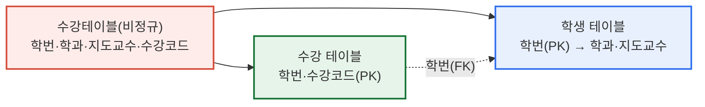
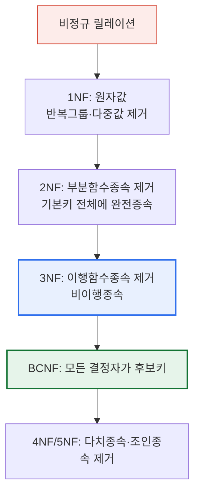

# 데이터베이스 정규화(Normalization)

## 1. 개요

### 가. 정의
> **정규화**는 관계형 데이터베이스에서 **데이터 중복을 제거하고 이상현상(Anomaly)을 방지**하기 위해, 릴레이션(테이블)을 **함수적 종속성(Functional Dependency)**에 따라 여러 개의 작은 릴레이션으로 무손실 분해(Lossless Decomposition)하는 체계적 설계 과정이다.

정규화가 필요한 근본 이유는 '**한 테이블에 서로 다른 주제의 정보를 몰아넣으면 중복이 생기고, 그 중복이 곧 이상현상을 부른다**'는 데 있다. 예를 들어 학생의 학과·지도교수 정보를 수강 테이블에 함께 넣으면, 같은 학생이 여러 과목을 수강할 때마다 학과·지도교수 값이 행마다 반복 저장된다. 처음에는 사소한 저장공간 낭비처럼 보이지만, 이 중복은 데이터를 넣고·지우고·바꾸는 모든 순간에 잠재적 오류를 만들어 낸다. 관계형 모델의 창시자 E. F. Codd가 1970년대에 정규형(Normal Form) 개념을 제시한 것도, "데이터를 어떻게 배치해야 갱신 시 모순이 생기지 않는가"라는 무결성 문제를 수학적으로 해결하기 위해서였다.

정규화의 핵심 사상은 **"하나의 사실은 오직 한 곳에만 저장한다(One Fact, One Place)"**로 요약된다. 서로 다른 주제(엔터티)의 데이터를 별도 테이블로 분리하고 외래키(FK)로 연결하면, 어떤 사실이든 데이터베이스 전체에서 단 한 번만 기록된다. 값을 바꿀 때 한 곳만 고치면 되므로 모순이 원천적으로 발생할 수 없다. 즉 정규화는 단순한 테이블 쪼개기 기법이 아니라, **데이터를 논리적으로 올바른 자리에 배치하는 설계 원칙**이며, 스키마의 품질을 결정하는 가장 기본적인 척도다.

또한 정규화는 **엔터티의 의미를 명확히 하는 과정**이기도 하다. 하나의 테이블에 학생·수강이라는 두 개념이 뒤섞여 있으면 그 테이블이 "무엇을 표현하는가"가 모호해진다. 정규화를 통해 테이블을 분해하면 각 테이블이 하나의 명확한 주제만 담게 되어, 스키마 자체가 업무 도메인의 개념 구조를 그대로 반영하게 된다. 이 점에서 정규화는 데이터 모델링(개념→논리 설계)의 마지막 정련 단계로도 볼 수 있다.

### 나. 필요성
중복이 방치되면 저장 공간 낭비를 넘어, 갱신 시 여러 행 중 일부만 바뀌어 **데이터가 서로 모순되는 심각한 무결성 문제**가 발생한다. 특히 계좌 잔액·재고 수량·고객 등급처럼 정확성이 곧 서비스 신뢰로 직결되는 데이터에서 중복은 치명적이다. 정규화는 이러한 논리적 무결성(Consistency)을 스키마 구조 차원에서 보장하는, 신뢰할 수 있는 데이터베이스 설계의 출발점이다. 반대로 조회 성능이 최우선인 분석계에서는 정규화를 완화(반정규화)하기도 하는데, 이 균형점을 판단하려면 먼저 정규화의 원리를 정확히 이해해야 한다.

## 2. 이상현상(Anomaly)의 발생 원리

정규화를 이해하는 가장 빠른 길은 "정규화하지 않으면 무슨 일이 벌어지는가"를 보는 것이다. 아래 `<수강테이블>`(기본키: {학번, 수강코드})은 학생 정보와 수강 정보를 한 테이블에 섞어 놓은 비정규 설계다.

| 학번 | 학과 | 지도교수 | 수강코드 |
|---|---|---|---|
| 221571 | 컴퓨터과 | K1 | C412 |
| 221571 | 컴퓨터과 | K1 | C511 |
| 221572 | 컴퓨터과 | M1 | C412 |
| 211561 | 수학과 | P2 | C324 |

이 표를 보면 학번 221571 학생이 두 과목(C412, C511)을 수강하므로, **학과(컴퓨터과)와 지도교수(K1)가 똑같이 두 번 저장**된다. 이상현상의 근본 원인은 바로 여기에 있다. 기본키가 아닌 속성인 학과·지도교수는 기본키 전체 {학번, 수강코드}가 아니라 **그 일부인 학번에만 종속(부분 함수 종속, Partial Dependency)**되는데도, 기본키의 다른 부분(수강코드)이 만들어 내는 행 수만큼 불필요하게 반복 저장되는 것이다. 이 구조적 결함이 삽입·삭제·갱신 세 가지 이상현상으로 표출된다.

첫째, **삽입 이상(Insertion Anomaly)**은 원하지 않는 데이터를 억지로 함께 넣어야 하는 문제다. 아직 어떤 과목도 신청하지 않은 신입생의 학과 정보를 저장하려 해도, 기본키의 일부인 수강코드가 NULL이면 행을 만들 수 없어 학생 정보 자체를 넣지 못한다. 즉 "수강해야만 학생으로 등록된다"는 비현실적 제약이 데이터 구조 때문에 강제된다.

둘째, **삭제 이상(Deletion Anomaly)**은 하나를 지우려다 관련 없는 정보까지 잃는 문제다. 학생 211561이 유일하게 듣던 C324 수강을 취소하여 그 행을 삭제하면, 함께 저장돼 있던 학과(수학과)·지도교수(P2) 정보까지 사라져 학생의 존재 자체가 데이터베이스에서 소멸한다. 수강 이력과 학생 신상이라는 별개의 사실이 한 행에 묶여 있기 때문이다.

셋째, **갱신 이상(Update Anomaly)**은 가장 위험한 유형으로, 중복된 값 중 일부만 수정되어 데이터가 모순되는 문제다. 학생 221571의 학과가 컴퓨터과에서 소프트웨어과로 바뀌면, 그 학생과 관련된 모든 행(C412, C511)을 빠짐없이 고쳐야 한다. 만약 한 행만 고치고 다른 행을 놓치면, 같은 학생의 학과가 동시에 두 개로 기록되어 "어느 것이 진짜인가"를 알 수 없는 상태가 된다.

| 이상현상 | 증상 | 근본 원인 |
|---|---|---|
| **삽입 이상** | 수강 없이는 학생 정보 삽입 불가 | 기본키의 일부(수강코드)가 NULL이면 행 생성 불가 |
| **삭제 이상** | 마지막 수강 삭제 시 학생 정보까지 소멸 | 한 행에 학생·수강 두 사실이 혼재 |
| **갱신 이상** | 학과 변경 시 일부 행만 수정→모순 | 학과 정보가 여러 행에 중복 저장 |

## 3. 해결 방안 — 함수적 종속성에 따른 무손실 분해

이상현상의 해결책은 명확하다. **부분 함수 종속을 제거하도록 테이블을 분리**하는 것이다. 학번에만 종속되는 학과·지도교수를 별도의 학생 테이블로 떼어 내고, 수강 관계 테이블에는 기본키 {학번, 수강코드}만 남긴다. 아래는 원본 테이블이 두 개의 명확한 주제 테이블로 분해되는 구조도다.

```mermaid
flowchart LR
  O["수강테이블(비정규)<br/>학번·학과·지도교수·수강코드"] --> S["학생 테이블<br/>학번(PK) → 학과·지도교수"]
  O --> E["수강 테이블<br/>학번·수강코드(PK)"]
  E -. "학번(FK)" .-> S
  style O fill:#fdecea,stroke:#d64b3a,stroke-width:2px
  style S fill:#e8f0fe,stroke:#2f6fed,stroke-width:2px
  style E fill:#e6f4ea,stroke:#137333,stroke-width:2px
```

분해 결과는 다음과 같다. **학생 테이블**에서는 학과·지도교수가 학생당 한 번만 저장되고, **수강 테이블**은 "누가 무엇을 듣는가"라는 관계만 순수하게 표현한다.

**학생 테이블** (기본키: 학번)

| 학번 | 학과 | 지도교수 |
|---|---|---|
| 221571 | 컴퓨터과 | K1 |
| 221572 | 컴퓨터과 | M1 |
| 211561 | 수학과 | P2 |

**수강 테이블** (기본키: {학번, 수강코드})

| 학번 | 수강코드 |
|---|---|
| 221571 | C412 |
| 221571 | C511 |
| 211561 | C324 |

이렇게 분리하면 세 가지 이상현상이 동시에 해소된다. 신입생은 학생 테이블에 학과만으로 등록되므로 **삽입 이상**이 사라지고, 수강을 모두 취소해도 학생 테이블의 신상은 남으므로 **삭제 이상**이 없어지며, 학과 변경은 학생 테이블의 단 한 행만 고치면 되므로 **갱신 이상**이 원천 제거된다. 중요한 점은 이 분해가 **무손실(Lossless)**이라는 것이다. 두 테이블을 학번으로 다시 조인(JOIN)하면 원래의 정보를 정확히 복원할 수 있어, 데이터를 나누되 의미는 하나도 잃지 않는다. 이것이 정규화가 단순한 삭제가 아니라 "안전한 분해"인 이유다.

## 4. 정규화 단계(Normal Forms)와 진행 절차

정규화는 한 번에 이루어지지 않고, 제거하는 종속성의 종류에 따라 1NF→2NF→3NF→BCNF→4NF→5NF의 단계로 점진적으로 진행된다. 실무에서는 대부분의 이상현상이 3NF 또는 BCNF에서 해소되므로, 통상 **3NF/BCNF까지를 목표**로 삼는다. 각 단계는 앞 단계를 만족한 상태에서 새로운 조건을 추가로 요구하는 누적적 구조를 가진다.

```mermaid
flowchart TB
  A["비정규 릴레이션"] --> B["1NF: 원자값<br/>반복그룹·다중값 제거"]
  B --> C["2NF: 부분함수종속 제거<br/>기본키 전체에 완전종속"]
  C --> D["3NF: 이행함수종속 제거<br/>비이행종속"]
  D --> E["BCNF: 모든 결정자가 후보키"]
  E --> F["4NF/5NF: 다치종속·조인종속 제거"]
  style A fill:#fdecea,stroke:#d64b3a
  style D fill:#e8f0fe,stroke:#2f6fed,stroke-width:2px
  style E fill:#e6f4ea,stroke:#137333,stroke-width:2px
```

**제1정규형(1NF)**은 모든 속성이 더 이상 나눌 수 없는 원자값(Atomic Value)을 갖도록 요구한다. 한 칸에 "C412, C511"처럼 여러 값을 콤마로 넣거나 반복 컬럼(과목1, 과목2)을 두면 1NF 위반이다. 이 경우 각 값을 별도 행으로 풀어 반복그룹을 제거한다. 1NF는 관계형 테이블의 최소 자격 요건에 해당한다.

**제2정규형(2NF)**은 1NF를 만족하면서 **부분 함수 종속을 제거**한 상태다. 앞 절의 예처럼 기본키가 복합키({학번, 수강코드})일 때, 기본키의 일부(학번)에만 종속되는 속성(학과·지도교수)을 분리하면 2NF가 된다. 기본키가 단일 속성이면 부분 종속 자체가 성립하지 않으므로 1NF이면 자동으로 2NF다.

**제3정규형(3NF)**은 2NF를 만족하면서 **이행 함수 종속(Transitive Dependency)을 제거**한 상태다. 예컨대 (학번→학과)이고 (학과→단과대학)이면, 학번→단과대학이라는 이행 종속이 존재한다. 이때 학과가 바뀌면 단과대학도 함께 관리해야 하는 중복이 생기므로, 학과-단과대학을 별도 테이블로 분리한다. 실무 스키마의 목표선이 대부분 여기에 있다.

**BCNF(Boyce-Codd Normal Form)**는 3NF를 강화하여 **모든 결정자(Determinant)가 후보키(Candidate Key)**여야 한다는 조건을 요구한다. 후보키가 여러 개이고 서로 겹치는(중첩된) 특수한 상황에서 3NF를 만족해도 남는 이상현상을 제거하기 위한 단계로, 예약 시스템(학생·과목·강사가 얽힌 배정 등)에서 자주 등장한다. 다만 BCNF 분해는 함수 종속성 보존(Dependency Preservation)이 깨질 수 있어, 실무에서는 3NF와 BCNF 사이의 트레이드오프를 검토한 뒤 적용 수준을 정한다.

정규화를 실제로 수행하는 절차는 다음과 같이 요약된다. 첫째, 대상 릴레이션의 모든 속성과 그들 사이의 함수적 종속성을 빠짐없이 도출한다. 둘째, 후보키와 기본키를 확정한다. 셋째, 1NF부터 시작해 각 단계의 위반 종속(반복그룹→부분종속→이행종속→후보키가 아닌 결정자)을 순서대로 찾아 해당 속성을 새 릴레이션으로 분리한다. 넷째, 분리된 릴레이션들을 다시 조인했을 때 원본이 복원되는지(무손실 조인)와 원래의 종속성이 보존되는지를 검증한다. 이 절차를 기계적으로 따르기보다, 각 분해가 업무 규칙(도메인 의미)과 일치하는지를 함께 확인하는 것이 올바른 스키마를 얻는 핵심이다.

| 단계 | 만족 조건 | 제거 대상 |
|---|---|---|
| **1NF** | 모든 속성이 원자값 | 반복그룹·다중값 |
| **2NF** | 기본키 전체에 완전 함수 종속 | 부분 함수 종속 |
| **3NF** | 이행 종속 없음 | 이행 함수 종속 |
| **BCNF** | 모든 결정자가 후보키 | 후보키 중첩에 의한 잔여 이상 |
| **4NF** | 다치 종속 없음 | 다치 종속(MVD) |
| **5NF** | 조인 종속 없음 | 조인 종속(PJNF) |

## 5. 심화 — 정규화와 반정규화(De-normalization)의 실무 트레이드오프

이론적으로는 정규화 단계가 높을수록 무결성이 좋아지지만, 실무에서는 무조건 높은 정규형이 정답은 아니다. 정규화는 테이블을 잘게 나누므로, 하나의 화면·리포트를 만들기 위해 여러 테이블을 **조인(JOIN)**해야 하는 경우가 늘어난다. 조인은 CPU·메모리를 소모하고, 대용량·고빈도 조회 환경에서는 응답 지연의 주범이 된다. 그래서 등장하는 것이 **반정규화**로, 성능을 위해 의도적으로 중복을 허용하거나 테이블을 통합하는 역방향 설계 기법이다.

대표적 사례가 데이터웨어하우스(DW)의 **스타 스키마(Star Schema)**다. 분석계는 "지난 분기 지역별·상품별 매출 합계"처럼 대량 집계 조회가 주를 이루는데, 정규화된 수십 개 테이블을 매번 조인하면 성능이 나오지 않는다. 그래서 사실(Fact) 테이블 주위에 차원(Dimension) 테이블을 배치하되, 차원 테이블 안에는 지역명·상품분류 같은 값을 일부러 중복 저장(반정규화)하여 조인 횟수를 최소화한다. 이커머스에서 상품 목록 화면에 "리뷰 개수"나 "평균 평점"을 상품 테이블에 미리 계산해 저장해 두는 것도 같은 원리의 반정규화다. 매 조회마다 리뷰 테이블을 집계하는 대신, 리뷰가 추가될 때만 카운트를 갱신하여 읽기 성능을 극적으로 개선한다.

핵심은 **반정규화가 정규화의 실패가 아니라 정규화를 전제로 한 의식적 선택**이라는 점이다. 먼저 정규화로 올바른 논리 구조를 확보한 뒤, 실측된 성능 병목이 확인된 부분에 한해 반정규화를 적용해야 한다. 정규화 없이 처음부터 중복을 방치하는 것과, 정규화 후 통제된 중복을 도입하는 것은 전혀 다르다. 후자의 경우 중복된 값의 일관성을 유지할 책임(트리거·배치·애플리케이션 로직)이 명확히 관리되기 때문이다. 성능과 무결성이라는 두 목표는 상충하므로, 기술사는 시스템의 성격(트랜잭션 중심 OLTP인지, 조회 중심 OLAP인지)에 따라 이 균형점을 판단할 수 있어야 한다.

## 6. 고려사항 및 시사점

1. **정규화와 성능의 트레이드오프 판단이 설계 역량의 핵심이다.** 정규화는 무결성을 높이지만 조인 증가로 조회 성능을 떨어뜨릴 수 있다. 무결성이 최우선인 계정계·원장 시스템은 3NF/BCNF까지 정규화하고, 조회 성능이 최우선인 분석계·통계계는 반정규화(스타 스키마, 집계 컬럼)를 전략적으로 적용하는 이원화 접근이 바람직하다.

2. **정확한 함수적 종속성 분석이 올바른 분해의 전제다.** "어떤 속성이 무엇에 의해 결정되는가"를 업무 규칙 차원에서 정확히 식별하지 못하면, 잘못된 키로 테이블을 나눠 오히려 무손실 분해가 깨지거나 불필요한 조인이 생긴다. 종속성 다이어그램(FD Diagram) 작성과 도메인 전문가 검증을 설계 절차에 포함해야 한다.

3. **OLTP는 정규화, OLAP은 반정규화라는 기준으로 아키텍처를 분리한다.** 트랜잭션 무결성이 중요한 운영계는 정규화된 스키마로 데이터를 안전하게 축적하고, 조회·분석은 ETL로 별도의 반정규화된 분석 저장소(DW/데이터마트)에 적재해 처리한다. 이렇게 워크로드를 분리하면 무결성과 성능을 동시에 달성할 수 있다.

4. **반정규화 시 중복 데이터의 일관성 유지 메커니즘을 반드시 함께 설계한다.** 집계 컬럼·중복 컬럼을 도입했다면, 원천 데이터 변경 시 이를 동기화하는 트리거·CDC·배치 또는 애플리케이션 로직을 명시적으로 마련해야 한다. 동기화 책임이 불분명한 반정규화는 갱신 이상을 인위적으로 되살리는 결과를 낳는다.

5. **NoSQL·문서형 DB 시대에도 정규화 원리는 유효하다.** MongoDB 등 문서형 DB는 조회 성능을 위해 데이터를 내장(Embedding, 반정규화)하는 것을 권장하지만, 이는 정규화 원리를 몰라도 된다는 뜻이 아니라 정규화·반정규화의 트레이드오프를 이해한 위에서 액세스 패턴에 맞춰 의도적으로 선택한다는 뜻이다. 원리를 알아야 참조(Reference)와 내장(Embedding) 중 무엇을 택할지 판단할 수 있다.

## 참고자료
- Codd, E. F., "A Relational Model of Data for Large Shared Data Banks", CACM, 1970. https://dl.acm.org/doi/10.1145/362384.362685
- Wikipedia, "Database normalization". https://en.wikipedia.org/wiki/Database_normalization

---

> **한 줄 요약**: 정규화는 *중복 제거와 이상현상(삽입·삭제·갱신) 방지*를 위해 함수적 종속성에 따라 테이블을 무손실 분해하는 설계 원칙(1NF→2NF→3NF→BCNF)으로, 부분·이행 종속을 제거해 무결성을 확보하되 조회 성능이 필요한 분석계에서는 반정규화와 전략적으로 균형을 맞춘다.
