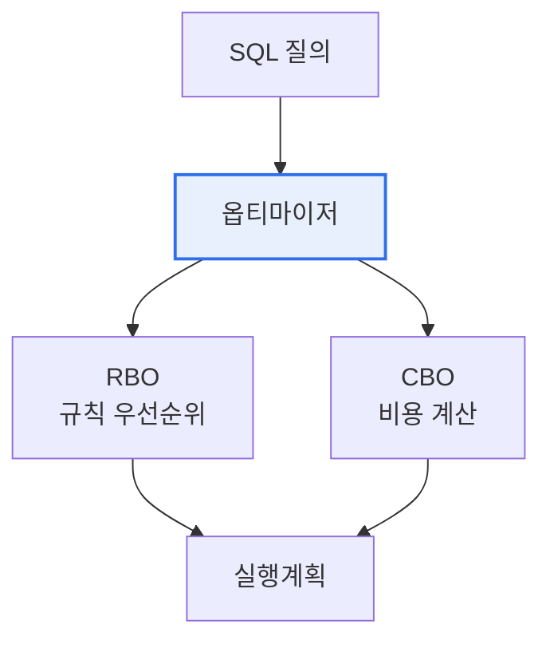

# 데이터베이스 옵티마이저(Optimizer) — RBO와 CBO

## 1. 개요

### 가. 개념
> **옵티마이저**는 SQL 질의를 실행할 때 **가능한 여러 실행 경로 중 가장 효율적인 방법(실행계획)을 선택**하는 DBMS의 핵심 엔진이다. 같은 결과를 얻는 방법은 여러 가지인데, 옵티마이저가 그중 최적을 고른다.

옵티마이저를 이해하는 핵심은 '**하나의 SQL에는 수많은 실행 방법이 있고, 어느 것을 택하느냐에 따라 성능이 수백 배 차이 난다**'는 데 있다. 예를 들어 두 테이블을 조인하는 질의도, 어느 테이블을 먼저 읽을지·인덱스를 쓸지·어떤 조인 방식을 쓸지에 따라 처리 시간이 극단적으로 갈린다. 사용자는 "무엇을 원하는가(SQL)"만 선언하고 "어떻게 처리할지"는 지정하지 않으므로, 그 '어떻게'를 결정하는 것이 옵티마이저의 몫이다. 옵티마이저는 실행 경로들을 평가해 가장 비용이 적은 계획을 세운다. 이 계획을 어떤 기준으로 세우느냐에 따라, 정해진 규칙을 따르는 **RBO** 와 실제 비용을 계산하는 **CBO** 로 나뉜다.

### 나. 필요성
데이터가 크고 질의가 복잡할수록 실행 방법 선택이 성능을 좌우한다. 옵티마이저는 사용자가 신경 쓰지 않아도 최적 경로를 찾아 성능을 확보하는 DBMS의 지능이다.

## 2. RBO vs CBO

**RBO(Rule Based Optimizer)** 는 미리 정해진 규칙과 우선순위(예: 인덱스가 있으면 무조건 사용)에 따라 실행계획을 세운다. 단순하고 예측 가능하지만 데이터의 실제 분포·양을 고려하지 않아 비효율적일 수 있다. **CBO(Cost Based Optimizer)** 는 테이블 크기·데이터 분포·인덱스 통계 등을 바탕으로 각 실행 경로의 **비용을 계산** 해 가장 저렴한 것을 선택한다. 통계에 기반하므로 훨씬 지능적이고, 현대 DBMS의 표준이다.

| 구분 | RBO(규칙 기반) | CBO(비용 기반) |
|---|---|---|
| **기준** | 정해진 규칙·우선순위 | 통계 기반 비용 계산 |
| **데이터 반영** | 안 함 | 반영(크기·분포·통계) |
| **장점** | 단순·예측 가능 | 지능적·효율적 |
| **단점** | 실제 상황 무시(비효율) | 통계 정확성에 의존 |
| **현재** | 거의 폐기 | 표준 |

## 3. 옵티마이저 적용 시 고려사항

| 고려사항 | 내용 |
|---|---|
| **통계정보 관리** | CBO는 통계에 의존 → 최신 통계 유지 필수 |
| **실행계획 확인** | 실행계획 분석으로 비효율 진단 |
| **힌트 활용** | 옵티마이저가 잘못 선택 시 힌트로 유도 |
| **바인드 변수** | 실행계획 재사용으로 파싱 부담 감소 |

## 4. 고려사항 및 시사점

1. **통계정보 최신화가 CBO의 생명**이다. CBO는 통계를 근거로 비용을 계산하므로, 통계가 오래되거나 부정확하면 잘못된 실행계획을 세운다. 정기적 통계 수집이 필수다.
2. **옵티마이저를 신뢰하되 검증**한다. 대부분 CBO가 최적을 찾지만, 복잡한 질의에서 잘못 선택할 수 있으므로 실행계획을 분석하고 필요시 힌트로 개입한다.
3. **SQL 튜닝의 핵심 도구**다. 실행계획을 읽고 옵티마이저의 판단을 이해하는 것이 DB 튜닝의 출발점이며, 통계·인덱스·힌트로 옵티마이저가 최적 경로를 찾도록 돕는다.

---

> **한 줄 요약**: 옵티마이저는 *SQL의 여러 실행 경로 중 최적을 선택* 하는 엔진으로, 규칙 기반 RBO와 통계 기반 비용 계산의 CBO(현 표준)로 나뉘며, CBO의 성능은 통계정보 최신화에 달렸고 실행계획 분석·힌트로 튜닝한다.
