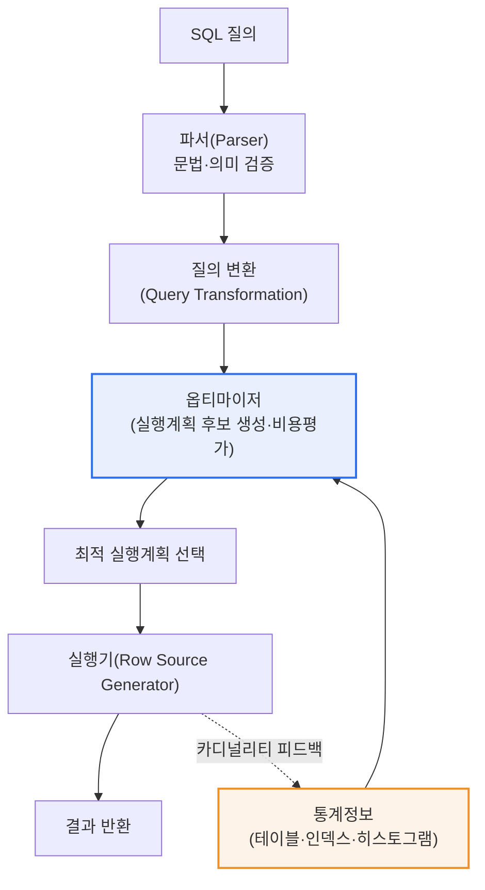
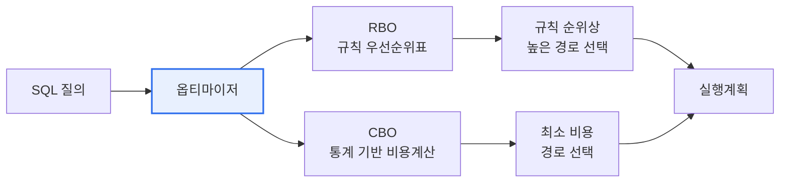

# 데이터베이스 옵티마이저(RBO·CBO)

## 1. 개요

### 가. 정의
> **옵티마이저(Optimizer)** 는 SQL 질의를 실행할 때 **같은 결과를 얻을 수 있는 여러 실행 경로(access path·join order·join method) 중 가장 효율적인 실행계획(execution plan)을 선택**하는 DBMS의 핵심 엔진이다. 사용자가 '무엇을(what)' 원하는지를 선언형 SQL로 표현하면, '어떻게(how)' 처리할지를 결정하는 것이 옵티마이저의 역할이다.

옵티마이저를 이해하는 핵심은 '**하나의 SQL에는 수십~수천 가지 실행 방법이 있고, 어느 것을 택하느냐에 따라 응답 시간이 수백~수만 배 차이 난다**'는 데 있다. 예를 들어 A·B 두 테이블을 조인하는 단순한 질의도, 어느 테이블을 먼저 읽을지(driving table), 인덱스를 탈지 전체 스캔을 할지(access path), 어떤 조인 방식(Nested Loop·Hash·Sort Merge)을 쓸지의 조합에 따라 실행 시간이 극단적으로 갈린다. 관계형 DB는 SQL이 '선언형 언어'이기 때문에 사용자가 처리 절차를 지정하지 않으며, 바로 그 절차를 자동으로 결정해 주는 지능이 옵티마이저다.

옵티마이저가 없다면 개발자가 매 질의마다 최적의 물리적 실행 순서를 손으로 짜야 하고, 데이터 양·분포가 바뀔 때마다 다시 튜닝해야 한다. 옵티마이저는 이 부담을 DBMS 내부로 흡수해, 사용자는 논리적 질의에만 집중하고 물리적 최적화는 엔진에 맡기도록 한다. 그런데 '무엇을 기준으로 최적을 판단하는가'에 따라 옵티마이저는 두 갈래로 나뉜다. 정해진 규칙의 우선순위를 따르는 **RBO(Rule Based Optimizer)** 와, 실제 데이터 통계를 근거로 비용을 계산하는 **CBO(Cost Based Optimizer)** 다. 오늘날 상용·오픈소스 DBMS는 사실상 모두 CBO를 표준으로 채택하고 있다.

### 나. 필요성과 위치
데이터가 크고 질의가 복잡할수록 '실행 방법의 선택'이 성능을 좌우한다. 옵티마이저는 SQL 처리 파이프라인(파싱 → 최적화 → 실행) 가운데 **최적화 단계**를 담당하며, 파서가 문법·의미를 검증하고 논리적으로 동등한 질의 형태들을 만들어 내면, 옵티마이저가 그중 물리적으로 가장 저렴한 계획을 골라 실행기(row source generator)에 넘긴다. 즉 옵티마이저는 사용자가 신경 쓰지 않아도 최적 경로를 찾아 성능을 확보하는 'DBMS의 두뇌'에 해당한다.

옵티마이저의 중요성은 시스템 규모가 커질수록 비선형적으로 증가한다. 소규모 데이터에서는 어떤 계획을 세워도 체감 차이가 작지만, 대용량·고동시성 환경에서는 잘못된 계획 하나가 CPU·메모리·I/O를 독점해 전체 시스템의 응답성을 무너뜨린다. 따라서 옵티마이저를 이해하는 것은 단순한 성능 최적화 지식이 아니라, 안정적 서비스 운영과 자원 효율의 근간을 다루는 문제이며, DB 튜닝·용량 산정·SLA 관리와 직결되는 핵심 역량이다.

## 2. SQL 처리 흐름 속 옵티마이저의 위치

옵티마이저가 언제·무엇을 근거로 개입하는지를 이해하려면 SQL 한 문장이 처리되는 전체 흐름을 봐야 한다. 아래 프로세스 세부도는 파싱부터 실행·통계 피드백까지의 단계를 보여준다.

```mermaid
flowchart TB
  SQL["SQL 질의"] --> PAR["파서(Parser)<br/>문법·의미 검증"]
  PAR --> TRANS["질의 변환<br/>(Query Transformation)"]
  TRANS --> OPT["옵티마이저<br/>(실행계획 후보 생성·비용평가)"]
  STAT["통계정보<br/>(테이블·인덱스·히스토그램)"] --> OPT
  OPT --> PLAN["최적 실행계획 선택"]
  PLAN --> EXEC["실행기(Row Source Generator)"]
  EXEC --> RES["결과 반환"]
  EXEC -. 카디널리티 피드백 .-> STAT
  style OPT fill:#e8f0fe,stroke:#2f6fed,stroke-width:2px
  style STAT fill:#fef3e8,stroke:#ed8f2f,stroke-width:2px
```

옵티마이저가 후보 계획을 만들 때 고려하는 물리적 선택지는 크게 세 축이다. 첫째는 **접근 경로(access path)** 로, 테이블을 통째로 읽는 전체 스캔(Full Table Scan)과 인덱스를 경유하는 인덱스 스캔 중 무엇이 더 싼지를 판단한다. 소량만 걸러지면 인덱스가, 대량이 걸러지면 전체 스캔이 유리하다. 둘째는 **조인 순서(join order)** 로, 먼저 읽어 결과 집합을 줄이는 테이블(driving table)을 무엇으로 삼느냐에 따라 이후 비용이 달라진다. 셋째는 **조인 방식(join method)** 으로, 소량 집합에 유리한 Nested Loop, 대량 동등 조인에 유리한 Hash Join, 정렬된 대량 집합에 맞는 Sort Merge 중 데이터 규모에 맞는 것을 고른다. 이 세 축의 조합이 곧 실행계획의 경우의 수를 폭발적으로 늘리며, 그 방대한 공간에서 최저 비용점을 찾는 것이 옵티마이저의 일이다.

이 흐름을 문단으로 풀어 보면, 먼저 **파서**가 SQL의 문법과 객체 존재 여부·권한을 검증한다. 이어 **질의 변환(query transformation)** 단계에서 옵티마이저는 서브쿼리 병합(view merging), 조건 이행(predicate pushing), OR 확장 등으로 논리적으로 동등하지만 더 최적화하기 쉬운 형태로 질의를 다시 쓴다. 그다음 본격적인 **최적화** 단계에서 여러 실행계획 후보를 생성하고 각 후보의 비용을 추정해 최저 비용 계획을 고른다. 이때 결정적으로 참조하는 것이 바로 **통계정보**이며, 실행 후 실제 처리된 행 수가 추정치와 크게 다르면 그 정보를 다시 통계로 되먹여(카디널리티 피드백) 다음 실행을 개선한다. 요컨대 옵티마이저의 판단 품질은 '통계의 정확성'에 절대적으로 의존한다.

## 3. RBO vs CBO: 판단 기준의 차이

옵티마이저의 두 방식은 '무엇을 근거로 실행 경로를 고르는가'에서 본질적으로 갈린다. 아래 구조도는 동일한 SQL이 두 방식에서 어떻게 다른 근거로 계획에 도달하는지를 보여준다.

```mermaid
flowchart LR
  S["SQL 질의"] --> O["옵티마이저"]
  O --> R["RBO<br/>규칙 우선순위표"]
  O --> C["CBO<br/>통계 기반 비용계산"]
  R --> RP["규칙 순위상<br/>높은 경로 선택"]
  C --> CP["최소 비용<br/>경로 선택"]
  RP --> P["실행계획"]
  CP --> P
  style O fill:#e8f0fe,stroke:#2f6fed,stroke-width:2px
```

### 가. RBO(규칙 기반 옵티마이저)
**RBO** 는 미리 정해진 규칙과 우선순위 목록에 따라 실행계획을 세운다. 예컨대 '단일 행 인덱스 접근 > 유니크 인덱스 > 범위 인덱스 > 전체 테이블 스캔'처럼 접근 경로마다 순위(rank)가 고정되어 있고, 옵티마이저는 데이터의 실제 양·분포와 무관하게 순위가 높은 경로를 무조건 선택한다. 장점은 단순하고 결과가 예측 가능하다는 것이다. 통계가 없어도 동작하고, 같은 SQL은 언제나 같은 계획을 만든다.

그러나 RBO의 치명적 한계는 '**실제 데이터를 보지 않는다**'는 점이다. 인덱스가 있으면 무조건 인덱스를 타므로, 전체 100만 건 중 90만 건을 읽어야 하는 질의에서도 인덱스를 타 오히려 랜덤 I/O가 폭증해 전체 스캔보다 훨씬 느려지는 역설이 발생한다. 데이터가 소량이던 시절에는 통했지만, 대용량·다양한 분포를 갖는 현대 환경에서는 잘못된 선택이 잦아 사실상 폐기되었다. Oracle의 경우 CBO 도입 이후에도 통계가 없거나 명시적 요청 시에만 사용되다가, 이후 버전에서 **더 이상 지원되지 않는(obsolete·deprecated)** 방식으로 정리되었다.

RBO가 폐기된 더 근본적 이유는 '**데이터는 변하는데 규칙은 고정되어 있다**'는 구조적 모순에 있다. 서비스 초기에 수천 건이던 테이블이 운영 몇 년 후 수억 건으로 늘어도, RBO는 여전히 같은 규칙 순위로 같은 계획을 만든다. 데이터의 성장·분포 변화에 따라 최적 경로가 바뀌어야 하는데 RBO는 이를 반영할 수단이 없다. 반면 CBO는 통계만 갱신하면 같은 SQL이라도 데이터 규모에 맞는 다른 계획을 스스로 세운다. 이 '변화 적응 능력'의 유무가 두 방식의 운명을 갈랐고, 그래서 현대 DBMS는 예외 없이 CBO를 기본값으로 삼는다.

### 나. CBO(비용 기반 옵티마이저)
**CBO** 는 테이블 크기·데이터 분포·인덱스 선택도·클러스터링 팩터 등의 **통계정보를 바탕으로 각 실행 경로의 비용(cost)을 실제로 계산**해 가장 저렴한 계획을 선택한다. 여기서 비용은 대략 'CPU 사용량 + I/O 횟수'를 정규화한 추정값이며, 옵티마이저는 후보 계획마다 예상 처리 행 수(**카디널리티, cardinality**)와 비용을 추정해 비교한다. 통계에 기반하므로 데이터 상황에 맞는 지능적 선택이 가능하고, 이것이 오늘날 모든 주요 DBMS의 표준이 된 이유다.

CBO의 성능은 곧 '통계의 신선도'에 달려 있다. 통계가 오래되어 실제 데이터와 어긋나면(stale statistics), 옵티마이저는 잘못된 카디널리티를 근거로 엉뚱한 계획을 세운다. 예를 들어 최근 급증한 테이블의 통계가 옛날 소량 기준으로 남아 있으면, 옵티마이저는 '이 테이블은 작다'고 오판해 부적절한 Nested Loop 조인을 선택하고, 그 결과 수 초에 끝날 질의가 수십 분을 소요하기도 한다. 그래서 CBO 운영의 핵심은 정기적·자동화된 통계 수집이다.

| 구분 | RBO(규칙 기반) | CBO(비용 기반) |
|---|---|---|
| **판단 기준** | 고정된 규칙·우선순위 | 통계 기반 비용 계산 |
| **데이터 반영** | 안 함(데이터 무시) | 반영(크기·분포·통계) |
| **장점** | 단순·예측 가능 | 데이터 상황에 맞는 지능적 최적화 |
| **단점** | 실제 상황 무시로 비효율 발생 | 통계 정확성에 성능이 좌우됨 |
| **현재 위상** | 폐기(obsolete) | 사실상의 표준 |

## 4. CBO의 비용 계산과 실무 튜닝 요소

CBO가 비용을 산정하는 과정은 결국 '**카디널리티 추정의 연쇄**'다. 조건절(predicate)마다 얼마나 많은 행이 걸러질지를 선택도(selectivity)로 추정하고, 그 결과 행 수를 다음 연산(조인·정렬)의 입력으로 넘겨 다시 비용을 계산한다. 이 사슬의 첫 단추인 선택도 추정이 어긋나면 이후 모든 추정이 연쇄적으로 틀어지므로, 데이터 분포를 정확히 알려 주는 **히스토그램(histogram)** 이 중요하다. 값의 분포가 균일하지 않은 컬럼(예: 특정 코드가 전체의 95%를 차지)에서는 히스토그램이 없으면 옵티마이저가 각 값을 균등 분포로 오판한다. 최신 버전들은 도수(frequency)·높이균형(height-balanced)에 더해 상위도수(top-frequency)·하이브리드(hybrid) 히스토그램을 지원해 편중 분포를 더 정밀하게 표현한다.

실무 튜닝의 요소들은 모두 '옵티마이저가 좋은 계획을 세우도록 돕는' 수단으로 이해하면 일관되게 정리된다. 아래 표의 각 항목은 서로 독립적이지 않고, 통계를 최신화하고 실행계획을 읽어 문제를 진단한 뒤 필요할 때만 힌트로 개입한다는 하나의 흐름을 이룬다.

| 튜닝 요소 | 내용과 이유 |
|---|---|
| **통계정보 관리** | CBO는 통계에 의존 → 자동 통계 수집으로 최신 상태 유지 필수 |
| **실행계획 분석** | EXPLAIN PLAN·실제 실행통계로 병목(과다 I/O·잘못된 조인) 진단 |
| **히스토그램** | 편중 분포 컬럼의 선택도 오판 방지 |
| **힌트(Hint)** | 옵티마이저가 오판할 때 개발자가 접근경로·조인방식을 명시적 유도 |
| **바인드 변수** | 실행계획 재사용(soft parse)으로 하드 파싱 부담 감소 |

여기서 주의할 트레이드오프가 바인드 변수와 히스토그램의 상호작용이다. 바인드 변수는 실행계획을 재사용해 파싱 비용을 줄이지만, 편중 분포 컬럼에 바인드 변수를 쓰면 '처음 들어온 값에 최적화된 계획'이 이후 다른 값에도 재사용되어 비효율(bind peeking 부작용)이 생길 수 있다. 이런 경우 적응형 커서 공유(adaptive cursor sharing) 같은 기능으로 값의 분포에 따라 계획을 분화시켜 보완한다. 즉 하나의 최적화 기법이 다른 상황에서는 역효과를 낼 수 있으므로, 실행계획을 실제로 읽고 검증하는 습관이 튜닝의 출발점이 된다.

### 가. 잘못된 카디널리티 추정이 부르는 성능 사고(사례)
CBO의 오판이 실제 장애로 번지는 전형적 시나리오는 '**작은 테이블로 오인한 대용량 테이블에 Nested Loop 조인을 선택**'하는 경우다. 예를 들어 야간 배치로 주문 테이블에 수백만 건이 적재되었는데 통계가 갱신되지 않아 옵티마이저가 '이 테이블은 수천 건'이라고 추정했다고 하자. 옵티마이저는 작은 집합에 유리한 Nested Loop(외부 행마다 내부 테이블을 반복 탐색)를 고르지만, 실제로는 수백만 번의 반복 탐색이 발생해 수 초면 끝날 질의가 수십 분간 CPU와 I/O를 점유한다. 낮 시간대 업무 질의였다면 곧바로 서비스 지연으로 이어진다.

이 사고의 진단과 처방은 옵티마이저의 원리를 그대로 따라간다. 먼저 실행계획에서 **추정 카디널리티(E-Rows)와 실제 행 수(A-Rows)의 괴리**를 확인해 옵티마이저가 어디서 오판했는지 짚는다. 근본 원인이 낡은 통계라면 통계를 재수집하는 것이 정석이고, 특정 값 편중이 원인이라면 히스토그램을 생성해 선택도 추정을 바로잡는다. 계획을 즉시 되돌려야 하는 긴급 상황에서만 조인 방식을 강제하는 힌트로 임시 조치하되, 이후 통계·인덱스로 근본 원인을 해소해 힌트 의존을 걷어낸다. 이 사례는 'CBO의 성능은 통계 정확성에 달렸다'는 명제와, '실행계획을 읽어 추정과 실제를 대조하는 것이 튜닝의 첫걸음'이라는 원칙을 동시에 보여 준다.

## 5. 심화: 적응형 최적화(Adaptive Query Optimization)

CBO의 근본 약점은 '**실행 전에 세운 추정이 실제와 다를 수 있다**'는 점이다. 통계가 아무리 좋아도 복잡한 조인·조건에서는 카디널리티 추정이 빗나가고, 그 결과 잘못된 계획이 굳어질 수 있다. 이를 보완하기 위해 등장한 것이 **적응형 질의 최적화(Adaptive Query Optimization)** 이며, Oracle Database 12c에서 하나의 기능군으로 정리되었다.

첫째, **적응형 계획(Adaptive Plans)** 은 카디널리티 추정이 어려운 조인에서 '계획 결정을 실행 시점까지 미루는' 방식이다. 옵티마이저는 실행계획에 통계 수집기(statistics collector)를 심어 두고, 실제 처리되는 행 수가 추정과 크게 다르면 실행 도중에 조인 방식을 Nested Loop에서 Hash Join으로 바꾸는 식으로 계획을 전환한다. 둘째, **자동 재최적화(Automatic Reoptimization)** 와 그 전신인 **카디널리티 피드백(cardinality feedback, 11gR2 도입)** 은 한 번 실행한 뒤 실제 카디널리티를 저장해, 다음 실행에서 그 값을 반영해 더 나은 계획으로 재컴파일한다. 셋째, **SQL 계획 관리(SQL Plan Management)** 는 검증된 계획을 베이스라인으로 고정해, 통계 변화로 계획이 갑자기 나빠지는 '계획 회귀(plan regression)'를 방지한다.

이 흐름의 실무적 함의는 분명하다. 과거에는 옵티마이저가 '실행 전에 한 번 세운 계획대로만' 처리했다면, 현대 CBO는 '실행하며 학습하고 스스로 교정하는' 방향으로 진화하고 있다는 것이다. 나아가 최근에는 머신러닝으로 카디널리티를 추정하거나(learned cardinality estimation), 실행 이력을 학습해 자동으로 튜닝을 제안하는 자율운영(autonomous) DB 기능이 상용화되고 있어, 옵티마이저는 규칙(RBO) → 통계 기반 비용(CBO) → 실행 중 적응(adaptive) → 학습 기반 자율화의 궤적을 그리고 있다.

## 6. 고려사항 및 시사점(기술사 관점)

1. **통계정보 최신화가 CBO의 생명이다.** CBO는 통계를 근거로 비용을 계산하므로, 통계가 오래되거나(stale) 부정확하면 잘못된 실행계획으로 성능이 급락한다. 자동 통계 수집 작업을 운영하고, 대량 데이터 적재(배치·마이그레이션) 직후에는 수동으로 통계를 갱신해 옵티마이저의 판단 근거를 항상 실제 데이터와 일치시켜야 한다.
2. **옵티마이저를 신뢰하되 반드시 검증한다.** 대부분의 질의는 CBO가 최적을 찾지만, 복잡한 다중 조인·편중 분포에서는 오판이 발생한다. 실행계획(EXPLAIN PLAN)과 실제 실행통계를 비교해 추정 카디널리티와 실제 행 수의 괴리를 확인하고, 괴리가 큰 지점을 히스토그램·힌트로 교정하는 검증 절차를 SQL 튜닝의 표준으로 삼아야 한다.
3. **힌트는 최후의 수단으로 신중히 쓴다.** 힌트로 계획을 강제하면 당장은 개선되지만, 데이터 분포가 바뀌면 그 강제 계획이 오히려 족쇄가 될 수 있다. 근본 원인(통계·인덱스 설계)을 먼저 해결하고, 힌트는 원인 교정이 어려운 예외적 상황에만 제한적으로 적용해 유지보수성을 지켜야 한다.
4. **계획 안정성과 회귀 방지 체계를 갖춘다.** 통계 변화나 버전 업그레이드로 잘 돌던 질의의 계획이 갑자기 나빠지는 '계획 회귀'는 운영 장애로 직결된다. SQL 계획 관리(계획 베이스라인)·적응형 최적화 기능을 활용해 검증된 계획을 보호하고, 변경 시에는 성능 회귀 테스트를 거쳐 전환하는 거버넌스가 필요하다.
5. **적응형·자율 최적화로의 진화를 설계에 반영한다.** 현대 CBO는 실행 중 계획을 교정하고 학습으로 튜닝을 자동화하는 방향으로 발전하므로, 신규 시스템 설계 시 이러한 기능을 켜고 모니터링 지표(계획 변경·재최적화 이력)를 확보해, DBA의 수작업 튜닝 의존도를 낮추고 대규모 질의 환경의 성능을 지속 관리해야 한다.

## 참고자료
- Oracle, "Query Optimizer Concepts (Database SQL Tuning Guide 19c)", https://docs.oracle.com/en/database/oracle/oracle-database/19/tgsql/query-optimizer-concepts.html
- Oracle Blogs, "Optimizer Adaptive Features in Oracle Database 12c Release 2", https://blogs.oracle.com/optimizer/optimizer-adaptive-features-in-oracle-database-12c-release-2
- ORACLE-BASE, "Cost-Based Optimizer (CBO) And Database Statistics", https://oracle-base.com/articles/misc/cost-based-optimizer-and-database-statistics

---

> **한 줄 요약**: 옵티마이저는 *SQL의 여러 실행 경로 중 최적 실행계획을 선택* 하는 DBMS의 두뇌로, 고정 규칙의 RBO(폐기)와 통계 기반 비용계산의 CBO(현 표준)로 나뉘며, CBO의 성능은 통계정보 최신화와 정확한 카디널리티 추정에 달려 있고, 실행계획 분석·히스토그램·힌트로 튜닝하며 실행 중 스스로 교정하는 적응형·자율 최적화로 진화하고 있다.
