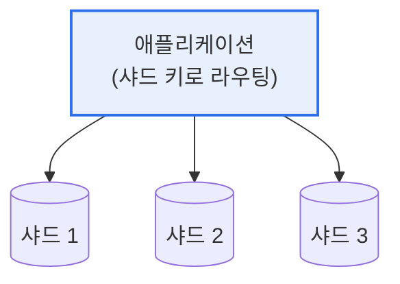

# 데이터베이스 샤딩(Sharding)

## 1. 개요

### 가. 개념과 분할 방법
> **샤딩(Sharding)** 은 대용량 데이터를 여러 개의 **독립된 데이터베이스(샤드, Shard)에 수평 분할하여 저장**함으로써, 데이터베이스의 부하를 분산하고 확장성을 확보하는 기법이다.

샤딩의 핵심 발상은 '**한 대의 DB가 감당 못 할 데이터를 여러 대로 나눠 담자**'는 것이다. 데이터가 폭증하면 하나의 데이터베이스 서버는 저장 용량·처리 성능의 한계에 부딪힌다. 서버 사양을 올리는 수직 확장(스케일업)은 비용이 크고 한계가 명확하다. 샤딩은 데이터를 **행 단위로 쪼개** 여러 서버에 나눠 저장하는 수평 확장(스케일아웃)이다. 예를 들어 사용자 데이터를 ID 기준으로 나눠 1~100만은 샤드1, 100만~200만은 샤드2에 저장한다. 그러면 각 샤드는 전체의 일부만 담당하므로 부하가 분산되고, 서버를 추가해 무한히 확장할 수 있다. 어느 데이터가 어느 샤드에 있는지는 **샤드 키(Shard Key)** 로 결정된다. 다만 데이터가 여러 서버에 흩어지므로, 여러 샤드에 걸친 조회·조인이 어렵고 관리가 복잡해지는 대가가 따른다.

### 나. 분할 방법
| 방법 | 내용 |
|---|---|
| **범위 기반(Range)** | 키 값 범위로 분할(예: ID 1~100만) |
| **해시 기반(Hash)** | 키의 해시값으로 분할(균등 분산) |
| **디렉터리 기반** | 매핑 테이블로 샤드 위치 관리 |

## 2. 샤딩 구조

## 3. 샤딩과 파티셔닝의 차이

샤딩과 파티셔닝은 데이터를 나눈다는 점은 같지만 범위가 다르다. **파티셔닝** 은 하나의 DB 서버 안에서 테이블을 논리적으로 분할하는 것이고, **샤딩** 은 데이터를 여러 물리적 DB 서버에 나눠 저장하는 것이다. 즉 샤딩은 파티셔닝을 여러 서버로 확장한 개념이다.

| 구분 | 파티셔닝(Partitioning) | 샤딩(Sharding) |
|---|---|---|
| **범위** | 단일 DB 내 테이블 분할 | 여러 DB 서버로 분산 |
| **목적** | 관리·성능(단일 서버) | 확장성(부하 분산) |
| **물리적 분산** | 없음(한 서버) | 있음(여러 서버) |
| **복잡도** | 상대적 낮음 | 높음(분산 관리) |

## 4. 적용 시 고려사항

| 고려사항 | 내용 |
|---|---|
| **샤드 키 선정** | 균등 분산·조회 패턴 고려(핫스팟 방지) |
| **크로스 샤드 질의** | 여러 샤드 조인·집계의 복잡성·성능 |
| **리밸런싱** | 샤드 추가 시 데이터 재분배 |
| **트랜잭션** | 여러 샤드 걸친 분산 트랜잭션의 어려움 |

## 5. 고려사항 및 시사점

1. **샤드 키 설계가 성패를 좌우**한다. 특정 샤드에 데이터·부하가 몰리는 핫스팟을 피하려면, 균등하게 분산되고 조회 패턴에 맞는 샤드 키를 신중히 선택해야 한다.
2. **크로스 샤드 연산의 어려움**을 고려한다. 여러 샤드에 걸친 조인·집계·트랜잭션은 복잡하고 느리므로, 가능한 한 단일 샤드 내에서 처리되도록 데이터를 설계한다.
3. **NoSQL·클라우드 DB의 기본 기능**으로 흡수되고 있다. MongoDB·Cassandra 등은 샤딩을 내장 지원하고, 클라우드 관리형 DB가 자동 샤딩·리밸런싱을 제공해 운영 부담을 줄이고 있다.

---

> **한 줄 요약**: 샤딩은 *대용량 데이터를 여러 DB 서버에 수평 분할* 해 부하 분산·확장성을 확보하는 기법으로, 단일 서버 내 파티셔닝과 달리 물리적으로 분산되며, 샤드 키 설계와 크로스 샤드 연산 관리가 핵심 과제다.
