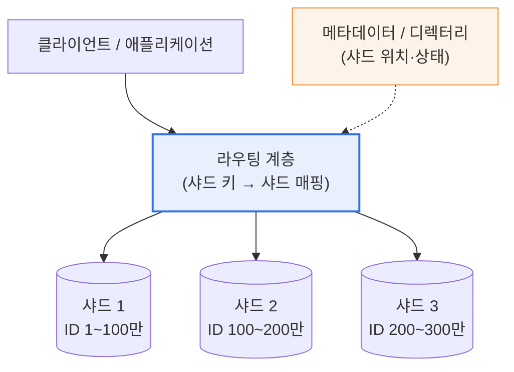
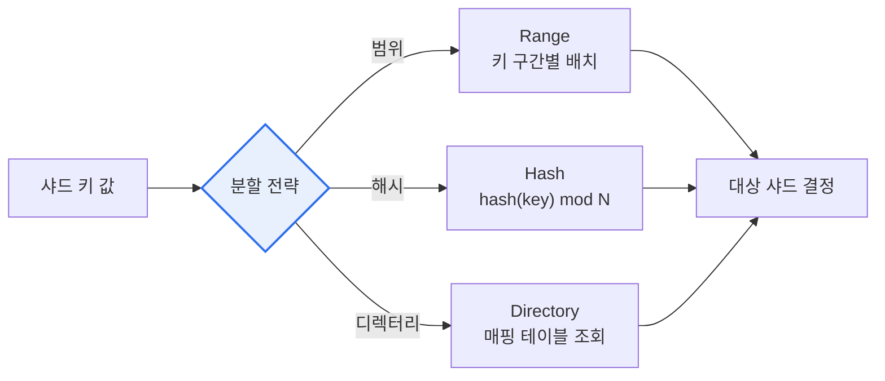

# 데이터베이스 샤딩(Sharding)

## 1. 개요

### 가. 정의
> **샤딩(Sharding)** 은 대용량 데이터를 여러 개의 **독립된 데이터베이스(샤드, Shard)에 수평 분할(Horizontal Partitioning)** 해 저장함으로써, 단일 데이터베이스의 저장·처리 부하를 여러 서버로 분산하고 선형적 확장성(Scale-out)을 확보하는 데이터 분산 기법이다.

샤딩의 핵심 발상은 '**한 대의 DB가 감당하지 못할 데이터를 여러 대로 나눠 담자**'는 것이다. 서비스가 성장해 데이터와 트래픽이 폭증하면 하나의 데이터베이스 서버는 저장 용량, CPU, 메모리, 디스크 I/O, 커넥션 수 등 여러 자원에서 동시에 한계에 부딪힌다. 이때 서버 사양을 키우는 **수직 확장(Scale-up)** 은 초기에 간단하지만, 고사양 하드웨어일수록 가격이 기하급수적으로 오르고 물리적 상한(한 서버가 가질 수 있는 코어·메모리)이 명확하며, 결국 단일 장애점(SPOF)이 남는다는 근본 한계가 있다.

샤딩은 이 한계를 **수평 확장(Scale-out)** 으로 넘어선다. 데이터를 **행(Row) 단위로 쪼개** 여러 서버에 나눠 저장하므로, 저렴한 서버를 계속 추가해 용량과 처리량을 거의 선형으로 늘릴 수 있다. 예를 들어 사용자 데이터를 사용자 ID 기준으로 나눠 1~100만은 샤드1, 100만~200만은 샤드2에 저장하면, 각 샤드는 전체의 일부만 담당하므로 개별 부하가 낮아지고 서버를 붙일수록 전체 처리량이 커진다. 어느 데이터가 어느 샤드에 있는지는 **샤드 키(Shard Key)** 와 그에 대한 라우팅 규칙으로 결정된다.

다만 이 이점에는 대가가 따른다. 데이터가 물리적으로 흩어지므로 여러 샤드에 걸친 조회·조인·집계가 어렵고, 하나의 트랜잭션이 여러 샤드에 걸치면 원자성 보장이 복잡해지며, 샤드 추가 시 데이터 재분배(리밸런싱)와 운영 관리 부담이 커진다. 따라서 샤딩은 '더 이상 단일 DB로 감당이 안 될 때' 도입하는 최후의 확장 카드이며, 무분별한 조기 적용은 오히려 복잡성만 키운다는 점이 실무의 교훈이다.

### 나. 등장 배경과 필요성
샤딩은 웹 서비스가 대중화되고 사용자·콘텐츠 데이터가 테라바이트를 넘어서면서 본격화됐다. 초기 대형 서비스들(Google Bigtable 사상, Facebook의 MySQL 샤딩, Instagram의 PostgreSQL 샤딩 등)은 관계형 DB를 애플리케이션 레벨에서 샤딩해 폭증하는 트래픽을 감당했다. 오늘날은 이 패턴이 NoSQL·NewSQL·클라우드 관리형 DB에 내장 기능으로 흡수되어, 개발자가 저수준 분산을 직접 구현하지 않고도 확장성을 얻을 수 있게 진화했다.

## 2. 샤딩 전체 구조

```mermaid
flowchart TB
  C["클라이언트 / 애플리케이션"] --> R["라우팅 계층<br/>(샤드 키 → 샤드 매핑)"]
  R --> S1[(샤드 1<br/>ID 1~100만)]
  R --> S2[(샤드 2<br/>ID 100~200만)]
  R --> S3[(샤드 3<br/>ID 200~300만)]
  M["메타데이터 / 디렉터리<br/>(샤드 위치·상태)"] -.-> R
  style R fill:#e8f0fe,stroke:#2f6fed,stroke-width:2px
  style M fill:#fef3e8,stroke:#ed8f2f
```

샤딩 시스템은 크게 세 계층으로 구성된다. **라우팅 계층**은 요청에 담긴 샤드 키를 보고 어느 샤드로 보낼지 결정한다. 이 라우팅은 애플리케이션 코드 안(클라이언트 사이드), 별도의 프록시/미들웨어(예: MySQL의 ProxySQL·Vitess, MongoDB의 mongos), 혹은 DB 엔진 내부 중 어디에 둘 것인가에 따라 아키텍처가 달라진다. **샤드**들은 서로 독립된(shared-nothing) DB 인스턴스로, 각자 자신의 데이터 부분집합에 대한 저장·질의를 완결적으로 처리한다. **메타데이터/디렉터리**는 어떤 키 범위가 어느 샤드에 있는지, 각 샤드의 상태·복제본 위치는 어떤지를 관리해 라우팅의 근거가 된다.

여기서 중요한 설계 원칙이 **shared-nothing**이다. 각 샤드가 자원을 공유하지 않고 독립적이어야, 한 샤드의 부하나 장애가 다른 샤드로 전파되지 않고 진정한 선형 확장이 가능하다. 반대로 샤드들이 공용 스토리지나 공용 락에 의존하면 그 지점이 새로운 병목이 되어 샤딩의 이점이 사라진다.

라우팅 계층을 **어디에 두는가**도 아키텍처의 성격을 결정한다. 첫째, **클라이언트 사이드 라우팅**은 애플리케이션 코드나 DB 드라이버가 직접 샤드 위치를 계산해 해당 샤드에 접속한다. 중간 홉이 없어 지연이 낮지만, 샤드 토폴로지 변경이 모든 클라이언트에 반영되어야 해 배포 결합도가 높다. 둘째, **프록시/미들웨어 라우팅**(mongos, ProxySQL, Vitess의 VTGate 등)은 애플리케이션과 샤드 사이에 라우팅 전담 계층을 둔다. 애플리케이션은 단일 엔드포인트만 알면 되므로 결합도가 낮아지고 리샤딩이 투명해지지만, 프록시 계층 자체를 이중화·확장해야 한다. 셋째, **DB 엔진 내장 라우팅**(Cassandra의 코디네이터 노드 등)은 어느 노드에 붙어도 요청이 올바른 노드로 전달되어 운영이 단순하다. 규모가 커질수록 클라이언트 사이드에서 프록시·엔진 내장 방식으로 이동하는 경향이 있다.

## 3. 분할(샤딩) 전략과 라우팅

```mermaid
flowchart LR
  K["샤드 키 값"] --> A{"분할 전략"}
  A -->|"범위"| RG["Range<br/>키 구간별 배치"]
  A -->|"해시"| HS["Hash<br/>hash(key) mod N"]
  A -->|"디렉터리"| DR["Directory<br/>매핑 테이블 조회"]
  RG --> OUT["대상 샤드 결정"]
  HS --> OUT
  DR --> OUT
  style A fill:#e8f0fe,stroke:#2f6fed,stroke-width:2px
```

분할 전략은 '데이터를 어떤 규칙으로 샤드에 배치하는가'를 정하며, 각 전략은 뚜렷한 장단점을 갖는다.

**가. 범위 기반(Range) 샤딩.** 샤드 키 값의 구간별로 데이터를 나눈다(예: 날짜 2026-01은 샤드1, 2026-02는 샤드2). 구현이 직관적이고, 범위 질의(특정 기간 조회)가 소수의 샤드에만 닿아 효율적이라는 장점이 있다. 그러나 최근 데이터에 쓰기가 몰리는 시계열 서비스에서는 '마지막 샤드'에만 트래픽이 집중되는 **핫스팟(Hot Spot)** 이 쉽게 발생한다. 예컨대 로그·주문 데이터를 생성 시각으로 범위 샤딩하면, 항상 최신 샤드 하나만 바쁘고 나머지는 놀게 되어 분산 효과가 무너진다.

**나. 해시 기반(Hash) 샤딩.** 샤드 키를 해시 함수에 넣어 나온 값으로 샤드를 결정한다(예: `hash(user_id) mod N`). 키 분포가 균등해져 핫스팟을 피하기 쉽다는 것이 가장 큰 장점이다. 반면 인접한 키가 서로 다른 샤드로 흩어지므로 범위 질의가 모든 샤드에 흩어져(scatter-gather) 비효율적이며, 무엇보다 **샤드 수 N이 바뀌면(`mod N`) 거의 모든 데이터의 소속이 바뀌어 대규모 재분배가 발생**한다.

이 재분배 폭증 문제를 완화하려고 **일관성 해싱(Consistent Hashing)** 이 널리 쓰인다. 일관성 해싱은 키와 노드를 하나의 해시 링(0~2³²−1 같은 원형 공간)에 배치해, 각 키를 시계 방향으로 가장 가까운 노드에 할당한다. 노드를 추가·삭제할 때 인접 구간의 데이터만 이동하므로 재배치량이 평균 K/N(전체 키 K, 노드 N) 수준으로 국한된다. 여기에 하나의 물리 노드를 여러 개의 **가상 노드(virtual node)** 로 링에 흩뿌리면 노드 간 부하 편차까지 줄일 수 있다. DynamoDB·Cassandra 계열이 이 원리를 채택한다.

구체적 수치로 보면 차이가 분명하다. 노드가 4대일 때 단순 `mod 4`에서 노드를 5대로 늘리면 이론상 전체 키의 약 80%가 소속 샤드를 바꿔야 한다(재배치 폭증). 반면 일관성 해싱에서는 새 노드가 링의 한 구간만 넘겨받으므로 평균적으로 전체의 약 1/5(20%) 정도만 이동한다. 수억 건 규모에서 이 차이는 '무중단 확장 가능 여부'를 가르는 결정적 요소가 된다.

범위 샤딩의 핫스팟은 실제 서비스에서 흔히 관측된다. 예를 들어 주문 데이터를 `order_id`(단조 증가) 범위로 샤딩하면, 신규 주문은 항상 마지막 샤드에만 쌓여 그 샤드의 쓰기 IOPS만 100%에 가깝고 나머지 샤드는 유휴 상태가 된다. 이를 피하려고 실무에서는 순차 키 대신 사용자 ID 해시를 앞에 붙이는 등 키를 재설계하거나, 시간축은 파티셔닝으로, 부하 분산은 해시 샤딩으로 나눠 담당하게 하는 혼합 전략을 쓴다.

**다. 디렉터리 기반(Directory) 샤딩.** 별도의 룩업 테이블(디렉터리)에 '어떤 키가 어느 샤드에 있는지'를 명시적으로 관리한다. 매핑을 자유롭게 바꿀 수 있어 재분배·특정 고객 격리 같은 운영 유연성이 가장 크다. 대신 모든 질의가 먼저 디렉터리를 조회해야 하므로 디렉터리 자체가 병목·단일 장애점이 되지 않도록 캐싱·이중화가 필수다. 특정 대형 고객(테넌트)을 전용 샤드로 분리하는 등 세밀한 배치가 필요한 SaaS에서 유용하다.

세 전략은 배타적이지 않고 결합되기도 한다. 대표적으로 초대형 서비스는 '**논리 샤드(가상 버킷)를 디렉터리로 물리 샤드에 매핑**'하는 2단계 구조를 쓴다. 먼저 샤드 키를 해시해 수천 개의 고정된 논리 버킷 중 하나에 넣고(균등 분산), 그 버킷을 어느 물리 서버가 담당하는지는 디렉터리로 관리한다. 그러면 물리 서버를 늘릴 때 데이터가 아니라 '버킷 담당표'만 옮기면 되어, 온라인 리밸런싱이 훨씬 수월해진다. Instagram이 초기에 PostgreSQL 위에 수천 개 논리 샤드를 두고 소수 물리 서버에 매핑했던 방식이 이 패턴의 잘 알려진 예다.

| 전략 | 장점 | 단점 | 대표 사례 |
|---|---|---|---|
| **범위(Range)** | 범위 질의 효율, 구현 단순 | 핫스팟 발생 쉬움 | HBase, MongoDB(range) |
| **해시(Hash)** | 균등 분산, 핫스팟 완화 | 범위 질의 비효율, 재분배 부담(→일관성 해싱) | Cassandra, DynamoDB |
| **디렉터리(Directory)** | 유연한 배치·재분배 | 디렉터리 병목·SPOF 위험 | 커스텀 샤딩, 일부 SaaS |

표만으로는 선택 기준이 드러나지 않으므로 실무 함의를 덧붙인다. 서비스의 **지배적 질의 패턴**이 전략 선택을 좌우한다. 특정 사용자의 데이터를 반복 조회하는 워크로드(예: 소셜 서비스의 '내 타임라인')는 사용자 ID 해시 샤딩이 유리하고, 기간별 리포팅이 핵심인 워크로드(예: 로그 분석)는 범위 샤딩이 유리하다. 즉 '어떤 키로 가장 자주 조회하는가'를 샤드 키로 삼아 **대부분의 질의가 단일 샤드에서 끝나도록** 설계하는 것이 성능의 관건이다.

## 4. 샤딩과 파티셔닝·복제의 차이

샤딩과 파티셔닝은 '데이터를 나눈다'는 점은 같지만 **나누는 범위**가 다르다. **파티셔닝(Partitioning)** 은 하나의 DB 서버 안에서 큰 테이블을 여러 논리 파티션으로 쪼개 관리·성능을 개선하는 것이고, **샤딩** 은 그 조각들을 아예 **여러 물리 DB 서버로 분산**하는 것이다. 즉 샤딩은 수평 파티셔닝을 여러 노드로 확장한 개념으로 볼 수 있다. 그래서 파티셔닝은 단일 서버의 자원 한계는 넘지 못하지만, 샤딩은 서버를 늘려 그 한계 자체를 넘는다.

또 하나 구분할 개념이 **복제(Replication)** 다. 복제는 같은 데이터를 여러 서버에 **똑같이 복사**해 가용성과 읽기 확장을 얻는 것이고, 샤딩은 서로 **다른 데이터**를 나눠 담아 쓰기·용량을 확장하는 것이다. 실제 대규모 시스템은 이 둘을 결합한다. 각 샤드를 다시 복제(마스터-복제본)해 두어, 샤딩으로 쓰기·용량을 늘리는 동시에 복제로 각 샤드의 가용성과 읽기 성능을 확보하는 것이 정석 아키텍처다.

예컨대 4개 샤드에 각각 복제본을 2개씩 두면 총 12개 인스턴스가 되는데, 쓰기는 4개 마스터로 4배 확장되고 읽기는 12개 노드로 분산되며 어느 마스터가 죽어도 복제본이 승격해 가용성이 유지된다. 이처럼 '샤딩(쓰기 확장) × 복제(읽기 확장·가용성)'의 곱으로 규모를 키우는 것이 현대 대규모 DB 아키텍처의 기본 골격이며, 그만큼 관리해야 할 인스턴스 수와 운영 복잡성도 곱으로 늘어난다는 점을 함께 고려해야 한다.

| 구분 | 파티셔닝 | 샤딩 | 복제 |
|---|---|---|---|
| **데이터** | 나눔(같은 서버 내) | 나눔(여러 서버) | 복사(동일 데이터) |
| **물리 분산** | 없음(한 서버) | 있음(여러 서버) | 있음(여러 서버) |
| **주 목적** | 관리·성능 | 쓰기·용량 확장 | 가용성·읽기 확장 |
| **복잡도** | 낮음 | 높음(분산 라우팅·트랜잭션) | 중간(복제 지연·일관성) |

## 5. 심화 — 크로스 샤드 문제와 관리형 DB의 자동화

샤딩 도입 후 실무에서 부딪히는 가장 어려운 문제는 **크로스 샤드(Cross-shard) 연산**과 **리밸런싱**이다.

**크로스 샤드 조인·집계.** 여러 샤드에 흩어진 데이터를 조인하거나 집계(COUNT, SUM, ORDER BY)하려면, 라우팅 계층이 모든 관련 샤드에 질의를 뿌리고(scatter) 결과를 모아 병합(gather)해야 한다. 이 scatter-gather는 가장 느린 샤드가 전체 응답 시간을 좌우하고(꼬리 지연), 샤드 수에 비례해 자원 소모가 커진다. 그래서 실무에서는 함께 조회되는 데이터를 같은 샤드에 모으는 **데이터 코로케이션**(예: 한 주문과 그 주문 상세를 동일 order_id 샤드에 배치)이나, 조회 전용으로 미리 집계·역정규화한 뷰를 두는 설계로 크로스 샤드 연산 자체를 줄인다.

**분산 트랜잭션.** 하나의 트랜잭션이 여러 샤드를 갱신해야 하면 2단계 커밋(2PC) 같은 분산 트랜잭션이 필요한데, 이는 성능 저하와 코디네이터 장애 위험이 크다. 그래서 많은 시스템이 강한 원자성을 포기하고 **사가(Saga) 패턴**처럼 각 단계를 보상 트랜잭션으로 되돌리는 최종 일관성 모델을 택한다. 이는 CAP 이론의 트레이드오프(분산 환경에서 일관성과 가용성의 절충)를 실무에 반영한 결과다.

**리밸런싱.** 샤드를 추가하면 데이터 일부를 새 샤드로 옮겨야 하는데, 이때 서비스 중단 없이(온라인) 데이터를 이동하고 매핑을 갱신하는 일이 까다롭다. 앞서 말한 일관성 해싱이나 논리 샤드(가상 버킷)를 물리 샤드에 매핑하는 기법(예: MongoDB의 chunk, Vitess의 vindex)으로 이동 범위를 국소화한다.

**관리형·분산 DB의 자동화.** 오늘날 이 부담의 상당 부분은 제품이 흡수한다. **MongoDB**는 샤드 키 기반 자동 청크 분할·밸런서를 내장하고, **Cassandra**는 일관성 해싱으로 노드 추가 시 자동 재분배한다. **Vitess**(YouTube가 MySQL 확장용으로 개발, CNCF 졸업)는 MySQL 위에 샤딩·라우팅·리샤딩을 얹어 애플리케이션 변경을 최소화한다. **CockroachDB·Google Spanner** 같은 NewSQL은 자동 레인지 분할과 분산 트랜잭션(TrueTime 등)을 제공해 개발자에게는 단일 DB처럼 보이게 한다. 이처럼 샤딩은 '개발자가 직접 구현하는 저수준 기술'에서 '플랫폼이 제공하는 관리형 기능'으로 이동하는 중이다.

## 6. 고려사항 및 시사점(기술사 관점)

1. **샤드 키 설계가 성패를 좌우한다.** 특정 샤드에 데이터·트래픽이 몰리는 핫스팟을 피하려면, 카디널리티가 높고 균등 분산되며 지배적 조회 패턴과 정렬되는 키를 신중히 골라야 한다. 잘못 고른 샤드 키는 나중에 바꾸기가 매우 어려워(전면 재분배) 초기 설계 단계의 핵심 의사결정이다.

2. **크로스 샤드 연산을 최소화하는 데이터 모델링.** 함께 조회·갱신되는 데이터를 같은 샤드에 모으는 코로케이션, 역정규화, 조회 전용 집계 테이블 등으로 대부분의 질의가 단일 샤드에서 끝나도록 설계해야 한다. 이는 정규화 원칙과의 트레이드오프이므로 도메인 특성에 맞게 균형을 잡는다.

3. **일관성·트랜잭션 전략의 선택.** 분산 환경에서는 강한 일관성(2PC)과 가용성·성능(최종 일관성·Saga) 사이의 CAP 트레이드오프가 불가피하다. 결제처럼 강한 정합성이 필요한 영역과 통계처럼 지연 허용이 되는 영역을 구분해 일관성 수준을 차등 적용하는 전략이 현실적이다.

4. **운영·관측성과 도입 시점.** 샤딩은 백업·모니터링·스키마 변경·장애 대응이 모두 배가되는 운영 복잡성을 수반한다. 따라서 수직 확장·읽기 복제·캐시로 먼저 버틴 뒤, 정말 단일 쓰기 노드가 한계에 이르렀을 때 도입하는 단계적 접근이 바람직하다. 도입 시에는 관리형·분산 DB로 저수준 부담을 위임하는 선택지를 우선 검토한다.

5. **확장 전략의 진화 방향.** NoSQL·NewSQL·서버리스 DB(Aurora·Spanner·CockroachDB)가 자동 샤딩·리밸런싱·분산 트랜잭션을 기본 제공하면서, 애플리케이션이 직접 샤딩하는 부담은 점차 감소하는 추세다. 기술사 관점에서는 '직접 구현 vs 관리형 위임'의 비용·유연성 트레이드오프를 데이터 규모·팀 역량·비용 구조에 맞춰 판단하는 것이 핵심이다.

## 참고자료
- MongoDB Sharding 공식 문서: https://www.mongodb.com/docs/manual/sharding/
- Vitess(Scalable MySQL) 문서: https://vitess.io/docs/
- AWS "Database sharding" 개념 설명: https://aws.amazon.com/what-is/database-sharding/

---

> **한 줄 요약**: 샤딩은 *대용량 데이터를 여러 DB 서버에 수평 분할* 해 쓰기·용량을 선형 확장(Scale-out)하는 기법으로, 범위·해시(일관성 해싱)·디렉터리 전략과 샤드 키 설계가 성능을 좌우하며, 단일 서버 내 파티셔닝·동일 데이터 복제와 구분되고, 크로스 샤드 연산·분산 트랜잭션·리밸런싱 관리가 핵심 과제다.
