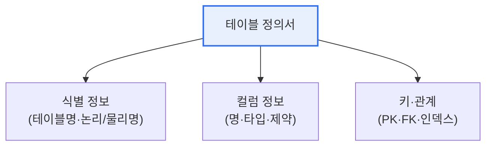

# 공공기관 데이터베이스 표준화지침 — 테이블 정의서

## 1. 개요

### 가. 개념
> **테이블 정의서**는 데이터베이스 표준화지침에 따라 **테이블의 구조·의미·제약조건을 표준 양식으로 문서화**한 설계 산출물로, DB 구축·유지보수·품질관리의 기준이 되는 핵심 문서다.

테이블 정의서가 중요한 이유는 '**데이터베이스의 설계 의도를 공식 기록으로 남겨 일관성과 소통을 보장한다**'는 데 있다. 공공기관은 여러 부서·사업자가 오랜 기간 시스템을 만들고 고친다. 표준 없이 각자 테이블을 만들면, 같은 뜻의 컬럼을 서로 다른 이름·타입으로 정의해 데이터가 뒤엉키고 연계·통합이 불가능해진다. 표준화지침은 이를 막기 위해 용어·도메인·코드를 표준화하고, 그 결과를 테이블 정의서 같은 표준 산출물로 기록하게 한다. 테이블 정의서를 보면 누구나 그 테이블이 무엇을 담고, 각 컬럼이 어떤 의미·형식·제약을 갖는지 알 수 있다. 이는 개발자 간 소통, 유지보수 시 영향 분석, 품질 진단의 기준이 된다. 즉 테이블 정의서는 표준화지침이 지향하는 데이터 일관성·상호운용성을 현장에서 실현하는 문서다. [[data-standardization]]

### 나. 위치
표준화지침은 데이터 표준(용어·도메인·코드)을 정의하고, 이를 반영한 산출물로 테이블 정의서·컬럼 정의서 등을 작성하도록 규정한다.

## 2. 테이블 정의서 기록 항목

| 항목 | 내용 |
|---|---|
| **테이블 한글명(논리명)** | 업무상 의미가 드러나는 표준 용어 |
| **테이블 영문명(물리명)** | 표준 약어·명명규칙에 따른 실제 이름 |
| **테이블 설명** | 저장 데이터·용도 설명 |
| **컬럼 목록** | 컬럼 논리·물리명, 도메인(데이터 타입·길이) |
| **키 정보** | 기본키(PK)·외래키(FK)·유일성 |
| **제약조건** | NOT NULL·기본값·체크 제약 |
| **인덱스** | 성능을 위한 인덱스 정의 |

## 3. 작성 지침(원칙)

테이블 정의서는 표준화지침의 명명규칙·도메인 표준을 반드시 준수해 작성한다. 컬럼명은 표준 단어·용어를 조합하고, 데이터 타입·길이는 표준 도메인을 따르며, 코드값은 표준 코드를 사용한다. 논리명(한글·업무 의미)과 물리명(영문·실제 구현)을 일관되게 매핑하고, 변경 시 이력을 관리한다.

| 지침 | 내용 |
|---|---|
| **표준 용어 준수** | 표준 단어·용어 사전 기반 명명 |
| **도메인 적용** | 표준 데이터 타입·길이 사용 |
| **표준 코드 사용** | 공통 코드값 적용 |
| **논리-물리 매핑** | 한글 논리명 ↔ 영문 물리명 일관성 |
| **이력 관리** | 변경 이력·버전 관리 |

## 4. 고려사항 및 시사점

1. **표준과 산출물의 정합성**이 관건이다. 테이블 정의서는 데이터 표준(용어·도메인·코드)을 충실히 반영해야 의미가 있으며, 표준과 어긋나면 품질 진단에서 결함으로 지적된다.
2. **자동화 도구로 일관성 확보**한다. 데이터 모델링·표준화 관리 도구를 활용해 표준 위반을 자동 점검하고, 모델과 정의서·실제 DB의 일관성을 유지한다.
3. **데이터 거버넌스의 기반**이다. 테이블 정의서 등 표준 산출물이 축적되면 메타데이터·데이터 카탈로그로 발전해, 공공데이터 개방·연계·품질관리의 토대가 된다. [[public-db-standardization]]

---

> **한 줄 요약**: 테이블 정의서는 *표준화지침에 따라 테이블 구조·의미·제약을 표준 양식으로 문서화* 한 산출물로, 논리/물리명·컬럼·키·제약 등을 표준 용어·도메인·코드에 맞춰 작성해 데이터 일관성과 상호운용성을 실현한다.
