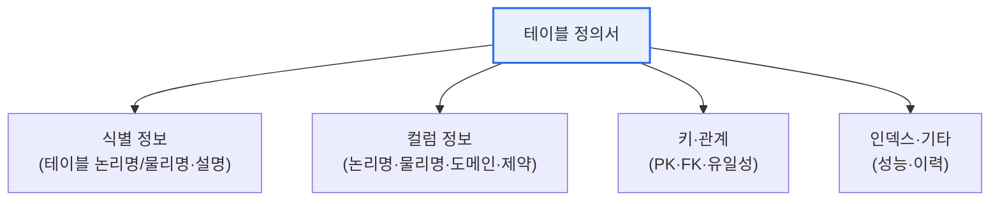
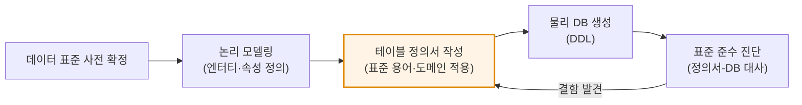
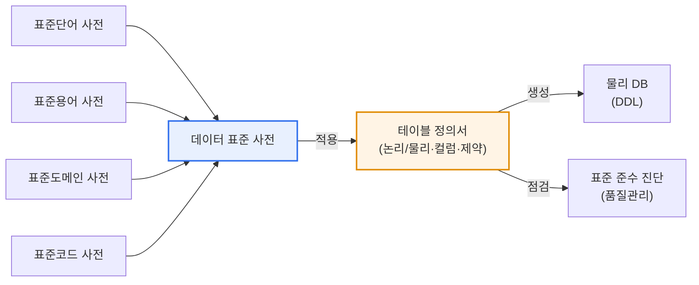

# 공공기관 데이터베이스 표준화지침 — 테이블 정의서

## 1. 개요

### 가. 개념
> **테이블 정의서**는 데이터베이스 표준화지침에 따라 **테이블의 구조·의미·제약조건을 표준 양식으로 문서화**한 설계 산출물로, DB 구축·유지보수·품질관리·데이터 연계의 기준이 되는 핵심 메타데이터 문서다.

테이블 정의서가 중요한 이유는 '**데이터베이스의 설계 의도를 공식 기록으로 남겨 일관성과 소통을 보장한다**'는 데 있다. 공공기관은 여러 부서·여러 사업자가 수년에 걸쳐 시스템을 만들고 고친다. 만약 표준 없이 각자 테이블을 만들면, 같은 뜻을 가진 '주민등록번호' 컬럼을 어떤 시스템은 `RESIDENT_NO CHAR(13)`으로, 다른 시스템은 `JUMIN VARCHAR(20)`으로 제각각 정의한다. 이렇게 이름·타입·길이가 어긋나면 데이터가 뒤엉키고, 기관 간 연계나 통합 조회가 사실상 불가능해진다. 실제로 행정정보 공동이용이나 공공데이터 개방에서 가장 큰 장애물이 바로 이 '표준 불일치'다.

표준화지침은 이를 막기 위해 용어·도메인·코드를 먼저 표준화하고, 그 결과를 테이블 정의서 같은 표준 산출물로 기록하게 한다. 테이블 정의서를 보면 누구나 그 테이블이 무엇을 담고, 각 컬럼이 어떤 의미·형식·제약을 갖는지 즉시 파악할 수 있다. 이는 개발자 간 소통, 유지보수 시 영향 분석, 데이터 품질 진단의 공통 기준이 된다. 즉 테이블 정의서는 표준화지침이 지향하는 데이터 일관성·상호운용성을 현장에서 실현하는 문서이자, 이후 메타데이터 관리와 데이터 거버넌스의 출발점이다. [[data-standardization]]

### 나. 등장 배경과 제도적 위치
공공부문의 데이터 표준화는 개별 기관의 자율에 맡겨두면 달성되기 어렵다. 그래서 정부는 '공공기관의 데이터베이스 표준화 지침'과 '공공데이터 관리지침' 등을 통해 데이터 표준(용어·도메인·코드)의 정의와 이를 반영한 설계 산출물 작성을 제도적으로 요구해 왔다. 표준화지침 체계 안에서 테이블 정의서는 데이터 표준 사전(표준단어·표준용어·표준도메인·표준코드)을 실제 물리 설계에 적용한 **결과물**의 위치를 차지한다.

이러한 흐름은 데이터 3법 개정과 공공데이터법 시행 이후 더 중요해졌다. 데이터가 '개방·연계·활용'의 대상이 되면서, 각 기관의 테이블이 표준을 지켜 설계되어 있어야 비로소 데이터셋을 신뢰성 있게 공개하고 다른 기관과 연계할 수 있기 때문이다. 표준화된 테이블 정의서가 축적되면 그것이 곧 기관의 메타데이터 자산이 되고, 데이터 카탈로그·품질관리의 토대가 된다.

## 2. 테이블 정의서의 기록 항목

테이블 정의서는 하나의 테이블에 대한 '설계 명세서'다. 아래 전체 구조도는 정의서가 담는 정보의 큰 갈래를, 이어지는 상세도는 표준 사전이 정의서에 어떻게 반영되는지를 보여준다.

```mermaid
flowchart TB
  T["테이블 정의서"] --> I["식별 정보<br/>(테이블 논리명/물리명·설명)"]
  T --> C["컬럼 정보<br/>(논리명·물리명·도메인·제약)"]
  T --> K["키·관계<br/>(PK·FK·유일성)"]
  T --> X["인덱스·기타<br/>(성능·이력)"]
  style T fill:#e8f0fe,stroke:#2f6fed,stroke-width:2px
```

정의서의 식별 정보는 그 테이블이 무엇인지 규정한다. **테이블 논리명(한글명)** 은 업무상 의미가 드러나는 표준 용어여야 하고, **테이블 물리명(영문명)** 은 표준 약어·명명규칙에 따라 만든 실제 DBMS 상의 이름이다. 예를 들어 논리명 '사용자기본정보'는 물리명 `TB_USER_BASE`처럼 접두어·표준 단어 조합 규칙을 따른다. 여기에 테이블이 저장하는 데이터의 용도와 범위를 서술한 **설명**이 붙어, 이 테이블을 처음 보는 사람도 맥락을 이해하도록 한다.

컬럼 정보는 정의서의 핵심이다. 각 컬럼마다 논리명·물리명과 함께 **도메인(데이터 타입·길이·형식)** 을 표준 사전에서 가져와 적용한다. 도메인 표준이 있으면 '금액'은 항상 `NUMBER(15)`, '여부'는 항상 `CHAR(1)`처럼 통일되어, 같은 성격의 데이터가 시스템마다 달라지는 일을 막는다. 또한 각 컬럼의 **제약조건**(NOT NULL, 기본값, CHECK 등)과 **키 정보**(PK·FK·유일성)를 명시해 데이터 무결성 규칙을 문서로 확정한다.

| 항목 | 내용 | 표준화 연계 |
|---|---|---|
| **테이블 논리명** | 업무 의미가 드러나는 표준 용어 | 표준용어 사전 |
| **테이블 물리명** | 표준 약어·명명규칙 기반 실제 이름 | 표준단어·약어 사전 |
| **테이블 설명** | 저장 데이터·용도 | — |
| **컬럼 목록** | 컬럼 논리·물리명, 도메인(타입·길이) | 표준용어·표준도메인 |
| **키 정보** | 기본키(PK)·외래키(FK)·유일성 | 무결성 규칙 |
| **제약조건** | NOT NULL·기본값·CHECK 제약 | 도메인 제약 |
| **표준 코드** | 코드성 컬럼의 허용값 | 표준코드 사전 |
| **인덱스** | 성능을 위한 인덱스 정의 | 물리 설계 |

### 가. 데이터 표준 사전 — 정의서의 재료
테이블 정의서는 무(無)에서 만들어지지 않는다. 그 재료는 표준화지침이 먼저 확정한 **데이터 표준 사전** 네 가지다. **표준 단어**는 이름을 짓는 최소 단위로, '등록/일자/금액/여부'처럼 더 쪼갤 수 없는 업무 어휘와 그 영문 약어(REG, DT, AMT, YN 등)를 정의한다. **표준 용어**는 이 단어들을 조합한 실제 컬럼·항목명(예: 등록일자=REG_DT)이며, **표준 도메인**은 용어가 가질 데이터 타입·길이·형식(예: '일자' 도메인=`DATE` 또는 `CHAR(8)`)을 규정한다. 마지막으로 **표준 코드**는 코드성 항목의 허용값 집합(예: 성별=`M/F`)을 정한다.

이 네 사전이 서로 맞물려 있기 때문에, 정의서 작성자는 컬럼명을 창작하는 것이 아니라 사전에서 '조립'한다. 그 결과 어느 시스템에서든 '등록일자'는 같은 이름·같은 타입으로 나타난다. 이것이 표준화가 데이터 일관성을 보장하는 근본 원리이며, 테이블 정의서는 이 사전 적용의 최종 산출물이다.

### 나. 작성·검증 절차
테이블 정의서는 대개 논리 모델링에서 물리 모델링으로 넘어가는 단계에서 작성되고, 이후 물리 DB 생성과 품질 점검으로 이어진다. 아래 절차는 표준 사전 확정에서 품질 진단까지의 흐름을 보여준다.

```mermaid
flowchart LR
  A["데이터 표준 사전 확정"] --> B["논리 모델링<br/>(엔터티·속성 정의)"]
  B --> C["테이블 정의서 작성<br/>(표준 용어·도메인 적용)"]
  C --> D["물리 DB 생성<br/>(DDL)"]
  D --> E["표준 준수 진단<br/>(정의서-DB 대사)"]
  E -->|결함 발견| C
  style C fill:#fff4e5,stroke:#e08a00,stroke-width:2px
```

## 3. 작성 지침(원칙)

테이블 정의서는 개인의 감각이 아니라 표준화지침이 정한 규칙을 기계적으로 따를 때 비로소 값어치를 갖는다. 작성의 첫 원칙은 **표준 용어·단어 준수**다. 컬럼명은 임의로 짓지 않고 표준 단어(예: '일자', '금액', '여부')와 표준 용어를 조합해 만든다. 이렇게 하면 '등록일', '등록일자', '등록일시'처럼 뜻은 같은데 표기가 다른 컬럼이 난립하는 것을 막는다.

두 번째 원칙은 **도메인·코드 표준 적용**이다. 데이터 타입과 길이는 반드시 표준 도메인을 따르고, 코드성 값(예: 성별·처리상태)은 표준 코드값을 사용한다. 이는 나중에 기관 간 데이터를 합칠 때 값의 형식과 의미가 어긋나지 않도록 하는 안전장치다. 세 번째 원칙은 **논리-물리 매핑의 일관성**으로, 한글 논리명과 영문 물리명을 1:1로 대응시키고 그 매핑 규칙을 전 시스템에 동일하게 적용한다. 마지막으로 표준과 설계는 시간이 지나며 바뀌므로, 변경 시 반드시 **이력·버전을 관리**해 언제 무엇이 왜 바뀌었는지 추적할 수 있어야 한다.

| 지침 | 내용 | 위반 시 문제 |
|---|---|---|
| **표준 용어 준수** | 표준 단어·용어 사전 기반 명명 | 동의어 컬럼 난립 |
| **도메인 적용** | 표준 데이터 타입·길이 사용 | 타입 불일치로 연계 실패 |
| **표준 코드 사용** | 공통 코드값 적용 | 값 의미 해석 오류 |
| **논리-물리 매핑** | 한글 논리명 ↔ 영문 물리명 일관성 | 설계-구현 괴리 |
| **이력 관리** | 변경 이력·버전 관리 | 변경 추적 불가 |

```mermaid
flowchart LR
  S1["표준단어 사전"] --> STD["데이터 표준 사전"]
  S2["표준용어 사전"] --> STD
  S3["표준도메인 사전"] --> STD
  S4["표준코드 사전"] --> STD
  STD -->|적용| TDEF["테이블 정의서<br/>(논리/물리·컬럼·제약)"]
  TDEF -->|생성| DB["물리 DB<br/>(DDL)"]
  TDEF -->|점검| QC["표준 준수 진단<br/>(품질관리)"]
  style STD fill:#e8f0fe,stroke:#2f6fed,stroke-width:2px
  style TDEF fill:#fff4e5,stroke:#e08a00,stroke-width:2px
```

## 4. 사례와 실무 함의

표준 준수 여부가 실제로 어떤 차이를 만드는지 예를 들면 이렇다. A기관과 B기관이 각각 민원 시스템을 구축했는데, 표준을 지킨 A기관은 '처리상태' 컬럼을 표준코드(`01:접수, 02:처리중, 03:완료`)와 표준도메인(`CHAR(2)`)으로 정의했다. 반면 표준을 지키지 않은 B기관은 같은 개념을 `STATUS VARCHAR(10)`에 '접수','진행','done' 같은 자유 문자열로 넣었다. 두 기관 데이터를 연계·통합할 때 A기관 데이터는 그대로 매핑되지만, B기관 데이터는 값 정제(cleansing)와 매핑 테이블을 새로 만들어야 하며 이 과정에서 누락·오분류가 발생한다. 이처럼 테이블 정의서의 표준 준수는 연계 비용과 데이터 품질에 직접적인 영향을 준다.

이 사례가 주는 교훈은 표준화의 이득이 '설계 시점의 약간의 규율'로 '통합 시점의 큰 비용'을 막는다는 데 있다. 표준을 지킨 A기관은 정의서 작성 단계에서 표준 사전을 참조하는 수고를 들였을 뿐이지만, 그 대가로 연계 시 매핑·정제 작업이 거의 발생하지 않는다. 반대로 B기관이 아낀 초기 수고는 나중에 정제 스크립트 개발, 매핑 테이블 유지, 오분류 검증이라는 몇 배의 비용으로 되돌아온다. 데이터가 여러 기관을 오갈수록 이 격차는 기하급수적으로 커지므로, 표준 준수는 '문서 형식'이 아니라 '총소유비용(TCO)을 낮추는 투자'로 이해해야 한다.

또한 품질관리 관점에서, 데이터 품질 진단은 실제 DB의 컬럼과 테이블 정의서·데이터 표준의 일치 여부를 점검한다. 정의서에는 `NOT NULL`로 되어 있는데 실제 데이터에 결측이 있거나, 표준코드가 아닌 값이 저장되어 있으면 '표준 미준수' 결함으로 지적된다. 따라서 테이블 정의서는 문서로 끝나는 것이 아니라 품질 측정의 기준선(baseline) 역할을 한다. 데이터 모델링 도구(예: 표준화 관리 솔루션)를 쓰면 표준 사전 위반을 설계 단계에서 자동 점검하고, 모델·정의서·실제 DDL의 일관성을 지속적으로 유지할 수 있다.

## 5. 심화 — 데이터 거버넌스·개방과의 연계

테이블 정의서는 단일 산출물을 넘어 조직 전체의 데이터 거버넌스 체계로 확장된다. 개별 테이블 정의서가 축적되면 그것이 곧 기관의 **메타데이터 저장소**가 되고, 여기에 데이터의 출처·담당자·활용 이력을 더하면 **데이터 카탈로그**로 발전한다. 최근 공공부문은 이러한 메타데이터를 기반으로 데이터맵을 구축해, 기관이 보유한 데이터를 한눈에 파악하고 필요한 데이터를 찾아 연계·개방하는 기반으로 삼고 있다. 즉 잘 작성된 테이블 정의서는 공공데이터 포털을 통한 개방과 마이데이터·행정정보 공동이용의 밑돌이 된다. [[public-db-standardization]]

나아가 국제적으로도 이러한 발상은 ISO/IEC 11179(메타데이터 레지스트리) 표준과 맞닿아 있다. 이 표준은 데이터 요소를 명확한 이름·정의·값 도메인으로 등록·관리하도록 규정하는데, 우리 공공 표준화지침의 표준 단어·용어·도메인·코드 체계가 바로 이 원리를 국내 실무에 구현한 것이다. 따라서 테이블 정의서 작성은 단순한 국내 행정 절차가 아니라 국제 표준이 지향하는 '데이터의 의미를 기계와 사람이 함께 이해하도록 등록·관리한다'는 원칙의 현장 적용으로 볼 수 있다.

기술사 시험 관점에서 이 주제는 '데이터베이스' 및 '공공데이터·데이터 품질' 영역에서 데이터 표준화·메타데이터·데이터 거버넌스와 묶여 출제되는 경향이 있다. 답안 구성 시에는 ① 테이블 정의서의 정의와 표준화지침 내 위치, ② 기록 항목과 표준 사전(단어·용어·도메인·코드)과의 연계, ③ 작성 지침과 위반 시 문제, ④ 품질 진단·연계에서의 실무 함의, ⑤ 데이터 카탈로그·거버넌스로의 확장까지 계층적으로 전개하면 단순 항목 나열을 넘어선 깊이를 보여줄 수 있다.

## 6. 고려사항 및 시사점

1. **표준과 산출물의 정합성이 관건이다.** 테이블 정의서는 데이터 표준(용어·도메인·코드)을 충실히 반영해야만 의미가 있다. 표준 사전과 정의서, 실제 DDL이 서로 어긋나면 품질 진단에서 결함으로 지적되므로, 세 계층의 일관성을 지속적으로 검증하는 체계가 필요하다.
2. **자동화 도구로 일관성을 확보한다.** 컬럼 수백·테이블 수천 규모에서는 수작업 점검이 불가능하다. 데이터 모델링·표준화 관리 도구를 활용해 표준 위반을 설계 단계에서 자동 점검하고, 모델·정의서·물리 DB의 정합성을 자동으로 유지·리포팅해야 한다.
3. **데이터 거버넌스의 기반으로 활용한다.** 테이블 정의서 등 표준 산출물이 축적되면 메타데이터·데이터 카탈로그·데이터맵으로 발전한다. 이를 공공데이터 개방·연계·품질관리의 토대로 삼는 전략적 관점이 요구된다.
4. **변경 관리와 거버넌스 체계를 병행한다.** 표준과 테이블은 업무 변화에 따라 바뀐다. 변경 요청·승인·반영·이력관리의 절차(데이터 표준 관리 프로세스)와 책임 조직(데이터 관리자·표준 관리자)을 명확히 두어야 표준이 시간이 지나도 무너지지 않는다.
5. **개인정보·보안 표준과 연계한다.** 공공 테이블에는 주민등록번호 등 민감정보가 포함되므로, 테이블 정의서 단계에서 개인정보 항목을 식별·표기하고 암호화·마스킹 대상을 지정해 설계 시점부터 프라이버시 보호(Privacy by Design)를 반영해야 한다.

## 참고자료
- 공공데이터포털(data.go.kr) — 공공데이터 제공·표준 안내: https://www.data.go.kr
- 행정안전부 공공데이터 관리 안내(공공데이터 제도): https://www.mois.go.kr

---

> **한 줄 요약**: 테이블 정의서는 *표준화지침에 따라 테이블 구조·의미·제약을 표준 양식으로 문서화* 한 산출물로, 논리/물리명·컬럼·키·제약을 표준 단어·용어·도메인·코드에 맞춰 작성해 데이터 일관성·상호운용성을 실현하고 메타데이터·데이터 거버넌스의 기반이 된다.
