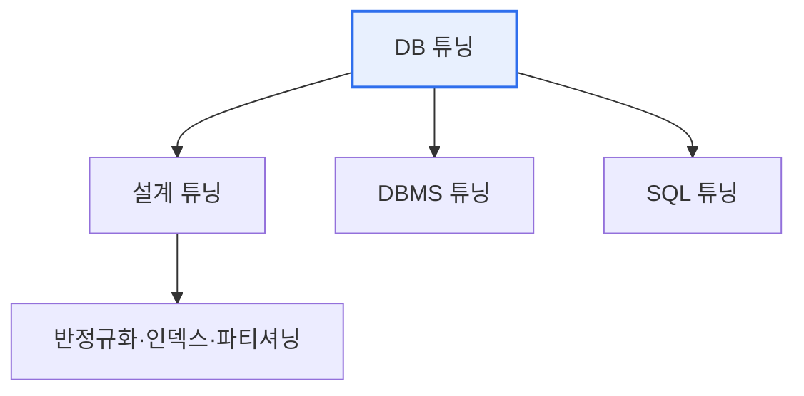

# 데이터베이스 튜닝(Database Tuning)

## 1. 개요

### 가. 개념과 목적
> **데이터베이스 튜닝**은 데이터베이스의 **성능 저하 원인을 진단하고 최적화하여 응답 속도·처리량을 개선**하는 활동. 데이터 용량이 커지고 동시 사용자가 늘수록 그 필요성이 커진다.

DB 튜닝이 중요한 근본 이유는 '**같은 데이터·같은 하드웨어라도 어떻게 설계·질의하느냐에 따라 성능이 수십·수백 배 차이 난다**'는 데 있다. 데이터가 적을 때는 잘 돌던 시스템도, 데이터가 쌓이고 사용자가 몰리면 응답이 느려져 서비스에 장애가 생긴다. 무작정 서버를 늘리는(하드웨어 증설) 것은 비용이 크고 근본 해결이 아니다. DB 튜닝은 하드웨어를 늘리기 전에, 비효율적인 설계·질의·인덱스를 바로잡아 자원을 최대한 활용한다. 예를 들어 인덱스가 없어 전체 테이블을 훑던 질의에 적절한 인덱스를 만들면, 같은 질의가 순식간에 끝난다. 튜닝은 설계·DBMS·SQL의 여러 계층에서 이뤄지며, 특히 SQL과 인덱스 튜닝이 가장 큰 효과를 낸다.

### 나. 튜닝의 대상 계층
튜닝은 세 계층에서 접근한다. 설계(테이블·인덱스 구조), DBMS(메모리·파라미터), SQL(질의문·실행계획). 이 중 SQL·인덱스 튜닝이 비용 대비 효과가 가장 크다.

## 2. 설계 단계 튜닝 기법

설계 단계 튜닝은 데이터 구조 자체를 성능에 유리하게 만드는 것으로, 근본적이고 효과가 크다.

| 기법 | 내용 |
|---|---|
| **반정규화** | 조인을 줄이기 위해 의도적 중복 허용(조회 성능↑) |
| **인덱스 설계** | 자주 조회하는 컬럼에 인덱스 생성 |
| **파티셔닝** | 큰 테이블을 분할해 접근 범위 축소 |
| **적정 데이터 타입** | 크기·형식 최적화 |

## 3. SQL 튜닝과 힌트

SQL 튜닝은 질의문과 실행계획(옵티마이저가 세운 처리 경로)을 개선한다. 옵티마이저가 최적 경로를 못 찾을 때, 개발자가 **힌트(Hint)** 로 실행 방식을 직접 지시한다.

| 힌트 유형 | 내용 |
|---|---|
| **접근 경로** | 인덱스 사용/미사용 지정(INDEX, FULL) |
| **조인 방식** | 조인 방법 지정(Nested Loop, Hash, Sort Merge) |
| **조인 순서** | 테이블 조인 순서 지정(ORDERED, LEADING) |
| **병렬 처리** | 병렬 실행 지정(PARALLEL) |

## 4. 고려사항 및 시사점

1. **측정·진단이 튜닝의 출발점**이다. 실행계획 분석·SQL 트레이스로 병목(느린 질의·풀스캔)을 정확히 찾아야 효과적으로 튜닝할 수 있다. 감이 아니라 데이터로 진단한다.
2. **인덱스는 양날의 검**이다. 조회는 빨라지지만 삽입·수정 시 인덱스 갱신 부담이 늘므로, 조회·갱신 패턴을 고려해 적절히 설계해야 한다. 과도한 인덱스는 오히려 성능을 해친다.
3. **하드웨어 증설보다 튜닝 우선**이다. 비효율을 방치한 채 서버만 늘리면 비용만 늘고 한계가 온다. SQL·인덱스 튜닝으로 자원을 최대한 활용한 뒤 필요시 증설하는 것이 경제적이다.

---

> **한 줄 요약**: DB 튜닝은 *성능 저하 원인을 진단해 설계(반정규화·인덱스·파티셔닝)·DBMS·SQL(질의·힌트) 계층에서 최적화* 하는 활동으로, 실행계획 분석 기반 진단과 SQL·인덱스 튜닝이 하드웨어 증설보다 우선하는 경제적 성능 개선책이다.
