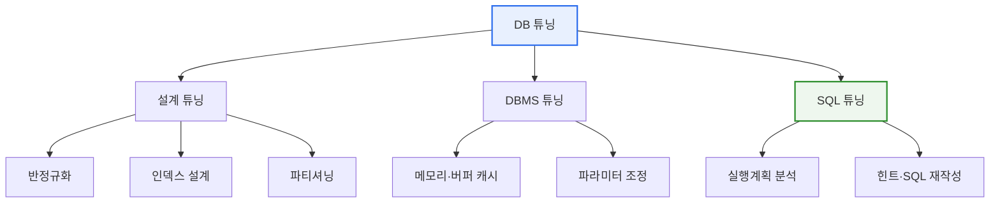

# 데이터베이스 튜닝(Database Tuning)

## 1. 개요

### 가. 개념과 목적

> **데이터베이스 튜닝**은 데이터베이스의 **성능 저하 원인을 진단하고, 설계·DBMS·SQL의 여러 계층에서 최적화하여 응답 속도(response time)와 처리량(throughput)을 개선**하는 활동이다. 데이터 용량이 커지고 동시 사용자가 늘수록 그 필요성이 커진다.

DB 튜닝이 중요한 근본 이유는 "**같은 데이터·같은 하드웨어라도 어떻게 설계하고 질의하느냐에 따라 성능이 수십~수백 배 차이 난다**"는 데 있다. 데이터가 적을 때는 잘 돌던 시스템도, 데이터가 쌓이고 사용자가 몰리면 응답이 급격히 느려져 서비스 장애로 이어진다. 이때 무작정 서버를 늘리는 하드웨어 증설(스케일업)은 비용이 크고 근본 해결이 아니다. 인덱스가 없어 100만 건 테이블을 매번 전부 훑던(풀 테이블 스캔) 질의에 적절한 인덱스를 만들면, 같은 질의가 수천 건만 읽고 끝나 응답이 순식간에 빨라진다. 자원(하드웨어)은 그대로인데 성능이 비약적으로 개선되는 것이다.

튜닝의 목적을 성능 지표로 구체화하면 두 축으로 나뉜다. 하나는 개별 질의가 얼마나 빨리 끝나는가를 보는 응답 시간이고, 다른 하나는 단위 시간당 얼마나 많은 트랜잭션을 처리하는가를 보는 처리량이다. 온라인 거래(OLTP)에서는 짧은 응답 시간이, 대량 배치·분석(OLAP)에서는 높은 처리량이 더 중요하다. 목적이 다르면 튜닝 방향도 달라지므로, 튜닝에 앞서 "무엇을 개선할 것인가"라는 목표를 명확히 정의하는 것이 첫걸음이다. 목표 없는 튜닝은 한쪽을 개선하다 다른 쪽을 희생하는 함정에 빠지기 쉽다.

### 나. 튜닝의 대상 계층

튜닝은 크게 세 계층에서 접근한다. 첫째, **설계 튜닝**은 테이블 구조·인덱스·파티셔닝 등 데이터 구조 자체를 성능에 유리하게 만드는 것으로, 가장 근본적이지만 이미 운영 중인 시스템에서는 변경 비용이 크다. 둘째, **DBMS 튜닝**은 메모리 할당·버퍼 캐시·각종 파라미터를 조정해 DBMS 엔진의 자원 활용을 최적화한다. 셋째, **SQL 튜닝**은 개별 질의문과 그 실행계획을 개선하는 것으로, 변경 범위가 좁고 리스크가 작으면서도 효과가 커 비용 대비 효과가 가장 높다. 실무에서는 흔히 소수의 비효율 SQL이 전체 부하의 대부분을 차지하므로, 이 "문제 SQL"을 찾아 개선하는 것이 튜닝의 핵심이 된다.

## 2. 튜닝의 계층과 전체 구조

DB 튜닝은 어느 한 지점을 고치는 단발성 작업이 아니라, 진단→분석→개선→검증을 반복하는 순환 과정이다. 아래 구조도는 세 계층과 각 계층의 대표 기법을 보여준다.

```mermaid
flowchart TB
  T["DB 튜닝"] --> D["설계 튜닝"]
  T --> M["DBMS 튜닝"]
  T --> S["SQL 튜닝"]
  D --> D1["반정규화"]
  D --> D2["인덱스 설계"]
  D --> D3["파티셔닝"]
  M --> M1["메모리·버퍼 캐시"]
  M --> M2["파라미터 조정"]
  S --> S1["실행계획 분석"]
  S --> S2["힌트·SQL 재작성"]
  style T fill:#e8f0fe,stroke:#2f6fed,stroke-width:2px
  style S fill:#eef7ee,stroke:#2f8f2f,stroke-width:2px
```

세 계층은 상호 보완적이다. 아무리 SQL을 잘 짜도 인덱스가 없으면 한계가 있고, 인덱스가 있어도 버퍼 캐시가 부족하면 디스크 I/O가 병목이 된다. 다만 개선의 우선순위는 대체로 "**진단으로 문제 SQL 식별 → SQL·인덱스 튜닝 → 필요시 설계·DBMS 튜닝 → 최후에 하드웨어 증설**" 순서가 경제적이다. 리스크와 비용이 작은 것부터 손대는 것이 원칙이기 때문이다.

### 가. 튜닝 프로세스: 측정과 진단

튜닝은 "감(感)"이 아니라 "데이터"로 해야 한다. 병목을 정확히 찾지 못한 채 이곳저곳을 손대면 효과 없는 변경만 쌓이고 오히려 부작용을 낳는다. 그래서 튜닝의 출발점은 언제나 측정과 진단이다. 대표 도구가 실행계획(Execution Plan)이다. 실행계획은 옵티마이저(Optimizer)가 질의를 처리하기 위해 세운 처리 경로로, 어떤 인덱스를 쓰는지, 조인을 어떤 방식·순서로 하는지, 예상 처리 건수는 얼마인지를 보여준다.

진단에서 눈여겨볼 신호는 몇 가지로 압축된다. 대용량 테이블에 대한 풀 테이블 스캔(Full Table Scan), 인덱스를 만들어 두고도 타지 않는 현상, 조인 순서가 뒤바뀌어 중간 결과가 비대해지는 경우, 그리고 통계정보가 오래되어 옵티마이저가 실제 데이터 분포를 잘못 추정하는 경우 등이다. 여기에 SQL 트레이스나 AWR·성능 뷰 같은 도구로 어떤 SQL이 자원(CPU·I/O·시간)을 많이 먹는지 순위를 매기면, 개선 효과가 큰 상위 질의부터 집중적으로 다룰 수 있다. 이처럼 "측정→상위 문제 식별→개선→재측정"의 순환이 튜닝의 뼈대다.

## 3. 설계 단계 튜닝 기법

설계 단계 튜닝은 데이터 구조 자체를 성능에 유리하게 만드는 것으로, 가장 근본적이고 효과가 크지만 그만큼 신중해야 한다. 이미 데이터가 쌓인 운영 시스템에서 구조를 바꾸는 것은 마이그레이션 비용과 정합성 리스크를 수반하기 때문이다.

| 기법 | 내용 | 트레이드오프 |
|---|---|---|
| **반정규화** | 조인을 줄이려 의도적 중복 허용(조회 성능↑) | 갱신 시 정합성 관리 부담↑ |
| **인덱스 설계** | 자주 조회하는 컬럼에 인덱스 생성 | 삽입·수정 시 인덱스 갱신 비용↑ |
| **파티셔닝** | 큰 테이블을 분할해 접근 범위 축소 | 파티션 키 설계 실패 시 효과 없음 |
| **적정 데이터 타입** | 크기·형식 최적화로 저장·I/O 효율↑ | 과도한 축소는 확장성 저해 |

### 가. 반정규화(Denormalization)

반정규화는 정규화로 잘게 나뉜 테이블을 조회 성능을 위해 의도적으로 다시 합치거나 중복 컬럼을 두는 기법이다. 정규화는 데이터 중복을 제거해 정합성을 높이지만, 조회할 때마다 여러 테이블을 조인해야 해 대량 조회에서는 비용이 커진다. 예를 들어 주문 목록 화면에서 매번 고객·상품 테이블을 조인해 이름을 가져와야 한다면, 주문 테이블에 고객명·상품명을 중복 저장해 조인을 없앨 수 있다. 다만 이는 원본이 바뀌면 중복본도 함께 갱신해야 하는 부담을 낳으므로, "조회는 잦고 갱신은 드문" 데이터에 선별적으로 적용해야 한다. 반정규화는 조회 성능과 정합성 관리 비용 사이의 명백한 트레이드오프이며, 무분별한 적용은 데이터 불일치라는 더 큰 문제를 부른다.

### 나. 인덱스 설계

인덱스는 책의 색인처럼 데이터의 위치를 빠르게 찾게 해 주는 구조로, 대부분 B-트리(B-Tree) 형태다. 인덱스가 있으면 조건에 맞는 소수의 행만 골라 읽으므로, 전체를 훑는 풀 스캔 대비 조회가 극적으로 빨라진다. 인덱스 설계에서 중요한 개념이 카디널리티(cardinality, 값의 다양성)와 선택도(selectivity)다. 성별처럼 값 종류가 적은(카디널리티 낮은) 컬럼은 인덱스 효과가 작고, 주민번호·계좌번호처럼 값이 거의 유일한 컬럼은 인덱스 효과가 크다. 여러 컬럼을 묶는 복합 인덱스는 컬럼 순서가 중요해, 조건에 자주 쓰이고 선택도 높은 컬럼을 앞에 두어야 한다. 인덱스만으로 질의를 처리(테이블 접근 없이 인덱스만 읽음)하는 커버링 인덱스(covering index)는 추가 성능 이점을 준다.

### 다. 파티셔닝(Partitioning)

파티셔닝은 하나의 큰 테이블을 논리적으로는 하나지만 물리적으로는 여러 조각으로 나누는 기법이다. 예를 들어 수년치 주문 데이터를 월별로 파티션하면, 특정 월의 데이터를 조회할 때 해당 파티션만 접근하고 나머지는 건너뛴다(파티션 프루닝, partition pruning). 범위(Range)·목록(List)·해시(Hash) 등 분할 기준을 워크로드에 맞게 고른다. 파티셔닝의 효과는 파티션 키와 쿼리 조건이 일치할 때 극대화되며, 조건이 파티션 키를 쓰지 않으면 모든 파티션을 뒤져 효과가 사라진다. 또한 오래된 파티션을 통째로 삭제·아카이빙하기 쉬워 대용량 이력 데이터 관리에도 유리하다.

### 라. DBMS 계층 튜닝(메모리·자원)

설계·SQL 튜닝이 "무엇을 어떻게 읽을지"를 다룬다면, DBMS 계층 튜닝은 "읽어 온 데이터를 얼마나 효율적으로 담아 둘지"를 다룬다. 핵심은 메모리와 디스크 I/O의 균형이다. DBMS는 자주 쓰는 데이터 블록을 버퍼 캐시(buffer cache)에 올려 두어 디스크 접근을 줄이는데, 이 캐시가 부족하면 이미 읽었던 데이터를 반복해서 디스크에서 다시 읽어야 해(캐시 미스) 성능이 떨어진다. 반대로 무한정 키울 수도 없으므로, 캐시 적중률(cache hit ratio) 같은 지표를 보며 적정 크기를 찾는 것이 DBMS 튜닝의 요체다.

정렬·해시 조인처럼 중간 작업 공간이 필요한 연산은 작업 메모리(sort/hash area)가 부족하면 디스크에 임시 영역을 만들어 처리(디스크 소트)하는데, 이는 메모리 내 처리보다 훨씬 느리다. 따라서 대량 정렬·집계가 잦은 배치성 워크로드는 작업 메모리를 넉넉히 잡는 것이 유리하다. 이처럼 DBMS 파라미터 튜닝은 워크로드 성격(OLTP인지 OLAP인지)에 맞춰 메모리·병렬도·커밋 방식 등을 조정하는 작업이며, 애플리케이션 코드를 건드리지 않고도 전반적 성능을 끌어올릴 수 있다는 장점이 있다. 다만 파라미터 하나가 시스템 전체에 영향을 주므로, 운영 환경에 반영하기 전 충분한 부하 테스트로 검증해야 한다.

## 4. SQL 튜닝과 옵티마이저·힌트

SQL 튜닝은 질의문과 실행계획을 개선하는 활동으로, 변경 범위가 좁아 리스크가 작으면서 효과가 커 튜닝의 핵심이다. 여기서 중심 역할을 하는 것이 옵티마이저다. 현대 DBMS는 대부분 비용 기반 옵티마이저(CBO, Cost-Based Optimizer)를 쓰는데, 이는 통계정보(테이블 건수, 컬럼 값 분포 등)를 근거로 여러 처리 경로의 비용을 추정해 가장 싼 경로를 고른다. 따라서 통계정보가 실제 데이터와 어긋나면 옵티마이저가 엉뚱한 계획을 세운다. 데이터가 대량 변경된 뒤 통계정보를 갱신하지 않아 성능이 급락하는 사례가 흔한 이유가 여기에 있다.

옵티마이저가 늘 최적 경로를 찾는 것은 아니다. 통계 부정확, 복잡한 조인, 편향된 데이터 분포 등으로 옵티마이저가 잘못된 계획을 세우면, 개발자가 **힌트(Hint)** 로 실행 방식을 직접 지시해 바로잡는다. 다만 힌트는 옵티마이저의 판단을 강제로 덮어쓰는 것이므로, 데이터 분포가 바뀌면 오히려 독이 될 수 있어 남용은 금물이다. 가능하면 통계정보 갱신·SQL 재작성으로 옵티마이저가 스스로 좋은 계획을 세우게 유도하고, 힌트는 최후 수단으로 쓰는 것이 바람직하다.

| 힌트 유형 | 내용 | 사용 맥락 |
|---|---|---|
| **접근 경로** | 인덱스 사용/미사용 지정(INDEX, FULL) | 옵티마이저가 인덱스를 안 타거나 잘못 탈 때 |
| **조인 방식** | 조인 방법 지정(Nested Loop, Hash, Sort Merge) | 데이터 크기에 맞는 조인 강제 |
| **조인 순서** | 테이블 조인 순서 지정(ORDERED, LEADING) | 중간 결과를 작게 유지하려 할 때 |
| **병렬 처리** | 병렬 실행 지정(PARALLEL) | 대량 배치·집계에서 처리량↑ |

### 가. 조인 방식과 SQL 재작성 (구체 사례)

조인 방식의 선택은 데이터 규모에 따라 성능을 크게 좌우한다. 작은 테이블과 인덱스가 잘 걸린 큰 테이블을 조인할 때는 Nested Loop 조인이 유리하다. 반면 양쪽 모두 대용량이라면, 한쪽을 해시 테이블로 만들어 매칭하는 Hash 조인이 훨씬 빠르다. 옵티마이저가 통계 오류로 대용량 조인에 Nested Loop를 골라 질의가 수십 분씩 걸리던 것을, Hash 조인 힌트로 바꿔 수 초로 단축하는 것이 전형적 튜닝 사례다.

SQL 재작성도 강력한 기법이다. 예컨대 상관 서브쿼리(각 행마다 서브쿼리를 반복 실행)를 조인으로 바꾸거나, 인덱스 컬럼에 함수를 씌워(`WHERE SUBSTR(col,1,2)='AB'`) 인덱스가 무력화되던 조건을 함수 없이(`WHERE col LIKE 'AB%'`) 다시 써서 인덱스를 타게 하는 식이다. 이처럼 "결과는 같되 옵티마이저가 더 좋은 계획을 세우도록" 질의를 다듬는 것이 SQL 튜닝의 본질이다.

## 5. 심화: 인덱스의 양면성과 실무 튜닝 전략

인덱스는 흔히 "튜닝의 만능키"로 여겨지지만, 실무에서 가장 오해가 많은 지점이기도 하다. 인덱스는 조회(SELECT)를 빠르게 하는 대신, 삽입·수정·삭제(INSERT/UPDATE/DELETE) 때마다 인덱스도 함께 갱신해야 하는 비용을 유발한다. 컬럼 하나에 인덱스를 다섯 개 걸어 두면, 그 테이블에 행을 하나 넣을 때마다 인덱스 다섯 개를 모두 갱신해야 해 쓰기 성능이 크게 떨어진다. 따라서 조회가 압도적으로 많은 테이블에는 인덱스를 적극 쓰되, 쓰기가 잦은 테이블에는 꼭 필요한 인덱스만 선별해야 한다. "인덱스는 많을수록 좋다"는 통념은 틀렸으며, 사용되지 않는 인덱스(unused index)는 저장 공간과 쓰기 비용만 축내므로 주기적으로 점검해 제거해야 한다.

실무 튜닝 전략을 정리하면 다음과 같다. 첫째, 파레토 원칙에 따라 전체 부하의 대부분을 차지하는 상위 소수 SQL에 집중한다. 성능 뷰로 자원 소비 상위 질의를 뽑아 개선하면 적은 노력으로 큰 효과를 얻는다. 둘째, 통계정보를 최신으로 유지한다. 대량 데이터 변경·적재 후에는 반드시 통계를 갱신해 옵티마이저가 올바른 판단을 하게 한다. 셋째, 튜닝 전후를 반드시 정량적으로 비교한다. 실행계획·응답 시간·논리적 읽기 블록 수를 개선 전후로 측정해 효과를 검증하고, 부작용(다른 질의 성능 저하)이 없는지 확인한다. 넷째, 애플리케이션 계층의 문제도 함께 본다. N+1 쿼리(반복문 안에서 질의를 건건이 날리는 안티패턴)나 커넥션 풀 부족은 DB 튜닝만으로 해결되지 않으므로, 애플리케이션-DB를 통합적으로 진단해야 한다.

## 6. 고려사항 및 시사점

기술사 관점에서 DB 튜닝은 단편적 기법의 나열이 아니라, 진단 기반의 체계적·경제적 성능 관리 전략으로 접근해야 한다.

1. **측정·진단이 튜닝의 출발점이다.** 실행계획 분석·SQL 트레이스·성능 뷰로 병목(느린 질의·풀스캔·통계 오류)을 정확히 찾은 뒤에 손대야 한다. 감으로 하는 튜닝은 효과가 없거나 부작용을 낳는다. "측정하지 않으면 개선할 수 없다"는 원칙이 튜닝 전반을 관통한다.

2. **인덱스는 양날의 검이다.** 조회는 빨라지지만 갱신 부담이 늘므로, 조회·갱신 패턴과 카디널리티·선택도를 종합해 꼭 필요한 인덱스만 선별해야 한다. 과도한 인덱스는 쓰기 성능을 해치고 미사용 인덱스는 자원만 낭비하므로 주기적 점검이 필요하다.

3. **하드웨어 증설보다 튜닝을 우선한다.** 비효율(풀스캔·비효율 SQL)을 방치한 채 서버만 늘리면 비용만 커지고 곧 한계에 부딪힌다. SQL·인덱스 튜닝으로 자원을 최대한 활용한 뒤, 그래도 부족할 때 증설하는 것이 경제적이다. 특히 클라우드 환경에서는 비효율 질의가 곧바로 과금(컴퓨팅·I/O 비용)으로 직결되므로 튜닝의 경제적 가치가 더 크다.

4. **통계정보와 옵티마이저를 관리한다.** 비용 기반 옵티마이저는 통계정보에 의존하므로, 대량 변경 후 통계 갱신을 자동화·정례화해 옵티마이저가 항상 정확한 판단을 하도록 유지해야 한다. 힌트는 최후 수단으로 제한적으로 쓰고, 근본적으로는 통계·SQL 재작성으로 옵티마이저를 유도하는 것이 지속 가능하다.

5. **애플리케이션-DB를 통합적으로 본다.** N+1 쿼리·커넥션 풀·캐시 전략 등 애플리케이션 계층 요인은 DB 튜닝만으로 해결되지 않는다. ORM 사용 시 발생하는 비효율 쿼리, 불필요한 반복 조회 등을 함께 진단해야 전체 성능을 근본적으로 개선할 수 있다.

## 참고자료

- Oracle Database SQL Tuning Guide: https://docs.oracle.com/en/database/oracle/oracle-database/
- Use The Index, Luke (인덱스·SQL 성능): https://use-the-index-luke.com/

---

> **한 줄 요약**: DB 튜닝은 *실행계획 분석 기반 진단으로 병목을 찾아 설계(반정규화·인덱스·파티셔닝)·DBMS·SQL(질의 재작성·힌트) 계층에서 최적화* 하는 활동으로, 인덱스의 조회·갱신 트레이드오프와 옵티마이저 통계 관리를 균형 있게 다루어 하드웨어 증설에 앞서는 경제적 성능 개선책이다.
