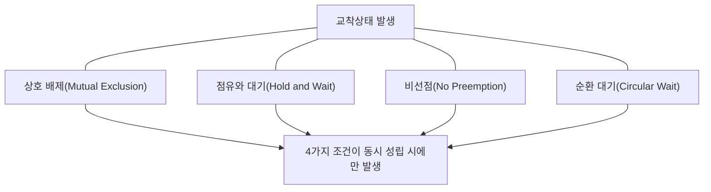
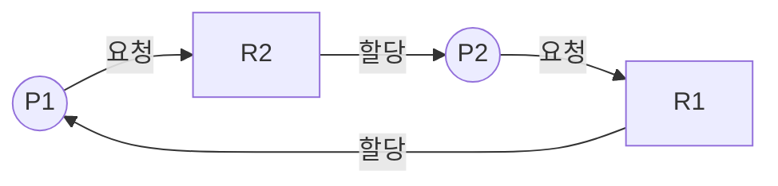
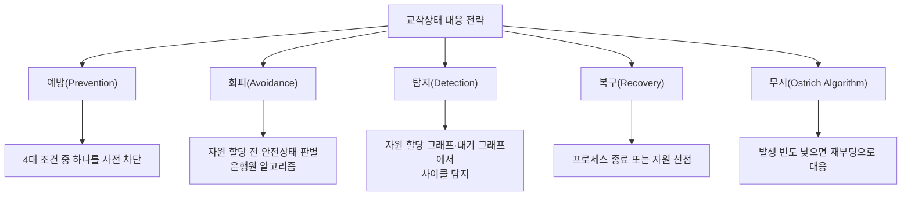

# 교착상태(Deadlock)

## 1. 개요

> **교착상태(Deadlock)** 란 둘 이상의 프로세스(또는 스레드·트랜잭션)가 서로가 점유한 자원을 무한히 기다리며, 어느 쪽도 진행하지 못하고 영원히 멈춰 있는 상태를 말한다.

멀티프로그래밍과 병행 처리가 보편화되면서 하나의 CPU·메모리·입출력 장치·데이터베이스 레코드 같은 유한한 자원을 여러 실행 흐름이 동시에 나눠 쓰는 일이 일상이 되었다. 자원을 효율적으로 공유하려면 어느 흐름이 자원을 먼저 잡고 다른 흐름은 잠시 기다리게 하는 **상호 배제(mutual exclusion)** 가 필요한데, 바로 이 "기다림"이 얽히고설키면 아무도 앞으로 나아가지 못하는 순환 대기가 만들어진다. 교착상태는 단순한 성능 저하가 아니라 시스템 일부 또는 전체가 멈추는 가용성 사고로 직결되므로, 운영체제·데이터베이스·분산 시스템 설계에서 반드시 다루어야 하는 핵심 주제다.

교착상태가 특히 까다로운 이유는 **비결정적(non-deterministic)** 으로 발생한다는 점이다. 동일한 코드라도 스케줄링 순서·타이밍·부하에 따라 어떤 때는 문제없이 지나가고 어떤 때는 멈춰버린다. 테스트 환경에서는 재현되지 않다가 운영 환경의 높은 동시성에서 간헐적으로 터지는 전형적인 "하이젠버그(Heisenbug)"라, 사후 탐지·복구뿐 아니라 설계 단계의 예방이 중요하다. 정보관리기술사 관점에서는 발생 조건을 정확히 이해하고, 예방·회피·탐지·복구라는 네 가지 처리 전략의 트레이드오프를 실무 맥락에서 설명할 수 있어야 한다.

교착상태는 굶주림(Starvation)과 구분해야 한다. 교착은 관련된 모든 흐름이 서로를 기다리며 **영원히** 멈추는 반면, 굶주림은 특정 흐름만 계속 뒤로 밀려 자원을 못 받는 상태로, 나머지는 정상 진행한다. 라이브락(Livelock)도 구분 대상이다. 라이브락은 흐름들이 멈춰 있지는 않지만 서로 양보만 반복하며 실질적 진전이 없는 상태다. 세 현상 모두 "일이 끝나지 않는다"는 증상은 비슷하나, 원인과 해법이 다르므로 진단 단계에서 정확히 분별해야 한다.

교착의 파급력은 시스템 규모가 클수록 커진다. 실제로 전자상거래의 재고 차감, 금융의 계좌 이체, 예약 시스템의 좌석 확보처럼 여러 자원을 동시에 잠그는 트랜잭션이 몰리는 순간 교착이 집중적으로 발생한다. 이럴 때 다수 트랜잭션이 연쇄적으로 롤백·재시도되며 응답 지연이 폭증하고, 최악의 경우 서비스 전체가 사실상 멈추는 장애로 번진다. 따라서 교착은 단일 프로세스의 버그가 아니라 **시스템 가용성과 직결된 아키텍처 차원의 관심사**로 다뤄야 한다.

## 2. 교착상태 발생의 4가지 필요조건

교착상태는 다음 네 가지 조건이 **동시에 모두** 성립할 때만 발생한다(Coffman 조건, 1971). 즉 이 중 하나라도 깨면 교착은 원천적으로 일어날 수 없으며, 이것이 예방(Prevention) 전략의 이론적 근거가 된다.

**가. 상호 배제(Mutual Exclusion).** 자원은 한 번에 하나의 흐름만 배타적으로 사용할 수 있어야 한다. 프린터, 쓰기 락이 걸린 DB 레코드처럼 동시에 공유할 수 없는 자원이 여기 해당한다. 읽기 전용으로 공유 가능한 자원(공유 락)은 이 조건을 만족하지 않으므로 교착의 원인이 되지 않는다. 즉 상호 배제는 자원의 본질적 성질이라 인위적으로 제거하기 가장 어려운 조건이다.

**나. 점유와 대기(Hold and Wait).** 한 흐름이 이미 어떤 자원을 점유한 채로, 다른 흐름이 가진 또 다른 자원을 추가로 요청하며 기다리는 상황이다. 예컨대 프로세스 P1이 자원 A를 잡은 상태에서 B를 요청하고, P2는 B를 잡은 상태에서 A를 요청하면 서로 물고 늘어지게 된다. 필요한 자원을 처음부터 한꺼번에 모두 확보하게 하면 이 조건을 깰 수 있다.

**다. 비선점(No Preemption).** 어떤 흐름이 점유한 자원은 그 흐름이 자발적으로 반납하기 전까지 강제로 빼앗을 수 없다. 만약 우선순위가 높은 흐름이 낮은 흐름의 자원을 강제로 회수할 수 있다면(선점), 순환 대기가 성립해도 자원 회수로 교착을 풀 수 있다. 다만 CPU·메모리처럼 상태를 저장·복원하기 쉬운 자원은 선점이 쉽지만, 프린터 출력 도중이나 DB 트랜잭션 중간처럼 선점하면 일관성이 깨지는 자원은 선점이 어렵다.

**라. 순환 대기(Circular Wait).** 대기 관계를 그래프로 그렸을 때 원형(사이클)이 형성되는 조건이다. P1→P2→P3→…→P1 형태로 각 흐름이 다음 흐름이 가진 자원을 기다리는 폐쇄 루프가 만들어진다. 위의 세 조건이 성립해도 이 순환만 없으면 교착은 일어나지 않으므로, 실무에서는 "모든 흐름이 자원을 같은 순서로만 획득하게 강제"하여 순환을 원천 차단하는 방법을 가장 많이 쓴다.

이 네 조건은 모두 **필요조건**이며 넷이 함께여야 비로소 충분조건이 된다는 점이 중요하다. 하나라도 성립하지 않으면 교착은 결코 발생하지 않는다. 예방 전략이 "넷 중 하나를 깬다"에 집중하는 이유가 바로 여기에 있다. 예컨대 상호 배제가 없는 순수 읽기 전용 데이터, 처음에 필요한 자원을 모두 확보하는 배치 작업, CPU처럼 언제든 선점 가능한 자원, 전역 순번대로만 락을 잡는 코드는 각각 하나의 조건을 무너뜨려 구조적으로 교착에서 자유롭다.

이 네 조건은 앞의 셋(상호 배제·점유와 대기·비선점)이 교착이 **가능한 환경**을 만들고, 마지막 순환 대기가 실제로 교착을 **발생**시키는 방아쇠라는 계층 구조로 이해하면 좋다. 실제 사례로, 은행 계좌 이체 로직에서 계좌 A→B 이체 스레드와 B→A 이체 스레드가 서로 상대 계좌 락을 먼저 잡으면 전형적인 순환 대기가 만들어진다. 실무에서는 계좌 번호가 작은 쪽부터 락을 거는 **자원 순서화** 로 이를 막는다.

## 3. 자원 할당 그래프(Resource Allocation Graph)

교착상태를 시각적으로 판별하는 대표 도구가 **자원 할당 그래프(RAG)** 다. 프로세스(원)와 자원(사각형)을 정점으로 두고, 프로세스가 자원을 요청하면 프로세스→자원(요청 간선), 자원이 프로세스에 할당되면 자원→프로세스(할당 간선)로 방향 간선을 그린다. 아래 그림은 P1이 R1을 잡은 채 R2를 요청하고, P2가 R2를 잡은 채 R1을 요청해 사이클(P1→R2→P2→R1→P1)이 형성된 교착 상황을 나타낸다.

핵심 판별 규칙은 자원의 인스턴스 수에 따라 달라진다. **자원마다 인스턴스가 하나씩이면 그래프에 사이클이 존재하는 것이 교착의 필요충분조건**이다. 반면 **자원에 인스턴스가 여러 개면 사이클은 교착의 필요조건일 뿐 충분조건은 아니다.** 사이클이 있어도 그 자원의 다른 인스턴스를 곧 반납할 프로세스가 있으면 교착이 아닐 수 있기 때문이다. 그래서 인스턴스가 하나뿐인 락에는 단순한 사이클 탐지로 충분하지만, 인스턴스가 여럿인 자원 풀에는 은행원 알고리즘 계열의 정밀한 탐지가 필요하다. 대기 그래프(Wait-for Graph)는 이 RAG에서 자원 정점을 접어(collapse) 프로세스 간 대기 관계만 남긴 축약형으로, DBMS의 교착 탐지기가 실제로 사용하는 자료구조다.

## 4. 교착상태 처리 기법

교착상태 대응은 발생을 막는 정적 전략(예방·회피)과 발생을 허용하되 사후 대응하는 동적 전략(탐지·복구)으로 나뉜다. 여기에 아예 무시하는 타조 알고리즘까지 더해 네 가지 축으로 정리한다.

**가. 예방(Prevention).** 4대 필요조건 중 하나를 설계 단계에서 성립하지 못하게 만드는 가장 강력한 전략이다. 상호 배제는 스풀링(spooling)처럼 자원을 가상화해 공유 가능하게 만들어 완화하고, 점유와 대기는 필요한 자원을 한 번에 모두 요청하게 하거나 아무 자원도 없을 때만 요청하게 강제한다. 비선점은 추가 자원을 못 얻으면 이미 가진 자원을 내려놓게 하고, 순환 대기는 모든 자원에 전역 순번을 매겨 오름차순으로만 획득하게 한다.

네 가지 조건 차단법 중 실무에서 가장 널리 쓰이는 것은 순환 대기 제거를 위한 **자원 순서화(전역 락 순서 지정)** 다. 상호 배제는 자원의 물리적 본성이라 없애기 어렵고, 점유와 대기의 일괄 요청은 실제 쓰지 않을 자원까지 미리 잡아 이용률을 크게 떨어뜨리며, 비선점의 강제 회수는 트랜잭션 일관성을 깨기 쉽기 때문이다. 반면 순환 대기 제거는 "락은 항상 정해진 순번의 오름차순으로만 잡는다"는 규칙 하나로 구현이 단순하고 부작용이 적어, 대부분의 애플리케이션 코딩 가이드가 이 방식을 채택한다.

다만 예방은 확실한 만큼 대가가 크다. 필요할 자원을 미리 다 잡아두면 실제 쓰지 않는 동안에도 자원이 놀아 이용률이 낮아지고, 전역 순서 규칙이 복잡한 대규모 코드베이스에서는 순서를 위반하는 경로가 숨어들기 쉬워 지속적인 검증이 필요하다. 따라서 예방은 자원 종류가 명확하고 락 계층이 정리된 시스템에서 특히 효과적이다.

**나. 회피(Avoidance).** 교착이 일어날 수 있는 조건은 허용하되, 자원을 할당할 때마다 그 할당이 시스템을 **안전 상태(safe state)** 로 유지하는지 검사해 위험한 할당을 거부하는 전략이다. 안전 상태란 모든 프로세스가 교착 없이 완료될 수 있는 자원 할당 순서(안전 순서열)가 최소 하나 존재하는 상태를 말한다. 대표 기법이 다익스트라의 **은행원 알고리즘(Banker's Algorithm)** 이다.

회피의 핵심 통찰은 예방처럼 조건 자체를 없애 이용률을 희생하지 않으면서도, 매 순간 "이 할당을 해도 모두가 무사히 끝날 길이 남는가"만 검사해 위험한 순간에만 대기를 강제한다는 점이다. 덕분에 자원을 미리 몰아서 잡을 필요가 없어 예방보다 이용률이 높다. 대신 각 프로세스가 앞으로 필요로 할 자원의 **최대 요구량을 사전에 선언**해야 하고 매 할당 시 안전성 검사(O(m·n²) 수준)를 돌려야 하므로, 자원 종류·프로세스 수가 유동적인 범용 OS보다 이들이 제한적이고 예측 가능한 임베디드·실시간 시스템에 적합하다.

**다. 탐지(Detection).** 교착을 막지 않고 발생을 허용한 뒤, 주기적으로 시스템 상태를 검사해 교착 여부를 판별한다. 자원 인스턴스가 하나씩이면 **대기 그래프(Wait-for Graph)** 에서 사이클을 찾고, 여러 개이면 은행원 알고리즘과 유사한 탐지 알고리즘을 돌린다. 검사 주기를 짧게 하면 빨리 발견하지만 오버헤드가 크고, 길게 하면 발견이 늦어 그동안 대기 중인 자원이 낭비된다.

검사 시점은 두 가지 방식이 있다. 자원 요청이 즉시 충족되지 못할 때마다 검사하는 방식은 교착을 발생 즉시 잡아내고 원인 프로세스도 특정하기 쉽지만 검사 빈도가 높아 부담이 크다. 반대로 일정 시간 간격이나 CPU 이용률이 특정 임계치 아래로 떨어질 때만 검사하는 방식은 오버헤드가 낮은 대신, 하나의 검사 주기 안에 여러 사이클이 얽혀 어느 프로세스가 근본 원인인지 가려내기 어려워진다. 데이터베이스 관리시스템(DBMS)이 대표적으로 이 탐지 방식을 쓰며, 실무에서는 락 대기 타임아웃을 함께 걸어 탐지 실패나 지연에 대비한다.

**라. 복구(Recovery).** 탐지된 교착을 실제로 푸는 단계다. 방법은 두 가지다. 하나는 **프로세스 종료** 로, 교착에 얽힌 프로세스를 모두 죽이거나(확실하지만 손실 큼) 하나씩 죽이며 교착이 풀릴 때까지 반복한다. 다른 하나는 **자원 선점** 으로, 희생자(victim)를 골라 자원을 빼앗고 그 프로세스를 이전 안전 지점으로 롤백(rollback)한다.

희생자 선정은 단순히 아무나 죽이는 것이 아니라 **총비용을 최소화하는 최적화 문제**다. 우선순위, 이미 소비한 CPU 시간, 남은 작업량, 점유한 자원의 종류와 수, 롤백에 필요한 비용 등을 종합해 "가장 적은 손실로 교착을 푸는" 대상을 고른다. 예컨대 이제 막 시작해 작업량이 적은 트랜잭션을 죽이면 롤백 비용이 작고, 거의 끝나가는 장시간 트랜잭션은 되도록 살린다.

이때 반드시 함께 관리해야 할 위험이 **굶주림(starvation)** 이다. 롤백 비용만 기준으로 삼으면 항상 같은 저비용 프로세스가 반복 희생되어 영원히 완료되지 못할 수 있다. 이를 막기 위해 희생 횟수를 비용 함수에 누적 반영하거나, 노후화(aging)로 여러 번 밀린 프로세스의 우선순위를 점차 높여 언젠가는 반드시 완주하도록 공정성을 보장한다.

## 5. 은행원 알고리즘과 처리 기법 비교

은행원 알고리즘은 은행이 모든 고객의 요청을 항상 만족시킬 수 있을 만큼만 대출을 내주는 원리에서 이름을 땄다. 각 프로세스가 선언한 최대 요구량(Max), 현재 할당량(Allocation), 앞으로 더 필요한 양(Need = Max − Allocation)과 시스템의 가용 자원(Available)을 바탕으로, 어떤 자원 요청을 수락했을 때 여전히 안전 순서열이 존재하는지를 안전성 검사(Safety Algorithm)로 확인한다. 안전하면 할당하고, 그렇지 않으면 요청 프로세스를 대기시킨다.

예를 들어 자원 총량이 10이고 P1·P2·P3의 최대 요구가 각각 7·4·9, 현재 할당이 2·2·2, 가용이 4라면, Need는 5·2·7이 된다. 가용 4로 Need 2인 P2를 먼저 끝내면 자원 4개가 회수되어 가용이 6이 되고, 이어 P1(Need 5)을 끝내 가용 8, 마지막으로 P3(Need 7)을 끝낼 수 있으므로 <P2, P1, P3>이라는 안전 순서열이 존재한다. 즉 이 상태는 안전 상태다. 만약 이 상태에서 어떤 요청이 안전 순서열을 하나도 남기지 못하게 만든다면 그 요청은 거부된다.

| 기법 | 시점 | 사전 정보 요구 | 자원 이용률 | 대표 적용 |
|------|------|----------------|-------------|-----------|
| **예방(Prevention)** | 설계 시 조건 차단 | 불필요 | 낮음 | 자원 순서화(락 계층화) |
| **회피(Avoidance)** | 할당 시 안전성 검사 | 최대 요구량 필요 | 중간 | 임베디드·실시간 시스템 |
| **탐지·복구(Detection)** | 발생 후 검사·해소 | 불필요 | 높음 | DBMS 트랜잭션 |
| **무시(Ostrich)** | 대응 안 함 | 불필요 | 최고 | 범용 OS(발생 드묾) |

은행원 알고리즘은 이론적으로 우아하지만 현실 적용에는 한계가 뚜렷하다. 첫째, 각 프로세스가 **최대 자원 요구량을 미리 정확히 알아야** 하는데 대화형·서버 워크로드에서는 이를 사전에 알기 어렵다. 둘째, 프로세스 수와 자원 수가 **동적으로 변하면** 매번 검사 비용이 커진다. 셋째, 자원이 항상 가용하다는 보장이 없어(고장·회수) 실제 시스템 가정과 맞지 않을 수 있다. 이 때문에 은행원 알고리즘은 범용 OS에는 거의 쓰이지 않고, 요구량이 명세되는 항공·우주·산업 제어 같은 제한된 고신뢰 도메인에서 개념적 토대로 활용된다.

여기서 반드시 구분해야 할 개념이 **안전 상태·불안전 상태·교착 상태**의 관계다. 안전 상태는 반드시 교착이 없지만, **불안전 상태가 곧 교착은 아니다.** 불안전 상태는 "안전 순서열을 보장할 수 없는" 상태일 뿐, 프로세스들의 실제 요청 패턴에 따라 운 좋게 교착 없이 끝날 수도 있다. 즉 교착 상태는 불안전 상태의 부분집합이며, 회피 전략은 이 불안전 영역에 아예 발을 들이지 않도록 보수적으로 자원 할당을 통제하는 것이다. 이 보수성 때문에 회피는 실제로는 교착이 안 날 요청까지 거부해 자원 이용률을 떨어뜨리는 대가를 치른다. 앞의 예에서 만약 P3이 Need 7을 요청했는데 가용이 4뿐이라 어떤 순서로도 완주가 불가능하다면 그 요청은 불안전 상태를 유발하므로 즉시 거부되고 P3은 대기한다.

예방은 안전하지만 비싸고, 무시(타조 알고리즘)는 저렴하지만 위험하다. 리눅스·윈도우 같은 범용 OS는 커널 수준 교착이 극히 드물고 예방·회피 비용이 크기 때문에 대체로 무시 전략에 가깝게 설계하고, 문제가 생기면 재부팅으로 해결하도록 둔다. 반면 다수 트랜잭션이 락을 다투는 DBMS는 탐지·복구가 필수라 대기 그래프 기반 교착 탐지기를 내장하고, 교착 발견 시 롤백 비용이 가장 작은 트랜잭션을 자동으로 희생자로 골라 `deadlock victim`으로 롤백한다.

## 6. 심화: 실무에서의 교착상태

**가. 데이터베이스 교착상태.** 관계형 DBMS는 2단계 로킹(2PL)으로 직렬성을 보장하는 과정에서 교착이 흔히 발생한다. Oracle·SQL Server·MySQL(InnoDB)은 모두 대기 그래프로 교착을 탐지해 자동으로 한 트랜잭션을 롤백하고 애플리케이션에 오류(예: SQL Server 1205 "deadlock victim")를 반환한다. 실무 대응 원칙은 세 가지다. 첫째, 트랜잭션 내에서 **테이블·행에 접근하는 순서를 애플리케이션 전체가 통일**해 순환 대기를 없앤다. 둘째, 트랜잭션을 **짧고 작게** 유지해 락 보유 시간을 줄인다. 셋째, 교착 오류는 정상적으로 발생할 수 있으므로 애플리케이션에 **재시도(retry) 로직**을 넣어 회복력을 확보한다. 실제로 대량 배치 이체·재고 차감 시스템에서 계좌·상품 ID 오름차순 락 획득 규칙을 도입해 교착 빈도를 크게 낮춘 사례가 많다. 예컨대 초당 수천 건의 이체가 몰리는 결제 시스템에서 락 순서를 통일하기 전에는 피크 시간대에 교착 롤백이 분당 수백 건씩 발생하다가, ID 오름차순 규칙과 3회 지수 백오프 재시도를 함께 적용한 뒤 교착으로 인한 최종 실패를 거의 0에 가깝게 줄인 개선 사례가 보고된다.

**나. 애플리케이션 스레드 교착.** 자바·C++·Go 같은 멀티스레드 애플리케이션에서 두 스레드가 두 개의 락을 서로 반대 순서로 잡으면 교착이 발생한다. 자바는 `jstack`이나 스레드 덤프로 "Found one Java-level deadlock" 진단 정보를 제공하고, `tryLock(timeout)`처럼 타임아웃이 있는 락 획득으로 무한 대기를 방지한다. 근본 대책은 역시 **일관된 락 순서(lock ordering)** 다. Go 언어는 채널 기반 통신을 권장해 공유 상태 락 자체를 줄이지만, 모든 고루틴이 서로의 채널 응답을 기다리면 런타임이 "all goroutines are asleep - deadlock!"을 감지해 패닉을 일으킨다.

실무에서 스레드 교착을 예방하는 구체적 원칙으로는 ① 여러 락이 필요하면 항상 정해진 전역 순서로만 획득하기, ② 락 보유 구간을 최소화하고 락을 쥔 채 외부 서비스를 호출하지 않기, ③ `tryLock` 타임아웃으로 무한 대기를 시간 제한으로 바꾸기, ④ 가능하면 불변 객체·메시지 전달·동시성 컬렉션으로 공유 가변 상태 자체를 줄이기가 있다. 이 원칙들은 앞서 본 4대 조건을 코드 수준에서 무너뜨리는 실천적 방법에 해당한다.

**다. 분산 시스템의 분산 교착.** 마이크로서비스나 분산 트랜잭션에서는 여러 노드에 흩어진 자원 사이에 순환 대기가 생기는 **분산 교착(distributed deadlock)** 이 발생하며, 단일 노드처럼 전역 대기 그래프를 즉시 관찰하기 어려워 탐지가 훨씬 까다롭다. 이를 위해 각 노드가 대기 정보를 담은 프로브(probe) 메시지를 전달해 순환을 추적하는 **에지 추적(edge-chasing)** 기법이나, 트랜잭션에 타임스탬프를 부여해 젊은 트랜잭션을 죽이는 **Wait-Die·Wound-Wait** 방식이 쓰인다. 실무에서는 완벽한 탐지보다 **타임아웃 기반 중단 후 재시도** 와 사가(Saga) 패턴의 보상 트랜잭션으로 회피하는 편이 현실적이다.

**라. 식사하는 철학자 문제로 본 교착의 본질.** 다익스트라가 제시한 **식사하는 철학자 문제(Dining Philosophers)** 는 교착과 그 해법을 압축적으로 보여주는 고전 예제다. 원탁에 앉은 다섯 철학자가 각자 왼쪽 포크를 먼저 집고 오른쪽 포크를 집으려 하면, 모두가 동시에 왼쪽을 든 순간 오른쪽을 영원히 기다리는 순환 대기(교착)에 빠진다. 이 문제의 해법이 곧 예방 전략의 축소판이다. ① 홀수 번째 철학자는 왼쪽부터, 짝수 번째는 오른쪽부터 집게 하여 **자원 획득 순서를 비대칭으로** 만들면 순환 대기가 깨진다. ② 동시에 식사할 수 있는 철학자 수를 N−1명으로 제한(세마포어)하면 점유와 대기가 완화된다. ③ 두 포크를 원자적으로 한꺼번에 집게 하면 점유와 대기 자체가 사라진다. 실무의 커넥션 풀 고갈, 스레드 풀 상호 대기 문제도 본질적으로 이 구조와 같아, 같은 해법 원리가 그대로 적용된다.

## 7. 고려사항 및 시사점 (기술사 관점)

1. **전략 선택은 비용-위험의 트레이드오프다.** 예방·회피는 교착을 원천 봉쇄하지만 자원 이용률과 처리량을 희생하고, 탐지·복구·무시는 성능을 살리는 대신 사고 발생을 감수한다. 시스템의 가용성 요구 수준(SLA), 자원 경합 빈도, 재시도 가능 여부를 종합해 계층별로 다른 전략을 조합하는 것이 실무적이다 — 예컨대 DB 계층은 탐지·복구, 애플리케이션 계층은 락 순서화 예방을 함께 적용한다.

2. **설계 단계 예방이 사후 대응보다 비용 효율적이다.** 교착은 재현이 어려워 운영 중 디버깅 비용이 매우 크다. 락 획득 순서 표준화, 트랜잭션 최소화, 타임아웃 강제 같은 규칙을 코딩 가이드·정적 분석 도구·코드 리뷰 체크리스트로 개발 초기부터 강제하는 것이 총소유비용(TCO)을 낮춘다.

3. **회복력(resilience) 설계가 완벽한 예방보다 현실적일 수 있다.** 분산 환경에서는 교착을 완전히 없애기 어렵다. 타임아웃·재시도·지수 백오프·서킷 브레이커·보상 트랜잭션 등 장애를 전제로 한 회복 메커니즘을 갖추면, 드물게 발생하는 교착을 시스템이 스스로 흡수하도록 만들 수 있다.

4. **굶주림·라이브락과 함께 통합 관리해야 한다.** 교착만 막고 희생자 선정을 소홀히 하면 특정 트랜잭션이 반복 롤백되어 굶주림에 빠지거나, 서로 양보만 반복하는 라이브락으로 전환될 수 있다. 롤백 횟수를 비용에 반영하고 노후화(aging) 기법으로 오래 기다린 요청의 우선순위를 높이는 등 공정성(fairness)까지 포함한 종합적 자원 관리가 필요하다.

5. **관측 가능성(Observability) 확보가 운영의 핵심이다.** 교착·락 대기 지표를 모니터링(예: DB의 lock wait, blocking session, 애플리케이션 스레드 덤프)해 이상 징후를 조기에 포착하고, 교착 로그를 사후 분석해 반복 원인을 제거하는 피드백 루프를 운영 프로세스에 내재화해야 한다.

6. **클라우드·컨테이너 시대에는 자원 경계가 넓어져 교착의 형태도 진화한다.** 커넥션 풀·스레드 풀·분산 락(Redis Redlock, ZooKeeper) 같은 논리적 자원이 새로운 교착 지점이 된다. 예컨대 서비스 A가 B를 동기 호출하고 B가 다시 A를 호출하는 순환 의존이 스레드 풀을 고갈시키면, 개별 프로세스는 살아 있어도 시스템은 사실상 교착에 빠진다. 비동기 논블로킹 아키텍처, 벌크헤드(bulkhead) 격리, 호출 그래프의 순환 제거 같은 설계 원칙이 예방책이 된다.

7. **자동화된 검증으로 잠재 교착을 조기에 발견해야 한다.** 정적 분석기(예: 락 순서 위반 탐지), 동시성 테스트 도구, 카오스 엔지니어링을 통한 부하 주입으로 운영 전에 교착 가능성을 노출시키는 것이 바람직하다. 특히 재현이 어려운 특성상, 테스트 커버리지만으로는 부족하므로 형식 검증·모델 체킹(TLA+ 등)으로 동시성 프로토콜의 무교착(deadlock-freedom)을 증명하는 접근도 고신뢰 시스템에서 활용된다.

## 참고자료
- Silberschatz, Galvin, Gagne, "Operating System Concepts" (Deadlocks 장)
- E. G. Coffman et al., "System Deadlocks", ACM Computing Surveys, 1971
- Microsoft SQL Server Docs — Deadlocks guide: https://learn.microsoft.com/en-us/sql/relational-databases/sql-server-deadlocks-guide
- Oracle Database Concepts — Locks and Deadlocks: https://docs.oracle.com/en/database/oracle/oracle-database/
- MySQL Reference Manual — Deadlocks in InnoDB: https://dev.mysql.com/doc/refman/8.0/en/innodb-deadlocks.html
- E. W. Dijkstra, "Hierarchical Ordering of Sequential Processes" (Dining Philosophers 원전)

---
> **한 줄 요약**: 교착상태는 상호 배제·점유와 대기·비선점·순환 대기 4대 조건이 동시에 성립할 때 발생하며, 예방·회피(은행원 알고리즘)·탐지·복구 전략을 시스템 특성에 맞게 조합하고 락 순서화·타임아웃·재시도 같은 회복력 설계로 함께 다뤄야 한다.
