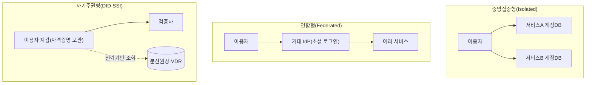
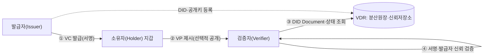

# 분산신원증명(DID, Decentralized Identity)

## 1. 개요

### 가. 정의

> **분산신원증명(DID, Decentralized Identity)**은 신원정보의 발급·저장·제출 권한을 중앙 기관이 아닌 **이용자 본인**에게 귀속시키는 신원 관리 패러다임이다. 이용자는 자신의 자격증명(Verifiable Credential)을 스스로의 지갑(디지털 월렛)에 보관하고, 검증에 필요한 정보만 **선택적으로** 제시하며, 검증자는 발급 기관에 직접 조회하지 않고도 위·변조 여부를 암호학적으로 확인한다.

DID는 W3C가 표준화한 **분산 식별자(Decentralized Identifier)** 규격과, 이를 활용해 신원을 "자기주권적(Self-Sovereign)"으로 다루려는 **SSI(Self-Sovereign Identity)** 철학을 아우르는 용어다. 좁게는 `did:method:식별자` 형태의 URI 스킴 하나를 가리키지만, 넓게는 발급자·소유자·검증자 사이에서 검증 가능한 자격증명을 주고받는 **신원 생태계 전체**를 의미한다. 기존 로그인이 "서비스가 보관한 나의 계정을 서비스에게 증명"하는 구조라면, DID는 "내가 보관한 나의 증명을 누구에게나 제시"하는 구조라는 점에서 신원의 통제권이 근본적으로 이동한다.

### 나. 등장 배경과 필요성

디지털 신원의 지배적 모델은 오랫동안 **중앙집중형(Isolated)**과 **연합형(Federated)**이었다. 중앙집중형에서는 서비스마다 별도의 계정과 비밀번호를 만들어야 하므로 이용자는 수십 개의 자격을 관리해야 하고, 각 서비스는 개인정보를 중복 축적한다. 이 축적은 곧 대규모 유출의 표적이 되며, 실제로 국내외에서 수천만 건 규모의 개인정보 유출 사고가 반복되어 왔다. 연합형(소셜 로그인·OIDC)은 계정 수를 줄여 편의를 높였지만, 소수의 **거대 신원 제공자(IdP)**가 이용자의 로그인 이력을 관찰·집중하게 되는 프라이버시·종속성 문제를 낳았다.

이러한 모델의 공통된 한계는 신원정보가 이용자가 아니라 **기관의 데이터베이스에 존재**한다는 점이다. 그 결과 이용자는 자신의 정보가 언제 어떻게 쓰이는지 통제할 수 없고, 성인 인증처럼 "성인 여부"만 필요한 상황에서도 주민등록번호·생년월일 전체를 넘겨야 하는 **과잉 수집**이 상시화된다. 개인정보보호 규범이 강조하는 **데이터 최소수집(Data Minimization)**과 **정보주체의 자기결정권**은 이러한 구조와 충돌한다.

DID는 신원정보를 이용자의 지갑으로 옮기고, 원본 데이터 대신 **암호학적으로 검증 가능한 증명**만 유통시킴으로써 이 충돌을 해소하려는 시도다. 발급 기관은 한 번 자격증명을 발급하면 이후 검증 과정에 개입하지 않으므로 이용자의 활동을 추적할 수 없고(발급자-검증자 비연결성), 검증자는 필요한 속성만 요구할 수 있어 과잉 수집이 구조적으로 억제된다. 최근 국내에서 모바일 운전면허증·모바일 신분증이 DID 기반으로 전개되고, EU가 **eIDAS 2.0**을 통해 전 회원국에 디지털 신원지갑(EUDI Wallet)을 의무화하는 흐름은 DID가 실험 단계를 넘어 국가 신원 인프라로 진입하고 있음을 보여준다.

## 2. 신원 관리 모델의 진화와 전체 구조

DID의 위치를 이해하려면 신원 모델의 진화 축 위에서 조망하는 것이 유용하다. 중앙집중형은 통제와 프라이버시 모두에서 이용자에게 불리했고, 연합형은 편의를 얻는 대신 소수 IdP에 대한 종속을 낳았다. DID(자기주권형)는 통제권을 이용자에게 돌려주되, 신뢰의 근거를 특정 기관이 아니라 **분산 신뢰 기반(블록체인·분산원장 등)**에 둔다는 점에서 두 모델과 구분된다.

DID 생태계의 실제 동작은 세 주체와 두 산출물로 요약된다. 세 주체는 자격증명을 발급하는 **발급자(Issuer)**, 이를 보관·제출하는 **소유자(Holder)**, 그리고 이를 확인하는 **검증자(Verifier)**이며, 흔히 **신뢰 삼각형(Trust Triangle)**이라 불린다. 두 산출물은 발급자가 서명해 발급하는 **검증가능 자격증명(VC, Verifiable Credential)**과, 소유자가 필요한 부분만 골라 재구성해 제출하는 **검증가능 제시(VP, Verifiable Presentation)**다.

이 구조의 핵심은 검증자가 **발급자에게 직접 묻지 않는다**는 점이다. 발급자는 자신의 DID와 공개키를 분산원장 등 **검증가능 데이터 저장소(VDR, Verifiable Data Registry)**에 등록해 두고, 검증자는 VP에 담긴 서명을 VDR의 공개키로 검증한다. 덕분에 발급자는 검증 시점을 알 수 없어 이용자 추적이 원천 차단되고, 검증자는 오프라인·실시간 조회 부담 없이 신뢰를 확인할 수 있다.

## 3. 핵심 구성요소 상세

### 가. 분산 식별자(DID)와 DID Document

DID는 `did:method-name:method-specific-id` 형식의 URI다. 예컨대 `did:web:example.com` 이나 `did:ion:EiClk...` 처럼, 가운데의 **메서드(method)**가 해당 DID를 어떤 신뢰 기반에서 생성·해석하는지를 규정한다. DID를 해석(resolve)하면 **DID Document**를 얻는데, 이 문서에는 그 DID를 통제하는 주체의 **공개키(인증수단)**, 서명·인증에 쓰이는 검증방법, 그리고 상호작용 지점을 알려주는 **서비스 엔드포인트**가 담긴다. 즉 DID는 "이름표", DID Document는 "그 이름표의 소유자가 자신을 증명하는 방법을 적어 둔 명세서"에 해당한다.

DID의 중요한 성질은 **자기인증(self-certifying)**이다. 식별자 자체가 공개키(또는 그 해시)와 결부되어 생성되므로, 그 DID의 통제자임을 증명하려면 대응하는 개인키로 서명하면 되고, 이를 발급해 준 중앙 등록기관이 필요 없다. 이 점이 이메일·전화번호 같은 기존 식별자와의 결정적 차이다.

### 나. 검증가능 자격증명(VC)과 선택적 공개

VC는 발급자가 소유자의 특정 속성(성명·생년월일·자격·소속 등)을 주장(claim)하고 자신의 개인키로 **디지털 서명**한 데이터 구조다. 서명이 붙어 있으므로 위·변조되면 검증이 실패하고, 발급자의 DID를 통해 "누가 보증했는가"가 드러난다. VC의 진가는 소유자가 이를 그대로 넘기지 않고 **VP로 재구성**할 때 발휘된다. 소유자는 여러 VC에서 필요한 항목만 추려 하나의 제시로 묶고, 여기에 자신의 개인키로 서명해 "이 제시가 나의 것임"을 함께 증명한다.

특히 **선택적 공개(Selective Disclosure)**와 **영지식증명(ZKP)** 기법을 결합하면, 원본을 노출하지 않고도 조건 충족만 증명할 수 있다. 대표적으로 SD-JWT나 BBS+ 서명을 이용하면 "생년월일" 자체를 밝히지 않고 "만 19세 이상"이라는 사실만 증명하는 것이 가능하다. 이는 술·담배 구매나 성인 콘텐츠 접근처럼 **속성 하나만 필요한** 실제 상황에서 개인정보 노출을 극적으로 줄인다.

| 구분 | 기존 신원증명 | DID 기반 VC |
|------|---------------|-------------|
| 정보 보관 | 서비스·기관 DB | 이용자 지갑 |
| 검증 방식 | 발급기관에 실시간 조회 | 서명·VDR 기반 오프라인 검증 |
| 공개 범위 | 신분증 전체(과잉) | 필요 속성만(선택적 공개) |
| 발급자 추적 | 가능(조회 로그) | 불가(비연결성) |
| 유출 위험 | 중앙 DB 집중 | 분산·최소화 |

위 표는 비교의 요지를 정리한 것이지만, 차이가 발생하는 근본 이유는 "원본 데이터를 옮기느냐, 검증 가능한 증명을 옮기느냐"의 설계 철학에 있다. 기존 방식은 신뢰를 위해 데이터를 이동·집중시키고, DID는 데이터를 이동시키지 않고 **신뢰만 이동**시킨다. 그 결과 유출 표면(attack surface)과 프라이버시 위험이 구조적으로 달라진다.

### 다. VDR과 신뢰 기반

VDR은 발급자의 DID·공개키, 그리고 자격증명의 **폐기 상태(revocation)** 등을 검증자가 확인할 수 있게 공유하는 저장소다. 반드시 블록체인일 필요는 없으나, 위·변조 저항성과 탈중앙 신뢰를 위해 분산원장이 널리 쓰인다. 다만 개인정보(VC 원본)를 블록체인에 올리면 삭제권 행사가 불가능해지므로, 실무에서는 **개인정보는 온체인에 저장하지 않고**(off-chain 지갑 보관) 검증에 필요한 공개키·해시·상태값만 온체인에 두는 것이 원칙이다.

## 4. 비교 — 연합형 신원(OIDC)과 DID

DID는 흔히 소셜 로그인(OAuth 2.0/OIDC)과 비교된다. OIDC에서는 로그인 때마다 IdP가 개입해 이용자를 서비스에 연결해 주므로, IdP가 이용자의 접속처·시점을 알 수 있고 IdP 장애 시 연쇄적으로 로그인이 마비된다. 반면 DID에서는 발급 이후 발급자가 검증에 관여하지 않으므로 이러한 관찰·단일장애점 문제가 없다. 다만 그 대가로 이용자가 **개인키·지갑을 스스로 안전하게 관리**해야 하는 책임이 발생한다. 요컨대 OIDC는 "편의를 위해 신뢰를 IdP에 위임"하고, DID는 "통제권을 얻는 대신 관리 책임을 이용자가 부담"하는 상반된 트레이드오프를 가진다. 이 때문에 현실에서는 OIDC와 DID를 대립이 아니라 **보완**으로 보고, OIDC 위에 VC 제시를 결합하는 하이브리드(OpenID for Verifiable Credentials, OID4VC) 방식이 확산되고 있다.

## 5. 심화 — 표준·정책 동향과 실무 적용

기술·표준 측면에서 W3C는 **DID Core 1.0(2022년 권고안)**과 **Verifiable Credentials Data Model**을 통해 상호운용의 뼈대를 제공했고, 최근에는 VC 2.0과 SD-JWT VC, 그리고 OpenID 진영의 **OID4VCI(발급)·OID4VP(제시)** 프로토콜이 발급·제시 절차의 사실상 표준으로 자리잡고 있다. 정책 측면에서 EU는 **eIDAS 2.0**으로 2026년까지 회원국별 EUDI Wallet 제공을 의무화하며 은행·통신 개통·공공서비스 로그인에 적용을 추진하고, 국내에서는 행정안전부의 **모바일 신분증(모바일 운전면허증)**이 DID 기반으로 발급되어 실물 신분증과 동일한 효력을 갖는 등 공공 영역에서 실증이 진행 중이다.

실무 적용 사례를 보면, 금융권에서는 여러 은행이 참여한 컨소시엄형 DID로 **비대면 계좌개설·자격 확인**을 간소화하고, 대학·자격기관에서는 졸업증명서·자격증을 VC로 발급해 위·변조 없는 즉시 검증을 지원한다. 채용 시 학력·경력 검증에 걸리던 수일의 확인 절차가 지갑 제시 한 번으로 단축되는 것이 대표적 효용이다. 예상 출제 방향으로는 "DID의 신뢰 삼각형과 VC/VP 절차 서술", "기존 PKI·연합형 신원과의 비교", "블록체인에 개인정보를 올리면 안 되는 이유와 GDPR 잊힐 권리의 충돌", "선택적 공개·ZKP를 통한 데이터 최소화 방안"이 답안 구성의 핵심 축이 될 수 있다.

## 6. 고려사항 및 시사점

기술사 관점에서 DID의 도입은 다음과 같은 전략적 판단과 함께 검토되어야 한다.

- **개인키·지갑 복구 전략(가용성 vs 자기주권)**: 개인키 분실은 곧 신원 상실이다. 니모닉 백업, 사회적 복구(social recovery), 하드웨어 지갑, 키 분할(MPC·Shamir Secret Sharing) 등 복구 수단을 마련하되, 복구를 쉽게 할수록 자기주권·보안성은 약해지는 트레이드오프를 사업 특성에 맞게 균형 있게 설계해야 한다.
- **프라이버시 규제와의 정합성(온체인 저장 금지 원칙)**: 개인정보를 분산원장에 기록하면 GDPR·개인정보보호법의 파기·정정 의무를 이행할 수 없다. 원본은 오프체인 지갑에, 온체인에는 공개키·해시·폐기상태 등 최소 메타데이터만 두는 설계와 폐기(revocation) 메커니즘 확보가 필수다.
- **상호운용성과 생태계 종속 회피**: 특정 벤더의 DID 메서드·지갑에 고착되면 자기주권의 취지가 무색해진다. W3C DID Core·VC 2.0·OID4VC 등 국제표준 준수와 신뢰 프레임워크(Trust Framework) 정합을 통해 발급자·검증자·지갑 간 상호운용을 확보하고, 발급자 신뢰목록(Trusted Issuer List) 거버넌스를 함께 정비해야 한다.
- **단계적 전환과 하이브리드 운영**: 전면 대체보다 기존 인증(OIDC·PKI)과 병행하는 하이브리드로 시작해, 성인 인증·자격 검증처럼 데이터 최소화 효용이 큰 영역부터 우선 적용하는 점진적 로드맵이 현실적이다. 이용자 수용성·검증자 인프라 확산 속도를 함께 고려한 생태계 조성이 성패를 좌우한다.
- **양자내성·법적 효력**: 서명 기반 신뢰가 핵심인 만큼 장기적으로는 포스트 양자 암호(PQC)로의 알고리즘 전환 유연성을 확보해야 하며, VC가 실물 증명과 동등한 법적 효력을 갖도록 전자서명법·관련 제도와의 연계도 병행되어야 한다.

## 참고자료

- W3C, "Decentralized Identifiers (DIDs) v1.0", https://www.w3.org/TR/did-core/
- W3C, "Verifiable Credentials Data Model v2.0", https://www.w3.org/TR/vc-data-model-2.0/
- European Commission, "European Digital Identity (eIDAS 2.0)", https://commission.europa.eu/strategy-and-policy/priorities-2019-2024/europe-fit-digital-age/european-digital-identity_en
- OpenID Foundation, "OpenID for Verifiable Credentials", https://openid.net/sg/openid4vc/

---

> **한 줄 요약**: DID는 신원정보의 통제권을 기관에서 이용자에게 돌려주는 자기주권 신원 모델로, 발급자·소유자·검증자의 신뢰 삼각형과 VC/VP·선택적 공개를 통해 과잉 수집 없이 위·변조를 암호학적으로 검증한다.
