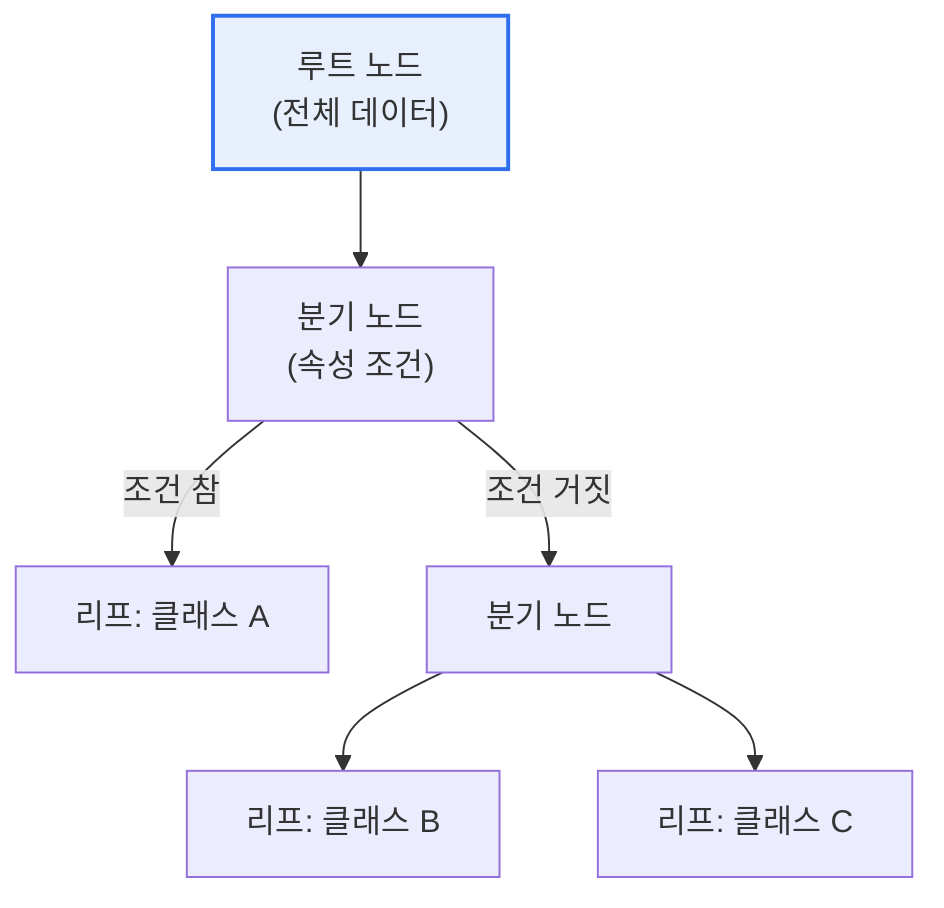

# 의사결정나무(Decision Tree)

## 1. 개요

### 가. 정의
> 데이터를 **속성(변수) 기준으로 반복 분할**하여 트리 형태의 규칙을 만들고, 이를 통해 분류·회귀를 수행하는 머신러닝 모델. 학습 결과를 사람이 이해하기 쉬운 if-then 규칙으로 표현한다.

의사결정나무의 가장 큰 강점은 '**해석 가능성(설명력)**'이다. "월소득이 300만 원 이상이고 연체 이력이 없으면 대출 승인"처럼, 모델이 왜 그런 결정을 내렸는지가 규칙의 형태로 투명하게 드러난다. 수백만 개의 가중치가 얽혀 왜 그렇게 판단했는지 알 수 없는 신경망(블랙박스)과 정반대다. 이 때문에 판단의 근거를 반드시 설명해야 하는 금융(대출 심사)·의료(진단)·법률 분야에서 특히 선호된다. 스무고개처럼 질문을 던져가며 답에 도달하는 방식이라 비전문가도 결과를 납득할 수 있다는 점이 실무에서 큰 가치를 지닌다.

### 나. 필요성
데이터 기반 의사결정이 확산되지만, 결과만큼이나 '왜 그런 결과인가'라는 설명이 중요한 영역이 많다. 의사결정나무는 예측과 설명을 동시에 제공하는 대표적 모델로, 설명가능 AI(XAI)의 기초가 된다.

## 2. 구조 및 학습 원리

의사결정나무는 루트 노드에서 전체 데이터로 시작해, 각 분기 노드에서 특정 속성 조건으로 데이터를 나누고, 최종적으로 리프 노드에서 예측(클래스나 값)을 내린다. 학습의 핵심은 '**어떤 속성으로 나눌 때 데이터가 가장 잘 구분되는가**'를 찾는 것이다. 나눈 뒤 각 그룹이 최대한 순수해지도록(한 클래스로 쏠리도록) 하는 속성을 선택한다.

| 구성 | 내용 |
|---|---|
| **루트/분기 노드** | 데이터를 나누는 속성 조건 |
| **가지(Branch)** | 조건의 결과(참/거짓) |
| **리프 노드** | 최종 예측(클래스·값) |

## 3. 분할 기준

노드를 나눌 속성을 고르는 기준이 알고리즘의 핵심이다. **정보이득** 은 나누기 전후의 불확실성(엔트로피) 감소량이 가장 큰 속성을 고르고(ID3·C4.5), **지니 계수** 는 불순도가 가장 낮아지는 속성을 고른다(CART). 회귀 트리는 분산 감소를 기준으로 한다.

| 기준 | 내용 |
|---|---|
| **정보이득** | 엔트로피 감소량 최대(ID3·C4.5) |
| **지니 계수** | 불순도 최소(CART) |
| **분산 감소** | 회귀 트리 |

## 4. 특징(장단점)

의사결정나무는 해석이 쉽고 전처리(정규화 등)가 거의 필요 없으며 수치·범주형 데이터를 함께 다룰 수 있다. 그러나 트리를 너무 깊게 키우면 학습 데이터에만 맞는 **과적합** 에 빠지기 쉽고, 데이터가 조금만 바뀌어도 트리 구조가 크게 달라지는 불안정성이 있다.

| 구분 | 내용 |
|---|---|
| **장점** | 해석 용이(규칙), 전처리 적음, 수치·범주 혼합 가능 |
| **단점** | 과적합 취약, 데이터 변화에 민감(불안정) |
| **대응** | 가지치기(Pruning), 앙상블(랜덤포레스트·GBM) |

## 5. 고려사항 및 시사점

1. **과적합 방지가 핵심**이다. 트리 깊이 제한이나 학습 후 불필요한 가지를 잘라내는 가지치기(Pruning)로 일반화 성능을 확보한다.
2. **앙상블로 정확도·안정성을 크게 향상**시킨다. 여러 트리를 결합한 랜덤포레스트, 오차를 순차 보정하는 그래디언트 부스팅(XGBoost·LightGBM)은 정형 데이터에서 딥러닝에 필적하는 성능을 낸다.
3. **설명가능 AI(XAI)의 기초**로서 가치가 크다. 개별 트리의 규칙 해석력과 앙상블의 성능을 결합하고, 특성 중요도(Feature Importance)로 판단 근거를 제시할 수 있다.

---

> **한 줄 요약**: 의사결정나무는 *속성 기준 반복 분할로 if-then 규칙 트리* 를 만드는 해석 가능한 모델로, 정보이득·지니로 분할하며 과적합에 취약해 가지치기·앙상블(랜덤포레스트·XGBoost)로 정확도와 안정성을 보완한다.
