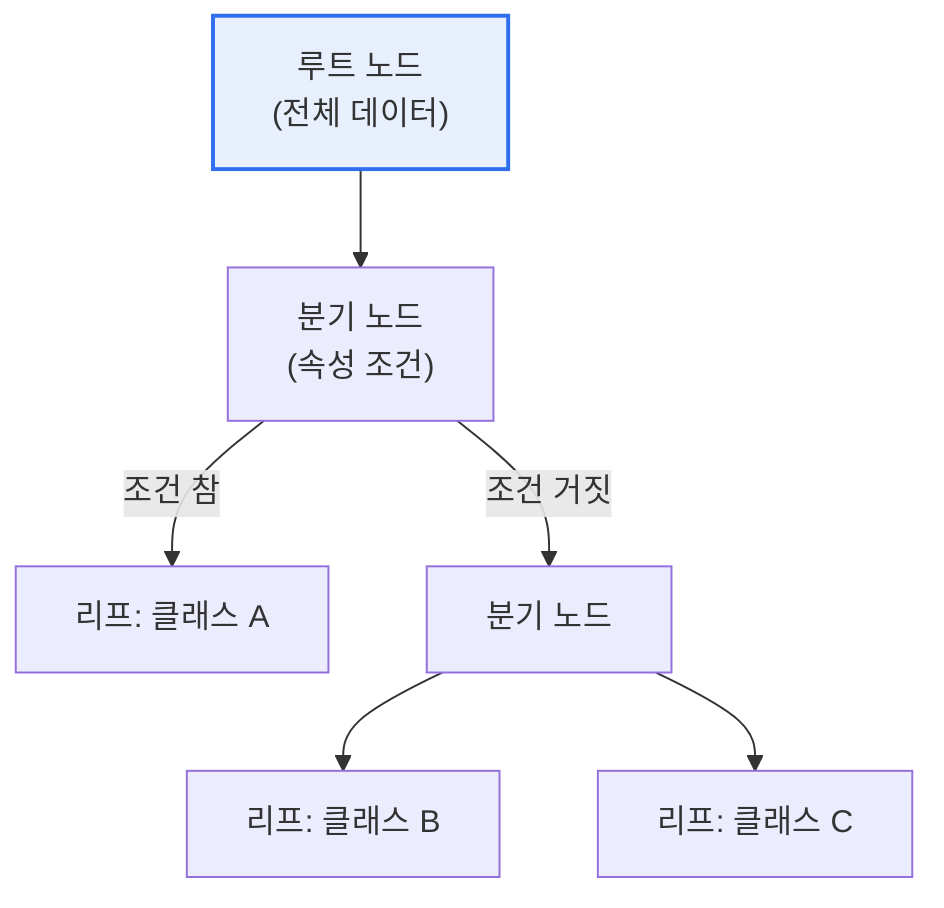

# 의사결정나무(Decision Tree)

## 1. 개요

### 가. 정의
> 데이터를 **속성 기준으로 반복 분할**하여 트리 형태의 규칙을 만들고, 이를 통해 분류·회귀를 수행하는 머신러닝 모델. 결과를 사람이 이해하기 쉬운 규칙으로 표현한다.

의사결정나무의 최대 강점은 '**해석 가능성(설명력)**'이다. "소득이 X 이상이고 나이가 Y 이하면 승인"처럼 판단 근거가 규칙(if-then)으로 드러나, 블랙박스인 신경망과 달리 왜 그런 결정을 내렸는지 설명할 수 있다. 이 때문에 금융·의료 등 근거가 중요한 분야에서 선호된다.

## 2. 구조 및 학습 원리

| 구성 | 내용 |
|---|---|
| **루트/분기 노드** | 데이터를 나누는 속성 조건 |
| **가지(Branch)** | 조건의 결과 |
| **리프 노드** | 최종 예측(클래스·값) |

## 3. 분할 기준

| 기준 | 내용 |
|---|---|
| **정보이득(Information Gain)** | 엔트로피 감소량 최대(ID3·C4.5) |
| **지니 계수(Gini)** | 불순도 최소(CART) |
| **분산 감소** | 회귀 트리 |

> 각 노드에서 불순도(엔트로피·지니)를 가장 크게 줄이는 속성으로 분할한다.

## 4. 특징

| 구분 | 내용 |
|---|---|
| **장점** | 해석 용이(규칙), 전처리 적음, 수치·범주 혼합 가능 |
| **단점** | **과적합** 취약, 데이터 변화에 민감(불안정) |
| **대응** | 가지치기(Pruning), 앙상블(랜덤포레스트·GBM) |

## 5. 시사점
- 과적합 방지를 위한 가지치기·최대깊이 제한이 핵심
- **랜덤포레스트·XGBoost** 등 앙상블로 정확도·안정성 크게 향상
- 설명가능 AI(XAI) 관점에서 규칙 기반 해석의 가치

---

> **한 줄 요약**: 의사결정나무는 *속성 기준 반복 분할로 if-then 규칙 트리* 를 만드는 해석 가능한 모델로, 정보이득·지니로 분할하며 과적합에 취약해 가지치기·앙상블(랜덤포레스트)로 보완한다.
