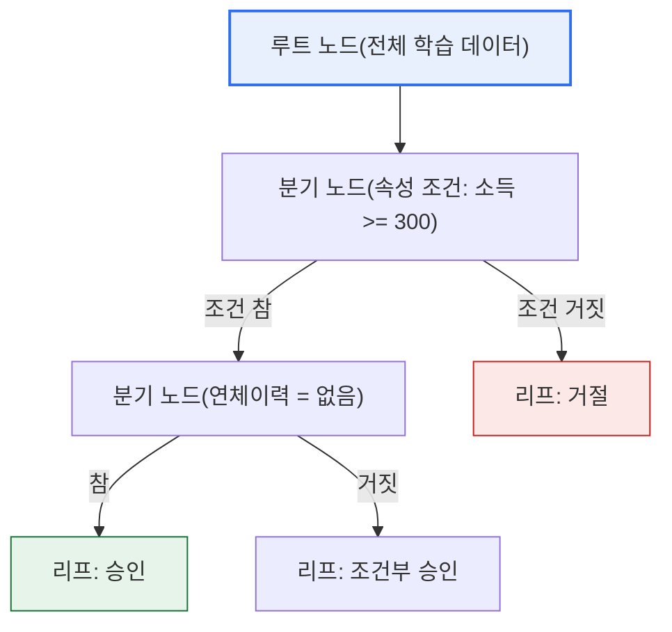
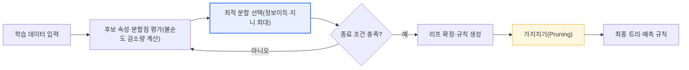

# 의사결정나무(Decision Tree)

## 1. 개요

### 가. 정의
> 데이터를 **속성(변수) 기준으로 반복 분할(recursive partitioning)** 하여 트리 형태의 규칙 집합을 만들고, 이를 통해 분류(Classification)·회귀(Regression)를 수행하는 지도학습 기반 머신러닝 모델. 학습 결과가 사람이 그대로 읽을 수 있는 if-then 규칙으로 표현된다는 점이 핵심이다.

의사결정나무의 가장 큰 강점은 '**해석 가능성(설명력, interpretability)**'에 있다. "월소득이 300만 원 이상이고 최근 12개월 연체 이력이 없으면 대출 승인"처럼, 모델이 왜 그런 결정을 내렸는지가 규칙의 형태로 투명하게 드러난다. 이는 수백만 개의 가중치가 비선형으로 얽혀 판단 근거를 사후에 추적하기 어려운 심층 신경망(블랙박스)과 정반대의 성질이다. 판단 근거를 규정·감독·소송에 대비해 반드시 설명해야 하는 금융(대출·신용평가), 의료(진단 보조), 법률·공공(행정 처분) 분야에서 의사결정나무가 지속적으로 선호되는 이유가 여기에 있다.

동작 방식이 '스무고개'와 닮았다는 점도 실무적 가치가 크다. 루트에서 시작해 질문(속성 조건)을 하나씩 던져가며 데이터를 좁혀 최종 답에 도달하므로, 통계나 머신러닝을 잘 모르는 현업 담당자도 트리를 따라 내려가며 결과를 납득할 수 있다. 규칙을 그대로 업무 매뉴얼이나 심사 기준표로 옮길 수 있어, 모델과 운영 규정 사이의 간극이 작다는 것도 다른 모델과 구별되는 특징이다.

### 나. 등장 배경 및 필요성
데이터 기반 의사결정이 확산되면서 '무엇을 예측했는가'만큼이나 '왜 그렇게 예측했는가'라는 **설명 책임(accountability)** 이 중요한 영역이 늘고 있다. EU GDPR의 '자동화된 의사결정에 대한 설명 요구권', 국내 신용정보법·개인정보보호법의 자동화된 결정에 대한 설명·이의 제기 규정 등은 예측 결과에 대한 근거 제시를 사실상 의무화한다. 의사결정나무는 예측과 설명을 동시에 제공하는 대표적 모델로서, 최근 부각되는 **설명가능 AI(XAI, eXplainable AI)** 의 이론적·실무적 기초를 이룬다.

또한 정형(테이블형) 데이터가 지배적인 금융·제조·유통 도메인에서, 트리 기반 모델(특히 후술할 앙상블)은 딥러닝보다 적은 데이터·전처리로도 높은 성능을 내는 경우가 많다. Kaggle 등 정형 데이터 경진대회의 상위 솔루션 상당수가 XGBoost·LightGBM 같은 트리 앙상블이라는 점은, 이 계열이 단순한 교육용 모델을 넘어 산업 표준 도구임을 보여준다.

## 2. 전체 구조 및 학습 원리

의사결정나무는 루트 노드에서 전체 데이터로 시작해, 각 분기(내부) 노드에서 특정 속성 조건으로 데이터를 두 갈래 이상으로 나누고, 더 이상 나누지 않는 리프(단말) 노드에서 최종 예측(클래스 또는 수치)을 산출한다. 학습의 본질은 '**어떤 속성을, 어떤 임계값으로 나눌 때 데이터가 가장 잘 구분되는가**'를 탐욕적(greedy)으로 반복 탐색하는 것이다. 나눈 뒤 각 자식 그룹이 최대한 순수해지도록(하나의 클래스로 쏠리도록) 만드는 분할을 매 단계 선택한다.

```mermaid
flowchart TB
  R["루트 노드(전체 학습 데이터)"] --> A["분기 노드(속성 조건: 소득 >= 300)"]
  A -->|조건 참| B["분기 노드(연체이력 = 없음)"]
  A -->|조건 거짓| L1["리프: 거절"]
  B -->|참| L2["리프: 승인"]
  B -->|거짓| L3["리프: 조건부 승인"]
  style R fill:#e8f0fe,stroke:#2f6fed,stroke-width:2px
  style L2 fill:#e6f4ea,stroke:#137333
  style L1 fill:#fce8e6,stroke:#c5221f
```

위 구조도에서 각 요소의 의미는 다음과 같다. **루트 노드**는 분할되기 전의 전체 표본을 담으며, 여기서 첫 번째 질문(가장 정보량이 큰 속성)을 던진다. **분기 노드**는 하나의 속성 조건으로 데이터를 나누는 지점이고, **가지(branch)** 는 그 조건의 결과(참/거짓, 또는 범주값)를 나타낸다. **리프 노드**는 더 이상 나누지 않고 예측을 확정하는 지점으로, 분류에서는 해당 노드에 남은 표본의 다수결 클래스를, 회귀에서는 표본 평균값을 예측으로 삼는다.

| 구성 요소 | 역할 | 예측에서의 의미 |
|---|---|---|
| **루트/분기 노드** | 데이터를 나누는 속성 조건 | 규칙의 조건부(if) |
| **가지(Branch)** | 조건의 결과(참/거짓·범주) | 규칙의 분기 |
| **리프 노드** | 분할 종료·최종 예측 | 규칙의 결과부(then) |

학습 절차를 순서로 보면, ① 현재 노드의 모든 후보 속성·분할점에 대해 분할 후의 불순도 감소량을 계산하고, ② 감소량이 가장 큰 분할을 채택해 자식 노드를 만들며, ③ 각 자식 노드에 대해 종료 조건(순수 노드, 최소 표본 수 미달, 최대 깊이 도달 등)을 만족할 때까지 ①~②를 재귀적으로 반복한다. 이처럼 각 단계에서 국소 최적을 선택하는 탐욕적 전략이므로 항상 전역 최적 트리를 보장하지는 않지만, 계산 효율과 성능의 균형이 좋아 실무에서 널리 쓰인다.

```mermaid
flowchart LR
  S["학습 데이터 입력"] --> C["후보 속성·분할점 평가(불순도 감소량 계산)"]
  C --> P["최적 분할 선택(정보이득·지니 최대)"]
  P --> D{"종료 조건 충족?"}
  D -->|아니오| C
  D -->|예| F["리프 확정·규칙 생성"]
  F --> G["가지치기(Pruning)"]
  G --> M["최종 트리·예측 규칙"]
  style P fill:#e8f0fe,stroke:#2f6fed,stroke-width:2px
  style G fill:#fef7e0,stroke:#f9ab00
```

위 프로세스 세부도가 보여주듯, 트리 성장(growing) 단계와 가지치기(pruning) 단계는 명확히 구분된다. 성장 단계에서는 불순도를 최대한 줄이는 방향으로 트리를 키우고, 이후 가지치기 단계에서 과도하게 세분화된 가지를 잘라 일반화 성능을 회복시킨다. 이 두 단계의 분리는 뒤에서 다룰 과적합 문제와 직결되는 핵심 설계이다.

## 3. 분할 기준(Split Criterion)

노드를 어떤 속성으로 나눌지 고르는 기준이 알고리즘의 정체성을 결정한다. 분할 기준의 공통 목표는 '**나눈 뒤 각 자식 노드의 불순도(impurity)를 최소화**'하는 것이며, 불순도를 어떻게 정의하느냐에 따라 대표 알고리즘이 갈린다.

**엔트로피 기반 정보이득(Information Gain)** 은 정보이론의 엔트로피(불확실성)를 불순도 척도로 삼아, 분할 전 엔트로피에서 분할 후 가중 엔트로피를 뺀 감소량이 가장 큰 속성을 고른다. 초기 알고리즘인 ID3가 이 방식을 쓴다. 다만 정보이득은 값의 종류가 많은 속성(예: 고객 ID)을 과대평가하는 편향이 있어, 후속 알고리즘 C4.5는 이를 분할 정보량으로 정규화한 **이득비(Gain Ratio)** 로 보정한다. C4.5는 연속형·범주형 속성을 함께 다루고 결측치 처리와 가지치기를 내장해 실무 완성도를 높였다.

**지니 계수(Gini Index)** 는 무작위로 뽑은 두 표본이 서로 다른 클래스일 확률로 불순도를 정의하며, 이를 가장 낮추는 분할을 선택한다. CART(Classification And Regression Trees)가 이 방식을 채택하며, 로그 연산이 없어 엔트로피보다 계산이 가볍고 항상 이진 분할(binary split)을 만든다는 특징이 있다. **회귀 트리**에서는 불순도 대신 분산(또는 평균제곱오차, MSE) 감소량을 기준으로 삼아, 자식 노드 내 목표값의 흩어짐이 가장 작아지는 분할을 고른다.

| 알고리즘 | 분할 기준 | 트리 형태 | 특징 |
|---|---|---|---|
| **ID3** | 정보이득(엔트로피) | 다진 분할 | 범주형 전용, 편향 존재 |
| **C4.5** | 이득비(Gain Ratio) | 다진 분할 | 연속형·결측·가지치기 지원 |
| **CART** | 지니 계수 / 분산감소 | 이진 분할 | 분류·회귀 통합, 계산 경량 |

세 기준의 실무적 함의는 단순한 성능 우열이 아니라 '어떤 데이터·요구에 맞는가'에 있다. 예컨대 범주가 매우 다양한 속성이 많은 데이터라면 ID3의 정보이득은 왜곡되기 쉬우므로 이득비나 지니를 쓰는 것이 안전하고, 예측값이 연속형이라면 분류용 지니가 아니라 분산 감소 기준(회귀 트리)을 써야 한다. scikit-learn의 `DecisionTreeClassifier`가 기본값으로 지니를 채택한 것도 계산 효율과 무난한 성능 때문이다.

## 4. 특징(장단점)과 과적합

의사결정나무는 해석이 쉽고, 정규화·스케일링 같은 전처리가 거의 필요 없으며(분할은 순서 정보만 사용), 수치형과 범주형 데이터를 함께 다룰 수 있다는 장점이 있다. 반면 트리를 제약 없이 깊게 키우면 학습 데이터의 잡음까지 규칙으로 외워버리는 **과적합(overfitting)** 에 매우 취약하다. 극단적으로는 각 리프에 표본이 하나씩만 남을 때까지 성장해 학습 정확도는 100%가 되지만, 새로운 데이터에 대한 성능은 급격히 떨어진다.

또 하나의 약점은 **불안정성(instability)** 이다. 학습 데이터가 조금만 바뀌어도 상위 분할이 달라지면 그 아래 트리 전체 구조가 크게 변할 수 있다. 이는 규칙의 신뢰성과 재현성을 해치는 요인으로, 단일 트리를 그대로 운영에 쓰기 어렵게 만든다.

| 구분 | 내용 |
|---|---|
| **장점** | 규칙 기반 해석 용이, 전처리 최소, 수치·범주 혼합, 특성 중요도 산출 |
| **단점** | 과적합 취약, 데이터 변화에 민감(불안정), 축 정렬 분할로 대각 경계 표현 한계 |
| **대응** | 사전·사후 가지치기, 깊이·최소표본 제약, 앙상블(랜덤포레스트·부스팅) |

과적합에 대한 대응은 크게 두 방향이다. 첫째는 **가지치기**로, 성장을 미리 멈추는 사전 가지치기(pre-pruning: 최대 깊이·리프 최소 표본 수 제한)와, 일단 크게 키운 뒤 검증 성능 기준으로 가지를 잘라내는 사후 가지치기(post-pruning: CART의 비용복잡도 가지치기 등)가 있다. 둘째는 여러 트리를 결합하는 **앙상블**로, 다음 심화 절에서 다룬다.

## 5. 적용 사례 및 수치 예시

의사결정나무·앙상블의 실무 가치는 구체 사례로 볼 때 분명해진다.

**사례 1 — 금융 신용평가(대출 심사).** 한 은행이 대출 승인 여부를 예측하는 모델을 만든다고 하자. 단일 트리는 "소득 300만 원 이상 → 연체 이력 없음 → 부채비율 40% 미만 → 승인"과 같은 규칙을 그대로 산출하므로, 감독기관에 제출할 심사 기준과 거절 사유(adverse action) 통지에 바로 쓸 수 있다. 실무에서는 정확도를 높이기 위해 XGBoost 같은 부스팅을 쓰되, 개별 거절 건에 대해서는 SHAP 값으로 "부채비율이 승인 확률을 12%p 낮췄다"처럼 변수별 기여도를 계량해 설명 책임을 충족한다.

**사례 2 — 통신·구독 서비스 이탈 예측(Churn).** 최근 3개월 사용량 감소율, 고객센터 문의 횟수, 요금제 변경 이력 등을 입력해 이탈 확률을 예측한다. 랜덤포레스트로 수백 개 트리를 결합하면 단일 트리의 불안정성이 완화되어, 데이터가 매달 갱신되어도 예측이 크게 출렁이지 않는다. 특성 중요도 분석으로 '고객센터 문의 급증'이 이탈의 핵심 신호임을 발견하면, 해당 고객군에 선제적 리텐션 오퍼를 보내는 마케팅 액션으로 연결된다.

**사례 3 — 제조 공정 품질 예측.** 온도·압력·속도 등 수십 개 센서 값으로 불량 여부를 예측할 때, LightGBM은 히스토그램 기반 분할과 리프 중심 성장으로 대규모 센서 데이터를 빠르게 학습한다. 딥러닝 대비 학습 시간이 짧고 하이퍼파라미터 튜닝이 수월해, 공정 조건이 자주 바뀌는 현장에서 재학습·배포 주기를 단축할 수 있다. 이때도 특성 중요도로 어떤 공정 변수가 불량과 강하게 연관되는지 제시해 현장 개선 활동으로 환류한다.

이들 사례가 공통으로 보여주는 것은, 단일 트리의 '규칙 해석력'과 앙상블의 '예측 정확도'가 서로 다른 국면에서 각각 필요하며, 실무에서는 목적에 따라 둘을 선택하거나 SHAP으로 결합한다는 점이다.

## 6. 심화 — 앙상블과 설명가능 AI(XAI) 동향

단일 의사결정나무의 한계를 극복하기 위해 등장한 **앙상블(Ensemble)** 은 오늘날 정형 데이터 분야의 사실상 표준이다. 크게 두 계열로 나뉜다. **배깅(Bagging) 계열**의 대표인 **랜덤포레스트(Random Forest)** 는 데이터를 부트스트랩 표본으로 여러 번 복원추출하고 분할 시 후보 속성도 무작위로 제한해 서로 다른 트리 수백 개를 만든 뒤, 그 예측을 다수결·평균으로 결합한다. 트리마다 오류의 방향이 다르므로 결합하면 분산이 줄어 단일 트리의 불안정성이 크게 완화된다.

**부스팅(Boosting) 계열**은 트리를 순차적으로 만들되, 앞선 트리가 틀린 부분(잔차)을 다음 트리가 집중 보정하도록 학습한다. 그래디언트 부스팅(GBM)을 실무 규모로 최적화한 **XGBoost**(2016, 정규화·2차 근사·병렬화), 리프 중심(leaf-wise) 성장과 히스토그램 기반 분할로 속도·메모리를 개선한 **LightGBM**(Microsoft), 범주형 처리를 강화한 **CatBoost**(Yandex)가 대표적이다. 이들은 정형 데이터에서 딥러닝에 필적하거나 능가하는 성능을 자주 보여, 신용평가·이탈예측·수요예측 등에 광범위하게 쓰인다.

앙상블은 성능을 크게 끌어올리는 대신, 수백 개 트리의 집합이 되어 단일 트리의 해석력을 상당 부분 잃는다. 이 딜레마를 메우기 위해 **특성 중요도(Feature Importance)**, **부분 의존도 그래프(PDP)**, 그리고 게임이론의 섀플리 값에 기반해 개별 예측에 대한 각 변수의 기여도를 정량화하는 **SHAP** 같은 사후 설명(post-hoc explanation) 기법이 함께 쓰인다. 특히 트리 앙상블은 SHAP 값을 효율적으로 계산하는 TreeSHAP 알고리즘이 있어, "성능은 부스팅으로, 설명은 SHAP으로" 확보하는 조합이 산업에서 널리 정착되었다. 결국 의사결정나무는 그 자체로는 화이트박스 모델이면서, 앙상블·XAI와 결합해 성능과 설명을 함께 잡는 축으로 발전하고 있다.

## 7. 고려사항 및 시사점 (기술사 관점)

1. **과적합 통제가 실전 성패를 좌우한다.** 단일 트리는 깊이·리프 최소 표본 수 제한과 비용복잡도 가지치기를, 앙상블은 트리 개수·학습률·서브샘플링 비율을 교차검증으로 조정해 일반화 성능을 확보해야 한다. 학습 정확도만 보고 배포하면 반드시 성능 저하를 겪는다.

2. **성능과 설명력의 트레이드오프를 목적에 맞게 설계한다.** 규제·감독이 엄격해 규칙 자체를 제시해야 하는 영역(대출 심사 기준, 의료 프로토콜)에서는 얕은 단일 트리가, 예측 정확도가 최우선인 영역에서는 부스팅 앙상블+SHAP 조합이 적합하다. 하나의 정답이 아니라 요구사항 기반 선택이 관건이다.

3. **데이터 품질·편향 관리가 규칙의 공정성을 결정한다.** 학습 데이터에 성별·지역 등 민감 속성의 편향이 있으면 트리가 이를 규칙으로 고착화해 차별적 결정을 재생산할 수 있다. 민감 속성 제거·대리변수(proxy) 점검·공정성 지표 모니터링을 함께 운영해야 하며, 이는 AI 윤리·거버넌스와 직결된다.

4. **정형 데이터에서의 우선 검토 대상으로 자리매김한다.** 이미지·음성·자연어는 딥러닝이 압도적이지만, 테이블형 데이터에서는 트리 앙상블이 여전히 강력한 기준선(baseline)이다. 신규 예측 과제에서 딥러닝보다 먼저 XGBoost·LightGBM을 시도해 비용 대비 효과를 검증하는 것이 실무적으로 합리적이다.

5. **MLOps 관점의 운영·재현성 확보가 필요하다.** 트리 구조는 학습 데이터·난수 시드에 민감하므로, 시드 고정·버전 관리·특성 중요도 드리프트 모니터링을 통해 모델이 시간에 따라 어떻게 변하는지 추적하고 재학습 시점을 판단해야 한다.

## 참고자료
- scikit-learn, "Decision Trees" — https://scikit-learn.org/stable/modules/tree.html
- XGBoost Documentation, "Introduction to Boosted Trees" — https://xgboost.readthedocs.io/en/stable/tutorials/model.html
- LightGBM Documentation — https://lightgbm.readthedocs.io/en/stable/
- SHAP Documentation — https://shap.readthedocs.io/en/latest/

---

> **한 줄 요약**: 의사결정나무는 *속성 기준 반복 분할로 if-then 규칙 트리* 를 만드는 해석 가능한(화이트박스) 모델로, 정보이득·이득비·지니로 분할하며 과적합·불안정에 취약해 가지치기와 앙상블(랜덤포레스트·XGBoost·LightGBM)로 정확도·안정성을 보완하고, SHAP 등 XAI 기법과 결합해 성능과 설명력을 함께 확보한다.
