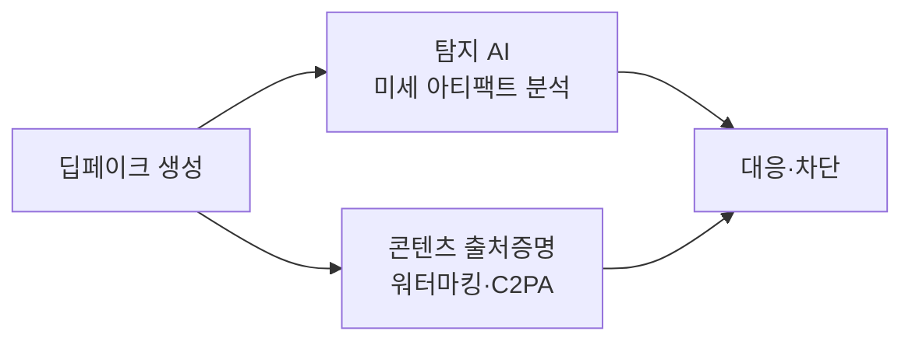

# 딥페이크(Deepfake)

## 1. 개요

### 가. 정의
> **딥러닝(Deep Learning)+가짜(Fake)** 의 합성어로, GAN 등 생성 AI로 실제와 구분하기 어려운 **가짜 이미지·영상·음성**을 합성하는 기술.

### 나. 원리
- **GAN**: 생성자(Generator)와 판별자(Discriminator)의 적대적 학습으로 위조물 정교화
- **오토인코더**로 얼굴 특징 추출·교체(Face Swap)

## 2. 활용과 악용

| 순기능 | 역기능(악용) |
|---|---|
| 영화·더빙·복원, 교육 콘텐츠 | 허위정보·가짜뉴스, 금융사기(음성), 명예훼손·성착취물, 선거 조작 |

## 3. 탐지·대응 기술

| 구분 | 대응 방안 |
|---|---|
| **기술** | 딥페이크 탐지 AI, 디지털 워터마크, 콘텐츠 출처인증(C2PA) |
| **제도** | 표시 의무·처벌 법제화, 플랫폼 삭제 의무 |
| **인식** | 미디어 리터러시 교육 |

## 4. 시사점
- 생성-탐지의 **창과 방패** 경쟁 → 출처증명·법제·국제공조 병행 필요

---

> **한 줄 요약**: 딥페이크는 *GAN 등 생성 AI로 실제 같은 가짜 미디어를 합성* 하는 기술로, 탐지 AI·워터마킹·출처인증·법제로 악용에 대응한다.
