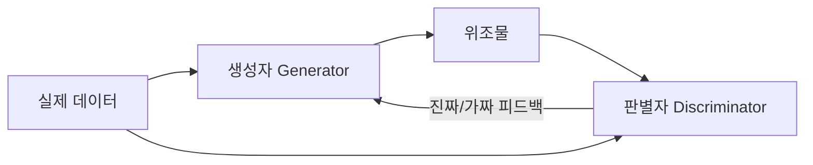
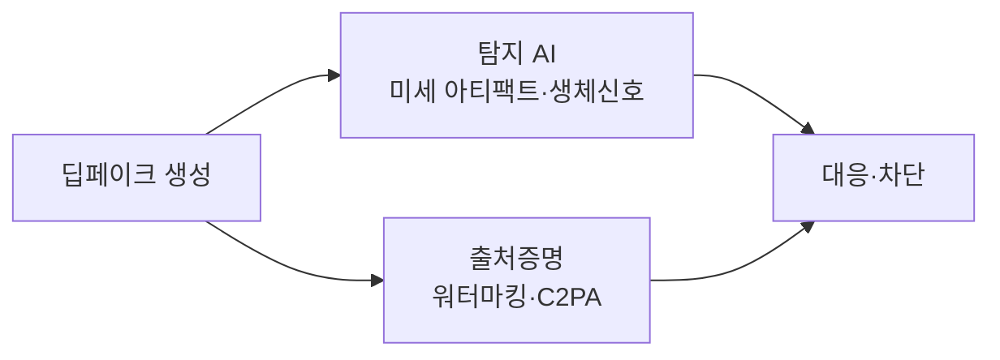

# 딥페이크(Deepfake)

## 1. 개요

### 가. 정의
> **딥러닝(Deep Learning)+가짜(Fake)** 의 합성어로, GAN·확산모델 등 생성 AI를 이용해 특정 인물의 얼굴·음성·행동을 실제와 구분하기 어려울 만큼 정교하게 합성·조작하는 기술.

딥페이크의 본질은 방대한 원본 데이터(얼굴 이미지·음성)로부터 그 사람의 **특징 분포를 학습한 뒤, 학습한 분포를 따르는 새로운 위조물을 생성**하는 데 있다. 과거의 합성(포토샵)이 사람이 픽셀을 수작업으로 조작하는 것이었다면, 딥페이크는 AI가 '진짜처럼 보이는 것이 무엇인지'를 스스로 학습해 자동 생성한다는 점에서 질적으로 다르며, 그만큼 정교하고 대량 생산이 가능하다.

### 나. 등장 배경 및 필요성
딥페이크가 사회 문제로 부상한 배경에는 두 축이 있다. 하나는 GAN(2014)·확산모델의 등장으로 생성 품질이 인간의 육안 구분을 넘어선 **기술적 성숙**이고, 다른 하나는 오픈소스 도구와 앱으로 누구나 손쉽게 만들 수 있게 된 **접근성의 폭증**이다. 여기에 SNS라는 초고속 확산 채널이 결합되면서, 정교한 위조물이 만들어지자마자 검증 없이 전파되어 **여론 조작·금융 사기·성착취물** 같은 심각한 피해로 이어진다. 이 때문에 딥페이크는 기술 자체보다 '생성-확산-악용'의 사슬을 어떻게 끊을 것인가가 핵심 과제가 된다.

## 2. 생성 원리

가장 대표적인 원리는 **GAN(적대적 생성 신경망)** 으로, 위조물을 만드는 **생성자(Generator)** 와 진짜·가짜를 가려내는 **판별자(Discriminator)** 를 경쟁시킨다. 생성자는 판별자를 속이려 점점 정교한 위조물을 만들고, 판별자는 이를 더 잘 잡아내려 발전하는데, 이 **적대적 학습(minimax 게임)** 의 균형점에서 판별자조차 구분 못 하는 위조물이 나온다. 얼굴 교체(Face Swap)에는 두 인물의 얼굴을 각각 압축·복원하며 특징을 뒤바꾸는 **오토인코더**가 쓰이고, 최근에는 노이즈를 점진적으로 제거하며 이미지를 만드는 **확산모델(Diffusion)** 이 더 높은 품질과 텍스트 기반 제어를 제공해 주류가 되고 있다. 예컨대 몇 초 분량의 음성 샘플만으로 특정인의 목소리를 복제해 "급히 돈을 보내라"는 통화를 위조하는 음성 딥페이크가 실제 금융사기에 악용된 사례가 보고되었다.

| 기술 | 원리 |
|---|---|
| **GAN** | 생성자-판별자의 적대적 학습으로 위조물 정교화 |
| **오토인코더** | 얼굴 특징 추출·복원으로 얼굴 교체(Face Swap) |
| **확산모델(Diffusion)** | 노이즈 제거 과정으로 고품질·텍스트 제어 생성 |

## 3. 활용과 악용

동일한 기술이 쓰임에 따라 순기능과 역기능으로 갈린다는 점이 딥페이크의 딜레마다. 순기능 측면에서는 영화의 디에이징·다국어 더빙, 고인의 복원, 가상 인간(버추얼 휴먼) 마케팅, 교육·의료 시뮬레이션처럼 창작·산업 가치를 만든다. 반면 역기능은 **본인의 동의 없이 정체성을 도용**한다는 데서 비롯되며, 허위정보로 선거·여론을 조작하거나, 음성 복제로 금융사기를 저지르거나, 얼굴 합성으로 명예훼손·불법 성착취물을 만드는 등 피해가 직접적이고 회복이 어렵다. 특히 유명인뿐 아니라 일반인도 SNS의 사진 몇 장이면 피해 대상이 될 수 있다는 점에서 위험이 보편화되었다.

| 순기능 | 역기능(악용) |
|---|---|
| 영화·더빙·복원, 가상 인간 | 허위정보·가짜뉴스, 선거·여론 조작 |
| 교육·의료 시뮬레이션 | 음성 복제 피싱(금융사기) |
| 광고·콘텐츠 제작 | 명예훼손·불법 성착취물 |

## 4. 탐지·대응 기술

대응은 크게 **사후 탐지**와 **사전 출처증명** 두 방향으로 나뉜다. 탐지 기술은 위조 과정에서 남는 미세한 흔적, 예컨대 눈 깜빡임의 부자연스러움, 피부의 미세한 혈류 신호(rPPG) 부재, 주파수 영역의 아티팩트를 AI로 잡아낸다. 그러나 탐지는 본질적으로 **뒤쫓는 방어**라, 생성 기술이 진화하면 다시 뚫린다는 한계가 있다. 그래서 근본 대안으로 부상한 것이 **출처증명**이다. 콘텐츠 생성·촬영 단계에서 진본임을 암호학적으로 서명해 두는 **C2PA·디지털 워터마킹**은 "가짜를 찾아내는" 대신 "진짜를 증명하는" 방식으로 발상을 뒤집는다. 여기에 표시 의무·처벌을 담은 법제와 미디어 리터러시 교육이 더해져야 실효적 대응이 완성된다.

| 구분 | 대응 방안 |
|---|---|
| **기술(탐지)** | 딥페이크 탐지 AI(생체신호·주파수 아티팩트) |
| **기술(출처증명)** | 디지털 워터마크, 콘텐츠 출처인증(**C2PA**) |
| **제도** | 생성물 표시 의무·처벌 법제화, 플랫폼 삭제 의무 |
| **인식** | 미디어 리터러시 교육으로 무비판적 확산 차단 |

## 5. 고려사항 및 시사점(기술사 관점)
- **창과 방패의 비대칭 경쟁**: 생성이 탐지보다 빠르게 진화하므로 탐지에만 의존하면 필패한다. 원본에 서명을 심는 **출처증명(Provenance)** 중심으로 전략을 전환해야 한다.
- **생성형 AI 규제와의 연계**: EU AI Act 등은 딥페이크 생성물의 표시 의무를 규정하는 추세이며, 국내 공직선거법·성폭력처벌법 개정과 함께 표시·처벌·삭제의 제도 정비가 필요하다.
- **플랫폼 책임과 국제 공조**: 확산의 통로인 플랫폼에 신속 탐지·삭제 의무를 부과하되, 국경을 넘는 특성상 국제 공조 없이는 실효성이 낮다.
- **AI 신뢰성 관점**: 딥페이크 대응은 곧 '무엇이 진짜인지 신뢰할 수 있는 사회'를 지키는 문제이며, 기술·제도·교육을 아우르는 사회적 대응 체계 구축이 요구된다.

---

> **한 줄 요약**: 딥페이크는 *GAN·확산모델 등 생성 AI로 인물의 얼굴·음성을 정교하게 위조* 하는 기술로, 생성-탐지의 비대칭 경쟁 속에서 탐지 AI만으로는 한계가 있어 **출처증명(C2PA·워터마킹)·법제·미디어 리터러시**를 병행하는 다층 대응이 필요하다.
