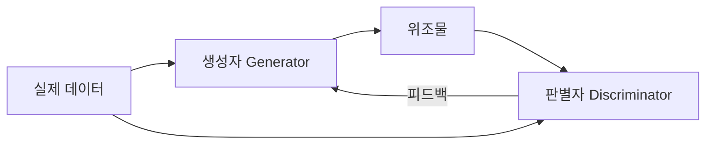
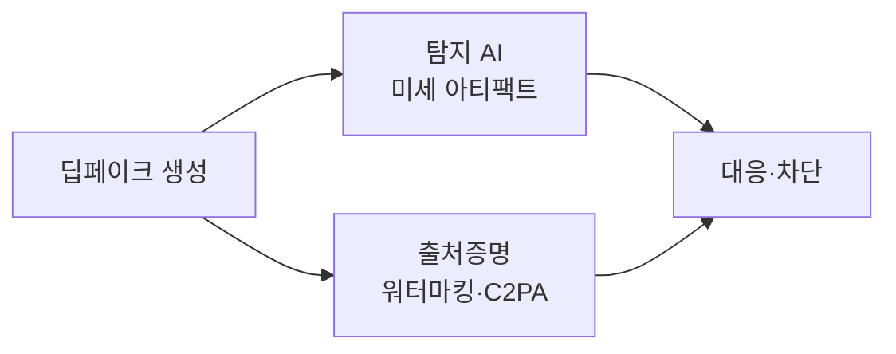

# 딥페이크(Deepfake)

## 1. 개요

### 가. 정의
> **딥러닝(Deep Learning)+가짜(Fake)** 의 합성어로, GAN·확산모델 등 생성 AI로 실제와 구분하기 어려운 **가짜 이미지·영상·음성**을 합성하는 기술.

### 나. 등장 배경
- 생성 AI(GAN·Diffusion)의 발전과 **오픈소스·저비용화**
- SNS 확산으로 위조 콘텐츠의 **파급력·악용 위험** 증대

## 2. 생성 원리

| 기술 | 원리 |
|---|---|
| **GAN** | 생성자-판별자의 적대적 학습으로 위조물 정교화 |
| **오토인코더** | 얼굴 특징 추출·교체(Face Swap) |
| **확산모델(Diffusion)** | 노이즈 제거 과정으로 고품질 생성 |

## 3. 활용과 악용

| 순기능 | 역기능(악용) |
|---|---|
| 영화·더빙·복원, 가상인간 | 허위정보·가짜뉴스, 선거 조작 |
| 교육·의료 시뮬레이션 | 음성 피싱(금융사기) |
| 광고·콘텐츠 제작 | 명예훼손·성착취물 |

## 4. 탐지·대응 기술

| 구분 | 대응 방안 |
|---|---|
| **기술** | 딥페이크 탐지 AI(생체신호·아티팩트), 디지털 워터마크, 콘텐츠 출처인증(**C2PA**) |
| **제도** | 표시 의무·처벌 법제화, 플랫폼 삭제 의무 |
| **인식** | 미디어 리터러시 교육 |

## 5. 고려사항 및 시사점
- 생성-탐지의 **창과 방패** 경쟁 → 탐지만으로 한계, **출처증명**(원본 서명) 병행
- 생성형 AI 규제(표시 의무)·국제공조 필요
- AI 신뢰성·정보보호 관점의 사회적 대응 체계 구축

---

> **한 줄 요약**: 딥페이크는 *GAN·확산모델 등 생성 AI로 실제 같은 가짜 미디어를 합성* 하는 기술로, 탐지 AI·워터마킹·출처인증(C2PA)·법제·미디어 리터러시로 악용에 대응한다.
