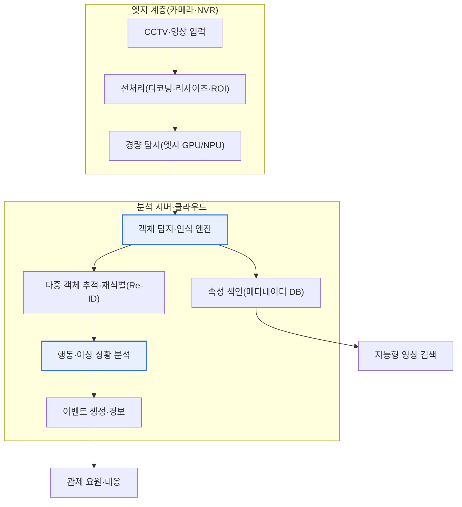
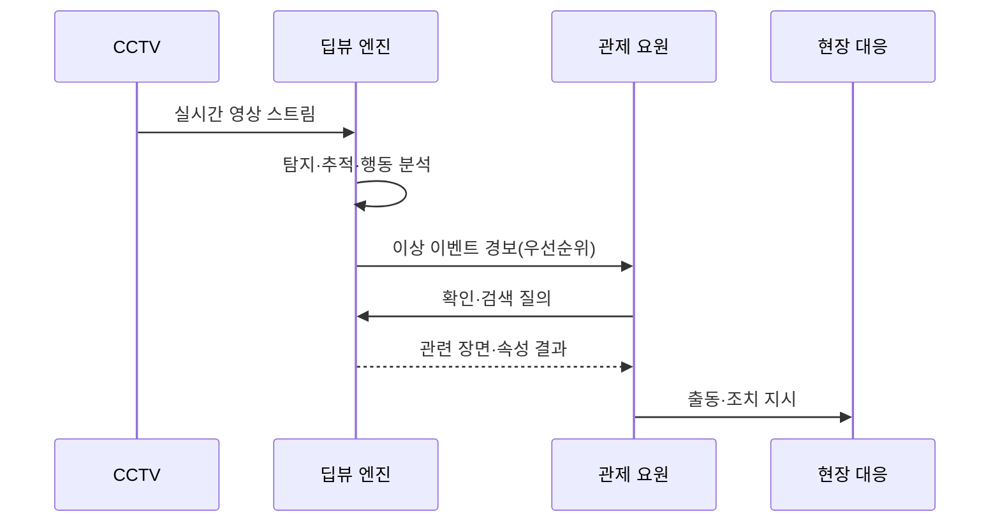

# 딥뷰(DeepView)

## 1. 개요

### 가. 정의
> 딥뷰(DeepView)는 딥러닝 기반의 **영상·객체 인식 지능형 분석 기술**로, CCTV 등 대규모 영상 스트림에서 사람·차량·행동·이상 상황을 자동으로 탐지·인식·검색·예측하는 지능형 영상관제(VCA, Video Content Analysis) 계열 기술이다.

딥뷰의 핵심 가치는 '**사람이 다 볼 수 없는 방대한 영상을 AI가 대신 감시·분석**'하는 데 있다. 오늘날 지방자치단체의 통합관제센터 한 곳이 수천~수만 대의 CCTV를 담당하지만, 관제 요원 한 명이 동시에 유의미하게 주시할 수 있는 화면은 통상 수십 개에 불과하다는 것이 현장의 오랜 문제였다. 사람의 주의력은 20~40분이 지나면 급격히 떨어지고, 여러 화면을 동시에 감시할 때 이상 상황을 놓칠 확률은 크게 높아진다. 결국 대부분의 영상은 '사건이 터진 뒤 사후에 되돌려 보는' 수동적 녹화 장치로만 기능해 왔다.

딥뷰는 이 구조를 근본적으로 바꾼다. 딥러닝 신경망이 영상 프레임 속의 객체와 그 객체가 만들어내는 시간적 행동 패턴을 '이해'하여, 침입·배회·유기·군집·쓰러짐 같은 상황을 실시간으로 탐지하고 즉시 경보를 발생시킨다. 또한 "빨간 상의를 입은 성인 남성"이나 "검은색 SUV"처럼 속성(attribute) 기반으로 방대한 영상을 초 단위로 검색해, 과거 수 시간이 걸리던 용의자·용의차량 추적을 획기적으로 단축한다. 즉 딥뷰는 CCTV를 '녹화하는 장치'에서 '**상황을 스스로 인지하고 판단하는 관제 주체**'로 전환하는 기술이며, 방범·교통·산업안전·재난 분야에서 사건을 사전에 예방하고 대응 속도를 끌어올리는 것을 목표로 한다.

### 나. 등장 배경 및 필요성
딥뷰가 부상한 배경은 세 흐름의 교차로 설명된다. 첫째, **CCTV의 폭발적 증가**다. 국내 공공기관 CCTV는 2010년대 이후 매년 두 자릿수 비율로 늘어 현재 수백만 대 규모에 이르는 것으로 추정되며, 여기에 민간 CCTV와 차량 블랙박스까지 더하면 사람이 감당할 수 있는 임계를 이미 한참 넘어섰다. '설치는 늘어나는데 감시 인력은 그대로'라는 구조적 불균형이 자동 분석의 필요성을 절박하게 만들었다.

둘째, **딥러닝 영상 인식 성능의 도약**이다. 2012년 ImageNet 대회에서 CNN 계열 모델이 기존 기법을 큰 격차로 앞선 이후, 영상 분류·객체 탐지·재식별 성능이 급격히 향상되어 특정 조건에서는 사람 수준의 인식 정확도에 근접했다. 규칙 기반(배경 차분, 광학 흐름)으로는 조명 변화·그림자·군중 상황에서 오탐이 잦아 실용성이 낮았지만, 데이터로 학습하는 딥러닝은 이런 잡음에 훨씬 강인해 실전 적용의 문턱을 넘었다.

셋째, **국가 R&D 차원의 전략적 투자**다. 딥뷰는 한국에서 과학기술정보통신부·ETRI(한국전자통신연구원) 등이 주도한 지능형 영상분석 국가 R&D 과제의 대표 브랜드로 알려져 있으며, 대규모 실환경 CCTV를 대상으로 한 실시간 다중 객체 분석 기술을 국산화한다는 목표 아래 추진되었다. 이처럼 딥뷰는 단순한 상용 제품명이 아니라 '지능형 영상 분석'이라는 기술 범주와 국가 연구개발 성과를 함께 지칭하는 용어로 쓰인다.

## 2. 전체 구조 및 처리 파이프라인

딥뷰의 전체 구조는 '영상 수집 → 전처리 → 딥러닝 분석 엔진 → 이벤트/경보 → 검색·저장'으로 이어지는 파이프라인으로 이해할 수 있다. 아래 구조도는 카메라 단(엣지)과 서버·클라우드가 역할을 나누어 실시간성과 정확도를 함께 확보하는 전형적 배치를 보여준다.

이 파이프라인에서 앞단(엣지)은 대역폭과 지연을 줄이기 위해 카메라나 NVR에서 1차 경량 탐지를 수행하고, 의미 있는 프레임·객체만 서버로 보낸다. 서버·클라우드는 무거운 인식·추적·행동 분석과 대용량 색인을 담당한다. 이렇게 계층을 나누는 이유는 뒤의 '고려사항'에서 다룰 실시간성과 비용의 트레이드오프와 직접 연결된다.

### 가. 객체 탐지(Object Detection)
객체 탐지는 딥뷰의 출발점으로, 한 장의 프레임에서 사람·차량·자전거·가방 등 관심 객체의 '위치(바운딩 박스)'와 '종류(클래스)'를 동시에 찾아내는 단계다. 초기의 2단계(two-stage) 방식(R-CNN 계열)은 후보 영역을 먼저 뽑고 분류하는 구조로 정확했지만 느렸다. 이후 등장한 1단계(one-stage) 방식인 YOLO(You Only Look Once)·SSD 계열은 이미지를 한 번에 격자로 나눠 위치와 클래스를 동시에 회귀 예측함으로써, 정확도를 크게 희생하지 않으면서 초당 수십 프레임의 실시간 처리를 가능하게 했다.

딥뷰가 다루는 실환경 영상은 조명 변화, 역광, 우천·안개, 원거리 소형 객체, 군중 속 심한 가림(occlusion) 같은 악조건이 상시적이다. 이 때문에 단순히 공개 데이터셋에서 잘 되는 모델을 가져오는 것으로는 부족하고, 실제 CCTV 화각·해상도·설치 각도에 맞춘 도메인 특화 재학습과 데이터 증강이 성능을 좌우한다. 예컨대 사거리 상단에 비스듬히 설치된 카메라에서는 사람이 위에서 내려다보는 형태로 찍혀, 정면 보행자 위주로 학습된 모델의 정확도가 급락하는 식이다.

### 나. 객체 추적 및 재식별(Tracking & Re-ID)
탐지가 '한 프레임의 사진'을 보는 일이라면, 추적은 '시간축을 따라 같은 객체를 이어 붙이는' 일이다. 다중 객체 추적(MOT)은 연속 프레임에서 검출된 박스들을 동일 객체끼리 연결해 이동 궤적을 만든다. 이 궤적이 있어야 '어디에서 나타나 어디로 이동했는가', '얼마나 오래 머물렀는가' 같은 행동 분석이 가능해진다.

재식별(Re-Identification, Re-ID)은 한 걸음 더 나아가, 서로 겹치지 않는 여러 카메라에 걸쳐 같은 사람·차량을 다시 알아보는 기술이다. 예를 들어 A 카메라에서 사라진 대상이 200m 떨어진 B 카메라에 다시 잡혔을 때, 옷 색·체형·걸음걸이 같은 외형 특징 벡터의 유사도로 동일인 여부를 추정한다. Re-ID는 얼굴이 보이지 않아도 동작하므로 광역 추적에 유용하지만, 조명·화질 차이와 유사 복장에 취약해 오매칭 관리가 중요하다.

### 다. 행동·이상 상황 분석(Behavior/Anomaly Analysis)
딥뷰의 부가가치가 가장 큰 단계다. 개별 프레임의 객체 정보만으로는 알 수 없는, '시간에 걸친 패턴'을 해석해 의미 있는 사건으로 판단한다. 대표적으로 정해진 선을 넘는 침입(virtual line crossing), 특정 구역에 오래 머무는 배회(loitering), 가방·물체를 두고 떠나는 유기(abandoned object), 사람이 바닥에 쓰러지는 낙상, 갑작스러운 군집·분산 같은 이상 밀집이 있다.

이 분석은 두 계열의 접근을 병행한다. 하나는 관리자가 규칙(예: "이 폴리곤 안에 30초 이상 머물면 배회로 판단")을 정의하는 규칙 기반이고, 다른 하나는 정상 패턴을 학습해 그로부터 벗어나는 것을 이상으로 잡는 학습 기반(anomaly detection)이다. 규칙 기반은 이해와 통제가 쉬운 대신 예상치 못한 이상은 놓치고, 학습 기반은 미지의 이상까지 포착하지만 '왜 이상인지' 설명이 어렵다는 상호 보완 관계에 있다. 최근에는 골격 추정(pose estimation)으로 사람의 관절 움직임을 추출해 폭행·낙상 같은 행동을 더 정밀하게 판정하는 방식이 확산되고 있다.

### 라. 지능형 영상 검색(Intelligent Search)
탐지·인식 결과를 '메타데이터'로 색인해 두면, 원본 영상을 다시 재생하지 않고도 조건 검색이 가능해진다. "어제 14~16시 사이, 정문 카메라, 빨간 상의 성인, 가방 소지" 같은 질의에 대해 시스템은 색인된 속성을 조회해 해당 장면만 초 단위로 추려낸다. 과거 수사 실무에서 특정 인물·차량을 찾느라 관제 요원이 수십 시간의 영상을 눈으로 되감던 작업이, 딥뷰 도입 후 수 분 수준으로 단축된 사례가 여러 지자체 통합관제센터에서 보고되고 있다. 이는 딥뷰의 실효성을 가장 직접적으로 보여주는 지점이다.

아래 표는 위 기술 요소를 정리한 것이다. 표는 어디까지나 보조 수단이며, 각 요소의 '왜'는 위 문단에서 서술한 바와 같다.

| 기술 요소 | 핵심 기능 | 대표 기법 | 실무 난점 |
|---|---|---|---|
| 객체 탐지 | 위치+종류 검출 | YOLO·SSD·R-CNN | 소형·가림·악천후 |
| 추적·재식별 | 궤적 연결·광역 동일성 | MOT·Re-ID | 유사 외형 오매칭 |
| 행동·이상 분석 | 시간적 패턴 판정 | 규칙+이상탐지·pose | 오탐/미탐 균형 |
| 지능형 검색 | 속성 기반 조회 | 메타데이터 색인 | 색인 정확도 |
| 엣지·가속 처리 | 실시간 대용량 처리 | GPU·NPU·엣지 | 비용·발열·대역폭 |

## 3. 활용 분야 및 사례

딥뷰의 처리 흐름을 사건 대응 관점에서 보면 아래와 같은 프로세스로 요약된다. 이 세부 흐름도는 '탐지가 곧 대응으로 이어지는' 폐루프를 강조한다.

방범·치안 분야에서는 학교 주변·우범지역의 침입·배회·폭행 징후를 탐지해 선제 순찰·출동을 유도하고, 사건 발생 시 용의자·용의차량을 광역 카메라망에서 신속히 추적한다. 예를 들어 실종 아동 수색에서 인상착의 속성으로 다수 카메라를 동시에 검색해 이동 경로를 복원하는 활용이 대표적이다.

교통 분야에서는 차량 흐름·정체·역주행·불법 주정차·교통사고를 자동 감지해 신호 제어·긴급 대응과 연계한다. 특정 교차로의 방향별 통행량을 실시간 집계해 신호 주기를 최적화하면 정체가 완화되는 식으로, 스마트시티 교통 인프라의 핵심 센서 역할을 한다.

산업안전 분야에서는 건설·제조 현장에서 안전모·안전벨트 미착용, 위험구역(중장비 반경) 진입, 낙상·끼임 징후를 감지해 중대재해를 예방한다. 최근 중대재해 처벌 관련 규제가 강화되면서 이러한 지능형 안전 관제 수요가 빠르게 늘고 있다. 이 밖에 리테일에서는 방문객 동선·체류 시간·연령/성별 추정(비식별 통계)을 분석해 매장 배치와 마케팅에 활용한다.

| 분야 | 대표 활용 | 기대 효과 |
|---|---|---|
| 방범·치안 | 침입·배회·폭행 탐지, 용의자 추적 | 예방·검거 시간 단축 |
| 교통 | 정체·사고·불법주정차·역주행 감지 | 신호 최적화·사고 대응 |
| 산업안전 | 보호구 미착용·위험구역 진입 감지 | 중대재해 예방 |
| 재난·환경 | 화재·연기·수위·군집 위험 감지 | 조기 경보 |
| 리테일 | 동선·체류·인구통계 분석 | 매장 운영 최적화 |

## 4. 심화: 최신 동향과 기존 규칙기반 대비 차별성

기술 동향 측면에서 딥뷰 계열은 몇 가지 방향으로 진화하고 있다. 첫째, **엣지 AI로의 이동**이다. 초기에는 모든 영상을 중앙 서버로 모아 분석했으나, 대역폭·저장 비용과 지연 문제로 인해 카메라 자체에 NPU를 탑재해 현장에서 1차 추론을 수행하는 '엣지 지능형 카메라'가 확산되고 있다. 이는 개인정보가 담긴 원본 영상을 최소한으로만 전송한다는 프라이버시 측면의 이점도 갖는다.

둘째, **비전-언어 모델(VLM)과 생성형 AI의 결합**이다. 최근에는 영상 장면을 자연어로 요약·질의하는 연구가 활발하다. "지난 한 시간 동안 특이한 상황이 있었는가"라는 자연어 질문에 시스템이 요약 답변을 생성하는 형태로, 관제의 사용성이 크게 개선될 가능성이 있다. 다만 환각(hallucination)과 오판 위험이 있어 치안·안전처럼 오류 비용이 큰 영역에서는 검증을 거친 제한적 적용이 신중히 논의되는 단계로 이해하는 것이 타당하다.

셋째, **표준·거버넌스의 정비**다. 지능형 영상분석의 성능을 객관적으로 평가하기 위한 시험·인증 체계와, 얼굴·행동 인식에 대한 사회적 수용성·법제도 논의가 병행되고 있다. 유럽연합의 AI Act가 공공장소 실시간 생체인식을 고위험·제한 범주로 다루는 등 규제 환경이 형성되고 있어, 딥뷰 계열 기술도 '기술적 정확도'와 '법·윤리적 정당성'을 함께 확보해야 하는 국면에 들어섰다.

기존 규칙기반 VCA와의 근본적 차이는 '무엇을 사람이 정의하는가'에 있다. 규칙기반은 배경 차분·모션 임계 같은 특징을 사람이 설계했기에 조명·그림자·나뭇잎 흔들림에 오탐이 잦고 환경이 바뀌면 재조정이 필요했다. 반면 딥러닝 기반은 방대한 데이터에서 특징 자체를 학습하므로 환경 변화에 강인하고, 새로운 상황도 데이터 추가 학습으로 대응할 수 있다. 이 차이가 실환경 오탐률을 낮춰 '경보 피로(alarm fatigue)'로 무력화되던 지능형 관제를 실제로 쓸 수 있게 만든 결정적 요인이다.

## 5. 고려사항 및 시사점(기술사 관점)

1. **프라이버시·인권과 기술의 균형**: 딥뷰는 얼굴·행동·동선을 대규모로 인식·추적하므로 개인정보 침해와 감시사회 우려가 본질적으로 따른다. 목적 제한·최소 수집 원칙 아래, 상시 마스킹(비식별)과 필요 시에만 권한자가 복원하는 선별적 비식별화, 접근 통제·감사 로그, 보관기간 제한을 설계 단계부터(privacy by design) 반영해야 한다. 기술 도입의 정당성은 '얼마나 잘 잡는가'가 아니라 '어떻게 남용을 막는가'로 판가름난다.

2. **실시간성과 비용의 트레이드오프(엣지 vs 클라우드)**: 초당 수십 프레임의 다중 카메라 영상을 저지연으로 처리하려면 상당한 연산 자원이 필요하다. 모든 것을 클라우드로 보내면 대역폭·저장 비용과 지연이 문제되고, 엣지로 밀면 카메라 단가·발열·유지보수가 늘어난다. 카메라 밀도, 요구 지연, 분석 난도에 따라 엣지-클라우드 역할을 배분하는 하이브리드 아키텍처 설계가 핵심 의사결정이 된다.

3. **정확도·편향·설명가능성 관리**: 오탐(false alarm)이 많으면 관제 요원이 경보를 무시하게 되어 시스템이 무력화되고, 미탐(miss)은 사건 방치로 직결된다. 두 오류의 균형점은 적용 도메인의 위험 비용에 맞춰 조정되어야 한다. 또한 특정 인종·성별·연령에 대한 인식 편향은 사회적 차별로 이어질 수 있으므로, 다양한 실환경 데이터로 학습·검증하고, 왜 그런 판단을 했는지 설명 가능한(XAI) 근거를 남겨 책임성을 확보해야 한다.

4. **표준·상호운용성과 국산화 전략**: 카메라·NVR·분석 엔진·관제 플랫폼이 제각각인 환경에서 벤더 종속을 피하려면 ONVIF 등 인터페이스 표준과 개방형 메타데이터 연계가 중요하다. 아울러 딥뷰가 국가 R&D 성과라는 점에서, 핵심 인식 엔진의 국산화와 성능 검증 체계 구축은 기술 주권·공급망 안정성 측면에서도 전략적 의미를 갖는다.

5. **운영 거버넌스와 지속 개선(MLOps 관점)**: 딥뷰는 배포로 끝나는 시스템이 아니라, 계절·조명·설치 환경 변화에 따라 성능이 저하(model drift)되는 살아있는 모델이다. 오탐 사례를 지속적으로 수집·재학습하고, 성능 지표를 모니터링하며 모델 버전을 관리하는 운영 체계가 없으면 초기 성능이 빠르게 퇴화한다. '한 번 구축'이 아니라 '지속 운영'의 관점이 필수다.

## 참고자료
- ETRI, 지능형 영상분석(딥뷰) 관련 연구 소개, https://www.etri.re.kr
- 한국인터넷진흥원(KISA), 지능형 CCTV 인증제 안내, https://www.kisa.or.kr
- 개인정보보호위원회, 영상정보처리기기 운영·관리 방침, https://www.pipc.go.kr
- Redmon et al., "You Only Look Once (YOLO): Unified, Real-Time Object Detection," https://arxiv.org/abs/1506.02640

---

> **한 줄 요약**: 딥뷰는 *딥러닝 기반 지능형 영상 분석 기술* 로 객체 탐지·추적/재식별·행동 분석·지능형 검색을 통해 CCTV를 능동적 관제 주체로 전환하며, 방범·교통·산업안전에 활용되되 프라이버시 보호·실시간성/비용 균형·정확도와 편향 관리·지속 운영이 핵심 과제다.
