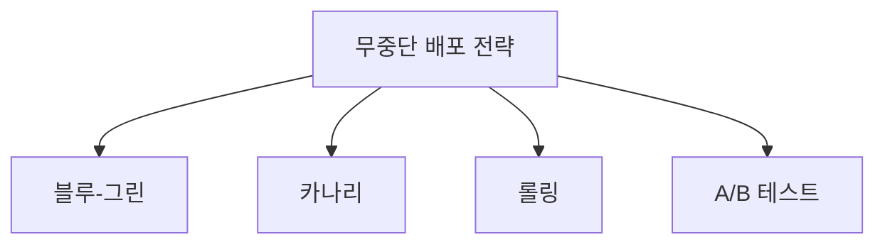

# 실행 중인 애플리케이션의 배포 전략 및 테스트 전략

## 1. 개요

### 가. 정의
> 운영 중(무중단)인 애플리케이션에 새 버전을 **서비스 영향 없이 안전하게 반영**하고, 배포 전후로 결함·성능을 검증하는 전략. CI/CD·DevOps의 핵심.

### 나. 필요성
- 24/365 서비스에서 **무중단(Zero-downtime)·빠른 롤백** 요구
- 릴리스 리스크 최소화, 사용자 영향 통제

## 2. 배포 전략

| 전략 | 방식 | 특징 |
|---|---|---|
| **블루-그린** | 신(그린)·구(블루) 환경 동시 운영 후 전환 | 즉시 롤백, 인프라 2배 |
| **카나리** | 일부 트래픽에만 점진 배포 | 위험 조기 감지, 점진 확대 |
| **롤링** | 인스턴스 순차 교체 | 자원 효율, 롤백 느림 |
| **A/B 테스트** | 버전별 트래픽 분기 비교 | 기능·성과 실험 |

## 3. 테스트 전략 (배포와 연계)

| 단계 | 테스트 |
|---|---|
| **배포 전** | 단위·통합·회귀 테스트(CI), 성능·보안 테스트 |
| **배포 중** | 카나리 분석(오류율·지연 모니터링), 스모크 테스트 |
| **배포 후(운영)** | **섀도/다크 런치**(실트래픽 복제), 기능 토글(Feature Flag), 카오스 테스트, A/B 성과 측정 |

## 4. 안전 배포 지원 요소

| 요소 | 역할 |
|---|---|
| **관측성(Observability)** | 로그·메트릭·트레이싱으로 이상 조기 탐지 |
| **자동 롤백** | 임계치 위반 시 자동 이전 버전 복귀 |
| **기능 토글** | 배포(Deploy)와 릴리스(Release) 분리 |
| **점진 배포** | 폭발 반경(Blast Radius) 최소화 |

## 5. 고려사항 및 시사점
- **관측성 + 자동 롤백**이 안전 배포의 전제
- GitOps·프로그레시브 딜리버리(Argo Rollouts 등)로 자동화
- DB 스키마 변경은 하위호환(Expand-Contract)으로 무중단 지원

---

> **한 줄 요약**: 무중단 배포는 *블루-그린·카나리·롤링·A/B* 로 위험을 통제하고, *배포 전(회귀)–중(카나리 분석)–후(섀도·기능토글)* 테스트와 관측성·자동 롤백으로 안전한 릴리스를 실현한다.
