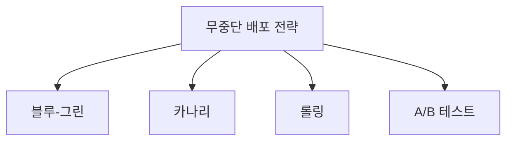

# 실행 중인 애플리케이션의 배포 전략 및 테스트 전략

## 1. 개요

### 가. 정의
> 운영 중(무중단)인 애플리케이션에 새 버전을 **서비스 영향 없이 안전하게 반영**하고, 배포 전후로 결함·성능을 검증해 릴리스 위험을 통제하는 전략. CI/CD·DevOps 실천의 핵심 축이다.

### 나. 등장 배경 및 필요성
과거처럼 서비스를 중단하고 새 버전을 통째로 올리는 방식은, 24/365로 돌아가는 오늘날 서비스에서는 곧 매출·신뢰 손실을 뜻한다. 게다가 배포 주기가 짧아지고(하루에도 여러 번) 마이크로서비스로 배포 단위가 잘게 나뉘면서, "한 번에 전부 바꾸고 문제 생기면 되돌린다"는 접근은 위험이 너무 크다. 그래서 **변경을 소수 사용자·소수 인스턴스에 먼저 노출해 위험을 조기에 감지하고, 문제가 있으면 즉시 되돌리는(Zero-downtime·빠른 롤백)** 점진적 배포 전략이 필요해졌다. 핵심 사상은 **폭발 반경(Blast Radius)의 최소화**, 즉 문제가 터져도 영향받는 범위를 최대한 좁게 유지하는 것이다.

## 2. 배포 전략

무중단 배포 전략들은 "새 버전을 어떻게 노출하느냐"에서 갈리며, 각각 롤백 속도·자원 비용·위험 감지력의 균형이 다르다.

| 전략 | 방식 | 장점 | 트레이드오프 |
|---|---|---|---|
| **블루-그린** | 신(그린)·구(블루) 환경을 동시 운영 후 트래픽을 한 번에 전환 | 즉시 롤백(전환만 되돌림) | 인프라 2배 비용 |
| **카나리** | 일부 트래픽에만 신버전 노출 후 점진 확대 | 위험 조기 감지, 영향 최소 | 배포 시간 김, 버전 공존 관리 |
| **롤링** | 인스턴스를 순차적으로 교체 | 추가 자원 최소 | 롤백 느림, 잠시 버전 혼재 |
| **A/B 테스트** | 버전별로 트래픽을 분기해 성과 비교 | 기능·비즈니스 성과 실험 | 통계적 설계 필요 |

**블루-그린**은 동일한 운영 환경을 하나 더 띄워 새 버전을 완성해 두고 로드밸런서로 트래픽을 한 번에 넘기는 방식이라, 문제가 생기면 다시 구 환경으로 전환만 하면 되어 롤백이 즉각적이다. 대신 두 환경을 동시에 유지해 자원이 두 배로 든다. **카나리**는 광부가 유독가스를 감지하려 카나리아를 앞세운 데서 유래한 이름처럼, 신버전을 전체의 5%→25%→100%로 조금씩 노출하며 지표를 보는 방식이라 위험을 가장 일찍 잡을 수 있다. **롤링**은 인스턴스를 하나씩 새 버전으로 갈아 끼워 추가 인프라가 거의 필요 없지만, 문제가 뒤늦게 발견되면 이미 교체된 인스턴스를 되돌리는 데 시간이 걸린다. **A/B 테스트**는 배포 기법이라기보다 두 버전의 전환율 등 비즈니스 성과를 비교하는 실험 목적이 강하다.

## 3. 테스트 전략 (배포 단계와 연계)

배포 전략이 아무리 정교해도, 각 단계에서 무엇을 검증하느냐가 뒷받침되지 않으면 위험을 걸러내지 못한다. 그래서 테스트를 **배포 전–중–후**로 나누어 배치한다.

| 단계 | 테스트 | 목적 |
|---|---|---|
| **배포 전** | 단위·통합·회귀 테스트(CI), 성능·보안 테스트 | 릴리스 후보의 결함을 사전 차단 |
| **배포 중** | 카나리 분석(오류율·지연 모니터링), 스모크 테스트 | 실사용자 노출 중 이상 조기 감지 |
| **배포 후(운영)** | 섀도/다크 런치, 기능 토글, 카오스 테스트, A/B 성과 측정 | 운영 환경에서의 검증·성과 확인 |

배포 전 단계의 핵심은 **회귀 테스트**로, 변경이 기존 기능을 망가뜨리지 않았는지를 확인해 릴리스 후보의 신뢰도를 확보한다. 배포 중에는 **카나리 분석**이 신버전과 구버전의 오류율·응답지연을 실시간 비교해, 통계적으로 유의한 악화가 보이면 확대를 멈추고 롤백을 유도한다. 배포 후 기법 중 **섀도(다크 런치)** 는 실제 트래픽을 복제해 신버전에도 흘려보내되 그 응답은 사용자에게 반환하지 않아, 사용자 영향 없이 운영 부하에서의 동작을 검증한다. **기능 토글(Feature Flag)** 은 코드를 배포해 두되 기능 노출은 스위치로 별도 제어해 **배포(Deploy)와 릴리스(Release)를 분리**하므로, 문제 시 재배포 없이 스위치만 꺼서 즉시 대응할 수 있다.

## 4. 안전 배포를 뒷받침하는 요소

점진적 배포와 테스트가 효과를 내려면, 이상을 "볼 수 있고" 문제 시 "자동으로 되돌릴 수 있는" 기반이 전제되어야 한다.

| 요소 | 역할 |
|---|---|
| **관측성(Observability)** | 로그·메트릭·트레이싱으로 이상을 조기 탐지 |
| **자동 롤백** | 오류율·지연이 임계치를 넘으면 자동으로 이전 버전 복귀 |
| **기능 토글** | 배포와 릴리스를 분리해 노출을 독립 제어 |
| **점진 배포** | 폭발 반경 최소화로 사고 영향 축소 |

특히 **관측성과 자동 롤백은 안전 배포의 전제 조건**이다. 카나리로 5%에 노출했더라도 그 5%에서 오류율이 급증하는 것을 메트릭으로 감지하지 못하면 위험 조기 감지라는 목적 자체가 무너지고, 감지해도 사람이 수동으로 대응하면 그사이 피해가 커진다. 그래서 임계치 위반 시 자동으로 트래픽을 되돌리는 구조가 필요하다.

## 5. 고려사항 및 시사점
- **관측성 + 자동 롤백이 전제**: 지표 기반 판단과 자동 복구가 없으면 어떤 점진 배포 전략도 안전을 보장하지 못한다.
- **프로그레시브 딜리버리 자동화**: GitOps와 Argo Rollouts·Flagger 같은 도구로 카나리 확대·분석·롤백을 선언적으로 자동화하는 방향으로 발전하고 있다.
- **DB 스키마 변경의 무중단 처리**: 애플리케이션은 무중단이어도 DB 스키마 변경은 구·신 버전이 잠시 공존하므로, 컬럼을 먼저 추가하고 나중에 제거하는 **Expand-Contract(확장-수축)** 패턴으로 하위호환을 유지해야 배포 중 장애를 막을 수 있다.

---

> **한 줄 요약**: 무중단 배포는 *블루-그린·카나리·롤링·A/B* 로 폭발 반경을 최소화해 위험을 통제하고, *배포 전(회귀)–중(카나리 분석)–후(섀도·기능 토글)* 테스트를 단계별로 연계하며, 관측성·자동 롤백을 전제로 프로그레시브 딜리버리와 Expand-Contract DB 변경으로 안전한 릴리스를 실현한다.
