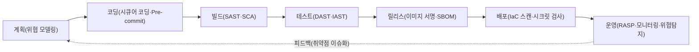
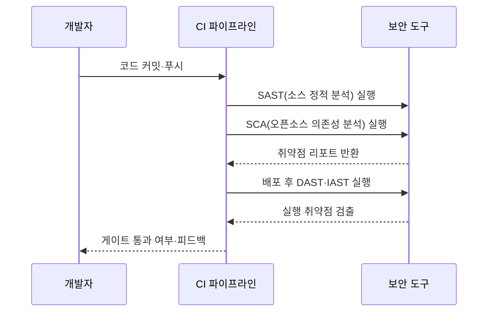

# DevSecOps(데브섹옵스)

## 1. 개요

> **DevSecOps**란 개발(Development)·보안(Security)·운영(Operations)을 하나의 연속된 흐름으로 통합하여, 보안을 소프트웨어 생애주기(SDLC)의 **전 과정에 자동화된 형태로 내재화**하는 개발·운영 문화이자 방법론이다. 핵심 사상은 "보안을 개발의 마지막 관문이 아니라 처음부터 모두의 책임(Security as Code, Shift-Left)으로 만든다"는 것이다.

DevSecOps가 등장한 배경은 기존 DevOps와 전통적 보안 체계 사이의 구조적 충돌에 있다. DevOps가 CI/CD 파이프라인을 통해 배포 주기를 일 단위·시간 단위로 단축하는 동안, 보안은 여전히 개발이 끝난 뒤 릴리스 직전에 별도 보안팀이 수동으로 점검하는 **후행(後行) 게이트**로 남아 있었다. 그 결과 보안 점검은 빠른 배포의 병목이 되거나, 일정에 밀려 형식적으로 생략되었다. 발견된 취약점을 운영 배포 직전에 고치는 비용은 설계 단계에서 고치는 비용의 수십 배에 달한다는 점(결함 조기 발견의 경제성)에서, 보안을 뒤로 미루는 구조는 비용과 위험을 동시에 키웠다.

또한 오픈소스·컨테이너·클라우드가 보편화되면서 공격면이 폭발적으로 늘었다. 하나의 애플리케이션이 수백 개의 오픈소스 의존성과 컨테이너 이미지, IaC 스크립트로 구성되는 오늘날, 사람이 릴리스마다 이를 수동 점검하는 것은 물리적으로 불가능하다. DevSecOps는 이러한 문제를 **보안 활동을 코드화·자동화하여 파이프라인 안으로 밀어 넣는(Shift-Left)** 방식으로 해결한다. 즉 보안을 별도 조직의 통제가 아니라 개발자가 매 커밋마다 즉시 피드백받는 품질 속성으로 전환하는 것이 DevSecOps의 본질이다.

## 2. DevSecOps 파이프라인 아키텍처

DevSecOps의 골격은 기존 CI/CD 파이프라인의 각 단계마다 대응되는 보안 활동을 배치하고, 그 결과를 게이트(Gate)로 삼아 통과 여부를 자동 판정하는 구조다. 아래 개념도는 계획부터 운영까지 각 단계에 보안이 삽입되는 전체 흐름을 보여준다.

이 파이프라인의 각 단계는 서로 다른 관점에서 보안을 검증한다. **계획 단계**에서는 설계도 수준에서 위협을 식별하는 위협 모델링(STRIDE 등)을 수행하여, 코드가 작성되기 전에 구조적 결함을 걸러낸다. **코딩 단계**에서는 IDE 플러그인과 Pre-commit 훅으로 개발자가 타이핑하는 순간 취약 패턴과 하드코딩된 시크릿을 경고한다. 이처럼 왼쪽(초기)으로 갈수록 발견 비용이 낮아지므로, DevSecOps는 가능한 활동을 최대한 앞단으로 옮기는 것을 지향한다.

**빌드·테스트 단계**는 자동 분석 도구가 집중되는 구간이다. 소스코드 정적 분석(SAST)과 오픈소스 구성분석(SCA)이 빌드 시점에 실행되고, 배포 가능한 산출물이 만들어지면 동작 중인 애플리케이션을 외부에서 공격해보는 동적 분석(DAST)과, 실행 내부 계측을 결합한 대화형 분석(IAST)이 뒤따른다. **릴리스·배포 단계**에서는 컨테이너 이미지에 대한 취약점 스캔과 디지털 서명, 구성요소 명세서(SBOM) 생성, IaC(Terraform 등) 설정 오류 검사가 이루어진다. 마지막 **운영 단계**에서는 런타임 자기보호(RASP)와 지속적 모니터링으로 배포 이후의 위협을 탐지하고, 발견된 문제를 다시 계획 단계로 환류(피드백)하여 순환 구조를 완성한다.

## 3. 핵심 보안 분석 기법(SAST·DAST·IAST·SCA)

DevSecOps 자동화의 중심에는 네 가지 애플리케이션 보안 테스트(AST) 기법이 있으며, 이들은 서로 다른 시점과 관점에서 상호보완적으로 작동한다. 아래 순차도는 하나의 커밋이 파이프라인을 통과하며 각 분석을 거치는 과정을 나타낸다.

**SAST(Static Application Security Testing)**는 소스코드나 바이트코드를 실행하지 않고 분석하여 SQL 인젝션·버퍼 오버플로 같은 코딩 취약점을 찾는다. 개발 초기부터 적용 가능하고 취약 지점을 코드 라인 단위로 지목하는 장점이 있으나, 실제 악용 가능성과 무관하게 경고를 쏟아내는 **오탐(False Positive)**이 많다는 한계가 있다. 반대로 **DAST(Dynamic AST)**는 실행 중인 애플리케이션을 실제 공격자처럼 외부에서 스캔하므로 오탐이 적고 실제 익스플로잇 가능성을 확인할 수 있지만, 취약점의 소스코드 위치를 알려주지 못하고 테스트 커버리지가 화면·엔드포인트에 의존한다.

**IAST(Interactive AST)**는 이 둘의 절충으로, 애플리케이션 내부에 계측 센서(에이전트)를 심어 테스트가 실행되는 동안 데이터 흐름을 관찰한다. 그 결과 "외부 입력이 실제로 취약한 코드 경로에 도달했는가"를 판단할 수 있어 오탐이 낮고 위치도 특정할 수 있다. **SCA(Software Composition Analysis)**는 관점이 다른데, 직접 작성한 코드가 아니라 프로젝트가 끌어다 쓰는 **오픈소스·서드파티 라이브러리의 알려진 취약점(CVE)과 라이선스 위반**을 탐지한다. 오늘날 코드의 70~90%가 오픈소스로 구성된다는 점에서 SCA는 사실상 필수이며, SBOM과 결합해 공급망 보안의 기반이 된다.

| 기법 | 분석 대상 | 실행 여부 | 강점 | 한계 |
|------|-----------|-----------|------|------|
| SAST | 소스·바이트코드 | 정적(비실행) | 조기 적용, 위치 특정 | 오탐 많음 |
| DAST | 실행 중 앱(외부) | 동적(실행) | 낮은 오탐, 실제 악용 확인 | 위치 미상, 후행 |
| IAST | 앱 내부 계측 | 동적(실행) | 정확도·위치 모두 우수 | 성능 부하, 언어 제약 |
| SCA | 오픈소스 의존성 | 정적(메타분석) | 공급망·라이선스 관리 | 자체 코드 취약점 미탐 |

## 4. DevOps와의 비교 및 문화적 전환

DevSecOps는 종종 "DevOps에 보안 도구를 추가한 것"으로 오해되지만, 본질은 도구가 아니라 **책임 모델의 전환**에 있다. 전통적 모델에서 보안은 별도 팀의 전유물이었고 개발자는 기능 구현에만 집중했다. DevSecOps는 "보안은 모두의 책임(Everyone is responsible for security)"이라는 원칙 아래, 개발자에게 보안 역량을 부여하고 보안팀은 통제자에서 **가드레일 제공자·조력자(Enabler)**로 역할을 바꾼다. 즉 보안팀은 매 릴리스를 직접 막아서는 대신, 개발자가 스스로 안전하게 만들 수 있는 자동화된 도구·정책(Policy as Code)·표준 템플릿을 제공한다.

| 구분 | DevOps | DevSecOps |
|------|--------|-----------|
| 보안 위치 | 릴리스 직전 후행 점검 | 전 단계 내재화(Shift-Left) |
| 보안 책임 | 별도 보안팀 | 개발·운영·보안 공동 |
| 수행 방식 | 수동 게이트 | 자동화(Security as Code) |
| 목표 | 빠른 배포 | 빠르면서 안전한 배포 |

이러한 전환의 현실적 어려움은 도구 도입보다 **문화·프로세스 정착**에 있다. 자동화 도구가 오탐을 남발하면 개발자는 경고를 무시하게 되고(경고 피로, Alert Fatigue), 게이트가 지나치게 엄격하면 배포 속도라는 DevOps 본연의 가치가 훼손된다. 따라서 성공적 DevSecOps는 위험도 기반으로 게이트 강도를 차등화하고(치명적 취약점만 배포 차단), 보안 챔피언(Security Champion) 제도로 개발팀 내부에 보안 전파자를 두는 등 점진적 접근을 취한다.

## 5. 적용 사례

한 대형 금융 핀테크 기업의 사례를 보면, 과거에는 분기마다 외부 모의해킹으로 취약점을 일괄 점검하여 평균 발견-조치까지 40일 이상 걸렸다. DevSecOps 전환 후 GitHub 커밋마다 SAST·SCA를 자동 실행하고 컨테이너 이미지 스캔을 배포 게이트로 설정하자, 취약점의 약 80%가 개발 단계에서 자동 검출·차단되었고 평균 조치 시간이 40일에서 2일 이하로 단축되었다. 특히 오픈소스 라이브러리의 Critical CVE(예: Log4Shell류 원격코드실행)가 공개된 직후, SBOM 조회만으로 영향받는 서비스를 수 시간 내 식별해 긴급 패치를 배포한 점은 공급망 보안에서 DevSecOps의 실질적 효용을 보여준다.

## 6. 고려사항 및 시사점

기술사 관점에서 DevSecOps 도입은 다음 전략적 요소를 종합적으로 고려해야 한다.

- **점진적 도입 전략**: 모든 보안 도구를 한 번에 파이프라인에 넣으면 오탐과 지연으로 개발 조직의 저항을 부른다. 우선 SCA·시크릿 스캔처럼 오탐이 적고 효과가 확실한 도구부터 적용하고, 게이트도 "경고 후 차단"의 2단계로 완화 도입하는 것이 현실적이다.
- **속도-보안 트레이드오프 관리**: DevSecOps의 성패는 배포 속도를 해치지 않으면서 보안을 확보하는 균형에 달려 있다. 전체 스캔은 야간 파이프라인으로 분리하고, 커밋 단위 파이프라인에는 증분(Incremental) 분석만 두어 개발자 피드백 지연을 최소화한다.
- **거버넌스·규제 연계**: ISMS-P, 개인정보보호법, 그리고 미국 행정명령 이후 강화된 SBOM 요구 등 규제와 파이프라인을 연계해야 한다. Policy as Code로 규제 요건을 자동 검증 규칙으로 코드화하면 감사(Audit) 증적도 자동 축적된다.
- **공급망 보안으로의 확장**: 자체 코드뿐 아니라 오픈소스·컨테이너·CI 도구 자체가 공격 대상이 된다(SolarWinds형 공급망 공격). SBOM·이미지 서명·아티팩트 무결성 검증(SLSA 프레임워크)까지 포함해야 실질적 방어가 완성된다.
- **전망**: 향후 DevSecOps는 AI를 활용한 취약점 자동 탐지·자동 패치 생성, 클라우드 네이티브 환경의 런타임 위협탐지(CNAPP)와 결합하며 발전할 전망이며, 제로 트러스트 아키텍처와 결합해 "설계부터 운영까지 신뢰를 검증하는" 통합 보안 체계로 수렴할 것으로 보인다.

---

> **한 줄 요약**: DevSecOps는 보안을 SDLC 전 과정에 자동화(Security as Code)로 내재화하고 최대한 앞단으로 이동(Shift-Left)시켜, 빠른 배포와 안전을 동시에 달성하는 개발·보안·운영 통합 방법론이다.
