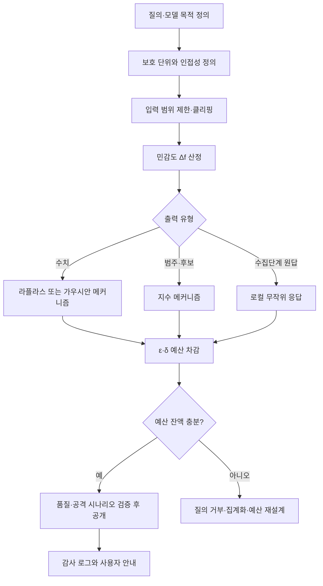

# 차등 개인정보보호(Differential Privacy)와 프라이버시 예산

## 1. 개요

> **정의**: 차등 개인정보보호(Differential Privacy, DP)는 개인 한 명의 데이터가 포함되거나 제외되어도 분석 결과의 확률분포가 크게 달라지지 않도록 무작위화된 메커니즘과 수학적 보장을 제공하는 프라이버시 강화 기술(PET)이다.

데이터 기반 의사결정은 개인 데이터를 많이 활용할수록 정확해지지만, 원시 데이터의 공개나 반복 질의는 재식별과 속성 추론 위험을 키운다.
단순히 이름·주민등록번호를 삭제하는 비식별화는 외부 데이터와의 결합 공격에 취약하고, 공개 이후 새로운 공격 지식이 등장하면 안전성을 다시 판단해야 한다.
차등 개인정보보호는 공격자의 배경지식을 제한하지 않고, 한 개인의 참여 여부가 결과에 미치는 영향 자체를 확률비율로 제한한다는 점에서 기존 기법과 출발점이 다르다.

DP의 핵심은 데이터를 영구적으로 지우는 것이 아니라, 데이터에서 결과를 산출하는 공개 메커니즘에 보장 조건을 부여하는 것이다.
따라서 동일한 원천 데이터라도 질의 종류, 민감도, 허용 가능한 정확도, 반복 공개 횟수에 따라 서로 다른 잡음과 예산을 설계해야 한다.
개인정보보호 담당자는 프라이버시 예산을 보안 설정값처럼 관리하고, 데이터 과학자는 통계적 유용성과 오차를 함께 검증해야 한다.
기술사는 알고리즘만 제시하지 않고 개인정보 처리 목적, 보호 단위, 결과 이용자, 감사 증적, 운영 중 예산 소진 통제를 포함한 거버넌스를 설계해야 한다.

### 1.1 등장 배경과 필요성

대규모 통계 공개에서 가장 어려운 문제는 유용한 집계 결과를 제공하면서도 특정 개인의 기여분을 추론할 수 없게 만드는 것이다.
예를 들어 특정 지역의 평균 소득을 공개할 때, 한 가구가 추가되거나 빠지는 경우 결과가 크게 변하면 그 가구의 존재나 특성이 드러날 수 있다.
질의 결과에 일정한 무작위성을 도입하면 개별 기여의 영향은 희석되지만, 무작위성은 임의로 넣는 것이 아니라 함수의 민감도와 프라이버시 매개변수로 계산되어야 한다.

DP는 데이터셋 자체가 익명이라는 주장이 아니라, 공개된 분석 과정이 개인 데이터에 대해 제한된 정보만 누출한다는 주장이다.
그러므로 DP를 적용한 결과도 민감한 집단의 존재, 이미 공개된 사실, 모델의 편향을 모두 제거해 주는 것은 아니다.
보호 단위가 사람인지, 가구인지, 계정인지, 이벤트인지 먼저 결정하지 않으면 같은 수치의 ε이라도 실제 보호 수준이 달라진다.

## 2. 차등 개인정보보호의 원리와 정형 정의

### 2.1 인접 데이터셋과 메커니즘

DP는 서로 인접한 두 데이터셋을 비교한다.
인접 데이터셋은 한 사람의 레코드가 추가 또는 삭제되었거나, 적용 정책에 따라 한 사람의 값이 변경된 데이터셋이다.
이때 데이터베이스 전체를 공개하는 대신 무작위화 함수인 메커니즘 \(M\)에 질의를 입력하고, 그 출력만 외부에 제공한다.

메커니즘의 출력은 같은 질의를 반복해도 달라질 수 있다.
중요한 것은 두 인접 데이터셋에서 특정 출력이 나타날 확률의 차이를 제한하는 것이며, 특정 개인이 어느 데이터셋에 속하는지 출력만 보고 판별하기 어렵게 만드는 것이다.
이 확률적 관점은 공격자가 어떤 보조 자료를 가지고 있는지 미리 가정하지 않아도 되는 최악조건 보장으로 연결된다.

원천 데이터는 권한이 있는 통제 영역에 남겨 두고, 질의와 민감도를 계산한 뒤 보호된 결과만 경계 밖으로 전달하는 것이 기본 구조다.
예산 관리자는 개별 질의의 비용을 기록하고, 누적 비용이 한도를 넘으면 질의를 거부하거나 더 강한 보호 설정을 적용한다.
결과 이용자는 원시 레코드가 아니라 통계 결과를 사용하므로 데이터 최소화와 접근 통제가 함께 작동한다.

### 2.2 ε-DP의 정식 정의

무작위 메커니즘 \(M\)이 모든 인접 데이터셋 \(D_1,D_2\)와 가능한 출력 사건 \(S\)에 대해 다음 조건을 만족하면 ε-차등 개인정보보호를 만족한다고 한다.

\[
Pr[M(D_1) \in S] \le e^{\varepsilon} Pr[M(D_2) \in S]
\]

ε은 프라이버시 손실 또는 프라이버시 예산을 나타내며, 작을수록 두 출력 분포가 더 유사해져 보호가 강해진다.
다만 ε은 절대적인 안전 등급이나 모든 위험의 확률이 아니며, 메커니즘·보호 단위·질의 집합과 함께 해석해야 한다.
ε이 커지면 일반적으로 필요한 잡음이 줄어 정확도가 높아지지만 개인 한 명의 영향이 결과에 더 많이 남을 수 있다.

실무에서는 δ를 허용하는 (ε,δ)-DP도 널리 사용한다.
이 정의는 대부분의 출력 사건에 대해 확률비율을 제한하되, 아주 작은 예외 확률 δ를 추가로 허용하여 가우시안 메커니즘이나 고급 조성을 사용할 수 있게 한다.
δ는 임의로 큰 값으로 정하면 안 되며, 데이터 규모·공격 모델·규제 기대 수준에 맞추어 문서화해야 한다.

### 2.3 DP가 보장하는 것과 보장하지 않는 것

DP는 참여 여부에 따른 출력 분포의 변화를 제한하므로 특정 개인의 데이터가 결과에 미치는 추가 위험을 줄인다.
공격자가 다른 공개 데이터와 결합하더라도 정의 자체가 성립하는 한 보장 논리는 유지되며, 여러 처리 결과에 대한 누적 손실도 계산할 수 있다.
또한 DP 결과에 후처리를 수행해도 개인정보보호 보장이 약해지지 않는다는 후처리 불변성(post-processing immunity)이 있다.

반면 DP는 원천 데이터의 편향, 소수 집단의 통계적 대표성, 결과의 공정성, 시스템 접근권한 문제를 자동으로 해결하지 않는다.
분석 결과가 이미 공개된 정보와 결합되어 집단의 민감한 특성을 추정하게 되는 문제도 별도의 위험 평가가 필요하다.
따라서 DP는 접근 통제, 암호화, 보안 로그, 목적 제한, 보유기간 통제와 대체 관계가 아니라 방어 심층화의 한 계층이다.

|구분|설명|기술사 관점의 핵심 질문|
|---|---|---|
|보호 단위|사람·가구·계정·이벤트 중 무엇을 한 단위로 볼지 결정|한 사람이 여러 레코드를 만들 때 기여를 어떻게 묶는가?|
|ε|확률비율을 제한하는 순수 프라이버시 매개변수|서비스 전체에서 누적 ε을 어떤 정책으로 제한하는가?|
|δ|아주 작은 예외 확률을 허용하는 완화 매개변수|δ가 보호 대상 수와 공격 가능성에 비해 충분히 작은가?|
|민감도|한 개인의 데이터 변화가 질의 결과에 미치는 최대 영향|입력 범위 제한과 클리핑으로 민감도를 통제했는가?|
|유용성|잡음 추가 뒤 결과가 의사결정에 사용할 수 있는 정도|오차·신뢰구간·하위집단 품질을 어떻게 검증하는가?|

## 3. 민감도와 무작위화 메커니즘

### 3.1 민감도 설계

함수 \(f\)의 전역 민감도는 인접 데이터셋에서 출력이 변할 수 있는 최대 크기로 정의한다.
카운트 질의는 한 사람의 추가로 최대 1만큼 변하므로 민감도가 작지만, 합계 질의는 개인 값의 범위가 제한되지 않으면 민감도가 커진다.
따라서 합계·평균을 공개하기 전에는 소득이나 사용량처럼 큰 값의 상한을 정하고 값을 범위 안으로 클리핑해야 한다.

클리핑은 이상치를 버리는 조치가 아니라 한 개인의 영향력을 일정 범위 안에 가두어 보호비용을 계산 가능하게 만드는 조치다.
하지만 상한을 너무 낮추면 실제 분포의 꼬리가 잘려 통계적 편향이 생기고, 너무 높이면 잡음이 커져 유용성이 떨어진다.
상한은 도메인 지식, 사전 분포, 민감도 분석, 정책 기준을 근거로 선택하고 변경 이력을 남겨야 한다.

### 3.2 라플라스 메커니즘

라플라스 메커니즘은 수치 질의에 라플라스 분포의 잡음을 더한다.
대표적으로 \(M(D)=f(D)+Lap(Δf/ε)\)와 같이 민감도에 비례하고 ε에 반비례하는 규모를 사용한다.
카운트, 합계, 평균처럼 출력이 수치형이고 순수 ε-DP를 적용하려는 경우 이해하기 쉬운 선택이다.

민감도가 1인 카운트 질의에 작은 ε을 적용하면 잡음의 분산이 커지고, 결과가 음수가 되는 등 도메인 제약을 벗어날 수 있다.
이때 음수 절단이나 반올림 같은 후처리는 DP 보장을 유지할 수 있지만, 정확도와 편향을 따로 측정해야 한다.
여러 통계를 동시에 발표하면 각 통계에 ε을 나누어 배정해야 하므로 질의 수가 늘어날수록 개별 결과가 부정확해질 수 있다.

### 3.3 가우시안 메커니즘

가우시안 메커니즘은 일반적으로 (ε,δ)-DP를 목표로 정규분포 잡음을 추가한다.
벡터 형태의 통계나 머신러닝 학습처럼 여러 차원과 반복 연산을 다룰 때 고급 조성 분석과 결합하기 좋다.
그러나 δ라는 예외 확률을 도입하므로 데이터셋 규모와 보호 단위에 비해 δ가 적절한지 검토하고, 예산 계산 모델을 명시해야 한다.

### 3.4 무작위 응답과 지수 메커니즘

무작위 응답은 설문 응답자가 자신의 실제 답을 일정 확률로 뒤집어 전송하게 하는 방식이다.
수집 단계에서 개인의 원답을 숨기는 로컬 DP에 적합하지만, 잡음이 누적되어 많은 표본과 신중한 추정 절차가 필요하다.
중앙 서버가 원시 데이터를 보유하지 않는 상황에서는 운영 편의보다 통계 오차와 응답 조작 가능성을 먼저 검토해야 한다.

지수 메커니즘은 출력이 수치가 아닌 후보·정책·추천 항목일 때 효용 점수가 높은 후보를 확률적으로 선택한다.
예를 들어 개인을 직접 노출하지 않고 업무 우선순위 후보를 선택하려면 후보별 점수의 민감도를 구한 뒤 선택 확률을 조정할 수 있다.
이 방식은 추천 품질을 높이려는 요구와 개인 정보 보호 요구가 충돌하는 의사결정 시스템에 활용된다.

### 3.5 조성과 프라이버시 회계

동일 데이터셋에 여러 질의를 실행하면 각 질의의 프라이버시 손실이 누적된다.
가장 단순한 순차 조성에서는 질의별 ε을 더해 전체 예산을 상한으로 계산한다.
고급 조성은 질의 횟수와 매개변수를 활용해 더 작은 상한을 제공할 수 있지만, 구현한 회계 방식과 가정이 검증되어야 한다.

프라이버시 회계는 데이터 파이프라인의 호출량, 대시보드 새로고침, 모델 학습 반복, 실패 후 재시도를 모두 포함해야 한다.
캐시된 결과를 재사용하면 불필요한 예산 차감을 줄일 수 있지만, 캐시 결과가 원시 데이터 변경과 불일치하는지 확인해야 한다.
예산 소진을 운영 장애로 취급하지 말고 정상적인 보호 통제로 다루어, 사용자에게 집계 수준 변경이나 지연을 설명해야 한다.

## 4. 적용 절차와 운영 아키텍처

### 4.1 분석 목적과 위협 모델 정의

첫 단계는 누구의 어떤 의사결정을 지원하기 위해 어떤 결과를 공개하는지 구체화하는 것이다.
내부 운영 대시보드인지, 외부 공공 통계인지, 모델 학습용 특성량인지에 따라 공개 범위와 공격자 능력이 다르다.
공격자가 결과를 반복 요청할 수 있는지, 여러 계정으로 우회할 수 있는지, 다른 데이터셋을 결합할 수 있는지를 위협 모델에 기록한다.

분석 목적이 불명확한 상태에서 먼저 잡음을 넣으면 보호 수준을 설명하기 어렵고, 정확도가 낮아진 원인도 추적할 수 없다.
필요한 최소 집계 수준과 공개 주기를 먼저 정하고, 원시 데이터 접근을 허용하지 않아도 되는지 확인해야 한다.
보호 대상과 이해관계자를 개인정보보호 책임자, 데이터 소유자, 통계 전문가, 서비스 운영자와 함께 합의한다.

### 4.2 예산 배정과 질의 정책

전체 ε 예산을 서비스·부서·데이터셋·기간별로 분리하면 한 기능의 과도한 질의가 다른 기능의 보호를 침해하는 것을 막을 수 있다.
질의 템플릿을 사전 승인하고 임의 SQL을 금지하면 민감도 산정과 회계가 단순해진다.
대시보드의 자동 새로고침 주기를 늘리거나 동일한 결과를 캐시하는 것은 정확도를 유지하면서 예산을 절감하는 운영 기법이다.

예산 배정은 숫자 하나를 선언하는 문제가 아니라 위험 수용 기준과 정확도 목표를 조정하는 의사결정이다.
소수 집단 통계가 중요한 경우 전체 평균의 정확도만 보고 배정하면 안 되며, 최소 표본수와 신뢰구간 폭을 함께 기준으로 삼아야 한다.
예산 변경은 승인권자, 변경 사유, 영향 받는 보고서, 재현 가능성을 감사 로그에 남긴다.

### 4.3 품질 검증과 공개 게이트

보호된 결과는 원본 정답과 비교하여 평균절대오차, 상대오차, 분포 왜곡, 순위 보존, 하위집단별 품질을 점검한다.
카운트가 0보다 작아지는지, 확률 합이 1이 되는지, 합계와 부분합의 관계가 유지되는지 도메인 불변식을 테스트한다.
불변식 보정은 후처리로 수행할 수 있지만, 보정이 결과 간 상관을 만들어 공격면을 키우는지 분석해야 한다.

재식별 관점에서는 한 번의 결과뿐 아니라 여러 기간과 여러 차원의 결과를 조합한 공격을 시뮬레이션한다.
예산 회계가 계산한 이론적 상한과 실제 시스템 로그의 호출 수가 일치하는지 대조한다.
품질·보호·운영 검증을 모두 통과한 경우에만 공개하고, 실패하면 집계 수준을 높이거나 질의를 거부한다.

## 5. 기법 비교와 선택 기준

비식별화는 직접 식별자를 삭제하거나 가명화하는 데이터 중심 접근이다.
DP는 데이터셋에 대한 분석 결과의 민감도를 제한하는 출력 중심 접근이므로, 두 기법은 경쟁 관계가 아니라 함께 사용할 수 있다.
가명화된 원천 데이터라도 DP 없이 반복 집계하면 개인의 기여분이 추론될 수 있다는 점이 핵심 차이다.

k-익명성은 준식별자 조합이 최소 k명의 레코드와 같아 보이도록 일반화·억제하지만, 동질성 공격이나 배경지식 공격을 충분히 막지 못할 수 있다.
DP는 공격자 지식과 무관한 확률적 보장을 제공하지만, 예산을 잘못 설정하거나 유용성 요구가 지나치면 실무 적용이 어려워진다.
동형암호는 암호화된 상태에서 계산하는 기밀성 기술이며, 계산비용과 구현복잡도가 높지만 서버가 원문을 보지 않아도 된다는 장점이 있다.
연합학습은 데이터를 이동시키지 않고 여러 참여자가 모델을 공동 학습하지만, 업데이트 자체의 정보 누출을 막으려면 DP나 안전한 집계가 추가로 필요하다.

|기법|보호 위치|장점|한계와 DP와의 관계|
|---|---|---|---|
|가명화·마스킹|저장 데이터·식별자|구현이 쉽고 업무 식별성을 일부 유지|결합·추론 공격에 취약하며 DP를 대체하지 않음|
|k-익명성·l-다양성|공개 테이블|구조적 식별 위험을 직관적으로 설명|배경지식·동질성 공격과 반복 공개에 취약할 수 있음|
|차등 개인정보보호|질의·모델 출력|정량적이고 조성 가능한 최악조건 보장|잡음에 따른 정확도 저하와 예산 설계 필요|
|동형암호|계산 중 데이터|서버가 평문을 보지 않고 연산 가능|비용이 높고 결과 공개 시 DP가 여전히 유용할 수 있음|
|연합학습|분산 학습 과정|원시 데이터를 중앙으로 모으지 않음|업데이트 누출을 막기 위한 DP·안전한 집계 필요|

선택 기준은 민감한 원천 데이터의 보관 위치, 분석 결과의 공개 범위, 실시간성, 계산비용, 반복 질의 수, 규제상 설명 가능성이다.
공공 통계처럼 결과를 반복 공개하는 경우 DP의 예산 회계가 강점을 보인다.
소수 참여자가 있는 협업 분석은 연합학습과 안전한 집계를 결합하고, 최종 통계를 DP로 보호하는 다층 구조가 현실적이다.

## 6. 산업 적용 사례

### 6.1 공공 인구·경제 통계

인구조사나 지역별 통계는 개인 단위 원자료를 공개하지 않고, 지역·연령·가구 형태별 집계를 제공해야 한다.
지역을 너무 세분화하면 소수 가구의 존재가 드러나고, 너무 크게 묶으면 정책 활용도가 낮아진다.
DP를 적용하면 세부 교차표마다 예산을 배분하고, 작은 셀에는 더 강한 보호나 공개 억제를 적용할 수 있다.

공개 기관은 통계 이용자에게 ε, δ, 보호 단위, 오차 범위, 공개 버전을 설명해야 한다.
또한 서로 다른 표의 합계가 정확히 맞지 않을 수 있으므로 일관성 보정과 그에 따른 통계적 편향을 함께 공개해야 한다.
이 사례의 교훈은 단일 데이터셋에 DP를 한 번 적용하는 것이 아니라, 공개 프로그램 전체를 예산 단위로 운영해야 한다는 점이다.

### 6.2 서비스 이용 분석과 제품 개선

온라인 서비스는 클릭·검색·구매 이벤트를 활용해 기능별 이용률과 이탈률을 계산한다.
개별 사용자의 행동 순서를 그대로 공유하지 않고, 기간·기능별 카운트와 비율을 DP로 보호하면 제품팀이 추세를 확인할 수 있다.
동일 사용자가 여러 이벤트를 발생시키면 이벤트 단위 보호는 실제 개인 보호보다 약해질 수 있으므로 사용자 단위 기여 상한을 둬야 한다.

예를 들어 한 사용자가 하루에 수천 번 이벤트를 발생시킬 수 있다면, 사용자별 이벤트 수를 제한하고 초과분을 클리핑한 뒤 카운트의 민감도를 계산한다.
이렇게 하면 헤비 유저 한 명이 결과와 예산을 동시에 지배하는 문제를 줄일 수 있다.
제품팀은 실험군별 차이를 판단할 때 DP 잡음의 신뢰구간을 포함하여, 작은 개선을 성급히 유의미하다고 결론 내리지 않아야 한다.

### 6.3 프라이버시 보호 머신러닝

머신러닝 학습에서 개인 레코드의 영향이 모델 파라미터에 남을 수 있으므로, 그래디언트를 클리핑하고 노이즈를 추가하는 DP-SGD 계열 접근을 사용할 수 있다.
각 학습 단계의 클리핑 노름과 노이즈 규모, 샘플링률, 반복 횟수를 기반으로 학습 전체의 ε과 δ를 추정한다.
보호 수준이 강해질수록 학습 수렴과 정확도가 저하될 수 있으므로, 모델 성능뿐 아니라 멤버십 추론 공격에 대한 노출도 평가해야 한다.

작은 데이터셋에서 동일 예산을 사용하면 잡음의 상대적 영향이 커진다.
따라서 모델을 DP로 학습하기 전에 공개·비민감 사전학습 모델을 활용하거나, 학습 목표와 보호 단위를 재설계하는 것이 비용 대비 효과가 좋을 수 있다.
DP 학습이 모델의 모든 편향이나 생성 결과의 유해성을 없애는 것은 아니므로 공정성·안전성 평가를 별도로 수행한다.

## 7. 심화: NIST 평가 지침과 최신 실무 동향

NIST는 차등 개인정보보호 보장을 평가하기 위한 지침에서 DP를 개인 데이터가 분석 결과에 나타날 때의 프라이버시 위험을 정량화하는 수학적 프레임워크로 설명한다.
이 지침은 정의를 만족한다고 선언하는 것에서 나아가, 보호 단위와 인접성, 메커니즘, 매개변수, 조성, 구현 가정을 평가 대상으로 본다.
따라서 조직은 제품 설명서에 단순히 “DP 적용”이라고 쓰지 말고 어떤 데이터 처리 단계에 어떤 보장을 적용했는지 증적을 남겨야 한다.

최근 실무의 방향은 ε 하나를 홍보하는 것에서 프라이버시 보장과 유용성을 함께 측정하는 것으로 이동하고 있다.
예산 회계 서비스, 자동 질의 거부, 모델 학습 로그, 공개 버전별 매개변수 관리가 플랫폼 기능으로 통합되어야 한다.
특히 동일 데이터를 여러 팀이 공유할 때 중앙 회계 없이 각 팀이 독립적으로 예산을 사용하면 전체 보장이 깨질 수 있으므로 조직 단위의 예산 원장이 필요하다.

기술사 답안에서는 정의식만 암기하기보다 보호 단위 설정에서 공개 게이트까지의 생명주기를 제시하는 것이 효과적이다.
문제에서 공공 통계, 추천, 머신러닝, 데이터 공유 중 어떤 맥락이 주어져도 민감도·메커니즘·예산·유용성·감사를 연결하여 설명해야 한다.
또한 DP의 한계를 함께 밝히면 비식별화 만능론을 피하고, 접근 통제와 암호기술을 결합하는 설계 관점을 보여 줄 수 있다.

## 8. 고려사항 및 시사점

### 8.1 보호 단위와 기여도

사람 한 명이 여러 레코드를 생성하는 서비스에서는 레코드 단위 인접성만 사용하면 실제 개인 보호가 약해진다.
사용자·가구 단위로 기여를 제한하고, 세션·기간별 최대 이벤트 수를 먼저 정의해야 한다.
보호 단위 변경은 ε 수치 변경보다 실질적인 영향이 클 수 있으므로 개인정보 영향평가와 함께 검토한다.

### 8.2 예산의 정책화

ε과 δ를 개발자가 임의로 선택하지 않도록 데이터 등급, 공개 대상, 기간, 사용 목적에 따른 기준표를 만든다.
예산은 기능별로 분리하고 재사용·재시도·배치 작업을 모두 회계에 포함한다.
예산 잔액과 소진 사유를 운영 대시보드에 표시하면 분석팀이 보호 통제를 우회하지 않고 질의를 계획할 수 있다.

### 8.3 유용성과 공정성

잡음은 전체 평균보다 소수 집단 결과에 더 큰 상대오차를 만들 수 있다.
하위집단별 오차와 신뢰구간, 의사결정 임계값의 변동을 점검하여 보호 때문에 특정 집단이 체계적으로 불리해지지 않는지 확인한다.
정확도를 높이기 위해 ε을 키우기 전에 집계 수준, 공개 주기, 질의 중복을 줄이는 설계를 우선한다.

### 8.4 구현·검증과 재현성

난수 생성기, 클리핑, 샘플링, 조성 계산이 구현마다 달라질 수 있으므로 검증된 라이브러리와 버전 고정을 사용한다.
시드 고정은 테스트 재현성에 도움이 되지만 운영 공개 결과가 예측 가능해지지 않도록 테스트·운영 난수를 분리한다.
매개변수와 원천 데이터의 접근권한, 결과 생성 시각, 예산 차감 내역을 감사 로그로 보존한다.

### 8.5 결합 방어

DP가 출력의 추가 위험을 제한하더라도 원천 데이터 접근·전송·저장 과정은 암호화와 권한 통제가 필요하다.
원본은 최소 인원만 접근하고, 가명화·보존기간·키 관리·침해 대응을 별도 통제로 운영한다.
DP, 안전한 집계, 동형암호, 연합학습 중 무엇을 선택할지는 공격면과 비용을 기준으로 결정하며 유행하는 기술을 일괄 적용하지 않는다.

### 8.6 설명 가능성과 이용자 고지

비전문 이용자는 ε을 보호 확률로 오해할 수 있으므로, 매개변수의 의미와 통계 오차를 쉬운 언어로 함께 고지한다.
공개 결과의 버전, 집계 범위, 잡음 적용 위치, 재사용 제한, 문의 창구를 데이터 카탈로그에 기록한다.
내부 승인자는 보호가 충분하다는 선언보다 계산 근거와 품질 측정 결과를 확인해야 한다.

### 8.7 전망과 연계 기술

생성형 AI와 분석 플랫폼이 자연어 질의를 통해 여러 통계를 자동 실행하면 프라이버시 회계와 질의 중복 제거가 더욱 중요해진다.
AI 에이전트에 임의 질의 권한을 주기보다 허용된 템플릿, 예산 토큰, 결과 등급, 감사 이벤트를 정책 엔진으로 강제해야 한다.
향후에는 DP 보장 수치와 모델 안전성·공정성·데이터 품질 지표를 하나의 AI 거버넌스 대시보드에서 함께 관리하는 방향이 바람직하다.

## 참고자료

1. NIST, “Guidelines for Evaluating Differential Privacy Guarantees,” https://nvlpubs.nist.gov/nistpubs/SpecialPublications/NIST.SP.800-226.pdf
2. NIST, “NIST Finalizes Guidelines for Evaluating ‘Differential Privacy’ Guarantees,” https://www.nist.gov/news-events/news/2025/03/nist-finalizes-guidelines-evaluating-differential-privacy-guarantees-de
3. NIST, “Differential Privacy for Privacy-Preserving Data Analysis,” https://www.nist.gov/blogs/cybersecurity-insights/differential-privacy-privacy-preserving-data-analysis-introduction-our
4. NIST, “Differential Privacy: Future Work & Open Challenges,” https://www.nist.gov/blogs/cybersecurity-insights/differential-privacy-future-work-open-challenges
5. Dwork, C., “Differential Privacy,” International Colloquium on Automata, Languages, and Programming, https://link.springer.com/chapter/10.1007/11787006_1

---

> **한 줄 요약**: 차등 개인정보보호는 개인 한 명의 기여가 분석 결과를 바꾸는 정도를 ε·δ와 프라이버시 예산으로 제한하여, 유용성과 정량적 개인정보보호를 함께 설계하는 출력 중심 PET이다.
