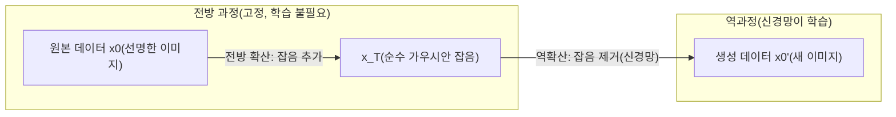
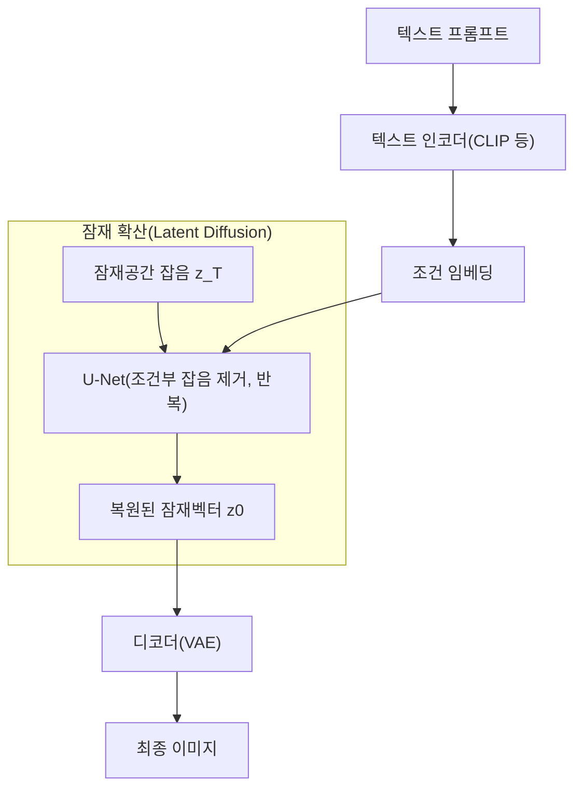

# 디퓨전 모델(Diffusion Model)

## 1. 개요

> **디퓨전 모델(Diffusion Model)**이란 데이터에 잡음(noise)을 점진적으로 더해 순수 가우시안 잡음으로 만드는 **전방 확산 과정(Forward Diffusion)**과, 그 역과정을 신경망으로 학습해 잡음으로부터 데이터를 복원·생성하는 **역확산 과정(Reverse Denoising)**으로 구성된 생성형(Generative) 딥러닝 모델이다.

생성형 AI의 목표는 학습 데이터의 확률분포 p(x)를 근사하여 그 분포에서 새로운 표본을 뽑는 것이다. 2014년 등장한 GAN(Generative Adversarial Network)은 생성자와 판별자의 적대적 경쟁으로 고품질 이미지를 만들었으나, 학습이 불안정하고 모드 붕괴(mode collapse, 다양성 상실)에 취약했다. VAE(변분 오토인코더)는 학습이 안정적이지만 생성 이미지가 흐릿한 한계가 있었다. 디퓨전 모델은 "생성을 한 번에 하지 말고, 잡음을 조금씩 걷어내는 수백 단계의 점진적 복원 문제로 분해한다"는 발상으로 이 딜레마를 풀었다. 각 단계가 작고 다루기 쉬운 문제로 나뉘므로 학습이 안정적이고, 표본의 다양성과 사실성(fidelity)을 동시에 확보한다.

디퓨전이 주목받는 근본 이유는 **품질·다양성·안정성의 균형**이다. 2020년 DDPM(Denoising Diffusion Probabilistic Models) 논문이 GAN에 필적하는 이미지 품질을 보인 이후, 2021~2022년을 거치며 Stable Diffusion·DALL·E 2·Imagen·Midjourney 등 텍스트-이미지 생성 서비스의 사실상 표준 기반 기술이 되었다. 오늘날 이미지뿐 아니라 오디오(음성 합성), 동영상, 3D, 단백질 구조 생성 등으로 응용이 확산되고 있어, 기술사 관점에서 생성형 AI의 핵심 원리로 반드시 이해해야 할 주제이다.

## 2. 전방·역확산 과정의 원리

**전방 확산 과정**은 원본 데이터 x0에 매 단계 t마다 작은 가우시안 잡음을 더해 x1, x2, …, x_T로 만드는 마르코프 연쇄(Markov chain)이다. 잡음의 세기는 사전에 정한 스케줄(β1…βT, variance schedule)로 결정되며 통상 T는 수백~수천 단계에 이른다. 이 과정은 학습 파라미터가 없는 **고정된 과정**이라는 점이 핵심이다. 또한 재매개변수화(reparameterization)를 통해 임의의 단계 t의 상태 x_t를 x0로부터 한 번에 계산할 수 있어, 학습 시 매 단계를 순차 시뮬레이션하지 않아도 되는 계산상 이점을 준다. 충분히 큰 T에서 x_T는 원본의 흔적이 사라진 표준정규분포에 수렴한다.

**역확산 과정**은 잡음이 낀 x_t에서 한 단계 이전 x_(t-1)을 추정하는 과정을 신경망으로 학습한다. 직관적으로는 "이 흐릿한 이미지에서 어떤 잡음이 섞였는지 예측하고 그만큼 걷어내라"는 문제이다. 실제 DDPM에서 신경망은 각 단계에 더해진 잡음 ε을 예측하도록 학습되며, 손실은 예측 잡음과 실제 잡음 간의 평균제곱오차(MSE)라는 매우 단순한 형태를 갖는다. 이 단순함이 학습 안정성의 비결이다. 학습이 끝나면 순수 잡음 x_T에서 시작해 신경망으로 잡음을 T번 걷어내며 새로운 데이터를 생성한다.

역과정 신경망의 구조로는 **U-Net**이 널리 쓰인다. U-Net은 인코더-디코더 사이에 스킵 연결(skip connection)을 두어 이미지의 전역 구조와 국소 디테일을 동시에 보존하며, 각 층에 현재 단계 t를 시간 임베딩으로 주입해 "지금 얼마나 잡음이 많은 단계인지"를 신경망이 인지하게 한다. 최근에는 U-Net 대신 트랜스포머 기반의 DiT(Diffusion Transformer)를 백본으로 쓰는 방식도 확산되고 있으며, 대표적으로 OpenAI Sora의 동영상 생성이 이 계열을 채택한 것으로 알려져 있다.

## 3. 조건부 생성과 잠재 확산

초기 디퓨전 모델은 무조건(unconditional) 생성, 즉 "아무 이미지나" 만드는 데 그쳤다. 실용화의 관건은 "원하는 것"을 만드는 **조건부 생성(Conditional Generation)**이다. 텍스트-이미지 생성에서는 프롬프트를 CLIP 같은 텍스트 인코더로 임베딩해 U-Net의 어텐션(cross-attention) 층에 주입하고, 잡음 제거의 매 단계가 텍스트 조건을 따르도록 유도한다. 여기에 **분류자 없는 유도(Classifier-Free Guidance, CFG)** 기법을 결합하면, 조건을 준 예측과 주지 않은 예측의 차이를 증폭해 프롬프트 충실도를 크게 높일 수 있다. CFG 강도(guidance scale)를 높이면 프롬프트를 더 충실히 따르지만 다양성과 자연스러움이 떨어지는 트레이드오프가 있다.

디퓨전 모델의 실용화를 결정지은 또 하나의 혁신은 **잠재 확산 모델(Latent Diffusion Model, LDM)**이다. 픽셀 공간에서 직접 확산을 수행하면(예: 512×512×3) 연산량이 막대하다. LDM은 먼저 VAE 인코더로 이미지를 저차원 잠재공간(예: 64×64)으로 압축하고, **그 잠재공간에서 확산·복원을 수행한 뒤** VAE 디코더로 원래 해상도의 이미지를 복원한다. 이로써 계산량을 수십 배 줄여 일반 GPU에서도 고해상도 생성이 가능해졌으며, 이것이 바로 Stable Diffusion의 핵심 구조이다. 잠재공간 압축으로 지각적으로 중요한 정보에 집중하고 미세한 고주파 잡음 처리 부담을 덜어내는 효과도 있다.

| 구분 | 픽셀 공간 확산(DDPM) | 잠재 확산(LDM/Stable Diffusion) |
|------|------|------|
| 확산 수행 공간 | 원본 픽셀(고차원) | 압축된 잠재벡터(저차원) |
| 연산량·메모리 | 매우 큼 | 대폭 감소(수십 배) |
| 고해상도 생성 | 어려움 | 소비자용 GPU에서도 가능 |
| 대표 모델 | DDPM, ADM | Stable Diffusion, SDXL |

## 4. GAN 등 타 생성모델과의 비교

생성모델의 특성을 비교하면 디퓨전이 왜 주류가 되었는지 이유가 분명해진다. GAN은 단일 순전파(one-shot)로 생성하므로 **추론이 빠르지만**, 판별자와의 균형이 깨지면 학습이 발산하거나 모드 붕괴로 특정 패턴만 반복 생성하는 문제가 있다. 디퓨전은 반대로 학습이 안정적이고 표본 다양성이 우수하지만, 생성 시 수십~수백 단계를 반복해야 하므로 **추론 속도가 느린 것**이 근본 약점이다. 이는 확산이 "많은 작은 문제로 분해"한 대가로, 품질·안정성과 속도가 상충함을 보여준다.

이 속도 문제를 완화하기 위해 표본 추출 단계를 대폭 줄이는 기법들이 발전했다. DDIM(결정론적 비마르코프 샘플러)은 수십 단계로도 준수한 품질을 내며, 나아가 잠재 일관성 모델(LCM)·증류(distillation) 기법은 단 1~4단계 생성까지 실현해 실시간 생성에 근접하고 있다. 즉 초기의 "느리다"는 통념은 빠르게 해소되는 중이다.

| 비교 항목 | GAN | VAE | 디퓨전 모델 |
|-----------|-----|-----|-------------|
| 생성 품질(사실성) | 높음 | 중간(흐릿) | 매우 높음 |
| 표본 다양성 | 낮음(모드 붕괴 위험) | 높음 | 높음 |
| 학습 안정성 | 낮음 | 높음 | 높음 |
| 추론 속도 | 빠름(1-step) | 빠름 | 느림(다단계, 개선 중) |
| 대표 활용 | 얼굴·초해상도 | 표현 학습 | 텍스트-이미지·영상·오디오 |

실제 산업 적용 사례로, 신약·소재 개발에서는 디퓨전으로 원하는 물성을 갖는 분자 구조를 생성하고(RFdiffusion 등 단백질 설계), 제조에서는 결함 이미지가 부족할 때 학습용 결함 데이터를 증강하며, 미디어·광고에서는 콘셉트 아트와 시안 제작 시간을 단축한다. 한 예로 텍스트-이미지 서비스는 디자이너의 초기 시안 작업 시간을 수 시간에서 수 분 단위로 줄여준다고 보고된다.

## 5. 고려사항 및 시사점

디퓨전 모델을 도입·활용할 때 기술사 관점에서 다음을 고려해야 한다.

- **성능-비용 트레이드오프 관리**: 생성 품질(단계 수·해상도·guidance scale)과 추론 지연·GPU 비용이 직결된다. 실시간 서비스라면 DDIM·LCM·모델 증류로 단계 수를 줄이고, 배치 생성이라면 품질을 우선하는 등 목적별 최적점을 설계해야 한다. 잠재 확산 채택으로 인프라 비용을 구조적으로 낮추는 것도 핵심 전략이다.

- **저작권·데이터 거버넌스**: 대규모 웹 크롤링 데이터로 학습하므로 저작권 침해, 특정 작가 화풍 모방, 학습 데이터 오염(data poisoning) 이슈가 상존한다. 데이터 출처 관리, 라이선스 준수, 옵트아웃 반영, 생성물의 상업적 이용 정책을 사전에 정립해야 한다.

- **오남용 대응과 워터마킹**: 사실적 생성 능력은 딥페이크·허위정보 생성에 악용될 수 있다. 생성물에 보이지 않는 워터마크(예: SynthID)를 삽입하고 출처(provenance) 표준(C2PA 등)을 적용하며, 콘텐츠 필터·안전 분류기로 유해 생성을 차단하는 다층 방어가 필요하다.

- **평가 지표의 선정**: 생성 품질은 FID(Fréchet Inception Distance, 실제 분포와의 거리)·IS 등으로 정량 평가하되, 텍스트 정합도는 CLIP Score로, 사용자 만족도는 정성 평가로 병행해야 신뢰할 수 있는 판단이 가능하다.

- **전망과 연계 기술**: 확산 기반 동영상·3D·월드 모델로 확장되며 트랜스포머 백본(DiT)과 결합해 확장성(scaling)이 강화되고 있다. RAG·멀티모달 LLM·에이전트와 결합해 생성-검증-편집을 자동화하는 파이프라인으로 발전할 전망이므로, 파운데이션 모델·멀티모달 AI와 연계해 통합적으로 이해할 필요가 있다.

## 참고자료

- Ho et al., "Denoising Diffusion Probabilistic Models"(DDPM), 2020: https://arxiv.org/abs/2006.11239
- Rombach et al., "High-Resolution Image Synthesis with Latent Diffusion Models", 2022: https://arxiv.org/abs/2112.10752
- Stability AI, Stable Diffusion: https://stability.ai/

---

> **한 줄 요약**: 디퓨전 모델은 데이터에 잡음을 점진적으로 더하는 전방 과정과 이를 신경망으로 되돌리는 역과정으로 구성된 생성모델로, 학습 안정성과 품질·다양성을 동시에 확보하며, 잠재 확산·조건부 생성 기법을 통해 텍스트-이미지·영상 생성의 표준 기반 기술로 자리 잡았다.
