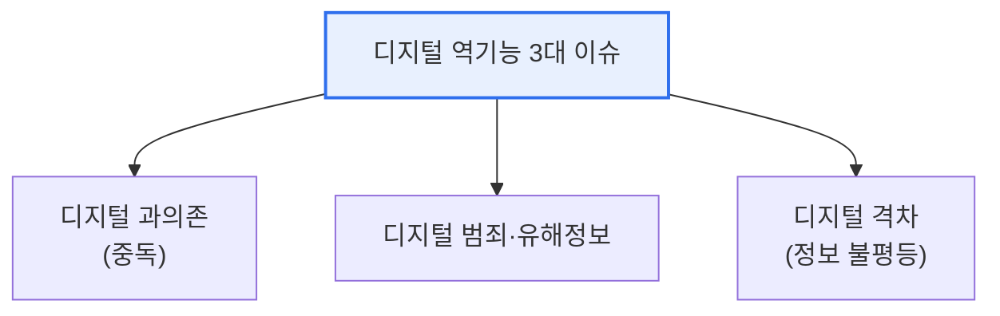

# 디지털 역기능(Digital Dysfunction)

## 1. 개요

### 가. 정의
> 디지털 기술 확산의 부작용으로 나타나는 **사회적·개인적 폐해**. 기술이 주는 편익의 이면에서 발생하는 중독·범죄·격차·정보왜곡 등을 포괄한다.

디지털 역기능이 심각한 사회 문제로 대두된 근본 이유는, 기술의 편익이 커질수록 그 **부작용도 함께 확대되고 고도화** 되기 때문이다. 스마트폰·SNS·AI가 삶에 깊숙이 들어오면서, 편리함과 연결의 이면에서 과의존·사이버폭력·가짜뉴스·프라이버시 침해 같은 문제가 개인의 건강과 관계를 해치고, 나아가 사회 전체의 신뢰와 안전을 위협한다. 특히 최근에는 생성형 AI로 딥페이크·허위정보가 정교해지고, 알고리즘이 편향된 정보만 보여주는 필터버블이 확산되면서 역기능이 더욱 교묘하고 광범위해졌다. 기술 자체는 중립적이지만, 그 사용과 확산의 그늘을 관리하지 않으면 디지털 사회의 지속가능성이 위협받는다.

### 나. 필요성
디지털 전환이 가속될수록 역기능도 비례해 커지므로, 이를 방치하면 개인의 피해를 넘어 사회적 비용과 불신이 누적된다. 편익을 살리면서 그늘을 최소화하는 균형 잡힌 대응이 필요하다.

## 2. 개념과 사례

디지털 역기능은 여러 형태로 나타난다. 스마트폰·게임·SNS에 대한 과의존(중독), 악플·디지털 성범죄 같은 사이버 폭력, 가짜뉴스·딥페이크·필터버블 같은 정보 왜곡, 세대·계층 간 디지털 격차, 개인정보 유출·감시 같은 프라이버시 침해가 대표적이다.

| 유형 | 사례 |
|---|---|
| **과의존·중독** | 스마트폰·게임·SNS 중독 |
| **사이버 폭력** | 악플·따돌림·디지털 성범죄 |
| **정보 왜곡** | 가짜뉴스·딥페이크·필터버블 |
| **디지털 격차** | 세대·계층 간 접근·활용 격차 |
| **프라이버시 침해** | 개인정보 유출·감시 |

## 3. 디지털 역기능 3대 이슈

디지털 역기능의 핵심은 세 이슈로 압축된다. **디지털 과의존** 은 스마트폰·인터넷 과몰입으로 일상과 건강이 훼손되는 문제이고, **디지털 범죄·유해정보** 는 사이버폭력·딥페이크·불법 콘텐츠처럼 타인과 사회에 해를 끼치는 문제이며, **디지털 격차** 는 접근·활용 능력의 차이가 교육·경제·복지의 기회 불평등으로 이어지는 문제다. 세 이슈는 각각 개인·사회·구조 차원의 폐해를 대표한다.

| 이슈 | 내용 |
|---|---|
| **디지털 과의존** | 스마트폰·인터넷 과몰입, 일상·건강 훼손 |
| **디지털 범죄·유해정보** | 사이버폭력, 딥페이크, 불법·유해 콘텐츠 |
| **디지털 격차** | 접근·활용 능력 차이로 인한 기회 불평등 |

## 4. 대응 방안

디지털 역기능은 한 가지 수단으로 해결되지 않고, 제도·기술·교육·사회 안전망이 함께 작동해야 한다. 제도적으로는 관련 법·규제와 디지털 포용 정책을, 기술적으로는 유해정보·딥페이크를 탐지·차단하는 AI를, 교육적으로는 디지털 리터러시·윤리 교육을, 사회적으로는 과의존 예방·상담과 민관 협력을 갖춘다.

| 구분 | 대응 |
|---|---|
| **제도·정책** | 관련 법·규제, 디지털 포용 정책 |
| **기술** | 유해정보 필터링·탐지(AI), 딥페이크 탐지 |
| **교육** | 디지털 리터러시·윤리 교육, 예방 프로그램 |
| **사회·상담** | 과의존 예방·상담 지원, 민관 협력 |

## 5. 고려사항 및 시사점

1. **기술적 통제만으로는 한계**가 있다. 유해정보 차단 기술은 필요하지만, 근본 해결은 이용자의 분별력을 키우는 교육과 사회 안전망의 병행에 있다.
2. **생성형 AI로 위협이 고도화**되고 있다. 딥페이크·허위정보가 정교해져 진위 판별이 어려워지므로, 이를 탐지하는 대응 기술도 함께 고도화해야 한다.
3. **디지털 포용과 안전의 균형**을 추구한다. 격차를 줄여 모두가 디지털 혜택을 누리게 하는 포용과, 유해로부터 보호하는 안전을 함께 달성하는 것이 디지털 사회의 지속가능성을 좌우한다.

---

> **한 줄 요약**: 디지털 역기능은 *과의존·디지털 범죄·디지털 격차* 3대 이슈로 나타나며, 기술적 통제만으로는 부족해 제도·기술·교육·사회 안전망을 병행해 대응해야 하는 디지털 사회의 지속가능성 과제다.
