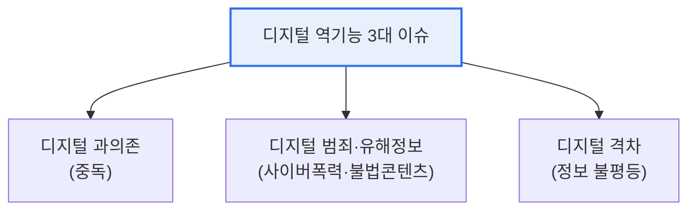

# 디지털 역기능(Digital Dysfunction)

## 1. 개요

### 가. 정의
> 디지털 기술 확산의 부작용으로 나타나는 **사회적·개인적 폐해**. 편익의 이면에서 발생하는 중독·범죄·격차·정보왜곡 등을 포괄한다.

디지털 역기능이 심각한 사회 문제가 된 이유는, 기술의 편익이 커질수록 그 **부작용도 함께 확대·고도화**되기 때문이다. 스마트폰·SNS·AI가 삶에 깊이 들어오면서, 중독·사이버폭력·가짜뉴스·프라이버시 침해 같은 문제가 개인을 넘어 사회 전반의 신뢰와 안전을 위협한다.

## 2. 개념과 사례 (1)

| 유형 | 사례 |
|---|---|
| **과의존·중독** | 스마트폰·게임·SNS 중독 |
| **사이버 폭력** | 악플·따돌림·디지털 성범죄 |
| **정보 왜곡** | 가짜뉴스·딥페이크·필터버블 |
| **디지털 격차** | 세대·계층 간 접근·활용 격차 |
| **프라이버시 침해** | 개인정보 유출·감시 |

## 3. 디지털 역기능 3대 이슈 (2)

| 이슈 | 내용 |
|---|---|
| **디지털 과의존** | 스마트폰·인터넷 과몰입, 일상·건강 훼손 |
| **디지털 범죄·유해정보** | 사이버폭력, 딥페이크, 불법·유해 콘텐츠 |
| **디지털 격차** | 접근·활용 능력 차이로 인한 기회 불평등 |

## 4. 대응 방안 (3)

| 구분 | 대응 |
|---|---|
| **제도·정책** | 관련 법·규제, 디지털 포용 정책 |
| **기술** | 유해정보 필터링·탐지(AI), 딥페이크 탐지 |
| **교육** | 디지털 리터러시·윤리 교육, 예방 프로그램 |
| **사회·상담** | 과의존 예방·상담 지원, 민관 협력 |

## 5. 시사점
- 기술적 통제만으론 한계 — **교육·제도·사회 안전망**의 병행
- 생성형 AI로 딥페이크·허위정보 위협 고도화 → 대응기술 고도화 필요
- 디지털 포용(격차 해소)과 안전을 함께 추구

---

> **한 줄 요약**: 디지털 역기능은 *과의존·디지털 범죄·디지털 격차* 3대 이슈로 나타나며, 제도·기술·교육·사회 안전망을 병행해 대응해야 하는 사회적 과제다.
