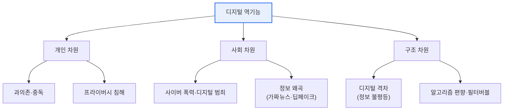
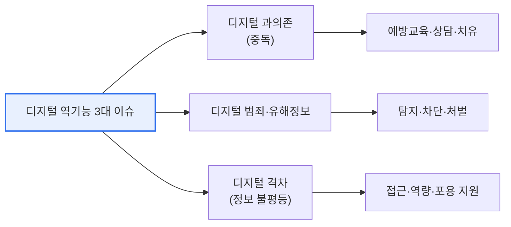

# 디지털 역기능(Digital Dysfunction)

## 1. 개요

### 가. 정의
> **디지털 역기능(Digital Dysfunction)** 이란 디지털 기술의 확산이 가져오는 편익의 이면에서 발생하는 **사회적·개인적 폐해**를 통칭한다. 스마트폰·인터넷 과의존(중독), 사이버 폭력·디지털 범죄, 가짜뉴스·딥페이크 같은 정보 왜곡, 디지털 격차, 프라이버시 침해 등을 포괄하는 개념이다.

디지털 역기능이 오늘날 심각한 사회 문제로 대두된 근본 이유는, **기술의 편익이 커질수록 그 부작용도 함께 확대되고 고도화**되기 때문이다. 스마트폰·SNS·생성형 AI가 일상 깊숙이 들어오면서, 편리함과 연결의 이면에서 과의존·사이버폭력·허위정보·프라이버시 침해가 개인의 건강과 관계를 해치고, 나아가 사회 전체의 신뢰와 안전을 위협한다. 기술은 그 자체로 중립적이지만, 사용과 확산의 그늘을 관리하지 않으면 디지털 전환이 가져올 이익 자체가 잠식된다는 점에서 역기능 관리는 디지털 사회의 지속가능성 문제로 격상된다.

특히 최근에는 역기능의 **양상 자체가 질적으로 변했다.** 과거의 역기능이 개인의 과사용이나 단순 악성 댓글 수준이었다면, 지금은 생성형 AI가 만든 딥페이크·허위정보가 진짜와 구분하기 어려울 만큼 정교해지고, 추천 알고리즘이 이용자가 좋아할 정보만 골라 보여주는 **필터버블(filter bubble)·에코챔버(echo chamber)** 가 사회적 양극화를 부추긴다. 즉 역기능이 개인 차원을 넘어 **여론·민주주의·사회 통합** 같은 구조적 층위로 확산되고 있다. 이 때문에 대응 역시 개인의 절제나 단편적 규제가 아니라 제도·기술·교육·사회 안전망을 아우르는 종합 대책으로 진화해야 한다.

### 나. 등장 배경과 필요성
디지털 역기능이 부각된 배경에는 세 가지 구조적 변화가 있다. 첫째, 스마트폰의 보급으로 온라인 접속이 **상시화·개인화**되어 과의존의 물리적 장벽이 사라졌다. 둘째, 플랫폼 기업의 수익 모델이 **이용자의 체류시간(engagement)** 에 의존하면서, 자극적·중독적 설계(무한 스크롤, 알림, 추천)가 구조적으로 강화되었다. 셋째, 콘텐츠 생산·유통 비용이 0에 수렴하면서 허위정보와 유해 콘텐츠가 **폭발적으로 확산**될 통로가 열렸다.

이러한 배경에서 디지털 역기능 대응이 필요한 이유는 명확하다. 디지털 전환이 가속될수록 역기능도 비례해 커지므로, 이를 방치하면 개인의 정신건강 악화·범죄 피해를 넘어 **사회적 신뢰 비용과 갈등이 누적**된다. 결국 디지털 기술이 주는 편익을 온전히 살리기 위해서라도, 그 그늘을 최소화하는 균형 잡힌 관리가 전제되어야 한다.

## 2. 디지털 역기능의 유형과 사례

디지털 역기능은 단일한 현상이 아니라 여러 층위에서 동시에 나타난다. 아래 개념도는 역기능을 개인·사회·구조 차원으로 나누어 전체 지형을 조망한 것이다.

```mermaid
flowchart TB
  DD["디지털 역기능"] --> IND["개인 차원"]
  DD --> SOC["사회 차원"]
  DD --> STR["구조 차원"]
  IND --> I1["과의존·중독"]
  IND --> I2["프라이버시 침해"]
  SOC --> S1["사이버 폭력·디지털 범죄"]
  SOC --> S2["정보 왜곡<br/>(가짜뉴스·딥페이크)"]
  STR --> T1["디지털 격차<br/>(정보 불평등)"]
  STR --> T2["알고리즘 편향·필터버블"]
  style DD fill:#e8f0fe,stroke:#2f6fed,stroke-width:2px
```

**개인 차원**의 대표 역기능은 과의존과 프라이버시 침해다. 스마트폰·게임·SNS 과몰입은 수면·학업·대인관계를 훼손하고, 심한 경우 우울·불안 같은 정신건강 문제로 이어진다. 이는 앞서 짚은 대로 플랫폼의 체류시간 극대화 설계와 맞물려 개인의 의지만으로는 벗어나기 어렵다는 점에서 구조적 성격을 띤다. 프라이버시 침해는 위치·검색·소비 이력이 광범위하게 수집·결합되면서, 개인이 자신의 정보가 어떻게 쓰이는지 통제하지 못하는 상황을 낳는다.

**사회 차원**에서는 사이버 폭력과 정보 왜곡이 두드러진다. 악성 댓글·집단 따돌림·디지털 성범죄는 익명성과 확산성이 결합되어 피해가 순식간에 증폭되고 회복이 어렵다. 정보 왜곡은 가짜뉴스·딥페이크·조작된 통계가 진실처럼 유통되며 여론을 오도하는 문제로, 특히 선거·재난 같은 국면에서 사회적 혼란을 키운다.

**구조 차원**의 역기능은 디지털 격차와 알고리즘 편향이다. 접근·활용 능력의 차이가 교육·경제·복지의 기회 불평등으로 고착되고, 추천 알고리즘이 편향된 정보만 노출해 확증편향과 양극화를 심화시킨다. 이는 개인의 노력으로 해소되지 않는 사회 시스템 차원의 문제다.

이 세 차원은 서로 독립적이지 않고 **상승작용**을 일으킨다는 점이 중요하다. 예컨대 디지털 리터러시가 낮은 취약계층(구조 차원의 격차)은 가짜뉴스·딥페이크(사회 차원의 정보 왜곡)에 더 쉽게 속고, 그 결과 잘못된 정보에 기반한 판단으로 경제적 피해를 입어 격차가 더 벌어진다. 반대로 정보 역량이 높은 집단은 알고리즘의 편향까지 인지해 걸러낸다. 이처럼 개인·사회·구조의 폐해가 서로 원인이자 결과로 얽히기 때문에, 어느 한 층위만 겨냥한 대책은 효과가 제한적이며 통합적 접근이 요구된다.

| 유형 | 대표 사례 | 성격 |
|---|---|---|
| **과의존·중독** | 스마트폰·게임·SNS 과몰입 | 개인 건강·일상 훼손 |
| **프라이버시 침해** | 개인정보 유출·과잉 수집·감시 | 자기정보 통제 상실 |
| **사이버 폭력** | 악플·따돌림·디지털 성범죄 | 익명성·확산성 피해 |
| **정보 왜곡** | 가짜뉴스·딥페이크·필터버블 | 여론 오도·신뢰 붕괴 |
| **디지털 격차** | 세대·계층 간 접근·활용 격차 | 구조적 기회 불평등 |

## 3. 디지털 역기능 3대 이슈

행정·정책 관점에서 디지털 역기능은 흔히 **3대 이슈** 로 압축해 다룬다. 앞의 유형론이 현상을 넓게 펼친 것이라면, 3대 이슈는 정책 대응의 초점을 잡기 위한 분류다.

```mermaid
flowchart LR
  D["디지털 역기능 3대 이슈"] --> A["디지털 과의존<br/>(중독)"]
  D --> B["디지털 범죄·유해정보"]
  D --> C["디지털 격차<br/>(정보 불평등)"]
  A --> A1["예방교육·상담·치유"]
  B --> B1["탐지·차단·처벌"]
  C --> C1["접근·역량·포용 지원"]
  style D fill:#e8f0fe,stroke:#2f6fed,stroke-width:2px
```

**디지털 과의존** 은 스마트폰·인터넷에 과몰입해 자기조절 능력을 잃고 일상·건강이 훼손되는 문제다. 특히 성장기 아동·청소년의 취약성이 커서, 예방교육·상담·치유 프로그램 같은 개인 지원과 함께, 중독을 유발하는 서비스 설계 자체를 규율하려는 논의(과몰입 방지 기능 의무화 등)가 이어진다. 핵심은 이용자의 의지 문제로만 환원하지 않고 **환경·설계 요인**을 함께 다루는 것이다.

**디지털 범죄·유해정보** 는 사이버폭력·디지털 성범죄·불법 콘텐츠·딥페이크처럼 타인과 사회에 직접 해를 끼치는 문제다. 대응은 유해정보를 **탐지·차단**하는 기술과, 가해 행위를 **처벌**하는 법·제도가 양축이 된다. 다만 표현의 자유와 충돌할 소지가 있어, 무엇을 어디까지 규제할지에 대한 사회적 합의가 함께 요구된다.

**디지털 격차(정보 불평등)** 는 접근·활용·참여 능력의 차이가 삶의 기회 격차로 이어지는 문제다. 인프라 보급(접근)뿐 아니라 디지털 역량 교육(활용), 취약계층의 서비스 참여(포용)까지 포괄해야 실질적 해소가 가능하다. 세 이슈는 각각 개인·사회·구조 차원의 폐해를 대표하며, 서로 얽혀 상승작용을 일으킨다는 점에서 통합적 접근이 필요하다.

| 이슈 | 핵심 내용 | 대응 초점 |
|---|---|---|
| **디지털 과의존** | 과몰입·자기조절 상실 | 예방교육·상담·설계 규율 |
| **디지털 범죄·유해정보** | 사이버폭력·딥페이크·불법콘텐츠 | 탐지·차단·처벌 |
| **디지털 격차** | 접근·활용·참여 불평등 | 접근·역량·포용 지원 |

## 4. 대응 방안과 실제 사례

디지털 역기능은 **한 가지 수단으로 해결되지 않는다.** 기술적 차단만으로는 우회가 쉽고, 규제만으로는 표현의 자유·혁신과 충돌하며, 교육만으로는 즉각적 피해를 막지 못한다. 따라서 **제도·기술·교육·사회 안전망**이 상호 보완적으로 작동하는 다층 대응이 정석이다. 아래에서는 네 축을 각각 나누어, 왜 그 수단이 필요하고 어떤 한계를 갖는지 함께 살핀다.

### 가. 제도·정책적 대응
제도는 다른 모든 대응의 뼈대가 된다. 사이버폭력·디지털 성범죄·딥페이크·개인정보 침해에 대한 처벌 근거와 플랫폼의 관리 의무를 법으로 명확히 해야, 기술·교육적 노력이 실효를 갖는다. 동시에 취약계층이 소외되지 않도록 인프라·기기·요금을 지원하는 **디지털 포용(digital inclusion)** 정책을 병행한다.

다만 제도적 대응은 **표현의 자유·산업 혁신과 충돌**할 소지가 상존한다. 유해정보의 정의가 모호하거나 규제가 과도하면 정당한 표현까지 위축시키고, 국내법만으로는 국경을 넘나드는 글로벌 플랫폼을 규율하기 어렵다는 한계가 있다. 그래서 규제는 사회적 합의에 기반한 **비례적·투명한 설계**가 요구된다.

### 나. 기술적 대응
기술은 대량으로 쏟아지는 유해 콘텐츠를 일차적으로 걸러내는 현실적 방어선이다. 유해정보·딥페이크를 자동 탐지·차단하는 AI 필터링, 아동 유해물 식별, AI 생성물임을 알리는 **워터마킹·출처표시(provenance)** 기술이 대표적이다. 사람이 일일이 검수하기 불가능한 규모를 감당한다는 점에서 기술적 대응은 필수다.

그러나 기술은 **창과 방패의 경쟁**에서 늘 앞서지 못한다. 생성 기술이 정교해질수록 탐지가 어려워지고, 우회·재업로드가 쉬워 완전한 차단은 불가능에 가깝다. 따라서 기술은 만능이 아니라 다른 축과 결합해야 효과를 낸다는 점을 전제로 활용해야 한다.

### 다. 교육·사회적 대응
가장 근본적이면서도 효과가 더디게 나타나는 축이 교육과 사회 안전망이다. 정보의 진위를 스스로 가리고 기술을 분별 있게 사용하는 **디지털 리터러시·디지털 윤리 교육**을 아동부터 노년까지 생애주기별로 제공하면, 이용자 스스로가 역기능에 대한 면역력을 갖게 된다. 여기에 과의존 예방·상담·치유 인프라와 민관 협력 거버넌스가 사회 안전망으로 뒷받침되어야 한다.

이 축의 강점은 **지속가능성**이다. 규제·기술이 외부적 통제라면, 교육은 이용자 내부의 판단력을 키워 근본적 회복력을 만든다. 다만 효과가 즉각적이지 않아, 단기 피해를 막는 제도·기술과 반드시 병행되어야 한다.

실제 사례를 보면, 유럽연합(EU)은 대형 온라인 플랫폼에 유해·불법 콘텐츠 관리 의무를 부과하는 **디지털서비스법(DSA)** 을 시행해 플랫폼의 사회적 책임을 제도화했고, AI의 위험을 등급화해 규율하는 **AI법(AI Act)** 논의를 통해 딥페이크 표시 의무 등을 다루고 있다. 국내에서도 한국지능정보사회진흥원(NIA) 등을 통한 인터넷·스마트폰 과의존 예방·상담 사업, 취약계층 디지털 역량 교육이 지속되고 있다. 이러한 사례들의 공통점은 **플랫폼의 책임, 기술적 대응, 이용자 역량 강화를 함께 묶는다**는 점이다.

| 구분 | 대응 방안 | 예시 |
|---|---|---|
| **제도·정책** | 법·규제, 디지털 포용 정책 | EU DSA·AI Act, 국내 과의존 예방정책 |
| **기술** | 유해정보·딥페이크 탐지, AI 생성물 표시 | AI 필터링, 워터마킹 |
| **교육** | 디지털 리터러시·윤리 교육 | 생애주기별 미디어 교육 |
| **사회·상담** | 예방·상담, 민관 협력 | 과의존 상담센터, 거버넌스 |

## 5. 심화 — 생성형 AI 시대의 역기능 고도화

디지털 역기능 논의에서 가장 시급한 최신 쟁점은 **생성형 AI가 역기능의 규모와 정교함을 동시에 끌어올렸다**는 점이다. 과거 딥페이크는 제작에 상당한 기술·시간이 필요했으나, 이제는 누구나 손쉽게 사실적인 가짜 영상·음성·이미지를 만들 수 있게 되면서 **딥페이크 성범죄, 유명인·정치인 사칭, 음성 위조 보이스피싱**이 급증하고 있다. 진위 판별이 어려워지면서 "본 것을 믿을 수 없는" 상황, 즉 사회적 신뢰의 근간이 흔들리는 문제가 대두된다.

이에 대한 대응 기술도 함께 진화하고 있다. AI가 만든 콘텐츠에 보이지 않는 **워터마크**를 삽입하거나 생성 이력을 기록하는 **출처·내력 표준(예: C2PA 콘텐츠 자격증명)**, 딥페이크를 역탐지하는 AI가 개발되고 있다. 그러나 생성 기술과 탐지 기술이 창과 방패처럼 경쟁하는 구도라, 기술만으로 완전한 해결은 어렵다. 결국 **표시 의무 같은 제도, 플랫폼의 유통 책임, 이용자의 비판적 수용 역량**이 함께 가야 한다는 점이 강조된다.

또한 추천 알고리즘이 유발하는 **필터버블·중독적 설계**에 대한 규율 논의도 심화되고 있다. 이용자를 특정 정보에 가두거나 과몰입을 유도하는 설계를 투명하게 공개하고 선택권을 보장하도록 요구하는 흐름은, 역기능의 책임을 개인에서 **서비스 설계 주체(플랫폼)로 이동**시키는 중요한 관점 전환이다.

## 6. 고려사항 및 시사점

1. **기술적 통제만으로는 한계**가 있다. 유해정보 차단·딥페이크 탐지 기술은 필수적이지만 우회가 가능하므로, 근본 해결은 이용자의 분별력을 키우는 디지털 리터러시 교육과 사회 안전망을 병행하는 데 있다.
2. **생성형 AI로 위협이 질적으로 고도화**되고 있다. 딥페이크·허위정보가 정교해져 진위 판별이 어려워지므로, 탐지 기술과 함께 AI 생성물 표시 의무·출처 검증 표준 같은 제도적 장치를 함께 마련해야 한다.
3. **역기능 책임의 무게중심을 개인에서 플랫폼으로** 옮기는 관점이 필요하다. 중독적 설계·알고리즘 편향처럼 구조적으로 유발되는 문제는 개인의 절제만으로 해결되지 않으므로, 서비스 설계의 투명성과 사업자의 사회적 책임을 제도화해야 한다.
4. **디지털 포용과 안전의 균형**을 추구한다. 격차를 줄여 모두가 디지털 혜택을 누리게 하는 포용과, 유해로부터 보호하는 안전을 동시에 달성하는 것이 디지털 사회 지속가능성의 핵심이다.
5. **규제와 표현의 자유·혁신 간 균형**이 관건이다. 유해정보 규제가 과도하면 표현의 자유와 산업 혁신을 위축시킬 수 있으므로, 사회적 합의에 기반한 비례적·투명한 규율 설계가 요구된다.

## 참고자료
- 한국지능정보사회진흥원(NIA) 디지털역기능대응: https://www.nia.or.kr/
- EU 디지털서비스법(DSA) 개요: https://commission.europa.eu/strategy-and-policy/priorities-2019-2024/europe-fit-digital-age/digital-services-act_en
- C2PA(콘텐츠 출처·내력 표준): https://c2pa.org/

---

> **한 줄 요약**: 디지털 역기능은 *과의존·디지털 범죄(유해정보)·디지털 격차* 3대 이슈로 나타나며, 생성형 AI로 딥페이크·허위정보가 고도화되는 지금 기술적 통제만으로는 부족해 제도·기술·교육·사회 안전망을 병행하고 책임을 플랫폼으로까지 확장해야 하는 디지털 사회의 지속가능성 과제다.
