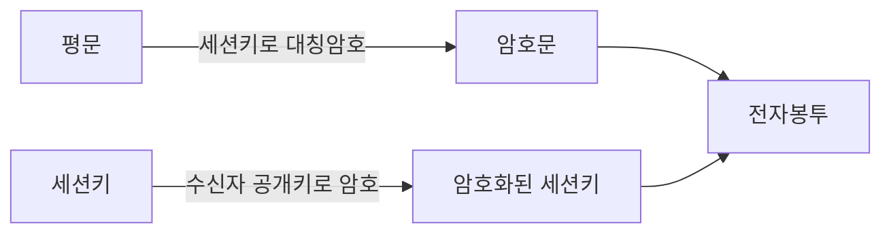

# 전자봉투(Digital Envelope) 생성·개봉 절차

## 1. 개요

### 가. 정의
> **대칭키의 빠른 암호화**와 **공개키의 안전한 키 분배**를 결합해, 대칭키(세션키)를 수신자 공개키로 암호화하여 함께 전달하는 하이브리드 암호 기법.

### 나. 목적
- 대용량 데이터 **기밀성** + 세션키 **안전 분배** 동시 달성

## 2. 생성 절차(송신자)

| 순서 | 내용 |
|---|---|
| 1 | 임의의 **세션키(대칭키)** 생성 |
| 2 | 세션키로 평문을 **대칭 암호화** → 암호문 |
| 3 | **수신자 공개키**로 세션키 암호화 |
| 4 | 암호문 + 암호화된 세션키 = **전자봉투** 전송 |

## 3. 개봉 절차(수신자)

| 순서 | 내용 |
|---|---|
| 1 | **수신자 개인키**로 암호화된 세션키 복호 → 세션키 획득 |
| 2 | 세션키로 암호문 **대칭 복호화** → 평문 복원 |

## 4. 특징
- 전자서명과 결합 시 **기밀성·무결성·부인방지** 동시 제공

---

> **한 줄 요약**: 전자봉투는 *평문을 세션키로 대칭 암호화하고 세션키를 수신자 공개키로 암호화* 해 함께 보내는 하이브리드 기법으로, 수신자는 개인키로 세션키를 풀어 평문을 복원한다.
