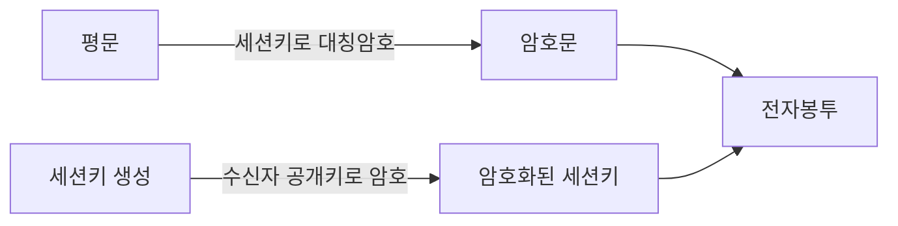

# 전자봉투(Digital Envelope) 생성·개봉 절차

## 1. 개요

### 가. 정의
> **대칭키의 빠른 암호화 성능**과 **공개키의 안전한 키 분배**를 결합해, 데이터는 대칭 세션키로 암호화하고 그 세션키만 수신자 공개키로 암호화하여 함께 전달하는 **하이브리드 암호** 기법.

전자봉투는 이름 그대로 "봉투" 은유로 이해하면 명확하다. 편지 본문(평문)은 값싸고 빠른 자물쇠(대칭 세션키)로 잠그고, 그 자물쇠 열쇠(세션키)는 오직 수신자만 열 수 있는 특수 봉투(수신자 공개키)에 넣어 함께 보낸다. 이렇게 하면 대량 데이터는 빠른 대칭키로 처리하면서도, 정작 어려운 **키 전달 문제는 공개키로 안전하게 해결**한다.

### 나. 등장 배경 및 필요성
대칭키 암호(AES 등)는 빠르고 대용량에 적합하지만, 송·수신자가 같은 키를 사전에 공유해야 하는 **키 분배 문제**가 근본 약점이다. 네트워크로 대칭키를 그냥 보내면 도청당하고, 미리 안전하게 나눠 갖는 것은 대규모 통신에서 비현실적이다. 반대로 공개키 암호(RSA 등)는 상대의 공개키만 알면 되므로 키 분배가 우아하지만, 연산이 무거워 **대용량 데이터를 직접 암호화하기엔 지나치게 느리다**. 전자봉투는 "빠른 암호화는 대칭키가, 안전한 키 교환은 공개키가"라는 역할 분담으로 두 방식의 단점을 서로 상쇄한다. 이 구조 덕에 실제로 암호화되는 데이터 양이 아무리 커도 공개키 연산은 **짧은 세션키 한 번**에만 쓰여 성능 부담이 최소화된다.

## 2. 생성 절차(송신자)

핵심은 **세션키를 매번 새로 생성**한다는 점이다. 세션키는 해당 통신 한 번에만 쓰고 버리는 임시 대칭키로, 노출되더라도 과거·미래 통신에 영향을 주지 않아 안전성을 높인다.

| 순서 | 내용 | 이유 |
|---|---|---|
| 1 | 임의의 **세션키(대칭키)** 생성 | 통신마다 일회성 → 노출 피해 최소화 |
| 2 | 세션키로 평문을 **대칭 암호화** → 암호문 | 대용량을 빠르게 처리 |
| 3 | **수신자 공개키**로 세션키 암호화 | 수신자만 개인키로 풀 수 있게 |
| 4 | 암호문 + 암호화된 세션키 = **전자봉투** 전송 | 데이터와 키를 함께 전달 |

## 3. 개봉 절차(수신자)

개봉은 생성의 역순이다. 수신자는 자신만 가진 **개인키**로 봉투 속 세션키를 먼저 꺼낸 뒤, 그 세션키로 암호문을 대칭 복호화해 평문을 복원한다. 공개키로 잠근 것은 오직 짝이 되는 개인키로만 열리므로, 도중에 봉투를 가로챈 제3자는 개인키가 없어 세션키를 얻지 못한다.

| 순서 | 내용 |
|---|---|
| 1 | **수신자 개인키**로 암호화된 세션키 복호 → 세션키 획득 |
| 2 | 세션키로 암호문 **대칭 복호화** → 평문 복원 |

## 4. 전자서명 결합(보안 서비스)

전자봉투만으로는 **기밀성**(내용 은닉)만 확보된다. 실제 보안 통신은 "이 메시지가 위조·변조되지 않았는가(무결성)", "정말 그 사람이 보냈는가(인증)", "보낸 사실을 부인할 수 없는가(부인방지)"까지 요구한다. 이를 위해 송신자가 메시지 해시를 **자신의 개인키로 서명**한 전자서명을 봉투와 함께 보낸다. 수신자는 송신자 공개키로 서명을 검증해, 서명이 성립하면 곧 그 개인키 소유자가 보냈고(인증·부인방지) 해시가 일치하므로 변조가 없음(무결성)을 동시에 확인한다.

| 서비스 | 실현 방법 |
|---|---|
| **기밀성** | 전자봉투(세션키를 수신자 공개키로 암호화) |
| **무결성** | 메시지 해시 비교 |
| **인증·부인방지** | 송신자 개인키로 전자서명, 공개키로 검증 |

이처럼 전자봉투(수신자 키 사용)와 전자서명(송신자 키 사용)을 결합하면 **기밀성·무결성·인증·부인방지 4대 보안 서비스**를 하나의 메시지로 제공할 수 있다.

## 5. 고려사항 및 시사점
전자봉투는 추상적 이론이 아니라 우리가 매일 쓰는 보안 통신의 실제 골격이다. **TLS의 키 교환**(RSA 방식), **S/MIME·PGP의 이메일 암호화**가 모두 이 구조를 따른다. 기술사 관점의 핵심은 신뢰의 뿌리에 대한 관리다. 첫째, 수신자 공개키가 진짜 그 사람의 것인지 보증하려면 **PKI·인증서(CA)** 기반의 신뢰 체계가 전제되어야 하며, 그렇지 않으면 중간자 공격에 세션키가 탈취된다. 둘째, 개인키·세션키의 생성·보관·폐기를 안전하게 하려면 **HSM과 키 수명주기 관리**가 필수다. 셋째, RSA 방식은 서버 개인키가 유출되면 과거 트래픽까지 복호될 위험이 있어, 최신 TLS는 **순방향 비밀성(PFS)** 을 제공하는 DH 계열 키 교환으로 이동하고 있다. 나아가 양자컴퓨터가 RSA를 위협하는 시대에는 봉투를 여는 공개키 부분을 **양자내성암호(PQC)** 로 대체하는 전환이 과제로 부상한다.

---

> **한 줄 요약**: 전자봉투는 *평문을 일회성 세션키로 빠르게 대칭 암호화하고 그 세션키만 수신자 공개키로 암호화* 해 함께 보내는 하이브리드 기법으로, 수신자는 개인키로 세션키를 풀어 복원하며 전자서명과 결합하면 기밀성·무결성·인증·부인방지를 모두 제공한다.
