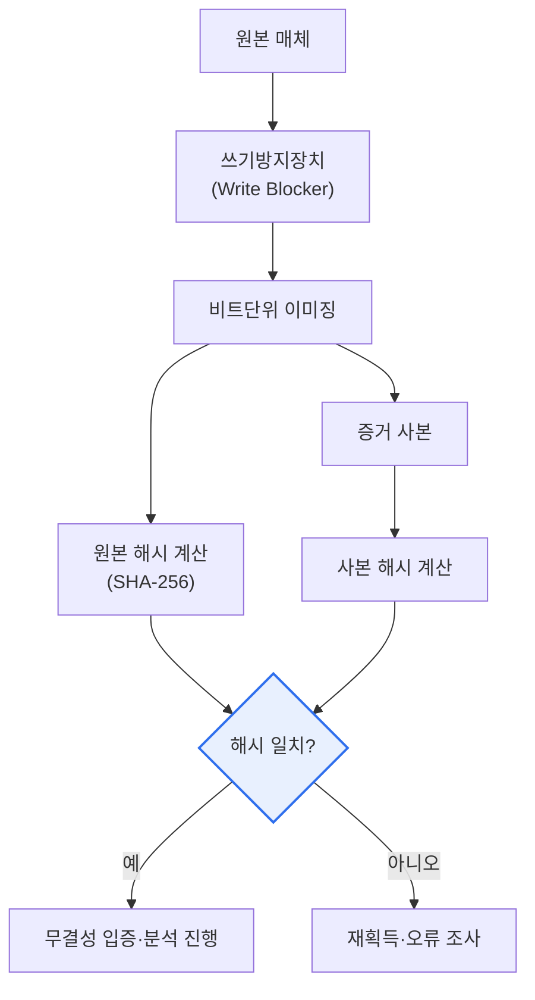

# 디지털 포렌식(Digital Forensics)

## 1. 개요

### 가. 디지털 포렌식의 개념과 등장 배경

> **디지털 포렌식(Digital Forensics)**은 컴퓨터·모바일·네트워크·클라우드 등 **디지털 기기에 저장·유통된 데이터를 법적 증거로서 수집·보존·분석·제출**하는 과학 수사 기법이다. 범죄 수사뿐 아니라 기업의 내부감사, 침해사고 대응(DFIR), 소송의 전자증거개시(e-Discovery)에 폭넓게 활용된다.

디지털 포렌식의 핵심은 '**증거능력(admissibility, 법정에서 증거로 인정받는 힘)**'에 있다. 아무리 결정적인 데이터를 찾아냈더라도 그것을 수집·분석하는 과정이 부적절하면 법정에서 증거로 채택되지 않는다. 예컨대 수사관이 압수한 노트북의 원본 디스크를 그대로 부팅해 파일을 열어 보면, 그 순간 접근시각(atime)·임시파일·로그가 바뀌어 "누군가 증거를 조작했을 수 있다"는 의심을 산다. 그 결과 실제로는 진범의 자료라 해도 증거 가치를 잃는다. 그래서 디지털 포렌식은 **원본을 그대로 보존하고 사본(이미지)으로 분석하며(무결성)**, 증거가 취득되어 법정에 제출되기까지의 모든 이동·보관·취급 이력을 빠짐없이 기록하고(**연계 보관성, Chain of Custody**), 같은 절차를 반복하면 같은 결과가 나오도록(**재현성**) 하는 엄격한 절차를 지킨다.

이 분야가 부상한 배경에는 범죄와 분쟁의 '디지털화'가 있다. 금융사기·기술유출·성범죄·내부자 부정 등 거의 모든 사건에서 결정적 단서가 스마트폰·PC·클라우드·메신저에 남는다. 동시에 데이터는 물리 증거와 달리 **비가시적이고, 쉽게 변조·삭제·은닉되며, 휘발성**을 갖는다. 전원을 끄면 메모리(RAM)의 암호키·실행 흔적이 사라지고, 덮어쓰기 한 번이면 삭제 데이터 복원이 어려워진다. 이런 특성 때문에 "어떻게 하면 증거를 훼손하지 않고 확보하느냐"라는 절차의 엄정성이 학문·실무의 중심 주제가 되었다. 우리나라도 형사소송법상 전자정보 압수·수색의 적법절차, 그리고 대검찰청·경찰의 디지털 증거 처리 표준절차를 통해 이 원칙들을 제도화하고 있다.

### 나. 기본 원칙 — 다섯 가지 요건

디지털 증거는 앞서 말한 특성 때문에 증거능력 확보를 위한 원칙 준수가 곧 생명이다. 다섯 원칙은 서로 독립적이지 않고 하나가 무너지면 전체 증거능력이 흔들리는 사슬 관계에 있다.

| 원칙 | 내용 | 실무 수단 |
|---|---|---|
| **정당성(적법성)** | 영장 등 적법한 절차로 수집 | 압수·수색영장, 참여권 보장 |
| **무결성(Integrity)** | 원본이 변경되지 않았음 입증 | 해시값(SHA-256) 취득·비교, 쓰기방지장치 |
| **연계 보관성(Chain of Custody)** | 취득~제출 전 과정 이력 추적 | 봉인·인수인계 기록, 접근 로그 |
| **재현성(Reproducibility)** | 동일 절차로 동일 결과 재현 | 검증된 도구·절차 문서화 |
| **신속성(Timeliness)** | 휘발성 증거를 신속 확보 | RAM·네트워크 세션 우선 수집 |

이 가운데 **무결성과 연계 보관성**이 법정 다툼의 핵심이다. 무결성은 수집 시점에 원본과 사본의 해시값(예: SHA-256)을 각각 계산해 두고, 이후 언제든 사본의 해시를 다시 계산해 최초값과 일치함을 보임으로써 "그동안 단 1비트도 바뀌지 않았다"를 수학적으로 증명한다. 연계 보관성은 "이 증거가 누구 손을 거쳐 어디에 보관되었는가"를 봉인·서명·인수인계 기록으로 끊김 없이 남겨, 중간에 바꿔치기·조작될 여지가 없었음을 보인다. 정당성은 이 모든 것의 전제다. 위법하게 수집한 증거는 이른바 **위법수집증거 배제법칙**에 따라 아무리 내용이 결정적이어도 증거능력이 부정될 수 있다.

## 2. 유형과 절차

### 가. 대상 매체별 유형

디지털 포렌식은 다루는 매체의 물리·논리 특성이 달라 대상별로 기술과 절차가 나뉜다. 저장장치를 다루는 **디스크 포렌식**, 폐쇄적 OS와 앱 데이터가 얽힌 **모바일 포렌식**, 흐르는 트래픽·로그를 잡는 **네트워크 포렌식**, 전원이 꺼지면 사라지는 휘발성 메모리(RAM)를 다루는 **메모리 포렌식**, 그리고 물리적 압수가 불가능하고 관할·소유 관계가 복잡한 **DB·클라우드 포렌식**이 있다.

| 유형 | 대상 | 특유의 난점 |
|---|---|---|
| **디스크 포렌식** | HDD·SSD 등 저장매체 | SSD의 TRIM·마모평준화로 삭제복원 어려움 |
| **모바일 포렌식** | 스마트폰·태블릿 | 암호화·잠금·앱별 저장구조, 벤더 종속 |
| **네트워크 포렌식** | 트래픽·방화벽/프록시 로그 | 휘발성 높음, 암호화 트래픽 |
| **메모리 포렌식** | 휘발성 메모리(RAM) | 전원 차단 시 소실, 실시간 확보 필요 |
| **DB·클라우드 포렌식** | DB·클라우드 저장 데이터 | 물리 압수 불가, 국외 관할·다중 임차 |

각 유형이 별도 기술로 갈라지는 이유는 '증거가 어디에, 얼마나 오래 남는가'가 다르기 때문이다. 예컨대 메모리 포렌식은 랜섬웨어·파일리스 악성코드의 복호화 키나 실행 중 프로세스가 오직 RAM에만 존재하므로, 전원을 끄기 전에 라이브로 덤프해야 한다. 반면 SSD는 TRIM 명령으로 삭제 블록이 즉시 비워지는 특성 때문에 전통적 디스크 복원 기법이 잘 통하지 않아, 삭제 즉시성이 오히려 증거 소실 위험이 된다. 이런 차이가 "휘발성 순서(order of volatility)에 따라 무엇부터 수집하느냐"라는 실무 판단으로 이어진다.

### 나. 표준 절차

절차는 현장에서 증거를 확보·보존하고(휘발성 우선), 원본 무결성을 유지한 사본을 만들어 이송하며(이미징·해시 검증), 데이터를 복원·분석한 뒤, 결과를 문서화해 제출하는 흐름을 따른다. 아래는 전체 절차의 개념도다.

| 절차 | 내용 | 무결성 통제 |
|---|---|---|
| **수집·보존** | 현장 증거 확보, 휘발성 순서 준수 | 봉인·촬영·현장기록 |
| **획득·이송** | 비트 단위 이미징(사본 생성) | 쓰기방지·원본/사본 해시 대조 |
| **분석** | 데이터 복원·타임라인·키워드 분석 | 사본만 분석, 원본 미접근 |
| **보고** | 분석 결과 문서화·증거 제출 | 재현 가능한 절차 명시 |

절차의 핵심 통제점을 그림으로 더 파고들면, '원본을 어떻게 건드리지 않고 사본을 만들어 그 무결성을 증명하는가'가 전 과정을 관통한다. 아래는 획득·검증 단계의 세부 아키텍처다.

여기서 **쓰기방지장치(Write Blocker)**는 원본 매체에 쓰기 명령이 가지 못하도록 물리·논리적으로 차단해, 이미징 과정에서 원본이 단 한 비트도 변하지 않게 보장한다. 이미징은 파일 단위가 아니라 **비트 단위(sector-by-sector)**로 떠서 삭제 영역·슬랙 공간까지 포함한다. 그런 뒤 원본과 사본의 해시가 일치함을 확인해야만 다음 단계로 넘어간다. 이 한 폭의 흐름이 곧 무결성·재현성·연계 보관성을 동시에 만족시키는 실무의 뼈대다.

## 3. 핵심 기술 및 활용 분야

디지털 포렌식은 여러 전문 기술을 동원한다. 원본 무결성을 유지하며 사본을 만드는 **이미징·복제**, 삭제·손상된 데이터를 되살리는 **데이터 복원(카빙)**, 파일 시스템 메타데이터를 시간순으로 엮어 사건을 재구성하는 **타임라인 분석**, 그리고 은닉·암호화·삭제로 증거를 지우려는 **안티포렌식에 대응**하는 기술이다.

| 기술 | 내용 | 활용 예 |
|---|---|---|
| **이미징·복제** | 원본 무결성 유지 사본 생성 | 압수 디스크 법적 사본 |
| **데이터 복원(카빙)** | 삭제·손상 데이터 시그니처 기반 복구 | 삭제 사진·문서 복원 |
| **타임라인 분석** | 파일·로그 시각 정보 재구성 | 침해 경로·행위 순서 규명 |
| **안티포렌식 대응** | 은닉·삭제·암호화 우회·탐지 | 스테가노그래피·와이핑 탐지 |

**데이터 복원(파일 카빙)**은 파일 시스템 정보가 지워졌어도 파일 고유의 시그니처(예: JPEG의 헤더·푸터 패턴)를 디스크 전체에서 스캔해 조각을 이어 붙여 복구한다. **타임라인 분석**은 파일의 생성·수정·접근 시각(MAC time)과 각종 로그를 하나의 시간축에 올려, "언제 무엇이 실행·전송·삭제되었는가"를 재구성한다. 침해사고에서 공격자의 최초 침투부터 권한 상승·측면 이동·데이터 유출까지의 순서를 밝히는 데 결정적이다. **안티포렌식 대응**은 증거를 없애려는 시도 — 로그 삭제, 파일 완전삭제(와이핑), 스테가노그래피 은닉, 타임스탬프 조작 — 을 역으로 탐지·복원하는 기술이다.

활용 분야도 넓다. 형사 범죄 수사가 대표적이지만, 기업에서는 영업비밀·기술유출 조사, 내부 부정·횡령 감사, 그리고 해킹·랜섬웨어에 대한 **침해사고 대응(DFIR, Digital Forensics & Incident Response)**에 쓰인다. 민사·형사 소송에서는 대량 전자문서를 검토·제출하는 **e-Discovery**가 별도의 전문 영역으로 발전했다. 예컨대 랜섬웨어 사고 대응에서는 메모리 포렌식으로 복호화 키·악성 프로세스를 확보하고, 네트워크 포렌식으로 C2(명령제어) 통신과 유출 경로를 밝히며, 디스크 포렌식으로 최초 감염 벡터를 규명하는 식으로 여러 기술이 함께 동원된다.

## 4. 심화 — 클라우드·모바일 확산과 AI 시대의 과제

디지털 포렌식의 최신 흐름은 '증거가 어디에나, 그러나 붙잡기는 더 어렵게' 흩어진다는 데서 비롯된다. 첫째, **클라우드 포렌식**의 부상이다. 데이터가 특정 물리 서버가 아니라 여러 리전·다중 임차(multi-tenant) 환경에 분산 저장되고, 서비스 제공자만 접근 가능한 경우가 많아, 전통적 '물리 압수'가 성립하지 않는다. 국외 서버에 저장된 데이터의 관할·주권 문제, 로그 보존 기간의 짧음, 스냅샷의 휘발성 등이 새로운 난점이다. 이에 따라 제공자 협조 절차, API·계정 기반 수집, 로그의 신뢰성 검증이 중요해졌다.

둘째, **모바일·메신저·IoT**의 폭증이다. 스마트폰은 강력한 전체 디스크 암호화와 앱별 샌드박스로 보호되어, 잠금 해제와 앱 데이터 해석이 큰 기술 장벽이 되었다. 메신저의 종단간 암호화, 자동 삭제 메시지, 클라우드 백업의 혼재는 증거 확보를 더 복잡하게 만든다. 웨어러블·차량·스마트홈 등 IoT 기기까지 증거원이 넓어지면서, 수집 대상 기기의 종류와 데이터 포맷이 폭발적으로 늘고 있다.

셋째, **대용량·자동화와 AI의 양면성**이다. 사건당 분석해야 할 데이터가 테라바이트 규모로 커지면서, 사람이 일일이 훑는 방식은 한계에 부딪혔다. 그래서 키워드·이미지 분류·이상행위 탐지에 AI·머신러닝을 적용해 분석을 자동화·가속하는 흐름이 뚜렷하다. 다만 AI가 판단 근거를 설명하기 어려우면(블랙박스) 법정에서 증거의 신뢰성을 다투기 어렵다는 문제, 그리고 **딥페이크 등 AI로 조작된 증거**를 가려내야 하는 새로운 과제가 동시에 생긴다. 즉 AI는 분석 도구이자 대응 대상이 되는 양면성을 띤다. 이런 흐름 속에서 도구의 신뢰성·검증(예: 표준화된 도구 테스트) 필요성이 더욱 강조된다.

## 5. 고려사항 및 시사점 (기술사 관점)

1. **절차 준수와 도구 신뢰성이 증거능력의 전제다.** 무결성·연계 보관성을 지키고, 결과가 검증된(재현 가능한) 도구를 사용해야 법정에서 증거로 인정받는다. 아무리 뛰어난 분석도 절차가 무너지면 무용지물이므로, 조직은 표준절차(SOP)와 도구 검증 체계를 갖춰야 한다.

2. **적법절차(정당성)와 프라이버시의 균형이 필요하다.** 전자정보는 범위가 방대해 무관한 개인정보까지 함께 수집될 위험이 크다. 영장 범위 내 선별 압수, 참여권 보장, 비관련 정보의 즉시 폐기 등 적법절차를 지키지 못하면 위법수집증거로 배제될 수 있다. 프라이버시 보호와 수사 실효성의 균형 설계가 관건이다.

3. **클라우드·모바일·IoT 확산에 대응하는 역량 확보가 시급하다.** 데이터가 분산·암호화·국외 저장되면서 수집 범위와 기술 난도가 급증했다. 클라우드 제공자 협조 체계, 국제공조(관할), 신기술 기기 대응 역량을 선제적으로 확보해야 증거 사각지대를 줄일 수 있다.

4. **안티포렌식과 대용량에 대한 기술적 대응이 필요하다.** 은닉·와이핑·타임스탬프 조작 등 증거인멸 기법이 고도화되고, 분석 대상 데이터는 폭증한다. 안티포렌식 탐지 기술과 AI 기반 자동 분석을 도입하되, AI의 설명가능성·신뢰성을 함께 확보해 증거의 법적 가치를 유지해야 한다.

5. **전문인력 양성과 표준·인증 체계가 지속가능성을 좌우한다.** 포렌식은 법·기술 융합 영역이라 숙련된 전문인력과 표준화된 절차·도구 인증이 뒷받침되어야 한다. 조직 차원의 교육·자격 체계와 국가·국제 표준 정합이 장기 경쟁력을 결정한다.

## 참고자료
- NIST SP 800-86, "Guide to Integrating Forensic Techniques into Incident Response": https://csrc.nist.gov/pubs/sp/800/86/final
- NIST Computer Forensics Tool Testing (CFTT) 프로그램: https://www.nist.gov/itl/ssd/software-quality-group/computer-forensics-tool-testing-program-cftt
- ISO/IEC 27037 (디지털 증거 식별·수집·보존 지침) 개요: https://www.iso.org/standard/44381.html
- 대검찰청 디지털 포렌식(디지털수사) 안내: https://www.spo.go.kr/

---

> **한 줄 요약**: 디지털 포렌식은 *디지털 증거를 무결성·연계 보관성을 지켜 수집·보존·분석·제출* 하는 과학 수사로, 정당성·무결성·연계보관성·재현성·신속성의 원칙 위에서 디스크·모바일·네트워크·메모리·클라우드 유형과 수집→획득→분석→보고 절차로 수행되며, 클라우드·모바일 확산과 AI 시대의 새로운 과제 속에서 절차 준수와 도구 신뢰성이 증거능력의 생명이다.
