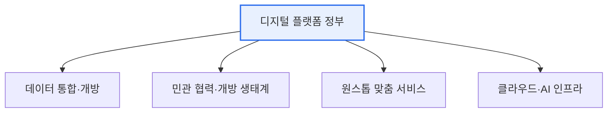

# 디지털 플랫폼 정부(Digital Platform Government)

## 1. 개요

### 가. 정의
> 정부의 모든 데이터와 서비스를 **하나의 디지털 플랫폼 위에 통합**하여, 국민·기업·정부가 함께 사회 문제를 해결하고 새로운 가치를 창출하도록 하는 정부 운영 패러다임.

디지털 플랫폼 정부의 핵심 발상은 정부를 '**서비스 제공자**'에서 '**플랫폼 운영자**'로 전환하는 것이다. 과거 전자정부가 부처별로 각각 시스템을 구축해 국민이 여러 사이트를 돌아다녀야 했다면, 디지털 플랫폼 정부는 데이터와 서비스를 하나의 플랫폼에 모아 민간이 그 위에서 혁신 서비스를 만들 수 있게 개방한다. 마치 스마트폰 앱스토어처럼, 정부가 데이터·기능을 API로 열어주면 민간이 이를 결합해 국민이 원하는 맞춤 서비스를 만드는 구조다. 국민은 여러 기관을 방문하지 않고 한 곳에서 모든 것을 해결하며(원스톱), 정부는 부처 칸막이를 넘어 데이터를 공유해 선제적·맞춤형 행정을 실현한다.

### 나. 등장 배경
부처별 사일로로 인한 서비스 단절, 국민의 디지털 경험 기대 상승, 데이터·AI 기술 성숙이 맞물리며, 기존 전자정부의 한계를 넘어 데이터 기반의 통합·개방형 정부로 나아갈 필요가 커졌다.

## 2. 특징 및 구성요소

디지털 플랫폼 정부는 몇 가지 축으로 구성된다. **데이터 통합·개방** 은 부처별로 흩어진 데이터를 연계·표준화해 공유하고 민간에 개방하는 기반이다. **민관 협력 생태계** 는 정부 데이터·서비스를 API로 열어 민간이 혁신 서비스를 창출하게 한다. **원스톱 맞춤 서비스** 는 국민이 한 곳에서 생애주기·상황에 맞는 서비스를 선제적으로 받게 한다. 이 모두를 **클라우드·AI 인프라** 가 떠받쳐 확장성과 지능화를 제공한다.

| 구성요소 | 내용 |
|---|---|
| **데이터 기반** | 부처 데이터 연계·표준화·개방(공공데이터) |
| **개방 생태계** | API 개방, 민관 협력 서비스 창출 |
| **서비스** | 원스톱·선제적·맞춤형 국민 서비스 |
| **인프라** | 클라우드 네이티브, AI, 보안 |

## 3. 기대효과

| 관점 | 효과 |
|---|---|
| **국민** | 한 곳에서 해결(원스톱), 선제·맞춤 서비스 |
| **기업** | 정부 데이터 활용 신산업·일자리 창출 |
| **정부** | 부처 협업·데이터 기반 과학행정, 효율화 |

## 4. 고려사항 및 시사점

1. **데이터 표준화·거버넌스가 성공의 전제**다. 부처별로 다른 데이터를 연계하려면 표준화와 품질관리, 소유·책임 체계가 먼저 갖춰져야 한다.
2. **개인정보 보호와 개방의 균형**이 관건이다. 데이터를 통합·개방할수록 프라이버시 위험이 커지므로, 마이데이터·가명처리·제로트러스트로 안전을 확보해야 한다.
3. **레거시 전환과 클라우드 네이티브 전환**이 필요하다. 부처별 노후 시스템을 클라우드로 옮기고 API 기반으로 재설계해야 진정한 플랫폼이 된다.

---

> **한 줄 요약**: 디지털 플랫폼 정부는 *정부의 데이터·서비스를 하나의 플랫폼에 통합·개방* 해 민관이 함께 가치를 창출하는 패러다임으로, 데이터 기반·개방 생태계·원스톱 서비스·클라우드 인프라를 축으로 하되 데이터 표준화와 개인정보 보호의 균형이 관건이다.
