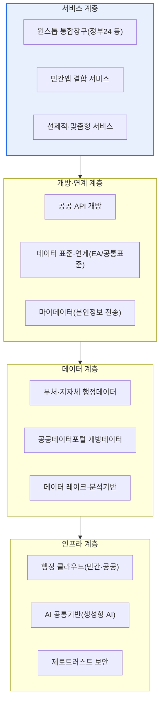
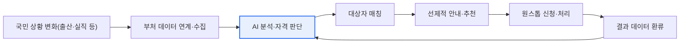

# 디지털 플랫폼 정부(Digital Platform Government)

## 1. 개요

### 가. 정의
> 정부의 모든 데이터와 서비스를 **하나의 디지털 플랫폼 위에 통합**하여, 국민·기업·정부가 함께 사회 문제를 해결하고 새로운 가치를 창출하도록 하는 정부 운영 패러다임이자, 정부를 '서비스 제공자'에서 '플랫폼 운영자·데이터 개방자'로 전환하는 정부 혁신 모델.

디지털 플랫폼 정부(DPG)의 핵심 발상은 정부를 '**서비스 제공자(Service Provider)**'에서 '**플랫폼 운영자(Platform Operator)**'로 전환하는 것이다. 과거 전자정부(e-Government)가 부처별로 각각 시스템을 구축해 국민이 여러 사이트를 돌아다녀야 했다면, 디지털 플랫폼 정부는 데이터와 서비스를 하나의 논리적 플랫폼에 모아 민간이 그 위에서 혁신 서비스를 만들 수 있게 개방한다. 마치 스마트폰 앱스토어처럼, 정부가 데이터·기능을 표준 API로 열어주면 민간이 이를 결합해 국민이 원하는 맞춤 서비스를 만드는 구조다.

이 전환이 갖는 의미는 단순한 시스템 통합이 아니라 **행정의 작동 원리 자체를 바꾼다**는 데 있다. 기존 전자정부는 '신청주의'에 기반해 국민이 자격을 알고 직접 찾아와 신청해야 서비스를 받을 수 있었다. 반면 DPG는 데이터를 부처 간에 공유·연계함으로써, 정부가 국민의 상황 변화(출산·실직·재난 등)를 먼저 인지하고 **선제적(Proactive)으로 서비스를 추천·제공**한다. 국민은 여러 기관을 방문하지 않고 한 곳에서 모든 것을 해결하며(원스톱), 정부는 부처 칸막이를 넘어 데이터를 공유해 과학적·맞춤형 행정을 실현한다.

### 나. 등장 배경 및 필요성
DPG가 부상한 배경에는 세 가지 구조적 압력이 겹쳐 있다. 첫째, **부처별 사일로(Silo)로 인한 서비스 단절**이다. 그동안 각 부처·지자체가 독자적으로 정보시스템을 구축해 데이터가 기관 경계 안에 갇히면서, 국민은 동일한 서류를 여러 기관에 반복 제출해야 했고 부처 간 협업 행정은 사실상 불가능했다. 둘째, **국민의 디지털 경험 기대 상승**이다. 민간 플랫폼(금융·쇼핑·모빌리티)이 제공하는 초개인화·즉시성 수준을 국민이 공공 서비스에도 요구하게 되었다. 셋째, **데이터·AI·클라우드 기술의 성숙**이다. 대규모 데이터 연계, 생성형 AI 기반 상담, 클라우드 네이티브 확장이 기술적으로 가능해지면서 통합·개방형 정부를 실제로 구현할 토대가 마련되었다.

우리나라의 경우 세계 최고 수준의 전자정부(UN 전자정부 평가 상위권)를 오랫동안 유지해 왔음에도, 개별 시스템의 우수성이 '국민이 체감하는 통합 경험'으로 이어지지 못한다는 한계가 지적되어 왔다. DPG는 이 간극을 데이터 중심의 통합·개방 아키텍처로 메우려는 국가적 시도로 이해할 수 있다.

## 2. 전체 구조 및 구성요소

디지털 플랫폼 정부는 데이터 계층, 개방·연계 계층, 서비스 계층, 인프라 계층이 수직으로 쌓인 다층 구조로 볼 수 있다. 아래 개념도는 이 전체 구조를 나타낸다.

```mermaid
flowchart TB
  subgraph SVC["서비스 계층"]
    S1["원스톱 통합창구(정부24 등)"]
    S2["민간앱 결합 서비스"]
    S3["선제적·맞춤형 서비스"]
  end
  subgraph OPEN["개방·연계 계층"]
    O1["공공 API 개방"]
    O2["데이터 표준·연계(EA/공통표준)"]
    O3["마이데이터(본인정보 전송)"]
  end
  subgraph DATA["데이터 계층"]
    D1["부처·지자체 행정데이터"]
    D2["공공데이터포털 개방데이터"]
    D3["데이터 레이크·분석기반"]
  end
  subgraph INFRA["인프라 계층"]
    I1["행정 클라우드(민간·공공)"]
    I2["AI 공통기반(생성형 AI)"]
    I3["제로트러스트 보안"]
  end
  SVC --> OPEN --> DATA --> INFRA
  style SVC fill:#e8f0fe,stroke:#2f6fed,stroke-width:2px
```

**데이터 계층**은 부처·지자체에 흩어진 행정 데이터와 공공데이터포털(data.go.kr)의 개방 데이터, 그리고 이를 분석 가능한 형태로 모으는 데이터 레이크·분석 기반으로 구성된다. DPG의 모든 가치는 결국 데이터에서 출발하므로, 이 계층의 **품질·표준·연계 가능성**이 전체 성패를 좌우한다. 데이터가 표준화되지 않거나 기관 밖으로 나올 수 없으면 상위 계층은 작동하지 않는다.

**개방·연계 계층**은 데이터와 기능을 외부가 쓸 수 있게 만드는 '접점'이다. 공공 API를 표준 방식으로 개방하고, 기관마다 다른 데이터 모델을 공통 표준·전사아키텍처(EA)로 정합화하며, 마이데이터(본인정보 전송요구권)를 통해 국민이 자신의 행정정보를 원하는 곳으로 옮길 수 있게 한다. 이 계층이 두꺼울수록 민간 혁신의 여지가 커진다.

**서비스 계층**은 국민이 실제로 만나는 지점이다. 정부24 같은 통합창구에서 원스톱으로 처리하고, 민간 앱이 공공 API를 결합해 새로운 서비스를 만들며, 데이터 분석에 기반해 자격이 있는 국민에게 먼저 서비스를 안내한다. **인프라 계층**은 이 모두를 떠받치는 클라우드 네이티브 기반, AI 공통 기반, 그리고 개방과 함께 필연적으로 커지는 위험을 통제하는 제로트러스트 보안으로 이뤄진다.

| 구성요소 | 핵심 내용 | 대표 수단 |
|---|---|---|
| **데이터 기반** | 부처 데이터 연계·표준화·개방 | 공공데이터포털, 데이터 표준, EA |
| **개방 생태계** | API 개방, 민관 협력 서비스 창출 | Open API, 마이데이터 |
| **서비스** | 원스톱·선제적·맞춤형 국민 서비스 | 정부24, 통합 로그인 |
| **인프라** | 클라우드 네이티브, AI, 보안 | 행정 클라우드, 생성형 AI, 제로트러스트 |

## 3. 핵심 원리 — 데이터 흐름과 서비스 생성 프로세스

DPG가 실제로 '선제적 맞춤 서비스'를 만들어내는 과정은 데이터가 수집·연계·분석되어 서비스로 환류되는 순환으로 설명된다. 아래 프로세스 상세도는 국민의 상황 변화가 어떻게 서비스로 이어지는지를 나타낸다.

```mermaid
flowchart LR
  E["국민 상황 변화(출산·실직 등)"] --> C["부처 데이터 연계·수집"]
  C --> A["AI 분석·자격 판단"]
  A --> M["대상자 매칭"]
  M --> N["선제적 안내·추천"]
  N --> P["원스톱 신청·처리"]
  P --> F["결과 데이터 환류"]
  F --> A
  style A fill:#e8f0fe,stroke:#2f6fed,stroke-width:2px
```

이 흐름의 출발점은 **이벤트(상황 변화)** 다. 예컨대 출생 신고가 접수되면, 그 사실이 여러 부처의 데이터와 연계되어 '이 가정이 받을 수 있는 지원'이 자동으로 도출된다. 과거에는 부모가 출산지원금·아동수당·전기료 감면 등을 각각 다른 기관에 따로 신청해야 했지만, DPG 지향점에서는 한 번의 신고가 관련 서비스 전체를 촉발한다. 실제로 정부는 이런 생애주기 묶음 서비스('행복출산', '안심상속' 등 원스톱 서비스)를 확대해 왔으며, DPG는 이를 데이터 연계로 더 폭넓게 자동화하려는 방향이다.

두 번째 단계인 **AI 분석·자격 판단**에서는 연계된 데이터를 근거로 국민이 어떤 서비스의 수급 자격을 갖는지 판정한다. 여기서 중요한 것은 '판단의 근거가 되는 데이터의 정확성과 최신성'이다. 소득·가구·거주 정보가 부처마다 다르게 관리되면 잘못된 자격 판정이 나올 수 있으므로, 데이터 표준화와 품질관리가 이 단계의 신뢰성을 결정한다.

세 번째 단계인 **매칭·안내·처리**는 판정 결과를 실제 서비스로 연결한다. 대상자에게 먼저 안내(Push)하고, 국민이 동의하면 원스톱으로 신청·처리한다. 마지막 **환류(Feedback)** 단계에서 처리 결과가 다시 데이터로 축적되어 다음 분석의 정확도를 높인다. 이처럼 DPG는 일회성 전산화가 아니라 **데이터가 서비스를 낳고 서비스가 다시 데이터를 낳는 선순환 구조**를 지향한다는 점이 전자정부와 근본적으로 다르다.

## 4. 전자정부와의 비교 — 차이가 생기는 이유

DPG를 흔히 '전자정부의 다음 단계'로 부르지만, 둘의 차이는 기술 세대의 문제가 아니라 **운영 철학의 문제**다. 전자정부는 '정부 업무의 전산화·온라인화'에 초점을 두어, 오프라인으로 하던 민원을 웹에서 처리할 수 있게 만드는 것이 목표였다. 그 결과 각 기관은 자기 업무를 잘 전산화했지만, 기관 사이의 경계는 그대로 남았다. 반면 DPG는 '데이터와 서비스의 통합·개방'에 초점을 두어, 기관 경계 자체를 데이터 흐름으로 허무는 것을 목표로 한다.

| 구분 | 전자정부(e-Gov) | 디지털 플랫폼 정부(DPG) |
|---|---|---|
| **관점** | 정부 업무의 전산화·온라인화 | 데이터·서비스의 통합·개방 |
| **구조** | 부처별 개별 시스템(사일로) | 하나의 논리적 플랫폼 |
| **서비스 방식** | 신청주의(국민이 찾아옴) | 선제·맞춤(정부가 먼저 안내) |
| **민간 역할** | 사용자(서비스 이용) | 협력자(서비스 공동 창출) |
| **인프라** | 자체 구축(온프레미스) | 클라우드 네이티브 |
| **데이터** | 기관 내 폐쇄 | 연계·표준·개방 |

이 차이가 실무에서 중요한 이유는, DPG로 가려면 **기술보다 거버넌스와 제도를 먼저 바꿔야 하기 때문**이다. 예를 들어 부처 A의 데이터를 부처 B가 쓰려면 개인정보보호법상 근거, 데이터 소유·책임 관계, 표준 정합이 선행되어야 한다. 즉 DPG의 병목은 대개 '기술 구현'이 아니라 '데이터를 나눠 쓸 수 있게 하는 법·제도·표준'에 있다. 이 지점을 이해하지 못하면 아무리 좋은 클라우드·AI를 도입해도 결과는 또 하나의 전자정부에 그친다.

**구체 사례**로, 공공데이터포털을 통해 개방된 데이터는 수만 종에 이르며 민간이 이를 활용해 부동산·교통·날씨·창업 등 다양한 앱을 만들어 왔다. 또한 '정부24'는 여러 기관 민원을 한 창구에서 처리하는 통합 서비스로 자리 잡았고, 국세청 홈택스의 연말정산 간소화는 흩어진 소득·지출 자료를 자동 수집해 제공함으로써 '자료를 모아주는 정부'의 대표 사례로 꼽힌다. 이들은 모두 DPG가 지향하는 '데이터 연계·개방을 통한 국민 편익'의 초기 형태로 볼 수 있다.

## 5. 심화 — 추진 방향과 최신 동향

DPG는 특정 시스템 하나가 아니라 **여러 정책·표준·인프라가 결합된 중장기 국가 전략**이므로, 최신 동향은 몇 갈래로 나뉜다. 다만 세부 추진 일정·예산 규모는 시점에 따라 달라질 수 있어, 여기서는 방향성 중심으로 일반화해 정리한다.

첫째, **행정의 클라우드 네이티브 전환**이다. 부처별 노후 시스템을 단순히 클라우드로 옮기는 것(Lift & Shift)을 넘어, API 기반으로 재설계해 데이터·기능이 서로 호출될 수 있는 구조로 바꾸는 것이 핵심이다. 이 과정에서 공공·민간 클라우드의 역할 분담, 망분리 정책의 완화·조정, 클라우드 보안인증(CSAP)과의 정합이 쟁점이 된다.

둘째, **생성형 AI의 행정 접목**이다. 최근에는 국민이 자연어로 질문하면 여러 부처 서비스를 가로질러 답을 찾아주는 'AI 행정 비서·챗봇' 형태의 시도가 확산되고 있다. 이는 DPG의 데이터·API 개방이 선행되어야만 가능한 응용으로, '개방된 데이터 위에서 AI가 통합 경험을 완성한다'는 그림에 해당한다. 다만 생성형 AI의 환각(Hallucination)·책임소재 문제 때문에, 행정 영역에서는 근거 데이터에 기반한 검증 가능한 답변(RAG 등)과 사람의 최종 확인이 강조된다.

셋째, **마이데이터의 공공 확장**이다. 금융권에서 시작된 마이데이터(본인정보 전송요구권)를 행정·의료 등으로 넓혀, 국민이 자신의 행정정보를 원하는 기관·앱으로 직접 옮겨 활용하게 하려는 흐름이다. 이는 '데이터의 통제권을 국민에게 돌려준다'는 점에서 DPG 개방 철학의 핵심축이며, 동시에 강력한 개인정보 보호 장치를 요구한다.

## 6. 고려사항 및 시사점 (기술사 관점)

1. **데이터 표준화·거버넌스가 성공의 전제다.** 부처별로 다른 데이터를 연계하려면 데이터 표준, 품질관리, 소유·책임(데이터 오너십) 체계, 참조·마스터 데이터 관리가 먼저 갖춰져야 한다. 거버넌스 없는 개방은 '연결되지 않는 데이터의 나열'로 끝난다. 기술사 관점에서는 EA·데이터 아키텍처와 데이터 품질관리 체계를 DPG의 선행 과제로 제시할 수 있다.

2. **개방과 개인정보 보호의 균형이 관건이다.** 데이터를 통합·개방할수록 프라이버시·재식별 위험이 커진다. 마이데이터에 의한 동의 기반 전송, 가명·익명처리, 제로트러스트(내부에서도 검증), 접근통제·감사로그를 통해 '개방하되 안전한' 구조를 설계해야 한다. 개방의 편익과 보호의 비용 사이 트레이드오프를 데이터 민감도별로 차등 설계하는 것이 실무 전략이다.

3. **레거시 전환과 클라우드 네이티브 재설계가 필요하다.** 단순 이전이 아니라 마이크로서비스·API 게이트웨이 기반으로 재설계해야 진정한 플랫폼이 된다. 이때 전면 재구축의 위험을 줄이기 위해 스트랭글러 패턴(Strangler Fig) 등 점진적 전환 전략과, 전환 중 서비스 연속성을 보장하는 이행 계획이 함께 요구된다.

4. **민관 협력 생태계의 지속가능성을 설계해야 한다.** 정부가 API를 열어도 민간이 참여할 유인(안정적 SLA, 명확한 이용약관, 수익모델)이 없으면 생태계는 형성되지 않는다. API의 버전 관리·품질 보증·개발자 지원(개발자 포털, 샌드박스)까지 포함한 '플랫폼 운영 역량'이 정부에 요구된다는 점이 전자정부와 결정적으로 다르다.

5. **디지털 포용(Digital Inclusion)을 병행해야 한다.** 선제·맞춤 서비스가 고도화될수록 고령층·장애인·디지털 취약계층이 소외될 위험이 있다. 온라인 채널과 함께 오프라인·대면·상담 채널을 유지하고, 접근성(웹 접근성 지침) 준수와 쉬운 이용 설계를 병행해야 '모두를 위한 플랫폼'이 된다.

## 참고자료
- 공공데이터포털: https://www.data.go.kr
- 정부24: https://www.gov.kr
- 디지털플랫폼정부위원회: https://www.dpg.go.kr

---

> **한 줄 요약**: 디지털 플랫폼 정부는 *정부의 데이터·서비스를 하나의 플랫폼에 통합·개방* 해 민관이 함께 가치를 창출하고 선제·맞춤 행정을 실현하는 패러다임으로, 데이터 표준·거버넌스와 개인정보 보호의 균형, 클라우드 네이티브 재설계, 지속가능한 민관 생태계 설계가 성패를 가른다.
