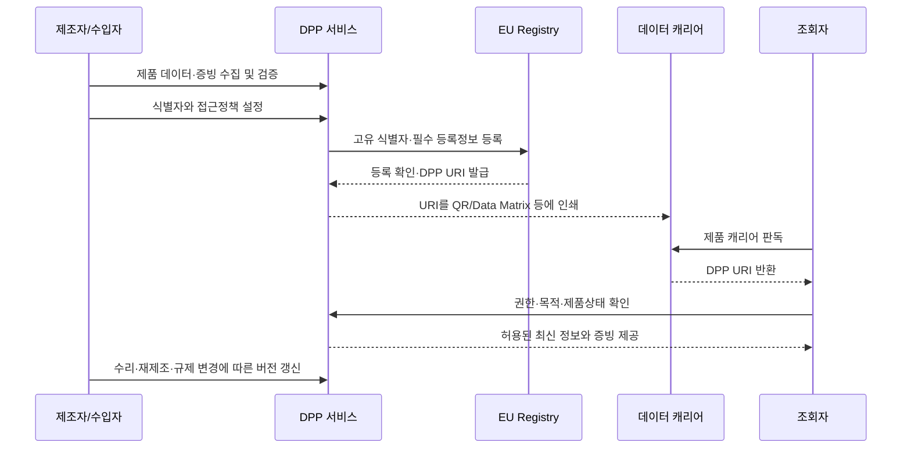

# 디지털 제품 여권(DPP, Digital Product Passport)

## 1. 개요

> **디지털 제품 여권(DPP)**은 제품·부품·소재에 관한 정보를 제품별 디지털 식별자와 연결하여 전자적으로 조회·교환할 수 있게 하는 데이터 체계이다.

유럽연합의 에코디자인 규정(ESPR, Regulation (EU) 2024/1781)은 지속가능한 제품의 설계와 유통을 촉진하기 위한 제도적 기반으로 DPP를 도입했다.

DPP의 목적은 단순히 QR 코드에 제품 설명서를 넣는 것이 아니다.

제품의 원산지, 재료, 내구성, 수리성, 환경성능, 재사용·재활용 정보처럼 제품 생애주기 전반에서 필요한 정보를 이해관계자에게 표준화된 방식으로 제공하는 것이 핵심이다.

소비자는 구매와 사용 단계에서 제품의 지속가능성 정보를 확인할 수 있다.

수리업체는 분해 방법과 부품 정보를 확인하여 수리 가능성을 높일 수 있다.

재활용업체는 소재 구성과 유해물질 정보를 이용하여 해체·분류·재활용 공정을 최적화할 수 있다.

공공기관과 세관은 제품의 등록 여부와 규제 준수 여부를 확인할 수 있다.

DPP가 등장한 배경에는 공급망의 다단계화와 제품 정보의 단절이 있다.

제조사가 보유한 소재·공정 정보가 유통업체, 소비자, 수리업체, 재활용업체까지 전달되지 않으면 순환경제를 설계하기 어렵다.

종이 문서나 제조사별 폐쇄 포털은 정보 갱신과 상호운용성에 한계가 있다.

따라서 DPP는 물리적 제품과 디지털 정보를 식별자·데이터 캐리어·접근정책으로 연결하는 정보관리 아키텍처로 이해해야 한다.

## 2. 법적 배경과 도입 필요성

### 가. ESPR과 제품별 위임법

ESPR은 모든 제품에 동일한 정보를 한 번에 요구하는 포괄적 데이터베이스가 아니다.

유럽연합 집행위원회가 제품군별 위임법(delegated act)을 제정하면 해당 제품군의 DPP 정보항목과 접근권한이 구체화된다.

배터리, 섬유, 철강, 건설제품 등 제품군마다 환경영향과 공급망 구조가 다르므로 동일한 스키마를 그대로 적용할 수 없기 때문이다.

따라서 기업은 법률의 일반원칙만 확인하는 데 그치지 말고 자신이 판매하는 제품군의 위임법과 별도 산업법을 함께 확인해야 한다.

ESPR 외에도 배터리 규정, 포장·포장폐기물 규정, 핵심원자재법, 장난감 안전 규정, 건설제품 규정 등이 DPP와 연결될 수 있다.

이처럼 DPP는 단일 솔루션의 이름이라기보다 제품 규제와 데이터 인프라가 결합된 제도·기술 프레임워크다.

### 나. 도입 필요성

첫째, 환경성능을 제품 생애주기에서 관리하려면 설계·조달·제조·유통·사용·수리·폐기 데이터가 이어져야 한다.

둘째, 규제기관이 요구하는 자료를 제품별로 빠르게 제출하려면 원천 데이터와 증빙자료의 추적성이 필요하다.

셋째, 공급망 참여자가 서로 다른 시스템을 사용하므로 표준 식별자와 교환 규칙이 없으면 데이터 재입력과 오류가 누적된다.

넷째, 제품이 중고·수리·재제조 단계로 이동할 때도 동일 제품의 이력과 상태를 이어받아야 순환 비즈니스가 가능하다.

다섯째, 제품 정보의 공개 범위를 소비자용·사업자용·규제기관용으로 나누어야 영업비밀과 투명성을 함께 관리할 수 있다.

## 3. DPP 전체 개념도와 구성요소

다음 개념도는 물리적 제품에서 데이터 제공과 규제 확인까지의 전체 구조를 나타낸다.

### 가. 제품과 데이터 캐리어

데이터 캐리어는 제품과 디지털 기록을 연결하는 물리적 접점이다.

QR 코드나 Data Matrix는 저비용으로 인쇄할 수 있고 스마트폰으로 읽기 쉽다.

RFID와 NFC는 비가시선 판독과 자동화된 물류 처리에 유리하지만 태그 비용과 인프라가 추가된다.

중요한 점은 캐리어에 모든 제품 정보를 직접 저장하지 않는다는 것이다.

캐리어에는 제품 또는 DPP를 찾기 위한 식별자·URI를 담고, 상세 데이터는 적절한 서비스에서 관리하는 방식이 일반적이다.

따라서 라벨이 훼손되거나 제품이 재포장되었을 때에도 식별자의 지속성과 재발급 정책을 설계해야 한다.

### 나. 식별자와 URI

제품 식별자는 특정 제조사의 내부 관리번호와 달리 공급망 전체에서 충돌하지 않고 가능한 한 제품의 생애주기 동안 유지되어야 한다.

제품 단위 식별자, 모델·배치 식별자, 구성품 식별자, 경제운영자 식별자를 분리하면 제품과 구성품의 관계를 표현하기 쉽다.

Registry는 등록된 고유 식별자와 필수 등록 메타데이터를 바탕으로 DPP의 URI를 제공하거나 연결한다.

이때 URI는 단순한 웹 주소가 아니라 식별, 인증, 버전, 접근정책, 리디렉션을 포함하는 운영 계약으로 다루어야 한다.

제품이 리퍼비시되거나 구성품이 교체되면 기존 기록을 삭제하기보다는 새로운 상태·이벤트·버전을 연결하여 이력을 보존하는 편이 감사와 분쟁 대응에 유리하다.

### 다. Registry와 상세 데이터 저장소

EU DPP Registry는 각 DPP의 고유 식별자와 법에서 정한 등록정보를 관리하는 중앙 등록 지점이다.

반면 상세 제품 데이터는 경제운영자 또는 DPP 서비스 제공자가 보유하는 분산형 저장 구조를 취할 수 있다.

이 구조는 중앙기관이 모든 제조 데이터와 영업비밀을 직접 저장하지 않으면서도, 제품별 등록과 고유성 확인을 가능하게 한다.

즉 DPP는 중앙화와 분산화를 이분법적으로 선택하는 구조가 아니라, 등록·탐색은 중앙화하고 상세 데이터의 보유·통제는 분산하는 하이브리드 구조다.

상세 데이터 서비스가 변경되어도 URI 해석과 이전 데이터의 가용성이 유지되어야 하므로 사업자 변경·파산·서비스 종료에 대비한 백업과 이전 절차가 필요하다.

### 라. 이해관계자와 권한

제조자와 수입자 등 경제운영자는 DPP를 만들고 정보의 정확성·완전성·갱신성을 관리할 일차적 책임을 진다.

유통업자와 온라인 마켓플레이스는 제품이 유효한 식별자와 필요한 정보를 갖추었는지 확인하는 역할을 수행할 수 있다.

소비자는 제품의 지속가능성과 사용·수리·폐기 정보를 이해하기 쉬운 화면으로 조회한다.

전문 수리업체는 제품별 분해·수리 절차와 호환 부품 정보를 제한된 권한으로 조회한다.

재활용업체는 소재 구성과 처리 시 주의사항을 확인하되, 제조사의 민감한 제조공정 정보에는 접근하지 않아야 한다.

시장감시기관과 세관은 등록 식별자, 적합성 증빙, 관련 규제정보를 검증한다.

## 4. 데이터 모델과 동작 절차

### 가. 정보 계층

DPP 데이터는 공개범위와 변경주기를 기준으로 계층화하는 것이 좋다.

공개 정보에는 제품 식별, 기본 사양, 수리·재활용 안내, 환경 관련 주요 지표를 넣을 수 있다.

사업자 정보에는 공급망 증빙, 배치별 품질자료, 감사 로그, 상세 소재 명세를 넣을 수 있다.

규제기관 전용 정보에는 적합성 평가와 세관 확인에 필요한 원본 증빙, 시험성적서, 책임자 정보를 둘 수 있다.

이 계층을 분리하지 않으면 소비자에게 과도한 정보를 노출하거나, 반대로 규제기관 검증에 필요한 증빙이 부족해진다.

### 나. 핵심 데이터 요소

다음 표는 일반적인 DPP 설계에서 고려할 데이터 요소를 정리한 것이다.

| 구분 | 주요 데이터 | 관리 관점 |
|---|---|---|
| 식별 | 제품·모델·배치·구성품·사업자 ID | 전역 유일성, 지속성, 관계 표현 |
| 제품 | 소재, 원산지, 성능, 안전, 규격 | 원천 시스템과 기준정보 연계 |
| 순환성 | 수리성, 분해성, 재사용, 재활용, 부품 | 생애주기별 갱신 |
| 환경성 | 탄소·에너지·자원·유해물질 지표 | 산정방법과 증빙 추적 |
| 증빙 | 시험성적서, 적합성 선언, 감사자료 | 위변조 방지와 보존기간 |
| 접근 | 소비자·사업자·당국별 권한 | 최소권한과 목적 제한 |
| 이력 | 수리, 교체, 재제조, 소유·상태 이벤트 | 버전과 시간순 무결성 |

표의 항목은 단순 필드 목록이 아니라 데이터 책임과 품질 규칙으로 연결되어야 한다.

예를 들어 탄소배출량은 숫자 하나만 저장할 것이 아니라 산정 경계, 기준연도, 배출계수, 검증주체, 단위와 함께 보존해야 비교와 감사를 할 수 있다.

소재 정보도 전체 중량의 합이 제품 총중량과 일치하는지, 소재 분류체계가 재활용업체의 분류체계와 호환되는지 확인해야 한다.

### 다. 등록·조회·갱신 절차

첫 단계는 제품 데이터의 수집이 아니라 데이터 책임자의 지정이다.

어떤 조직이 소재 데이터를 제공하고 어떤 조직이 환경성능을 검증하는지 정하지 않으면, 나중에 정보가 바뀌었을 때 수정 책임을 추적할 수 없다.

둘째, 제품·배치·구성품 식별자를 생성하고 원천 시스템의 내부 키와 매핑한다.

셋째, 필수 등록정보와 상세 DPP 데이터를 품질검사한 뒤 Registry에 등록한다.

넷째, 반환된 URI를 데이터 캐리어로 제품·포장·동봉 문서에 연결한다.

다섯째, 조회 시 사용자 역할과 제품 상태에 따라 필요한 데이터만 제공한다.

여섯째, 수리·부품교체·재제조·규제 변경을 새로운 버전이나 이벤트로 기록한다.

이 절차에서 등록과 상세 데이터 저장을 분리하면 Registry 장애가 상세 데이터 전체의 장애로 전이되는 것을 줄일 수 있다.

## 5. 데이터 거버넌스와 기술적 고려사항

### 가. 데이터 품질

DPP의 신뢰성은 화면의 디자인보다 원천 데이터의 품질에 의해 결정된다.

정확성은 실제 제품과 기록이 일치하는지의 문제이고, 완전성은 규정상 필수항목이 빠지지 않았는지의 문제다.

적시성은 제품 변경이나 규제 변경이 적절한 시간 안에 반영되는지의 문제다.

상호운용성은 서로 다른 사업자의 데이터가 동일한 의미체계와 단위로 교환되는지의 문제다.

따라서 데이터 카탈로그, 공통 코드, 단위 표준, 검증규칙, 담당자, 품질지표를 데이터 계약으로 명시해야 한다.

예를 들어 부품 중량을 kg와 g로 혼용하면 합계 검증이 실패하고, 재활용 판단에 필요한 소재코드가 사업자마다 다르면 자동 분류가 작동하지 않는다.

### 나. 보안과 프라이버시

DPP는 공개 데이터와 영업비밀이 공존하는 시스템이므로 모든 정보를 공개하는 것이 투명성은 아니다.

소비자에게는 최소한의 제품·환경정보를 제공하고, 수리업체에는 안전한 분해에 필요한 정보만 제공하며, 규제기관에는 법정 검증에 필요한 증빙을 제공하는 목적 기반 접근이 필요하다.

서비스 간 통신은 전송구간 암호화와 상호 인증으로 보호하고, 관리자와 사업자 계정에는 다중인증과 세분화된 권한을 적용해야 한다.

등록·변경·조회 이벤트는 감사 로그로 남겨 누가 언제 어떤 데이터를 바꾸고 열람했는지 확인할 수 있어야 한다.

악의적인 사업자가 친환경 수치나 원산지를 조작할 수 있으므로 데이터의 출처, 서명, 검증주체, 변경 이력을 함께 보존해야 한다.

블록체인을 사용하면 일부 무결성 문제를 보조할 수 있지만, 잘못 입력된 원본 데이터의 진실성을 자동으로 보장하지는 않는다.

따라서 전자서명, 검증 가능한 증명, 독립 감사, 원천 데이터 검증이 블록체인 도입보다 우선한다.

### 다. 가용성과 사업자 변경

DPP는 제품의 예상 수명 동안 접근 가능해야 하므로 제품을 판매한 사업자가 서비스를 중단하는 상황을 고려해야 한다.

제3자 서비스 제공자에게 백업을 맡기거나, 이전 가능한 포맷과 보존정책을 마련하여 사업자 변경 시 데이터를 이관해야 한다.

캐리어가 연결하는 URI의 도메인이나 서비스가 바뀌면 기존 제품의 라벨이 무용지물이 되므로 리디렉션, 도메인 위임, 재해복구, 서비스 수준 목표를 설계해야 한다.

가용성은 24시간 웹 화면이 열리는 것만 뜻하지 않는다.

오프라인 물류나 재활용 현장에서도 최소한의 식별과 안전정보를 확보할 수 있도록 캐시·백업·재시도 정책을 마련해야 한다.

## 6. 기존 기술과의 비교

### 가. 바코드·QR 코드와 DPP

바코드와 QR 코드는 데이터를 표현하고 읽는 매체이며, DPP는 식별자·데이터·거버넌스·접근정책을 포함하는 체계다.

따라서 QR 코드가 있다고 해서 자동으로 DPP가 되는 것은 아니다.

일반 QR은 제조사 웹페이지로 연결되는 데 그칠 수 있지만, DPP는 제품의 고유성과 생애주기 데이터, 권한별 접근, 등록·감사 규칙을 함께 정의한다.

반대로 DPP는 QR이나 Data Matrix를 활용할 수 있으므로 기존 물류 인프라와 결합할 수 있다.

### 나. 제품 추적성과 DPP

추적성(traceability)은 제품이 공급망의 어느 단계에 있었는지를 추적하는 데 초점을 둔다.

DPP는 추적성 외에도 제품의 환경성능, 수리성, 재활용성, 적합성 증빙을 다양한 사용자에게 제공한다.

즉 추적성은 DPP의 중요한 데이터 원천이지만 DPP 전체와 동일하지 않다.

### 다. 블록체인 기반 이력과 DPP

블록체인은 참여자 간 합의된 원장을 제공할 수 있지만, 모든 상세 데이터를 온체인에 올리면 비용·성능·삭제권·영업비밀 문제가 커진다.

DPP는 중앙 Registry와 사업자별 상세 저장소를 조합하는 하이브리드 구조가 가능하다.

따라서 블록체인은 선택적 무결성 앵커나 증명 로그에 활용하고, 제품 데이터의 주 저장소로 반드시 채택할 필요는 없다.

| 비교 항목 | 일반 QR/바코드 | 공급망 추적성 | DPP | 블록체인 이력 |
|---|---|---|---|---|
| 중심 목적 | 식별·링크 | 이동·상태 추적 | 지속가능성·규제·순환성 정보 | 합의된 변경 이력 |
| 데이터 위치 | 링크 대상 서비스 | 기업별 시스템 | Registry와 분산 상세 저장소 | 분산 원장 또는 외부 저장소 |
| 권한 모델 | 단순 공개가 많음 | 참여자별 계약 | 역할·목적 기반 접근 | 원장·스마트계약 정책 |
| 제품 생애주기 | 제한적 | 공급망 중심 | 설계부터 폐기까지 | 기록된 이벤트 중심 |
| 핵심 위험 | 링크 단절·복제 | 사일로·정합성 | 표준·품질·가용성 | 개인정보·비용·입력 신뢰성 |

이 비교에서 보듯 기술 선택보다 먼저 데이터의 책임과 목적을 정의해야 한다.

## 7. 적용 사례

### 가. 전기차·산업용 배터리

배터리는 소재 구성, 용량, 상태, 재사용 가능성, 안전정보가 수리·재사용·재활용에 직접 영향을 주는 대표 제품군이다.

제조자는 셀·모듈·팩의 식별자를 연결하고, 배터리의 주요 성능과 소재·안전 정보를 관리할 수 있다.

사용 중 교체나 성능 저하가 발생하면 상태 이벤트를 추가하여 중고 배터리의 재사용 가능성을 평가할 수 있다.

재활용업체는 잔존 에너지와 화학계열, 분해 주의사항을 확인하여 작업자 위험을 줄일 수 있다.

다만 배터리 데이터는 제조사의 핵심 기술과 연결될 수 있으므로 소비자 공개 항목과 전문 처리업체 항목을 분리해야 한다.

### 나. 섬유 제품

섬유 DPP는 원사와 소재 혼용률, 염색·가공 정보, 수리·세탁 지침, 재활용 가능성을 연결할 수 있다.

의류 한 벌이 여러 소재와 부자재로 구성되면 소재별 식별자와 제품 식별자의 관계를 표현하는 데이터 모델이 필요하다.

소비자는 재생섬유 비율과 관리방법을 확인할 수 있고, 재활용업체는 혼방 여부를 바탕으로 분류 공정을 선택할 수 있다.

그러나 공급망의 원단·염색·봉제 단계가 여러 국가에 걸쳐 있으므로 협력사의 데이터 품질과 증빙 신뢰성을 단계적으로 높여야 한다.

### 다. 공공조달과 내부 자산관리

공공기관은 DPP를 친환경 조달의 증빙과 자산 생애주기 관리에 활용할 수 있다.

구매 시점의 인증정보뿐 아니라 유지보수 이력과 교체 부품, 폐기 경로를 연결하면 총소유비용과 자원효율을 함께 평가할 수 있다.

다만 조달기관의 추가 입력이 공급업체의 중복 업무가 되지 않도록 전자조달·자산관리·환경정보 시스템의 인터페이스를 먼저 정비해야 한다.

## 8. 심화: 2026년 제도·표준 동향과 기술사 답안 포인트

유럽연합 집행위원회는 DPP Registry를 제품별 등록과 고유성 확인을 위한 기반으로 운영하고 있으며, 2026년 7월 안내에서는 제품 데이터는 분산형으로 보유할 수 있지만 각 DPP의 Registry 등록은 요구된다고 설명한다.

Registry는 상세 제품정보 전체를 한 곳에 모으는 데이터 레이크가 아니라, 고유 식별자와 필수 등록 메타데이터를 관리하고 상세 위치로 연결하는 역할로 이해하는 것이 정확하다.

위원회 FAQ는 Registry의 법정 운영 기한을 2026년 7월 19일로 제시하고, 배터리 등 제품군부터 제품별 규칙에 따라 단계적으로 도입된다고 안내한다.

또한 제품별 위임법 채택 뒤 경제운영자에게 최소 18개월의 전환기간이 주어질 수 있으므로, 기업은 법 시행일만 기다리기보다 지금 원천 데이터와 식별자 체계를 정비해야 한다.

2026년에는 CEN과 CENELEC가 고유 식별자, 데이터 캐리어, API, 상호운용성, 데이터 교환 프로토콜 등을 다루는 DPP 수평 표준군을 제시하고 있다.

이 표준화 흐름은 DPP를 단순한 ESG 보고서가 아니라 식별자·캐리어·데이터 서비스·API·접근통제가 결합된 엔터프라이즈 아키텍처로 보아야 한다는 점을 보여준다.

기술사 답안에서는 “QR을 붙이면 끝”이라는 표현을 피하고, **식별자→Registry→분산 상세 데이터→권한별 서비스→생애주기 이벤트**의 흐름을 개념도로 제시하는 것이 좋다.

또한 법·제도, 데이터 거버넌스, 상호운용성, 보안·프라이버시, 운영 지속성의 다섯 관점을 하나의 단계적 도입 로드맵으로 연결해야 한다.

예를 들면 1단계에는 제품·배치 기준정보와 데이터 책임자를 정하고, 2단계에는 공급망 원천데이터와 증빙을 연계하며, 3단계에는 Registry·API·접근정책을 통합하고, 4단계에는 수리·재활용 데이터로 순환성을 검증한다.

## 9. 고려사항 및 시사점

### 가. 규제 매핑과 책임체계

제품군별 위임법과 산업법의 요구사항을 데이터 항목·책임자·증빙·보존기간으로 매핑해야 한다.

법무·품질·환경·조달·IT 부서가 따로 해석하면 동일 항목의 정의가 달라지므로 데이터 거버넌스 위원회와 단일 용어집이 필요하다.

### 나. 단계적 도입과 투자 우선순위

처음부터 모든 제품과 모든 공급망을 통합하려 하면 데이터 품질이 낮은 상태에서 플랫폼 비용만 커진다.

규제 시행이 빠르고 순환효과가 큰 제품군을 파일럿으로 선정하여 식별자·데이터 품질·조회율·갱신시간을 측정한 뒤 확장해야 한다.

### 다. 상호운용성과 벤더 종속

특정 DPP 서비스 제공자의 독점 스키마와 URI에 종속되면 사업자 변경이나 해외 공급망 연계가 어려워진다.

기계판독 가능한 개방형 데이터 포맷, 표준 API, 데이터 이관 포맷, URI 이전정책을 계약과 아키텍처에 포함해야 한다.

### 라. 보안·영업비밀의 균형

투명성을 이유로 원가·공정·공급처를 모두 공개하면 경쟁력과 개인정보가 침해될 수 있다.

공개·사업자·수리·규제기관별 뷰를 분리하고, 필드 수준 권한·마스킹·감사로그·키 관리로 목적에 맞는 최소 공개를 구현해야 한다.

### 마. 데이터 품질과 그린워싱 방지

환경지표를 저장하는 것만으로 친환경성을 증명할 수 없다.

산정방법, 원천데이터, 검증주체, 버전, 불확실성, 갱신일을 함께 기록하고 독립 검증과 표본 감사를 운영해야 한다.

### 바. 운영 회복력과 장기 보존

제품 수명보다 DPP 서비스가 먼저 종료될 수 있으므로 백업, 이중화, 서비스 제공자 변경, 재해복구, 보존 포맷을 계약상 의무로 정해야 한다.

기술사는 기능 목록보다 장애·파산·도메인 변경·캐리어 훼손·잘못된 데이터 수정이라는 실패 시나리오를 먼저 제시해야 한다.

## 참고자료

- European Commission, Digital Product Passport: https://single-market-economy.ec.europa.eu/single-market/digital-product-passport_en
- European Commission, Digital Product Passport FAQs: https://single-market-economy.ec.europa.eu/single-market/digital-product-passport/explore-our-faqs_en
- European Commission, DPP Registry now live: https://single-market-economy.ec.europa.eu/news/digital-product-passport-registry-now-live-2026-07-20_en
- EUR-Lex, Regulation (EU) 2024/1781: https://eur-lex.europa.eu/eli/reg/2024/1781/oj/eng
- CEN-CENELEC, Digital Product Passport standards: https://www.cencenelec.eu/news-events/news/2026/en-in-the-spotlight/2026-07-15-dpp/

---

> **한 줄 요약**: DPP는 QR 코드가 아니라 제품의 고유식별자와 Registry, 분산형 상세 데이터, 권한·증빙·생애주기 거버넌스를 결합하여 지속가능성과 규제 준수를 관리하는 제품 데이터 아키텍처다.
