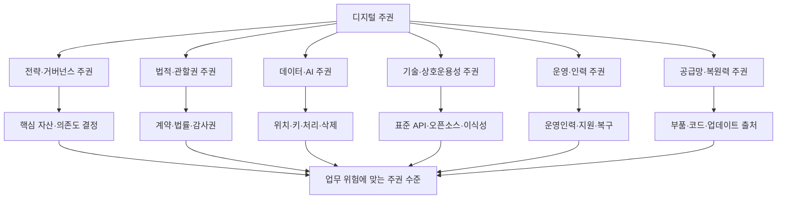
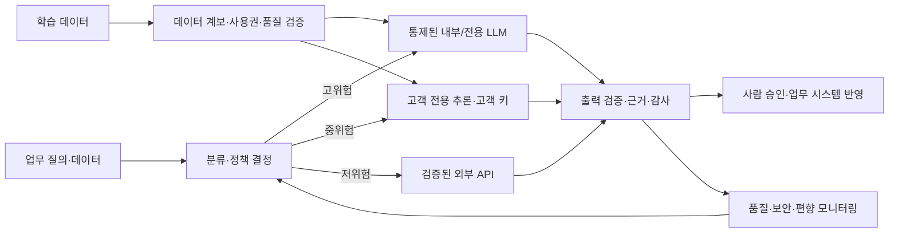

# 디지털 주권(Digital Sovereignty)과 클라우드·AI 주권

## 1. 개요

### 가. 정의

> **디지털 주권(Digital Sovereignty)**은 조직 또는 국가가 디지털 기술·데이터·인프라·운영을 스스로 결정하고 통제하며, 외부 사업자·관할권·공급망에 대한 전략적 의존을 관리할 수 있는 능력이다.

디지털 주권은 데이터를 특정 국가에 저장하는 데이터 레지던시(data residency)보다 넓은 개념이다. 데이터가 어디에 저장되는지는 출발점일 뿐이며, 누가 암호키를 통제하는지, 장애 때 누가 서비스를 복구할 수 있는지, 소프트웨어를 감사·수정·이식할 수 있는지, 외국 법률이나 공급망 중단이 서비스에 어떤 영향을 주는지까지 포함한다. 즉 주권의 핵심은 위치가 아니라 의사결정권과 지속 가능한 통제력이다.

유럽연합 집행위원회는 기술 주권을 핵심 기술·데이터·인프라를 개발하고 통제하면서 비EU 사업자에 대한 의존을 줄이는 능력으로 설명한다([European Commission, Strengthening Europe’s Tech Sovereignty](https://digital-strategy.ec.europa.eu/en/policies/eu-tech-sovereignty)). 이 정의에서 중요한 부분은 ‘외부와의 단절’이 아니라 ‘의존을 관리할 수 있는 자율성’이다. 개방형 표준과 국제 협력을 유지하면서도 특정 사업자 하나가 중단되면 국가 기능이나 기업의 핵심 업무가 멈추는 상태는 피해야 한다.

기술사 답안에서는 디지털 주권을 보호주의나 국산화와 동일시하지 않는 것이 중요하다. 모든 부품과 소프트웨어를 국내에서 직접 만드는 것은 현실적인 목표가 아닐 수 있다. 대신 위험이 큰 자산을 식별하고, 법적 관할권·데이터·키·운영 인력·소프트웨어 공급망·이식성에 대한 통제 수준을 측정하여 업무 위험에 맞는 주권 수준을 선택하는 거버넌스 문제로 접근해야 한다.

### 나. 등장 배경과 필요성

첫째, 클라우드와 SaaS의 집중도가 높아지면서 단일 사업자 의존이 운영 리스크가 되었다. 편리한 관리형 서비스를 사용하면 출시 속도와 탄력성은 좋아지지만, 가격·약관·API 변경·리전 장애·계정 정지와 같은 사건이 기업의 선택권을 제한할 수 있다. 멀티클라우드를 도입하더라도 동일한 외부 관리형 서비스와 동일한 공급망에 의존하면 형식적인 분산에 그칠 수 있다.

둘째, 데이터와 AI가 의사결정의 기반이 되면서 데이터의 관할권과 모델 운영권이 중요해졌다. 데이터는 저장 중(at rest), 전송 중(in transit), 사용 중(in use) 모두에서 보호되어야 하며, AI 서비스는 학습 데이터의 사용 범위·추론 위치·로그 보존·모델 업데이트·출력 검증을 통제할 수 있어야 한다. 모델을 외부 API로 호출하는 경우에는 입력 데이터가 재학습에 사용되는지, 하위 처리자가 누구인지, 삭제 요청을 어떻게 증명하는지가 주권의 일부가 된다.

셋째, 반도체·가속기·운영체제·오픈소스 패키지·원격 업데이트가 연결된 공급망 위험이 커졌다. 공급망 주권은 모든 부품의 원산지를 국내로 만드는 의미가 아니라, 핵심 구성요소의 출처와 의존관계를 파악하고 대체·감사·패치·복구 능력을 확보하는 의미로 이해해야 한다. 디지털 서비스의 중단은 데이터센터 한 곳의 고장보다 인증서·패키지 저장소·DNS·시간 동기화처럼 눈에 잘 보이지 않는 공통 의존성에서 시작될 수 있다.

### 다. 목적과 적용 범위

디지털 주권의 목적은 다음 네 가지로 정리된다.

1. 핵심 서비스의 의사결정권과 지속 운영 능력을 확보한다.
2. 데이터·AI의 법적, 기술적, 운영적 통제력을 높인다.
3. 단일 공급자·단일 관할권·단일 공급망에 따른 집중 위험을 줄인다.
4. 개방형 생태계와 상호운용성을 통해 전환 가능성을 유지한다.

적용 범위는 공공 행정, 금융·의료·에너지 같은 중요 서비스, 제조·국방 공급망, 기업의 핵심 업무 SaaS, 생성형 AI 플랫폼 등이다. 일반적인 업무 협업 도구와 국가 핵심 인프라의 요구 수준은 다르므로 일률적인 ‘최고 주권’을 요구하면 비용과 혁신 속도를 잃을 수 있다.

따라서 첫 단계는 자산을 업무 영향도와 데이터 민감도로 분류하는 것이다. 생명·안전·국가 기능에 직접 연결된 시스템은 높은 통제와 복구 역량이 필요하지만, 공개 정보 분석 시스템은 개방형 글로벌 서비스를 선택해도 위험이 낮을 수 있다. 주권은 제품의 속성이 아니라 업무 맥락과 위험 수용도에 따라 결정되는 설계 목표다.

## 2. 디지털 주권의 계층과 참조 아키텍처

### 가. 주권 계층

디지털 주권은 하나의 지표가 아니라 여러 계층의 통제력을 합성한 결과다. 전략 계층에서는 핵심 기술과 사업자의 소유·지배구조, 법적 계층에서는 계약과 외국 법률의 영향, 데이터 계층에서는 저장·처리·키 통제, 기술 계층에서는 표준과 이식성, 운영 계층에서는 사람과 절차를 평가한다.

아래 구조에서 상위 전략이 하위 기술을 대체하는 것은 아니다. 법적으로 EU 또는 국내 관할에 있는 사업자라도 독점 API와 외부 공급망에 과도하게 의존하면 기술·운영 주권이 낮을 수 있다. 반대로 글로벌 사업자의 표준 서비스를 사용하더라도 고객 관리 키, 독립 감사, 명확한 종료·이전 절차를 확보하면 특정 위험을 낮출 수 있다.

### 나. 계층별 의미

**전략·거버넌스 주권**은 누가 디지털 자산의 방향과 예산을 결정하는가의 문제다. 이사회·기관장·CIO·CISO가 핵심 서비스 목록, 허용 가능한 외부 의존, 공급자 집중 한도, 전환 투자 예산을 승인해야 한다. 전략 주권이 없으면 기술팀이 개별 제품을 잘 운영해도 조직 전체의 의존 구조를 개선하기 어렵다.

**법적·관할권 주권**은 데이터와 시스템에 적용되는 법률, 계약, 정부 접근 요구, 분쟁 해결 장소를 다룬다. 계약서에는 데이터 처리자와 하위 처리자, 정부 요청 통지, 감사권, 삭제 증명, 보안사고 통지, 서비스 중단과 종료 조건을 명시해야 한다. 저장 위치만 국내로 지정하고 운영자·백업·원격지원·로그가 다른 관할에 있으면 실질적 통제는 약할 수 있다.

**데이터·AI 주권**은 데이터의 수집부터 폐기까지 수명주기와 모델의 학습·추론·평가·업데이트를 통제하는 능력이다. 고객이 암호키를 직접 보유하거나 외부 키관리시스템을 통해 폐기할 수 있어야 하며, AI 입력이 공급자 학습에 사용되지 않는지 확인해야 한다. AI 결과의 근거·로그·버전·승인 기록을 보존하면 사후 설명과 감사가 가능해진다.

**기술·상호운용성 주권**은 특정 기술 스택에 갇히지 않고 다른 환경으로 기능을 이동하거나 독립적으로 감사할 수 있는 능력이다. 공개 표준, 문서화된 API, 포터블 데이터 형식, 컨테이너 이미지의 재현 가능한 빌드, 독립적인 백업 복원이 핵심 수단이다. ‘오픈소스 사용’만으로는 충분하지 않으며, 실제로 수정·빌드·배포할 수 있는 인력과 라이선스 권리가 함께 있어야 한다.

**운영·인력 주권**은 장애와 보안사고 때 외부 공급자의 허가를 기다리지 않고 서비스를 운영·복구할 수 있는 능력이다. 운영 매뉴얼, 구성 백업, 키 복구 절차, 독립 모니터링, 훈련된 내부 인력, 대체 지원 계약을 갖추어야 한다. 운영 주권이 낮은 시스템은 평상시에는 저렴해 보여도 긴급 상황에서 복구 시간이 길어지고 협상력이 약해진다.

**공급망·복원력 주권**은 하드웨어, 펌웨어, 소프트웨어 패키지, 클라우드 하위 서비스, 업데이트 경로까지 의존관계를 추적하는 능력이다. SBOM과 공급자 목록을 관리하고, 서명된 업데이트와 재현 가능한 빌드를 사용하며, 중요한 구성요소의 단종·수출 제한·취약점 발생 시 대체 경로를 시험해야 한다.

## 3. 클라우드·데이터·AI 주권의 설계 원리

### 가. 클라우드 주권

클라우드 주권은 클라우드 서비스의 데이터·기술·운영·법률·공급망에 대해 고객 또는 공공기관이 요구 수준의 독립성과 통제력을 확보하는 것이다. 단순히 서버가 특정 국가의 데이터센터에 있다는 사실은 클라우드 주권의 충분조건이 아니다. 원격 관리 계정, 지원 인력, 암호키, 하위 서비스, 로그와 백업의 위치까지 확인해야 한다.

유럽연합 집행위원회의 2025년 `Cloud Sovereignty Framework`는 클라우드 조달에서 여덟 가지 주권 목표를 제시한다. 전략적, 법적·관할권, 데이터·AI, 운영, 공급망, 기술, 보안·컴플라이언스, 환경 지속가능성 주권을 함께 평가하며, 보안 인증만으로 주권을 대신하지 않는다([European Commission, Cloud Sovereignty Framework](https://commission.europa.eu/document/download/09579818-64a6-4dd5-9577-446ab6219113_en)).

이 프레임워크는 각 목표의 최소 보장 수준인 SEAL(Sovereignty Effectiveness Assurance Level)과 서비스 간 비교를 위한 Sovereignty Score를 구분한다. 조달기관은 위험에 맞는 최소 수준을 요구하고, 점수는 여러 후보를 정렬하는 보조 기준으로 사용할 수 있다. 따라서 모든 업무에 최고 등급을 강제하기보다 업무 분류와 위험평가가 먼저다.

클라우드 선정 시에는 데이터센터 위치, 운영 주체, 하위 처리자, 외국 법률 노출, 고객 보유 키, 감사 로그, API 이식성, 데이터 내보내기 비용, 종료 지원, 독립 운영 가능성을 확인한다. 계약에 ‘데이터는 국내 저장’이라는 문장만 넣는 방식은 처리·백업·지원·법적 접근 경로를 빠뜨리므로 증거 기반 평가가 필요하다.

### 나. 데이터 주권

데이터 주권은 데이터가 적용 법률과 조직의 통제 정책에 따라 수집·저장·이용·공유·삭제되는 상태다. 데이터 레지던시는 물리적 저장 위치를 뜻하고, 데이터 로컬라이제이션은 특정 지역 내 저장·처리를 법으로 요구하는 정책을 뜻하며, 데이터 주권은 위치뿐 아니라 접근권·키·사용 목적·감사·삭제까지 포함한다.

데이터 분류표에는 민감도만 넣지 말고 업무 영향도, 보존기간, 국외 이전 가능성, 허용 가능한 운영자, 재식별 위험을 함께 기록한다. 그 결과 공개 데이터는 글로벌 SaaS에, 내부 데이터는 계약·암호화가 강화된 환경에, 규제·국가 핵심 데이터는 독립 운영이 가능한 환경에 배치하는 식으로 통제 수준을 차등화할 수 있다.

암호화는 주권을 보조하지만 자동으로 보장하지는 않는다. 공급자가 키를 모두 관리하면 저장 위치가 국내여도 접근권을 공급자에게 넘긴 셈이 될 수 있다. 고객 관리 키, 외부 키관리, 키 접근 승인, 키 사용 로그, 키 폐기 후 복구 불능 증명을 연계해야 ‘통제 가능한 데이터’에 가까워진다.

데이터 이동과 삭제도 주권의 핵심이다. 백업·캐시·검색 인덱스·모델 학습 데이터·장애 복구 복제본까지 삭제 범위에 포함되는지 확인하고, 표준 형식으로 전체 데이터를 내보내는 시험을 정기적으로 수행해야 한다. 삭제가 논리 삭제인지 물리적 삭제인지, 하위 처리자까지 전파되는지, 증거를 어떻게 보관하는지까지 정의해야 한다.

### 다. AI 주권

AI 주권은 데이터·모델·컴퓨팅·추론·운영 의사결정에 대한 자율적 통제 능력이다. 외부 LLM API를 이용하는 경우에도 모델을 직접 소유하는 것만이 답은 아니며, 입력 데이터의 처리 범위, 모델 버전 고정, 출력 로그, 안전 필터, 평가 데이터, 장애 시 대체 모델을 통제하는지가 중요하다.

AI 파이프라인은 학습 데이터와 업무 추론 데이터를 분리해야 한다. 업무상 기밀 입력이 공급자의 범용 모델 개선에 사용되지 않도록 계약·기술 설정·감사로 확인하고, 프롬프트와 출력에 포함된 개인정보·영업비밀을 마스킹한다. 모델 제공자가 변경되면 성능·편향·보안 특성이 달라질 수 있으므로 변경 전후 평가를 자동화한다.

주권형 AI를 구축할 때는 데이터와 모델을 무조건 내부에 두기보다 위험별로 배치한다. 최고 민감 업무는 내부 또는 통제된 전용 추론 환경, 중간 위험 업무는 고객 전용 인스턴스와 고객 키, 낮은 위험 업무는 검증된 외부 API를 선택할 수 있다. 이때 데이터 반출 금지와 모델 품질 사이의 트레이드오프를 정량적으로 기록해야 한다.

## 4. 주권 수준 평가와 도입 절차

### 가. 평가 지표 설계

주권을 평가할 때는 추상적인 ‘국산 여부’ 대신 증거로 확인 가능한 지표를 만든다. 예를 들어 데이터·AI 영역에는 저장·처리 위치, 고객 키 통제, 학습 사용 금지, 모델·데이터 삭제 증명을, 운영 영역에는 내부 인력 비율, 복구훈련 성공률, 공급자 지원 없이 가능한 작업 비율을 넣을 수 있다.

지표는 이진형 질문과 성숙도 질문을 조합한다. ‘고객 키가 있는가’처럼 예/아니오로 판정할 항목도 있지만, 키를 누가 생성·승인·회전·폐기하는지와 감사의 독립성은 수준별로 평가해야 한다. 공급자의 자기진술만으로 점수를 주지 말고 계약서, 구성 화면, 감사보고서, 복구훈련 결과, 실제 데이터 내보내기 결과를 증거로 요구한다.

업무별 점수는 가중합으로 계산할 수 있다. 가령 법적·관할권 20%, 데이터·AI 20%, 운영 20%, 기술·이식성 15%, 공급망 15%, 보안·컴플라이언스 10%로 시작하되, 금융 거래나 국가 핵심 업무는 보안·법적 통제에 더 높은 가중치를 줄 수 있다. 점수는 절대적인 인증이 아니라 선택과 개선을 위한 의사결정 도구다.

### 나. 도입 절차

1단계는 핵심 서비스와 의존성 목록을 작성하는 것이다. 서비스 카탈로그에 애플리케이션, 데이터셋, 모델, 클라우드 리전, API, 하위 처리자, 인증서, 키, 패키지 저장소, 운영 담당자를 연결한다. 이 목록이 있어야 특정 사업자나 국가의 장애가 어디로 전파되는지 볼 수 있다.

2단계는 영향도 분석과 주권 목표를 정하는 것이다. 기밀성·무결성·가용성뿐 아니라 법적 접근, 공급중단, 전환시간, 복구 가능성을 평가한다. 결과에 따라 업무마다 필수 주권 수준, 허용 가능한 외부 의존, 비상 전환 시간을 정의한다.

3단계는 조달과 설계를 결합하는 것이다. 공급자 평가표에 계약·관할권·키·운영·이식성·공급망 항목을 넣고, 아키텍처에는 멀티리전 백업, 표준 API, 독립 로그, 대체 인증, 탈출구(exit) 설계를 반영한다. 조달 단계에서 빠진 통제는 운영 단계에서 비용이 크게 증가한다.

4단계는 검증과 지속 개선이다. 분기별로 데이터 내보내기, 키 회전·폐기, 공급자 장애, 대체 리전 전환, 모델 교체, 사고 통지 절차를 시험한다. 공급자가 ‘가능하다’고 설명한 기능을 실제 복구훈련으로 검증하지 않으면 주권 점수는 문서상의 약속에 머문다.

### 다. 주권 아키텍처 운영 통제

접근은 최소권한과 지속 검증으로 통제한다. 운영자 계정은 개인 식별, 다중인증, 시간 제한, 승인 워크플로, 세션 기록을 적용하고, 긴급 계정은 사후 검토와 자동 만료를 둔다. 공급자 지원 계정도 예외가 아니라 동일한 정책과 감사 범위에 넣는다.

관측성은 특정 클라우드 콘솔에만 의존하지 않는다. 애플리케이션 로그, 보안 이벤트, 데이터 접근, 키 사용, 모델 호출, 관리 작업을 독립 저장소로 전달하고, 표준 형식과 보존정책을 정의한다. 그래야 계정이 잠기거나 서비스가 중단된 상황에서도 사고 분석과 규제 보고를 이어갈 수 있다.

변경 관리는 모델·API·리전·하위 공급자 변경을 포함한다. 클라우드 사업자가 기본 리전이나 약관을 바꾸거나, AI 사업자가 모델을 자동 교체하면 성능과 법적 위험이 달라질 수 있다. 변경 통지 기간, 영향평가, 승인, 롤백, 대체 경로를 계약과 운영 절차에 연결해야 한다.

## 5. 비교와 트레이드오프

### 가. 핵심 개념 비교

데이터 레지던시는 데이터가 물리적으로 저장되는 위치에 초점을 둔다. 데이터 주권은 위치와 함께 접근권·처리·키·법적 통제를 묻고, 디지털 주권은 데이터 외에도 기술·인프라·운영·공급망·인력의 자율성을 포함한다. 따라서 레지던시를 충족했다고 해서 주권이 완성되는 것은 아니다.

디지털 주권과 디지털 자립도 구분해야 한다. 자립은 외부 도움 없이 모든 것을 자체 생산하려는 방향에 가깝지만, 주권은 개방성과 상호의존을 인정하면서도 핵심 의사결정과 위험 통제 능력을 확보하는 방향이다. 자립을 과도하게 추구하면 중복 투자와 기술 고립이 발생할 수 있고, 주권을 지나치게 좁게 정의하면 의존 위험을 놓칠 수 있다.

클라우드 주권은 클라우드 서비스와 공급자 관계에 초점을 둔 하위 개념이며, 주권형 클라우드는 특정 제품명이 아니다. 계약·기술·운영 통제가 갖춰져야 하며, 동일한 제품도 고객의 키·리전·지원모델·이식성 설정에 따라 주권 수준이 달라질 수 있다.

| 구분 | 핵심 질문 | 주요 통제 | 한계 또는 오해 |
|---|---|---|---|
| 데이터 레지던시 | 데이터가 어디에 저장되는가? | 리전·백업 위치 | 처리·접근·키를 설명하지 못함 |
| 데이터 로컬라이제이션 | 법이 어느 지역 내 저장·처리를 요구하는가? | 법률·정책·리전 제한 | 글로벌 협력·운영 효율과 충돌 가능 |
| 클라우드 주권 | 클라우드를 독립적으로 통제·운영할 수 있는가? | 계약·키·이식성·운영·관할권 | 업무별 위험평가가 없으면 과잉 통제 |
| 디지털 주권 | 핵심 디지털 의사결정과 생태계를 통제할 수 있는가? | 전략·데이터·기술·공급망·인력 | 단일 점수로 축약하면 맥락 손실 |
| 디지털 자립 | 외부 도움 없이 만들고 운영할 수 있는가? | 자체 기술·인력·인프라 | 비용 증가와 기술 고립 위험 |

### 나. 개방성과 주권의 균형

폐쇄적 시스템은 통제감을 줄 수 있지만, 자사만 아는 기술과 독점 부품에 의존하면 내부 인력 부족과 단종 위험이 커진다. 공개 표준과 오픈소스는 여러 사업자를 선택할 수 있게 하지만, 유지보수 주체가 불분명하거나 핵심 메인테이너가 외부 조직에 집중되어 있으면 다른 종류의 공급망 위험이 생긴다.

따라서 개방성은 라이선스 이름만으로 평가하지 않는다. 소스와 빌드 과정에 접근할 수 있는지, 취약점 패치를 독립적으로 적용할 수 있는지, 데이터 형식과 API가 공개되어 있는지, 운영 인력을 확보할 수 있는지 확인한다. 오픈소스의 활용과 주권 통제를 함께 추진하려면 SBOM, 재현 가능한 빌드, 내부 포크 정책, 커뮤니티 보안 대응 체계가 필요하다.

비용과 통제력도 트레이드오프다. 고객 관리 키, 전용 리전, 독립 로그, 이중 공급자, 예비 인력은 비용을 올리지만 사고의 영향과 전환 비용을 낮춘다. 기술사 답안에서는 ‘주권이 높을수록 좋다’고 결론내리기보다, 장애 손실·규제 벌금·전환비용의 기대값과 통제 투자비를 비교하여 위험 기반으로 최적화해야 한다.

## 6. 적용 사례

### 가. 공공 행정의 민감 데이터 클라우드 전환

공공기관이 복지·조세·보건 데이터를 클라우드로 전환한다고 가정한다. 데이터 저장 리전만 국내로 정하는 방식은 부족하다. 운영자와 하위 처리자, 원격지원 계정, 백업·재해복구, 고객 키, 로그·분석 서비스까지 데이터 흐름과 접근 경로를 함께 확인해야 한다.

업무를 영향도에 따라 세 등급으로 나눈다. 국민의 생명·권리와 직접 연결된 핵심 업무는 통제된 환경과 독립 복구 능력을 요구하고, 내부 행정 업무는 검증된 공공 클라우드와 강한 계약 통제를 적용하며, 공개 정보 업무는 범용 클라우드를 사용하되 개인정보를 반입하지 않는 식이다. 이렇게 하면 모든 업무를 최고 수준으로 고정하지 않으면서 핵심 데이터의 주권을 강화할 수 있다.

전환 검증에서는 데이터 반출·복원, 키 폐기, 운영자 세션 감사, 장애 시 수동 업무, 대체 사업자에서의 복구를 실제로 실행한다. 테스트에서 데이터 형식이 달라지거나 관리형 서비스에 종속된 기능이 발견되면, 운영 이전에 표준 포맷과 대체 설계를 마련해야 한다.

### 나. 제조 기업의 AI 품질 검사

제조 기업이 외부 비전 모델과 클라우드 GPU를 사용해 품질 검사를 자동화하는 경우, 원본 영상에 설계정보와 작업자 개인정보가 포함될 수 있다. 원본은 통제된 영역에서 전처리하고, 외부 서비스에는 필요한 특징만 전달하거나 전용 추론 환경을 사용한다. 모델 입력·출력과 버전은 계보로 기록해 불량 판정의 책임을 추적한다.

공급자 교체에 대비해 학습 데이터와 라벨을 표준 형식으로 관리하고, 모델 평가셋과 합격 기준을 내부에 보관한다. 외부 API가 변경되면 동일한 평가셋으로 정확도·편향·지연을 비교하여 생산 라인에 반영할지 승인한다. 이 구조는 모델을 직접 소유하지 않아도 업무 의사결정의 통제력을 높인다.

설비가 오프라인이 되는 상황도 고려한다. 네트워크 단절 시 엣지 장치에서 제한된 판정을 수행하고, 연결이 복구되면 승인된 로그만 중앙으로 동기화한다. 단, 엣지 모델의 보안 업데이트와 키 회전이 지연되지 않도록 오프라인 운영 기간과 비상 업데이트 절차를 정해야 한다.

## 7. 심화: EU 프레임워크와 기술사 답안 연계

### 가. EU 클라우드 주권 프레임워크의 시사점

유럽연합 집행위원회 `Cloud Sovereignty Framework`는 주권을 한 줄의 ‘EU 안에 데이터가 있는가’로 판단하지 않고 여덟 개 목표로 나누어 조달 증거를 수집한다. 특히 전략·법적 관할권·공급망·기술·운영을 함께 보는 점은 클라우드 보안 인증과 주권 평가가 동일하지 않음을 보여준다.

프레임워크의 SEAL은 목표별 최소 보장 수준을 설정하고, Sovereignty Score는 여러 후보의 상대적 특성을 비교하는 보조 점수로 사용한다. 이 구분은 기술사 답안에서 ‘인증을 받았으니 주권이 충분하다’는 오류를 피하게 한다. 인증은 특정 보안 요구의 증거이지, 고객이 언제든 다른 환경으로 이전할 수 있다는 보장은 아니기 때문이다.

또한 유럽연합 집행위원회가 2026년 6월 3일 발표한 기술 주권 패키지 설명은 클라우드·AI 생태계의 역량, 인프라, 공급망, 오픈소스, 공공 조달을 함께 다룬다([European Commission, Cloud and AI Development Act](https://digital-strategy.ec.europa.eu/en/policies/cloud-and-ai-development-act)). 해당 정책 페이지는 공공 부문이 위험평가에 따라 네 가지 클라우드·AI 주권 보장 수준을 활용할 수 있다고 설명하며, 실제 적용에서는 법령·조달 공고·감사 기준의 최신 상태를 별도로 확인해야 한다.

### 나. 예상 출제 방향과 답안 구성

출제는 ‘디지털 주권의 개념과 확보 방안’에서 데이터 레지던시·클라우드·AI·공급망을 연결하는 형태로 확장될 수 있다. 답안은 정의에서 끝내지 말고, 왜 필요한지, 무엇을 평가하는지, 어떤 아키텍처와 거버넌스로 통제하는지, 비용과 개방성의 트레이드오프는 무엇인지 순서대로 전개한다.

개념도에는 전략·법률·데이터·기술·운영·공급망 계층을 제시하고, 세부도에는 업무 분류→위험평가→공급자 선정→계약·설계→복구훈련→지속 평가의 폐쇄루프를 그린다. 표는 레지던시·로컬라이제이션·클라우드 주권·디지털 주권을 비교하는 보조 도구로 쓰되, 각 차이가 생기는 원리를 문장으로 설명한다.

사례에서는 공공 민감 데이터와 제조 AI를 활용하면 데이터 위치뿐 아니라 키·운영·모델 버전·이식성·공급망을 함께 설명할 수 있다. 결론은 ‘국산화’나 ‘멀티클라우드’를 만능 해법으로 제시하지 말고, 위험 기반 주권 수준·개방형 표준·독립 감사·exit 테스트·인력 역량을 연계하는 전략으로 마무리한다.

## 8. 고려사항 및 시사점

### 가. 위험 기반 수준화

모든 시스템에 최고 수준의 주권을 요구하면 비용과 혁신 속도에 부담이 된다. 반대로 모든 시스템을 편의성만으로 외부 서비스에 맡기면 핵심 기능의 협상력과 복구 능력을 잃는다. 업무 영향도·데이터 민감도·전환 가능성·법적 의무를 기준으로 서비스별 최소 수준을 정해야 한다.

주권 등급은 고정된 라벨이 아니라 위험 변화에 따라 재평가한다. 새로운 AI 사용, 외국 법률 변경, 공급자 인수, 단종 공지, 하위 처리자 변경이 있으면 등급과 통제를 다시 확인한다. 최소 연 1회뿐 아니라 중대한 변경과 사고 후에도 재평가해야 한다.

### 나. 관할권과 계약의 실효성

계약서에 데이터 위치와 보안 의무를 쓰는 것만으로는 부족하다. 정부 요청 통지, 원격지원의 승인, 하위 처리자 변경, 감사 자료, 삭제 증명, 서비스 중단·종료·이전 지원, 분쟁 관할을 실제 집행 가능한 조항으로 만들어야 한다. 법무·보안·조달·운영이 함께 공급자 평가를 수행해야 기술적 요구와 계약이 어긋나지 않는다.

외국 법률 노출은 공급자의 등록 국가만으로 판단하지 않는다. 모회사·지배구조·하위 처리자·원격 운영자·관리 콘솔의 법적 접근 가능성을 살펴야 한다. 법적 위험을 기술적 암호화와 계약적 통지 의무로 어떻게 줄일지, 남은 위험을 어떤 기관이 수용할지 기록해야 한다.

### 다. 이식성과 exit 전략

이식성은 ‘데이터를 다운로드할 수 있다’는 말보다 넓다. 데이터·메타데이터·권한·암호키·감사로그·모델·워크플로·구성값을 함께 이전하고, 대체 환경에서 동일한 업무 수준을 재현할 수 있어야 한다. 관리형 데이터베이스의 고유 기능과 독점 API가 많을수록 전환 비용과 시간이 증가한다.

Exit 테스트는 계약 체결 후 한 번만 하는 문서 검토가 아니다. 대표 업무를 선정해 정해진 시간 안에 대체 환경으로 복원하고, 데이터 무결성·성능·권한·감사·규제 보고를 확인한다. 테스트 결과를 다음 조달과 아키텍처 개선에 반영해야 한다.

### 라. 공급망과 오픈소스 관리

SBOM, 공급자·하위 공급자 목록, 펌웨어·패키지 출처, 서명 검증, 취약점 대응 시간을 관리한다. 특정 오픈소스 프로젝트가 중단되거나 취약점이 발견되면 내부 포크·대체 구현·패치 역량이 있는지 확인한다. 공급망 주권은 원산지 하나를 보는 것이 아니라 중단 시 대체할 수 있는 시간과 능력을 보는 것이다.

오픈소스는 주권을 높일 수 있는 수단이지만 자동 보장은 아니다. 라이선스 의무, 메인테이너 집중, 빌드 서버의 신뢰, 패키지 저장소 의존, 지원 인력 부족을 함께 평가한다. 공공·금융 핵심 시스템은 오픈소스 도입 정책과 보안 패치 SLA를 운영 기준으로 명문화해야 한다.

### 마. AI의 책임성과 인간 통제

AI 주권은 모델을 내부에 설치하는 것으로 끝나지 않는다. 학습 데이터의 권리, 개인정보 최소화, 모델 설명·검증, 편향 평가, 금지된 자동결정, 인간 승인, 사고 시 롤백을 전 생애주기로 관리해야 한다. 외부 모델을 쓸 때에도 업무 최종 결정의 책임 주체와 이의제기 경로는 조직 안에 남아 있어야 한다.

모델 업데이트와 외부 API 장애에 대비해 고정 버전, 대체 모델, 규칙 기반 fallback, 수동 업무를 준비한다. 정확도가 높다는 이유로 검증되지 않은 출력을 바로 생산·행정 시스템에 반영하면 주권이 아니라 외부 판단에 대한 종속이 된다.

### 바. 성과 측정과 지속 개선

주권 성과는 공급자 수나 국내 리전 비율만으로 평가하지 않는다. 핵심 지표로 데이터 내보내기 성공률, 대체 환경 전환시간, 키 독립성, 감사 로그 완전성, 공급자 장애 시 복구시간, 중대한 단일 의존성 수, 내부 운영 역량, 모델 변경 검증률을 관리한다.

지표가 좋아져도 업무 성과와 충돌할 수 있다. 전환시간을 줄이려고 기능을 단순화하면 사용자 가치가 떨어질 수 있고, 강한 격리로 지연시간·비용이 증가할 수 있다. 기술사 관점에서는 주권·보안·가용성·성능·비용·혁신을 함께 보고, 이해관계자에게 선택의 근거와 잔여 위험을 투명하게 제시해야 한다.

## 참고자료

1. European Commission, “Strengthening Europe’s Tech Sovereignty” — https://digital-strategy.ec.europa.eu/en/policies/eu-tech-sovereignty
2. European Commission, “Cloud Sovereignty Framework”, version 1.2.1, October 2025 — https://commission.europa.eu/document/download/09579818-64a6-4dd5-9577-446ab6219113_en
3. European Commission, “Cloud and AI Development Act” — https://digital-strategy.ec.europa.eu/en/policies/cloud-and-ai-development-act
4. European Commission, “First policy brief on digital sovereignty” — https://interoperable-europe.ec.europa.eu/collection/sovereignty/news/first-policy-brief-digital-sovereignty

---

> **한 줄 요약**: 디지털 주권은 데이터를 국내에 두는 데서 끝나지 않고, 법적 관할권·키·AI·기술·운영·공급망을 업무 위험에 맞게 통제하고 필요할 때 독립적으로 전환할 수 있는 능력이다.
