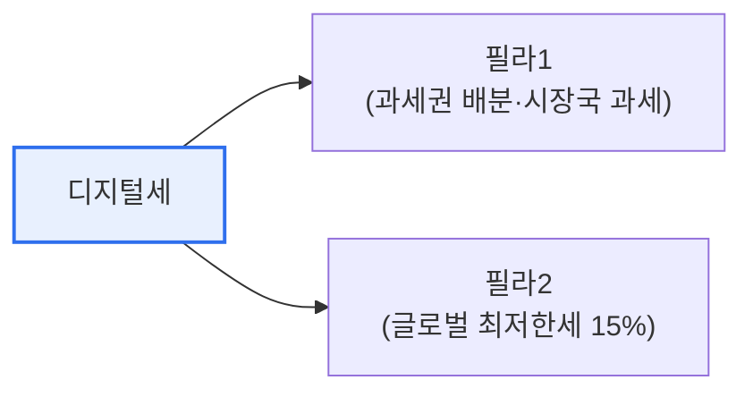

# 디지털세(Digital Tax)

## 1. 개요

### 가. 정의
> **디지털세**는 물리적 사업장 없이 여러 나라에서 디지털 서비스로 수익을 올리는 **글로벌 대기업(특히 빅테크)에 대해, 이용자가 있는 시장 소재국에서도 과세할 수 있도록 한 국제 과세 체계**다.

디지털세가 등장한 근본 이유는 '**디지털 경제가 기존 국제 과세 원칙을 무력화했다**'는 데 있다. 전통적으로 법인세는 기업이 물리적 사업장(고정사업장)을 둔 나라에서 매긴다. 그런데 구글·애플·메타 같은 빅테크는 서버·사무실 없이도 전 세계 이용자에게 서비스를 팔아 막대한 수익을 낸다. 정작 이용자가 있는 나라에서는 물리적 사업장이 없다는 이유로 세금을 걷지 못하고, 기업은 세율이 낮은 나라로 이익을 옮겨 세 부담을 줄인다(BEPS, 세원 잠식). 이는 조세 형평성을 심각하게 훼손한다. 디지털세는 이 문제를 바로잡는다. 즉 '이익이 발생한 시장(이용자가 있는 곳)에서도 과세한다'는 새 원칙을 세운 것이다. OECD/G20이 주도해 140여 개국이 큰 틀에 합의했으며, 매출 발생지 과세권 배분(Pillar 1)과 글로벌 최저한세(Pillar 2)의 두 축으로 구성된다.

### 나. 등장 배경
디지털 경제로 물리적 사업장 없는 초국경 사업이 보편화되면서, 고정사업장 중심의 기존 과세 원칙과 세원 잠식(BEPS) 문제 해결이 요구되었다.

## 2. 주요 내용 (OECD 두 기둥)

| 구분 | 내용 |
|---|---|
| **필라 1(Pillar 1)** | 초대형 기업 이익의 일부에 대한 과세권을 시장 소재국에 배분 |
| **필라 2(Pillar 2)** | 글로벌 최저한세(15%) 도입, 저세율국 이전 유인 제거 |

필라 1은 '어디서 과세할 것인가(과세권 재배분)'를, 필라 2는 '최소한 얼마는 과세할 것인가(최저한세)'를 다룬다. 두 축이 결합해 빅테크의 조세 회피를 근본적으로 억제한다.

## 3. 의미와 전망

| 관점 | 내용 |
|---|---|
| **조세 형평성** | 시장국의 정당한 과세권 회복 |
| **BEPS 대응** | 세원 잠식·이익 이전 방지 |
| **디지털 주권** | 데이터·플랫폼 경제의 과세 기반 |
| **전망** | 단계적 시행, 각국 이해관계 조율·이행 과제 |

## 4. 고려사항 및 시사점

1. **국제 공조와 이행이 관건**이다. 디지털세는 다자간 합의로만 실효성이 있으므로, 각국의 비준·국내법 반영과 이중과세 방지 조율이 성패를 좌우한다.
2. **한국 기업에 양면적 영향**이 있다. 글로벌 매출이 큰 국내 대기업은 필라 1 적용 대상이 될 수 있어 대비가 필요한 반면, 시장국으로서 과세권 확대의 이익도 있어 균형 있는 대응이 요구된다.
3. **디지털 경제 과세의 출발점**이다. 데이터·AI·플랫폼 경제가 커질수록 새로운 가치 창출에 대한 과세 논의가 확대될 전망이며, 디지털세는 그 제도적 출발점으로 평가된다.

---

> **한 줄 요약**: 디지털세는 *물리적 사업장 없이 초국경 수익을 내는 빅테크에 시장 소재국도 과세* 하도록 한 국제 과세 체계로, 과세권 배분(필라1)과 글로벌 최저한세(필라2)로 조세 형평성·BEPS 문제에 대응하며 국제 공조 이행이 관건이다.
