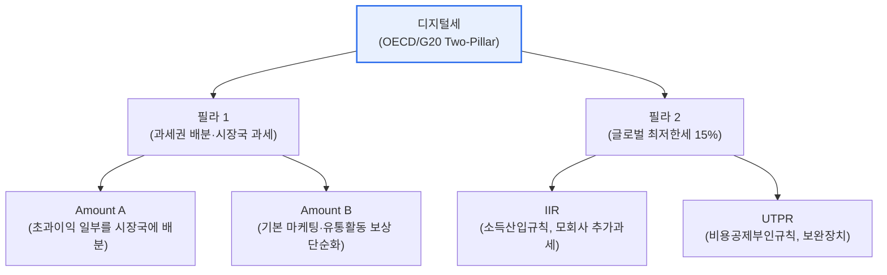
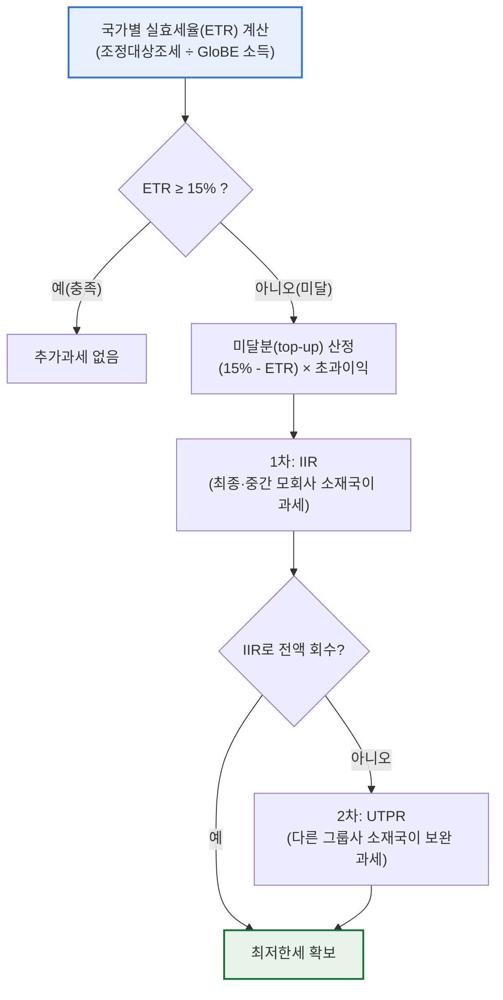

# 디지털세(Digital Tax)

## 1. 개요

### 가. 정의
> **디지털세**는 물리적 사업장(고정사업장) 없이 여러 나라의 이용자를 대상으로 디지털 서비스에서 수익을 올리는 **글로벌 대기업(특히 빅테크)에 대해, 이용자·시장이 있는 소재국에서도 과세권을 행사할 수 있도록 재설계한 국제 조세 체계**다. OECD/G20 포괄적 이행체계(Inclusive Framework, 약 140여 개국)가 합의한 두 기둥(Pillar 1·Pillar 2)을 뼈대로 한다.

디지털세가 등장한 근본 이유는 '**디지털 경제가 20세기 초에 확립된 국제 과세 원칙을 무력화했다**'는 데 있다. 전통적 국제 조세는 '고정사업장(Permanent Establishment)이 있는 나라가 그 이익에 과세한다'는 원칙 위에 서 있다. 이는 공장·사무실·영업소 같은 물리적 실체가 있어야 사업이 성립하던 산업 경제를 전제로 만들어진 규칙이다. 그러나 구글·애플·메타·아마존 같은 빅테크는 서버 한 대, 사무실 하나 없이도 앱스토어·검색광고·클라우드·SNS를 통해 전 세계 이용자에게 서비스를 팔아 막대한 수익을 낸다. 문제는 정작 매출과 이용자가 존재하는 시장국에서는 '물리적 사업장이 없다'는 이유로 법인세를 걷지 못하고, 기업은 지식재산권과 이익을 법인세율이 낮은 국가(아일랜드·룩셈부르크 등)로 옮겨 실효세율을 극단적으로 낮춘다는 점이다. 이처럼 세원(稅源)이 잠식되고 이익이 저세율국으로 이전되는 현상을 BEPS(Base Erosion and Profit Shifting, 세원 잠식과 이익 이전)라 부른다.

이러한 구조는 조세 형평성을 심각하게 훼손한다. 같은 나라에서 사업하는 국내 기업은 정상 세율로 세금을 내는데, 정작 시장을 지배하는 다국적 플랫폼은 거의 세금을 내지 않는 '기울어진 운동장'이 만들어지기 때문이다. 디지털세는 바로 이 문제를 바로잡기 위해 '**가치가 창출되고 이용자가 존재하는 시장에서도 과세한다**'는 새 원칙을 세운 국제 공조의 산물이다. 100년 넘게 유지돼 온 과세권 배분 규칙을 근본적으로 바꾼다는 점에서, 디지털세는 단순한 세목 신설이 아니라 국제 조세 질서의 패러다임 전환으로 평가된다.

### 나. 등장 배경과 전개
디지털세 논의는 개별 국가들이 먼저 '디지털서비스세(DST, Digital Services Tax)'를 일방적으로 도입하면서 촉발됐다. 프랑스가 2019년 자국 내 디지털 매출의 3%를 과세하는 DST를 도입하자 영국·이탈리아·스페인 등이 뒤따랐고, 미국은 자국 빅테크를 겨냥한 차별 과세라며 보복관세로 맞서 무역 분쟁으로 비화했다. 이러한 각국의 파편적·일방적 과세가 이중과세와 무역 갈등을 낳자, 통일된 다자 규범의 필요성이 대두되었고 OECD/G20이 주도해 2021년 10월 약 140개국이 두 기둥 체계에 정치적으로 합의하기에 이르렀다. 즉 디지털세는 '고정사업장 원칙의 한계'와 'BEPS'라는 구조적 문제에, '각국 DST의 난립'이라는 현실적 압력이 더해져 국제 공조로 수렴한 결과물이다.

## 2. 주요 내용 — OECD 두 기둥(Two-Pillar) 체계

### 가. 전체 구조도
디지털세는 '어디서 과세할 것인가(과세권의 재배분)'를 다루는 필라 1과, '최소한 얼마는 과세할 것인가(최저 실효세율의 보장)'를 다루는 필라 2가 상호 보완적으로 결합한 구조다. 필라 1이 과세권의 '수평적 재분배'라면, 필라 2는 세율 경쟁의 '바닥(floor)'을 설정하는 '수직적 하한선'에 해당한다.

```mermaid
flowchart TB
  D["디지털세<br/>(OECD/G20 Two-Pillar)"] --> P1["필라 1<br/>(과세권 배분·시장국 과세)"]
  D --> P2["필라 2<br/>(글로벌 최저한세 15%)"]
  P1 --> A1["Amount A<br/>(초과이익 일부를 시장국에 배분)"]
  P1 --> A2["Amount B<br/>(기본 마케팅·유통활동 보상 단순화)"]
  P2 --> R1["IIR<br/>(소득산입규칙, 모회사 추가과세)"]
  P2 --> R2["UTPR<br/>(비용공제부인규칙, 보완장치)"]
  style D fill:#e8f0fe,stroke:#2f6fed,stroke-width:2px
```

### 나. 필라 1(Pillar 1) — 과세권의 시장국 배분
필라 1은 매출 규모가 매우 큰 초대형 다국적기업의 이익 중 일부에 대한 과세권을 '이익이 실제로 발생한 시장 소재국'에 새로 배분하는 규칙이다. 핵심은 Amount A로, 연결매출과 이익률이 일정 기준을 넘는 초대형 기업의 '통상이익을 초과하는 부분(초과이익)'의 일정 비율을 매출이 발생한 시장국들에 이용자·매출 규모에 따라 나누어 과세하도록 한다. 이는 물리적 사업장이 없어도 시장국이 과세권을 갖게 한다는 점에서 100년 전통의 고정사업장 원칙을 정면으로 수정하는 조항이다. 여기에 기본적인 마케팅·유통 활동에 대한 정상가격 산정을 단순화하는 Amount B가 보완적으로 설계되어, 이전가격 분쟁과 행정 비용을 줄이려 한다.

다만 필라 1은 다자간 협약(Multilateral Convention) 형태로 발효되어야 실효성을 갖는데, 미국을 비롯한 주요국의 비준 지연과 이해관계 조율의 어려움으로 이행이 상당히 지체되고 있다는 점에 유의해야 한다. 즉 필라 1은 합의된 설계에도 불구하고 아직 완전 발효에 이르지 못한 '진행형 과제'로 이해하는 것이 정확하다.

### 다. 필라 2(Pillar 2) — 글로벌 최저한세 15%
필라 2는 연결매출 7억 5천만 유로 이상인 다국적기업이 사업을 영위하는 '모든 국가'에서 최소 15%의 실효세율(ETR, Effective Tax Rate)을 부담하도록 강제하는 규칙(GloBE Rules)이다. 만약 특정 저세율국에서의 실효세율이 15%에 미달하면, 그 미달분(top-up tax)을 다른 나라에서 추가로 과세한다. 추가과세는 두 축으로 작동한다. 소득산입규칙(IIR, Income Inclusion Rule)은 최종 모회사(또는 중간 모회사)가 있는 나라가 미달분을 우선 걷도록 하고, 이를 걷지 못할 때 비용공제부인규칙(UTPR, Undertaxed Profits Rule)이 보완적으로 다른 그룹사가 있는 나라에서 미달분을 회수한다. 이 설계의 목적은 명확하다. 기업이 이익을 아무리 저세율국으로 옮겨도 어차피 어딘가에서 15%까지 채워 과세되므로, 저세율국으로 이익을 이전할 유인 자체를 제거하는 것이다.

필라 2의 추가과세(top-up tax) 판정 과정은 아래와 같이 국가별 실효세율 계산에서 출발해 미달분을 IIR·UTPR로 회수하는 흐름으로 작동한다. 이 프로세스는 '저세율국에서 덜 낸 세금은 어차피 어딘가에서 채워진다'는 필라 2의 억지력을 구조적으로 보여준다.

```mermaid
flowchart TB
  S["국가별 실효세율(ETR) 계산<br/>(조정대상조세 ÷ GloBE 소득)"] --> C{"ETR ≥ 15% ?"}
  C -->|"예(충족)"| OK["추가과세 없음"]
  C -->|"아니오(미달)"| TU["미달분(top-up) 산정<br/>(15% - ETR) × 초과이익"]
  TU --> IIR["1차: IIR<br/>(최종·중간 모회사 소재국이 과세)"]
  IIR --> Q{"IIR로 전액 회수?"}
  Q -->|아니오| UTPR["2차: UTPR<br/>(다른 그룹사 소재국이 보완 과세)"]
  Q -->|예| DONE["최저한세 확보"]
  UTPR --> DONE
  style S fill:#e8f0fe,stroke:#2f6fed,stroke-width:2px
  style DONE fill:#e6f4ea,stroke:#137333,stroke-width:2px
```

필라 2는 필라 1보다 실제 이행이 앞서 나가고 있다. 2026년 기준 60개국 이상이 GloBE 규칙을 입법했거나 시행 중이며, 한국도 국제조세조정에 관한 법률을 개정해 2024 회계연도 개시 사업연도부터 글로벌 최저한세를 시행하고 있다. 이는 한국이 OECD 합의를 선제적으로 국내법에 반영한 사례로, 대상 기업들은 국가별 실효세율 계산과 신고 의무(GloBE Information Return, GIR)를 이행해야 한다.

| 구분 | 필라 1(Pillar 1) | 필라 2(Pillar 2) |
|---|---|---|
| **목적** | 과세권의 시장국 재배분 | 최저 실효세율 보장 |
| **핵심 규칙** | Amount A(초과이익 배분)·Amount B | IIR·UTPR(15% top-up) |
| **적용 대상** | 초대형 다국적기업(고매출·고이익률) | 연결매출 7.5억 유로 이상 MNE |
| **이행 현황** | 다자협약 비준 지연, 진행형 | 60여 개국 시행, 한국 2024년 시행 |

필라 1과 필라 2는 상호 보완적이다. 필라 1이 '어느 나라가 걷느냐'의 과세권 지도를 다시 그린다면, 필라 2는 '얼마나 낮게까지 세율을 내릴 수 있느냐'의 하한선을 그어 조세 경쟁의 바닥을 막는다. 두 축이 함께 작동해야 빅테크의 조세 회피를 과세권 배분과 세율 하한 양면에서 억제할 수 있다.

## 3. 최근 동향 — 미국 이탈과 Side-by-Side 절충(2025~2026)

디지털세는 2025년을 기점으로 중대한 국면 변화를 맞았다. 미국 신행정부는 2025년 초 행정명령으로 OECD 두 기둥 프로젝트에서 사실상 이탈을 선언했고, 미국계 다국적기업에 필라 2의 IIR·UTPR을 적용하는 것에 강하게 반대했다. 미국 기업이 세계 빅테크의 상당수를 차지하는 만큼, 미국의 이탈은 체계 전체의 실효성을 위협하는 요인이었다.

이에 2025년 6월 G7의 정치적 합의를 거쳐, 2026년 1월 OECD는 이른바 'Side-by-Side(병존)' 패키지를 발표했다. 핵심은 미국이 자국의 기존 최저한세 제도(GILTI 등)로 유사한 과세를 하고 있다고 보아, 미국을 모회사로 하는 다국적기업 그룹을 GloBE의 IIR·UTPR 적용에서 제외하는 안전장치(Side-by-Side Safe Harbor)를 두는 것이다. 2026년 1월 5일 기준으로 이 요건을 충족한다고 OECD가 공식 확인한 나라는 미국이 유일하다. 이는 글로벌 최저한세의 뼈대를 유지하면서 최대 이해당사국인 미국의 이탈을 봉합하려는 현실적 절충으로, 제도의 지속 가능성을 높이는 동시에 '보편적 적용'이라는 원칙에는 균열을 남긴 양면적 결정으로 평가된다. 한편 대상 기업의 첫 GloBE 정보신고(GIR)는 2026년 6월 30일까지로 예정되는 등, 필라 2의 실제 이행·신고 국면이 본격화되고 있다.

## 4. 주요국 도입 사례와 수치

디지털세의 전개를 구체적으로 이해하려면 각국의 일방적 DST와 다자 규범의 이행 사례를 함께 봐야 한다. 이 사례들은 '왜 통일된 다자 규범이 필요했는가'와 '이행이 왜 어려운가'를 동시에 드러낸다.

첫째, 프랑스는 2019년 세계 최초로 자국 내 연 매출 2,500만 유로 및 글로벌 매출 7억 5천만 유로 이상인 디지털 기업의 프랑스 내 디지털 매출에 3%를 과세하는 DST를 도입했다. 이 세율은 '이익'이 아니라 '매출'에 부과된다는 점이 특징인데, 이는 빅테크가 이익을 저세율국으로 옮겨 이익 기준 과세를 회피하는 것을 우회하기 위한 설계였다. 그러나 미국은 이를 자국 기업에 대한 차별 과세로 규정하고 프랑스산 제품에 대한 보복관세를 예고하며 무역 분쟁으로 번졌다. 영국(2020년, 디지털서비스 매출의 2%), 이탈리아·스페인(각 3%) 등도 유사한 DST를 도입해 파편화가 심화됐다.

둘째, 이러한 각국 DST의 난립은 이중과세와 통상 갈등이라는 부작용을 낳았다. 같은 매출에 대해 시장국의 DST와 본국의 법인세가 중복 부과될 수 있고, 세율·과세표준·대상이 나라마다 달라 기업의 컴플라이언스 부담이 급증했다. 이 혼란이 역설적으로 OECD 주도 다자 합의의 추동력이 되었으며, 다자 규범이 발효되면 각국은 일방적 DST를 철회하기로 한 것이 합의의 전제였다. 즉 필라 1의 발효가 지연될수록 개별국 DST가 유지·부활할 유인이 커지는 구조적 긴장이 존재한다.

셋째, 한국은 국제조세조정에 관한 법률을 개정해 2024 회계연도 개시 사업연도부터 필라 2(글로벌 최저한세)를 시행하고 있다. 연결매출 7억 5천만 유로 이상인 다국적기업은 진출한 각 국가별로 실효세율을 계산해 15%에 미달하면 미달분을 추가 납부해야 하며, 이를 위한 GloBE 정보신고(GIR) 의무를 진다. 한국의 대형 제조·플랫폼 기업들이 다수 대상이 되어, 국가별 세무데이터 집계와 신고 체계 구축이 실무 현안으로 부상했다.

| 사례 | 형태 | 세율·기준 | 함의 |
|---|---|---|---|
| **프랑스 DST(2019)** | 일방적 매출세 | 디지털 매출 3% | 최초 도입, 미국과 통상 분쟁 |
| **영국 DST(2020)** | 일방적 매출세 | 디지털서비스 매출 2% | 유럽 확산, 파편화 심화 |
| **한국 필라2(2024)** | 다자 규범 이행 | 최저 ETR 15% | OECD 합의 선제 국내법화 |
| **미국(2025~)** | 이탈·절충 | Side-by-Side 예외 | 보편 적용 원칙에 균열 |

넷째, 이러한 사례들을 관통하는 교훈은 '국제 조세는 기술 변화의 속도를 제도가 따라잡지 못할 때 파열음을 낸다'는 것이다. 프랑스의 일방적 DST는 규범 공백을 메우려는 시도였으나 통상 갈등을 낳았고, OECD의 다자 합의는 그 갈등을 봉합하려 했으나 미국 이탈로 다시 균열이 생겼다. 필라 2가 15% 하한선으로 실질적 성과를 내는 동안에도 필라 1은 표류하는 비대칭이 지속되는 것은, 과세권 배분이라는 근본적 이해 조정이 최저한세 설정보다 훨씬 첨예한 주권·이익 충돌을 수반하기 때문이다. 디지털세의 미래는 이 두 축 사이의 균형을 어떻게 회복하느냐에 달려 있다.

## 5. 의미와 전망

| 관점 | 내용 |
|---|---|
| **조세 형평성** | 물리적 실체 없이 이익을 얻는 빅테크에 시장국의 정당한 과세권 회복 |
| **BEPS 대응** | 세원 잠식·저세율국 이익 이전 유인 제거(15% 하한) |
| **디지털 주권** | 데이터·플랫폼 경제의 가치 창출에 대한 과세 기반 확보 |
| **불확실성** | 미국 이탈·Side-by-Side 절충으로 보편 적용 원칙 약화, 필라 1 지연 |

종합하면 디지털세는 조세 형평성 회복과 BEPS 억제라는 명확한 정책 목표를 갖지만, 그 실현은 최대 이해당사국의 참여와 다자 규범의 이행 속도에 크게 좌우된다. 필라 2는 이미 60여 개국에서 시행되며 실질적 하한선으로 자리잡아 가는 반면, 필라 1은 다자협약 비준의 정치적 난관에 막혀 있고, 미국의 이탈과 Side-by-Side 절충은 '모든 다국적기업에 동일하게 적용한다'는 보편성 원칙에 예외를 만들었다. 따라서 향후 전망은 '필라 2 중심의 부분적·단계적 정착'과 '개별국 DST의 잔존 가능성'이 병존하는 불완전 균형으로 이해하는 것이 현실적이며, 이 불확실성 자체가 기업의 조세 전략과 각국의 정책 대응에서 핵심 변수로 작용한다.

## 6. 고려사항 및 시사점

정보관리기술사 관점에서 디지털세는 '디지털 경제의 성장이 제도·규범의 재설계를 강제한다'는 사례이자, 데이터·플랫폼·AI 경제의 가치 배분 문제와 직결되는 주제로 접근해야 한다.

1. **국제 공조의 이행 속도와 파편화가 최대 변수다.** 디지털세는 다자 합의로만 실효성을 갖는데, 미국의 이탈과 Side-by-Side 절충, 필라 1의 비준 지연에서 보듯 각국의 이해관계가 첨예하다. 합의가 흔들리면 개별국 DST가 다시 난립해 이중과세·무역 분쟁이 재연될 수 있으므로, 국내법 반영과 이중과세 방지 조율이 성패를 좌우한다.
2. **한국 기업에 양면적 영향이 있다.** 글로벌 매출이 큰 국내 대기업(반도체·전자·플랫폼 등)은 필라 2 적용 대상이 되어 국가별 실효세율 계산·신고(GIR) 등 상당한 조세 컴플라이언스 부담을 진다. 동시에 한국은 대형 플랫폼의 시장국으로서 과세권 확대의 이익도 있어, 부담과 이익을 함께 저울질하는 균형 대응이 필요하다.
3. **조세 컴플라이언스가 곧 정보시스템 과제가 된다.** 국가별 실효세율 산정, 사업연도별 재무데이터 집계, GloBE 정보신고는 방대한 데이터를 정확·적시에 산출해야 하는 작업이다. ERP·세무 시스템에 국가별 세무데이터 표준화, 데이터 정합성 검증, 자동 계산·신고 파이프라인을 구축하는 것이 실무 대응의 핵심이며, 이는 데이터 거버넌스·마스터데이터 관리와 직결된다.
4. **디지털 경제 과세의 제도적 출발점으로 확장성이 크다.** 데이터·AI·플랫폼 경제가 커질수록 '가치가 어디서 창출되는가'를 둘러싼 과세 논의는 데이터세·로봇세 등으로 확장될 가능성이 있다. 디지털세는 그 첫 다자 규범이라는 점에서, 향후 디지털 가치 배분 논의의 준거로 계속 인용될 전망이다.
5. **기술·정책의 접점에서 통합적으로 이해해야 한다.** 디지털세는 조세·통상·데이터 주권·산업 경쟁력이 얽힌 복합 이슈다. 단순한 세제 변화로 보지 말고, 플랫폼 경제의 규제·데이터 이동·디지털 통상과 연계된 국가 전략의 한 축으로 조망하는 것이 기술사 수준의 접근이다.

## 참고자료
- OECD, "Global minimum tax: Understanding the Side-by-Side package" (2026.01) — https://www.oecd.org/en/events/2026/01/global-minimum-tax-understanding-the-side-by-side-package.html
- PwC, "Pillar Two Country Tracker" — https://www.pwc.com/gx/en/services/tax/pillar-two-readiness/country-tracker.html
- Skadden, "OECD Publishes Pillar Two Global Minimum Tax Safe Harbor" (2026.01) — https://www.skadden.com/insights/publications/2026/01/oecd-publishes-pillar-two
- OECD, "Base Erosion and Profit Shifting (BEPS)" 개요 — https://www.oecd.org/tax/beps/

---

> **한 줄 요약**: 디지털세는 *물리적 사업장 없이 초국경 수익을 내는 빅테크에 시장 소재국도 과세* 하도록 한 OECD/G20 국제 과세체계로, 과세권을 시장국에 배분하는 필라 1과 15% 글로벌 최저한세인 필라 2로 BEPS·조세 형평성 문제에 대응하며, 미국 이탈과 2026년 Side-by-Side 절충 등 국제 공조의 이행이 성패를 좌우한다.
