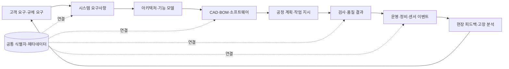
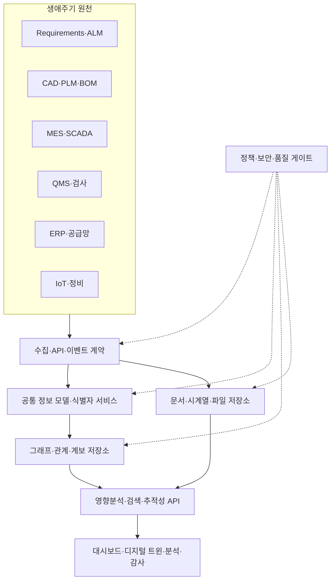

# 디지털 스레드(Digital Thread) 기반 전 생애주기 정보연계

## 1. 개요

> **정의**: 디지털 스레드(Digital Thread)는 제품·서비스의 요구사항부터 설계, 개발, 생산, 운영, 유지보수, 폐기까지 생애주기에서 생성되는 이질적 정보를 식별자와 관계로 연결하여 추적 가능하게 만드는 통합 정보 흐름이다.

전통적인 조직은 기획, 설계, 제조, 품질, 영업, 유지보수 시스템을 각각 도입해 왔다.
각 시스템은 부서의 업무에는 최적화되지만, 시스템 사이의 의미와 연결은 문서·메일·수작업 대조에 남는 경우가 많다.
그 결과 설계 변경이 어느 생산계획과 검사기준에 영향을 주는지, 현장 고장이 어떤 요구사항과 설계결정에서 비롯되었는지 즉시 설명하기 어렵다.
디지털 스레드는 이 단절을 단순한 파일 통합이 아니라 생애주기 객체 사이의 관계와 맥락을 연결하는 문제로 다룬다.

디지털 스레드의 핵심은 모든 데이터를 하나의 데이터베이스에 복사하는 것이 아니다.
각 분야의 원천 시스템을 존중하면서도 요구사항, 부품, 형상, 공정, 검사결과, 센서 이벤트를 공통 식별자와 표준 의미로 참조하는 것이 출발점이다.
따라서 중앙 저장소를 만들더라도 원천성, 변경 이력, 접근권한, 버전 간 관계를 보존해야 한다.
정보관리기술사 답안에서는 통합이라는 표현에 그치지 않고 식별성, 상호운용성, 계보, 영향분석, 신뢰성, 보안까지 함께 설명해야 한다.

등장 배경은 모델 기반 엔터프라이즈와 스마트 제조의 확산에 있다.
제품이 소프트웨어, 전자부품, 기계부품, 데이터 서비스가 결합된 시스템으로 복잡해지면서 한 부서의 산출물만으로 품질을 보장하기 어려워졌다.
디지털 트윈을 운영하려면 물리적 대상의 상태와 가상 모델을 연결할 뿐 아니라, 그 모델이 어떤 요구사항과 설계·검사 근거를 가지는지도 추적해야 한다.
디지털 스레드는 이러한 연결을 통해 디지털 트윈, 모델 기반 시스템 엔지니어링, 데이터 기반 의사결정의 기반을 제공한다.

목표는 네 가지로 정리할 수 있다.
첫째, 특정 부품이나 요구사항을 기준으로 전후방 영향을 신속하게 찾는다.
둘째, 동일한 제품 정의를 제조·검사·정비에서 재사용하여 재입력과 해석 차이를 줄인다.
셋째, 변경과 승인 이력을 남겨 데이터에 대한 신뢰와 감사 가능성을 높인다.
넷째, 현장 피드백을 설계와 요구사항으로 되돌려 다음 제품과 공정의 품질을 개선한다.

## 2. 개념과 구성 원리

### 2.1 디지털 스레드와 관련 개념의 구분

디지털 스레드는 데이터 저장 기술의 제품명이 아니라 정보연계의 운영 모델이다.
데이터 레이크는 원천 데이터를 다양한 형식으로 저장하는 저장·처리 중심 개념이고, 디지털 스레드는 생애주기 객체와 관계를 따라가며 의미 있는 질문에 답하는 연결 중심 개념이다.
디지털 트윈은 현실의 관찰 대상을 목적에 맞게 표현하고 상태를 동기화하는 디지털 표현이며, 디지털 스레드는 그 트윈과 요구사항·설계·공정·검사 데이터를 잇는 정보 흐름이다.
PLM은 제품 관련 정보와 프로세스를 관리하는 체계이고, 디지털 스레드는 PLM을 포함한 ERP·MES·QMS·ALM·IoT 등 경계를 가로지르는 추적 관점이다.

다음 표는 용어를 구분하기 위한 보조 자료이다.
표의 한 칸만 외우기보다 각 개념이 해결하려는 단절의 위치를 파악해야 한다.

| 구분 | 핵심 질문 | 주된 범위 | 디지털 스레드와의 관계 |
|---|---|---|---|
| 디지털 스레드 | 생애주기 정보가 어떻게 연결되고 추적되는가 | 요구사항부터 폐기까지 | 전체 연결 구조와 운영 원리 |
| 디지털 트윈 | 물리 대상의 상태를 어떤 디지털 표현으로 동기화하는가 | 대상·모델·센서·시뮬레이션 | 스레드 위에서 운영되는 응용 |
| PLM | 제품 데이터와 협업 프로세스를 어떻게 관리하는가 | 제품 정의·변경·승인 | 중요한 원천 시스템이자 관리 체계 |
| 데이터 레이크 | 다양한 원천 데이터를 어떻게 보관·처리하는가 | 저장·분석 플랫폼 | 스레드 데이터를 담을 수 있는 기반 |
| 지식 그래프 | 객체와 관계를 어떤 의미 모델로 표현하는가 | 엔터티·관계·추론 | 연결과 영향분석을 구현하는 방법 |
| MBSE | 모델로 시스템 요구와 설계를 어떻게 관리하는가 | 시스템 엔지니어링 | 상위 요구·설계 스레드의 핵심 원천 |

### 2.2 전체 정보 흐름

디지털 스레드는 생애주기 단계마다 만들어지는 산출물을 공통 식별자와 관계로 연결한다.
요구사항 ID가 시스템 기능, 설계 요소, 부품, 공정계획, 검사특성, 현장 이벤트까지 이어지면 변경 영향과 원인 분석이 가능해진다.
연결은 단방향 링크 목록이 아니라 버전, 유효기간, 책임자, 승인상태, 출처를 포함한 관계로 관리해야 한다.

요구사항은 고객의 기대, 법규, 안전 제약, 성능 목표를 검증 가능한 문장으로 바꾼 결과다.
요구사항이 설계와 시험으로 연결되지 않으면 제품이 요구를 만족한다고 주장할 근거가 약해진다.
따라서 요구사항 링크에는 검증 방법, 승인 상태, 변경 사유를 함께 기록한다.

설계 계층에서는 시스템 구조, 인터페이스, 형상, 소프트웨어 버전, 부품 구성과 제조 정보가 서로 연결된다.
단순 파일명 연결은 파일이 복사되거나 형식이 변환될 때 관계가 끊어질 수 있으므로, 모델 요소와 개체에 영속적인 식별자를 부여하는 방식이 필요하다.
같은 부품 번호라도 설계 버전과 적용 제품군이 다르면 다른 유효성을 가질 수 있으므로 버전과 구성 기준을 명시해야 한다.

제조와 품질 계층에서는 설계 의도가 작업 지시, 장비 설정, 검사 특성, 부적합 처리로 전달된다.
검사 결과가 특정 형상·공정·설비·작업 조건을 참조하면 불량의 원인을 평균값이 아니라 조건별로 분석할 수 있다.
반대로 이 관계가 없으면 품질 데이터는 독립된 숫자 묶음이 되어 설계 변경에 대한 재검증 범위를 정하기 어렵다.

운영과 피드백 계층은 스레드를 닫힌 문서 체계가 아니라 학습 루프로 만든다.
정비 이력과 센서 이벤트는 어떤 사용 환경에서 문제가 반복되는지 알려주고, 이 정보는 요구사항·설계·예방정비 주기로 되돌아간다.
피드백을 원천 데이터와 구분하고 현장 판정의 신뢰도와 승인상태를 함께 보존해야 잘못된 이벤트가 설계 변경을 유발하는 것을 막을 수 있다.

### 2.3 식별자와 의미 모델

식별자는 스레드의 실마리다.
제품, 구성품, 요구사항, 모델 요소, 공정, 검사특성, 문서, 센서 이벤트에 안정적인 전역 또는 도메인 식별자를 부여하고, 시스템별 키와의 매핑을 관리한다.
업무 시스템의 내부 번호를 무조건 전역 키로 쓰면 시스템 교체나 조직 개편 때 관계가 깨질 수 있으므로, 영속 식별자와 표시용 번호를 분리하는 설계가 유리하다.

식별자만 같다고 의미가 자동으로 같아지는 것은 아니다.
용어집과 온톨로지는 부품, 기능, 공정, 결함, 단위, 상태의 의미와 허용 관계를 정의한다.
예를 들어 온도 값의 단위가 섭씨인지 화씨인지, 검사 특성이 설계 공차의 상한인지 측정값의 상한인지가 명확해야 시스템 간 교환에서 의미가 변하지 않는다.

메타데이터에는 생성자, 생성시각, 원천 시스템, 버전, 보안등급, 품질상태, 보존기간, 적용 제품구성, 라이선스를 포함할 수 있다.
메타데이터는 본문보다 부수적인 설명처럼 보이지만 검색, 영향분석, 감사, 재현성의 기준점이 된다.
데이터를 옮길 때 본문만 복사하고 메타데이터를 잃으면 연결은 남아도 신뢰 가능한 맥락을 잃는다.

### 2.4 표준과 상호운용성

서로 다른 시스템을 연결할 때는 파일 변환만으로 충분하지 않다.
구문 상호운용성은 파일을 읽을 수 있는지의 문제이고, 의미 상호운용성은 읽은 값이 동일한 개념으로 해석되는지의 문제다.
조직 간 거래에서는 프로세스와 책임의 상호운용성까지 필요하므로 승인, 변경 통지, 오류 처리, 재전송 규칙을 계약에 포함해야 한다.

스마트 제조에서는 제품 모델 교환을 위한 STEP 계열, 장비 데이터 교환을 위한 MTConnect, 품질 정보 교환을 위한 QIF와 같은 표준을 조합할 수 있다.
표준을 사용한다고 바로 통합되는 것은 아니며 조직이 어떤 프로파일과 필수 필드를 채택하는지, 확장 필드의 의미를 어떻게 관리하는지가 중요하다.

표준화와 현실 시스템의 간극은 매핑 계층과 적합성 시험으로 관리한다.
원천 시스템의 데이터를 공통 정보 모델로 변환하고, 변환 전후의 값과 관계가 보존되는지 테스트 데이터로 확인한다.
일대일 포인트 매핑만 늘리면 인터페이스가 기하급수적으로 증가하므로, 공통 모델과 API·이벤트 계약을 중심으로 연결 구조를 단순화한다.

## 3. 구현 아키텍처와 운영 절차

### 3.1 논리 아키텍처

다음 구조는 특정 제품을 복제하라는 참조 모델이 아니라, 스레드의 기능을 계층으로 나눈 것이다.
원천 시스템을 바꾸지 않고 가상화·연계할 수도 있고, 규제 또는 성능 요구가 높으면 신뢰 데이터 저장소를 별도로 둘 수도 있다.
중요한 것은 조회 결과가 원천, 변환, 버전, 권한을 설명할 수 있어야 한다는 점이다.

수집 계층은 배치, API, 메시지, 파일 교환을 목적에 맞게 사용한다.
설계 변경처럼 승인 순서가 중요한 업무는 트랜잭션과 상태 전이가 필요하고, 센서 이벤트처럼 대량·저지연인 데이터는 스트리밍과 시계열 저장이 적합하다.
모든 데이터를 실시간화하면 비용과 복잡성이 커지므로 정보의 신선도 요구와 분석 목적에 따라 주기를 구분한다.

공통 정보 모델은 최소 공통 속성과 관계를 정의하는 계약이다.
모든 원천의 세부 속성을 하나의 거대 스키마에 억지로 넣으면 모델이 경직되므로, 핵심 식별·상태·버전·관계는 공통화하고 도메인 확장은 네임스페이스와 프로파일로 관리한다.
모델 변경은 하위 호환성, 변환 규칙, 소비자 영향, 재처리 계획을 검토한 뒤 시행한다.

관계 저장소는 그래프 데이터베이스나 관계형 링크 테이블로 구현할 수 있다.
그래프가 항상 정답은 아니며, 정형 집계는 관계형·컬럼형 저장소가 더 적합할 수 있다.
기술 선택은 영향분석의 탐색 패턴, 관계 깊이, 쓰기·읽기 비율, 규제 보존, 팀 역량을 기준으로 결정하고, 조회 계층에서 여러 저장소를 조합할 수 있다.

### 3.2 구축 절차

첫 단계는 업무 질문과 성공 기준을 정하는 것이다.
“데이터를 통합한다”는 목표 대신 “설계 변경 후 영향받는 검사계획을 10분 안에 찾는다”처럼 사용자와 시간을 포함해 정의한다.
정확한 질문이 있어야 필요한 관계, 최신성, 권한, 성능 기준을 결정할 수 있다.

둘째, 핵심 생애주기 객체와 시스템을 목록화한다.
요구사항, 시스템 기능, 구성품, 형상, 소프트웨어, 공정, 검사, 고장, 공급자처럼 가치가 높은 객체부터 시작하고, 모든 파일을 첫 범위에 넣지 않는다.
현재의 수작업 대조와 중복 입력을 가치 흐름으로 그리면 우선순위와 예상 효과가 보인다.

셋째, 식별자·용어·관계·상태의 기준 모델을 만든다.
같은 이름이 다른 의미를 가질 수 있으므로 데이터 사전과 책임자를 두고, 관계가 성립하는 조건과 유효기간을 문서화한다.
변경 전후의 관계를 유지하려면 버전과 구성 기준을 모델의 필수 요소로 취급한다.

넷째, 작은 가치 흐름을 파일럿으로 구현한다.
예를 들어 요구사항-설계-검사 연결 또는 고장-부품-정비 연결 중 하나를 선정하여 실제 조회 시나리오를 완주한다.
파일럿은 인터페이스 수보다 관계의 품질, 사용자 수용성, 원천 데이터의 결함을 발견하는 장으로 활용한다.

다섯째, 품질·보안·성능 게이트를 운영 파이프라인에 넣는다.
스키마, 식별자 유일성, 필수 관계, 단위, 시간, 중복, 권한, 계보 누락을 자동 점검하고 예외는 승인과 만료일을 남긴다.
고위험 제품에서는 데이터의 서명·해시·전자승인과 검증 로그를 연결하여 나중에 결과를 재현할 수 있게 한다.

여섯째, 변경관리와 운영 조직을 정착시킨다.
정보 모델 위원회, 도메인 데이터 소유자, 플랫폼 운영자, 보안·품질 책임자의 역할을 정의하고, 모델 변경 요청과 버전 릴리스 절차를 둔다.
시스템을 한 번 연결하고 끝내지 말고 신규 제품·협력사·센서가 들어올 때 같은 온보딩 절차를 적용한다.

### 3.3 추적성·영향분석·변경전파

추적성은 상류와 하류의 두 방향으로 제공해야 한다.
상류 추적은 현장 결함이 어떤 공정, 설계, 요구사항과 관련되는지 확인하는 것이고, 하류 추적은 요구사항이나 설계 변경이 어떤 검사·정비·고객 구성에 영향을 주는지 찾는 것이다.
관계가 단방향으로만 기록되면 영향 범위와 원인 분석 중 하나를 놓치므로 양방향 탐색이 가능해야 한다.

영향분석은 직접 링크의 나열을 넘어 관계 유형과 조건을 해석한다.
예를 들어 “사용” 관계와 “검증” 관계, “대체” 관계는 변경 전파의 우선순위가 다르다.
그래프 패턴, 규칙 엔진, 구성관리 정보로 필수 검증 경로가 끊긴 것을 찾아야 하며, 탐색 결과에는 왜 포함되었는지 설명을 붙인다.

변경전파는 자동으로 모든 것을 바꾸는 기능이 아니다.
영향 후보를 만들고 도메인 책임자가 영향 여부와 재검증 범위를 승인하는 반자동 방식이 안전하다.
승인 없는 자동 전파는 오래된 구성이나 예외 계약을 침해할 수 있으므로, 자동화 수준은 위험과 변경의 가역성을 기준으로 정한다.

### 3.4 품질·보안·권한

디지털 스레드 품질은 정확성, 완전성, 일관성, 최신성, 유일성, 추적성, 가용성으로 나누어 측정할 수 있다.
그러나 평균 품질점수 하나로는 핵심 관계의 누락을 감출 수 있으므로, 필수 객체·필수 링크·고위험 제품군별 품질 게이트를 별도로 둔다.
품질 지표에는 정의, 분모, 측정 주기, 임계값, 개선 담당자를 명시해야 한다.

보안은 중앙 그래프에 모든 정보가 모인다는 가정에서 시작해야 한다.
설계도면, 공급자 정보, 고객 운용정보, 개인의 정비 기록은 서로 다른 등급과 법적 근거를 가질 수 있다.
객체·관계·속성 수준의 접근 제어, 행·열 필터링, 마스킹, 사용 목적 기록, 조회 감사 로그를 조합한다.

협력사 연계에서는 전체 스레드를 공유하지 않고 필요한 뷰와 기간·구성·속성만 제공하는 데이터 공간 방식이 유리하다.
공급자가 데이터를 변경하면 누가 무엇을 언제 바꾸었는지 확인할 수 있어야 하고, 인증서·서명·해시·신뢰목록을 적절히 사용한다.
무결성 기술은 데이터가 참이라는 의미까지 보장하지 않으므로 원천 검증과 업무 승인도 필요하다.

## 4. 비교와 적용 사례

### 4.1 점대점 통합과 디지털 스레드의 비교

점대점 통합은 두 시스템 사이의 빠른 요구를 해결하는 데 유리하지만, 시스템 수가 증가하면 인터페이스 수와 변환 규칙이 급격히 늘어난다.
각 인터페이스가 다른 용어와 버전을 사용하면 한 곳의 변경이 여러 곳의 장애로 확산되고, 관계를 통합적으로 탐색하기 어렵다.
디지털 스레드는 공통 모델·식별자·이벤트 계약을 중심에 두어 연결의 의미와 책임을 표준화한다.

| 구분 | 점대점 인터페이스 | 디지털 스레드 방식 |
|---|---|---|
| 시작 속도 | 단일 요구에 빠름 | 모델·거버넌스 준비 필요 |
| 확장성 | 시스템 증가에 따라 복잡도 증가 | 공통 모델과 재사용 관계로 완화 |
| 의미 관리 | 인터페이스별 매핑에 분산 | 용어·관계·프로파일을 중앙 관리 |
| 영향분석 | 여러 로그와 문서를 수작업 조회 | 관계 탐색과 규칙으로 범위 산출 |
| 변경 대응 | 연쇄 수정 가능성 큼 | 버전·계보·호환성 절차로 통제 |
| 적합한 상황 | 단순·일회성·낮은 결합 | 장기 제품·규제·다조직 생태계 |

점대점이 나쁘다는 뜻은 아니다.
초기에는 인증·정산·장비 상태처럼 한정된 흐름을 점대점으로 빠르게 검증할 수 있다.
다만 제품 생애주기와 파트너가 늘어날 것이 예상되면, 점대점 연결을 공통 계약과 중계 계층으로 전환할 이행 계획을 함께 마련해야 한다.

### 4.2 제조 품질 사례

가상의 항공 부품 제조기업이 설계 변경 후 검사 재실행 범위를 정하지 못한다고 가정한다.
기존에는 CAD 파일, 작업표준서, 검사 결과, 공급자 성적서를 부서별 폴더에서 찾아 담당자가 수작업으로 대조했다.
문서 이름은 비슷하지만 부품 버전과 공정 유효기간이 달라, 변경 후 누락된 검사로 출하 지연과 재작업이 발생했다.

먼저 부품·형상·공차·공정·검사특성에 영속 식별자를 부여하고, 설계 버전과 제조 구성의 관계를 모델링한다.
다음으로 제품 정의 데이터를 표준 교환 형식으로 관리하고, 작업지시와 품질 시스템이 동일한 부품·특성 ID를 참조하게 한다.
검사 결과에는 측정 장비, 교정 상태, 공정 조건, 작업자 역할, 데이터 버전을 포함한다.

변경이 승인되면 영향분석 서비스가 관련 공정·검사·공급자·재고 구성을 후보로 제시한다.
품질 책임자는 후보 중 실제 영향을 받는 항목을 승인하고, 필요한 재검증과 출하 보류를 결정한다.
현장 고장이 발생하면 고장 이벤트에서 부품 로트, 공정 조건, 검사결과, 설계 변경까지 역추적하여 재발 방지 항목을 설계 피드백으로 등록한다.

이 사례의 성과는 통합 시스템 개수 자체가 아니다.
변경 영향분석 시간, 필수 링크 누락률, 동일 데이터 재입력 횟수, 재검증 누락 건수, 현장 문제의 원인 규명 시간으로 측정해야 한다.
예를 들어 영향분석 시간을 수일에서 수십 분으로 줄였더라도 관계 품질이 낮아 오탐이 많다면 승인 업무가 증가할 수 있으므로, 속도와 정확도를 함께 평가한다.

### 4.3 디지털 트윈과의 결합 사례

발전 설비의 디지털 트윈은 센서 값과 시뮬레이션 결과를 보여주는 것만으로 완성되지 않는다.
해당 센서가 어느 설비·부품에 설치되었고, 어떤 설계 변수와 정비 절차를 참조하며, 이상 탐지 모델의 학습 데이터와 경보 이력이 무엇인지 연결되어야 한다.
이 연결이 있으면 경보를 단순히 표시하는 데서 나아가 정비 우선순위와 설계 개선의 근거로 활용할 수 있다.

다만 실시간 센서 데이터와 장기 보존 제품 정의 데이터는 수명과 처리 특성이 다르다.
저지연 시계열 저장소와 변경 불변의 설계·승인 저장소를 분리하고, 공통 식별자와 시간·구성 기준으로 연결하는 하이브리드 구조가 적합하다.
실시간 상태가 과거 설계 버전과 혼동되지 않도록 관측 시각, 적용 구성, 시간 유효성을 함께 조회해야 한다.

## 5. 심화: 표준화·신뢰성과 기술사 답안 연계

국가 연구기관과 산업 표준화 활동에서는 디지털 스레드를 설계·제조·검사·제품지원 사이의 정보 흐름으로 보고, 개방형 표준과 신뢰 가능한 추적성을 강조한다.
제품 데이터를 표준화하는 목적은 특정 도구에 종속되지 않게 하고, 생애주기 단계 사이에서 정보의 재사용과 검증을 가능하게 하는 데 있다.
그러나 표준 목록을 나열하는 것보다 적용 범위, 필수 정보, 적합성 시험, 조직의 운영 책임을 설명하는 것이 기술사 답안에 적합하다.

디지털 스레드와 디지털 트윈은 서로 대체 관계가 아니다.
트윈이 특정 물리 객체의 상태를 표현하는 응용이라면 스레드는 그 상태가 어떤 요구사항·설계·공정·검사·정비 맥락을 가지는지 연결하는 기반이다.
트윈의 신뢰도를 높이려면 데이터의 시간 동기화뿐 아니라 모델 버전, 검증·확인 결과, 불확실성, 추적성까지 관리해야 한다.

최근에는 그래프 기술, 이벤트 기반 아키텍처, 데이터 공간, 생성형 AI 기반 검색이 스레드 활용을 확장하고 있다.
생성형 AI가 생애주기 데이터를 질의할 때는 권한이 있는 관계만 검색하고, 답변 근거와 원천 링크를 제시하며, 추론 결과와 사실 데이터를 구분해야 한다.
그렇지 않으면 연결된 데이터가 많아질수록 잘못된 관계를 그럴듯하게 설명하는 위험도 커진다.

예상 답안은 다음 순서가 안정적이다.
정의와 등장 배경을 서술하고, 요구사항-설계-생산-운영의 개념도를 제시한다.
그 다음 식별자·메타데이터·표준·그래프·API·거버넌스를 설명하고, 점대점 통합과 비교한다.
제조 품질 또는 디지털 트윈 사례로 업무 효과를 제시한 뒤, 상호운용성·보안·품질·변경관리·조직 책임을 고려사항으로 마무리한다.

## 6. 고려사항 및 시사점

### 6.1 가치 질문과 범위를 먼저 확정한다

전사 통합을 목표로 시작하면 범위와 예산이 커지고 빠른 성과를 증명하기 어렵다.
변경 영향분석, 규제 추적성, 재고 구성 확인, 예지정비처럼 비용과 위험이 분명한 질문을 선정한다.
질문에 필요한 관계와 최신성부터 정한 뒤 데이터와 인터페이스 범위를 확장하는 단계적 접근이 바람직하다.

### 6.2 식별자와 버전을 경영 자산으로 관리한다

식별자 규칙을 시스템 개발팀의 내부 문제로만 두면 시스템 교체 때 스레드가 끊긴다.
기업 차원의 식별자 정책, 구성 기준, 버전 수명, 폐기·대체 관계, 데이터 소유자를 정하고 신규 시스템 조달 요건에 포함한다.
관계를 만들 수 없는 객체는 데이터 품질 부채로 등록하고 개선 백로그에서 관리한다.

### 6.3 표준을 선택하되 프로파일을 운영한다

표준을 많이 채택하는 것이 상호운용성을 보장하지 않는다.
조직이 실제로 사용하는 버전, 필수 요소, 단위, 코드 목록, 확장 필드, 적합성 시험을 프로파일로 정의해야 한다.
표준 변경은 기존 관계와 소비자에 대한 영향평가, 변환 테스트, 병행 운영 기간을 거친다.

### 6.4 데이터 품질과 신뢰성을 지속 측정한다

연계가 성공해도 식별자 중복, 필수 링크 누락, 오래된 모델, 단위 변환 오류가 있으면 의사결정의 위험은 줄지 않는다.
핵심 객체와 관계의 품질을 제품군·협력사·생애주기 단계별로 측정하고, 품질 결과와 책임자를 대시보드에 표시한다.
데이터 품질 개선의 우선순위는 모든 오류를 없애는 것이 아니라 안전·규제·고객 영향이 큰 경로부터 낮추는 것이다.

### 6.5 보안과 협업의 균형을 설계한다

스레드의 가치는 공유에 있지만, 전체 데이터를 모두 공유할 필요는 없다.
최소권한, 목적 기반 뷰, 프로젝트·제품·지역별 분리, 반출 승인, 협력사 계약, 조회 감사로 공유 범위를 통제한다.
보안을 이유로 링크를 모두 차단하면 스레드의 가치가 사라지므로, 민감도와 업무 필요에 따라 관계의 세부 수준을 조정한다.

### 6.6 자동화에는 사람의 승인 경로를 둔다

변경 영향 후보, 이상 탐지, 유사 문서 연결을 자동화하면 분석 속도를 높일 수 있다.
그러나 자동 추론은 관계의 사실성과 책임을 대신 보장하지 않으므로, 고위험 변경에는 근거, 신뢰도, 승인자, 롤백 계획을 남긴다.
자동화율이 아니라 올바른 영향 범위와 재검증 누락 감소를 성과지표로 삼는다.

### 6.7 조직과 공급망까지 포함한다

디지털 스레드는 IT 부서만의 플랫폼 사업이 아니다.
제품·설계·제조·품질·정비·구매·보안·법무가 데이터 의미와 책임을 함께 정해야 하며, 협력사도 식별자와 변경 통지 계약에 참여해야 한다.
교육과 운영 커뮤니티를 통해 현장 데이터가 다시 설계와 표준에 반영되는 순환을 만들어야 지속된다.

## 7. 참고자료

- NIST, Digital Thread for Smart Manufacturing: https://www.nist.gov/programs-projects/digital-thread-smart-manufacturing
- NIST, Digital Thread for Manufacturing: https://www.nist.gov/programs-projects/digital-thread-manufacturing
- NIST, Enabling the Digital Thread for Smart Manufacturing: https://www.nist.gov/ctl/smart-connected-systems-division/smart-connected-manufacturing-systems-group/enabling-digital
- NIST, System Lifecycle Handler for Digital Thread: https://tsapps.nist.gov/publication/get_pdf.cfm?pub_id=924828
- NIST, Digital Twins for Advanced Manufacturing: https://www.nist.gov/programs-projects/digital-twins-advanced-manufacturing
- NIST, Recommendations on Ensuring Traceability and Trustworthiness of Manufacturing-Related Data: https://nvlpubs.nist.gov/nistpubs/ams/NIST.AMS.300-10.pdf
- NIST, Testing the Digital Thread in Support of Model-Based Manufacturing and Inspection: https://tsapps.nist.gov/publication/get_pdf.cfm?pub_id=919497

---

> **한 줄 요약**: 디지털 스레드는 공통 식별자·표준 의미·버전·계보로 제품 생애주기 정보를 연결하여 변경 영향분석, 품질 추적성, 디지털 트윈 운영과 현장 피드백을 가능하게 하는 정보관리 기반이다.
