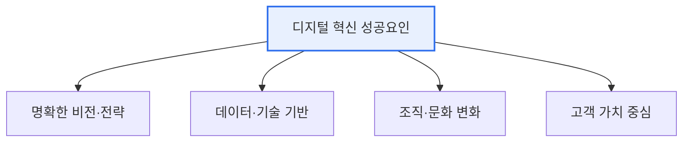

# 디지털 혁신을 위한 고려사항과 CoE(Center of Excellence)

## 1. 개요

### 가. 정의
> 디지털 혁신(DX)을 성공적으로 추진하기 위한 전략·조직·문화 차원의 고려사항과, 이를 전담해 **역량을 결집·전파하는 조직인 CoE(Center of Excellence, 전문가 조직)** 의 역할을 다룬다.

디지털 혁신에서 CoE가 필요한 근본 이유는 '**혁신 역량이 조직에 흩어져 있으면 확산되지 못하고 사라진다**'는 데 있다. DX는 특정 부서 하나가 아니라 조직 전체가 바뀌는 여정인데, 각 부서가 제각기 시도하면 중복 투자·시행착오가 반복되고 성공 경험이 공유되지 않는다. CoE는 데이터·AI·클라우드 같은 핵심 역량을 갖춘 전문가를 한곳에 모아, 전사에 방법론·표준·모범사례를 제공하고 각 부서의 혁신을 지원·전파하는 '혁신의 허브' 역할을 한다. 즉 CoE는 흩어진 역량을 결집해 시행착오를 줄이고, 성공을 조직 전체로 확산시켜 DX의 속도와 성공률을 높인다.

### 나. 필요성
DX 프로젝트의 다수가 실패하는데, 그 원인은 대개 전략 부재·조직 저항·역량 부족이다. 이를 극복하려면 혁신을 전담·지원하는 구심점(CoE)이 필요하다.

## 2. 디지털 혁신을 위한 고려사항

| 고려사항 | 내용 |
|---|---|
| **비전·리더십** | 경영진 주도의 명확한 DX 목표 |
| **데이터·기술** | 데이터 거버넌스, 클라우드·AI 기반 |
| **조직·문화** | 애자일·실험 문화, 저항 관리 |
| **고객 중심** | 고객 가치에서 출발한 혁신 |
| **인재·역량** | 디지털 역량 확보·육성 |

DX의 성공은 기술보다 비전·문화·역량에 좌우된다. 특히 조직 문화 변화와 인재 확보가 어렵고 중요하다.

## 3. CoE의 역할

| 역할 | 내용 |
|---|---|
| **역량 결집** | 데이터·AI·클라우드 전문가 집중 |
| **표준·방법론** | 전사 공통 프레임워크·모범사례 제공 |
| **지원·전파** | 각 부서 혁신 프로젝트 지원·확산 |
| **교육·문화** | 디지털 역량 교육, 혁신 문화 조성 |
| **거버넌스** | 우선순위·투자·성과 관리 |

CoE는 중앙집중형(강한 통제)·분산형(부서 자율)·허브앤스포크(혼합) 등으로 운영되며, 성숙도에 따라 통제에서 자율로 무게중심을 옮긴다.

## 4. 고려사항 및 시사점

1. **CoE는 통제가 아닌 지원 조직**이어야 한다. 현업 위에 군림하며 통제하면 저항을 부르므로, 역량을 전파하고 지원하는 조력자 역할로 자리매김해야 한다.
2. **성숙도에 따른 진화**가 필요하다. 초기에는 CoE가 중앙에서 강하게 이끌지만, 조직 역량이 성숙하면 각 부서가 자율적으로 혁신하도록 권한을 이양(허브앤스포크→분산)한다.
3. **문화 변화의 촉매**가 핵심 가치다. CoE의 궁극적 목표는 특정 프로젝트 수행이 아니라, 조직 전체가 데이터·실험 기반으로 일하는 디지털 문화를 내재화하도록 촉진하는 것이다.

---

> **한 줄 요약**: 디지털 혁신은 *비전·데이터·조직문화·고객가치·인재* 를 고려해야 하며, CoE는 *핵심 역량을 결집해 표준·방법론을 제공하고 각 부서 혁신을 지원·전파* 하는 혁신 허브로서 통제보다 지원과 문화 변화의 촉매 역할을 한다.
