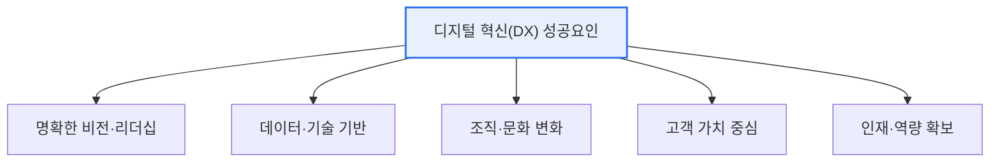
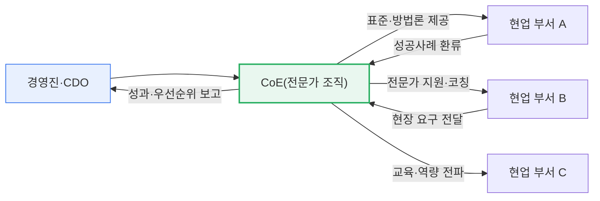

# 디지털 혁신을 위한 고려사항과 CoE(Center of Excellence)

## 1. 개요

### 가. 정의
> **CoE(Center of Excellence, 전문가 조직)** 는 디지털 혁신(DX)에 필요한 데이터·AI·클라우드 등 핵심 역량을 **전담 전문가 집단에 결집**하고, 전사에 표준·방법론·모범사례를 제공하며 각 부서의 혁신을 지원·전파하는 **'혁신의 허브' 조직**이다. 디지털 혁신을 위한 고려사항이란 이러한 CoE를 포함해, DX를 성공으로 이끄는 전략·데이터·조직·문화·인재 차원의 조건들을 말한다.

디지털 혁신에서 CoE가 필요한 근본 이유는 '**혁신 역량이 조직에 흩어져 있으면 확산되지 못하고 소멸한다**'는 데 있다. DX는 특정 부서 하나의 프로젝트가 아니라 조직 전체가 일하는 방식·비즈니스 모델·문화를 바꾸는 장기 여정이다. 그런데 각 부서가 제각기 시도하면 동일한 도구를 중복 도입하고, 같은 시행착오를 반복하며, 어렵게 얻은 성공 경험이 부서 경계를 넘지 못한 채 사라진다. CoE는 데이터 사이언티스트·AI 엔지니어·클라우드 아키텍트·애자일 코치 같은 희소 전문가를 한곳에 모아, 전사 공통의 방법론과 표준을 세우고 각 현업 부서의 혁신을 코칭·지원함으로써 이 문제를 해결한다. 즉 CoE는 흩어진 역량을 결집해 시행착오와 중복 투자를 줄이고, 국지적 성공을 조직 전체로 확산시켜 DX의 속도와 성공률을 높이는 구심점이다.

### 나. 등장 배경과 필요성
디지털 혁신 프로젝트의 상당수가 기대한 성과를 내지 못하고 좌초하는데, 그 원인은 기술 자체보다 **전략 부재, 조직의 변화 저항, 역량 부족, 사일로(부서 간 단절)** 인 경우가 많다. 특히 데이터·AI 같은 첨단 역량은 인재가 희소하고 학습 곡선이 가파르기 때문에, 이를 각 부서가 개별적으로 확보하기란 현실적으로 불가능하다.

이런 배경에서 조직은 두 가지 상반된 딜레마에 직면한다. 역량을 중앙에 모으면 전문성은 확보되지만 현업과 멀어져 실용성이 떨어지고, 각 부서에 분산하면 현업 밀착성은 좋아지지만 전문성·표준이 약해진다. CoE는 이 딜레마를 '**전문성은 중앙에 결집하되 현업을 지원·전파하는**' 방식으로 절충하기 위해 등장한 조직 형태다. 따라서 CoE는 단순한 신기술 태스크포스가 아니라, DX 여정 전반에 걸쳐 역량을 축적·전수하며 조직의 디지털 성숙도를 끌어올리는 상설·전략 조직으로 이해해야 한다.

## 2. 디지털 혁신을 위한 고려사항

디지털 혁신의 성공은 도입한 기술의 화려함이 아니라 비전·데이터·조직문화·고객가치·인재라는 여러 축의 균형에 좌우된다. 아래 전체 구조도는 DX 성공을 떠받치는 핵심 요인들을 보여준다.

```mermaid
flowchart TB
  DX["디지털 혁신(DX) 성공요인"] --> V["명확한 비전·리더십"]
  DX --> D["데이터·기술 기반"]
  DX --> C["조직·문화 변화"]
  DX --> P["고객 가치 중심"]
  DX --> H["인재·역량 확보"]
  style DX fill:#e8f0fe,stroke:#2f6fed,stroke-width:2px
```

### 가. 비전·리더십
DX는 조직의 근본적 변화를 수반하므로 경영진의 강력한 후원과 명확한 방향성이 없으면 추진력을 잃는다. 리더십이 흔들리면 단기 실적 압박에 밀려 혁신 투자가 가장 먼저 삭감되고, 부서 간 이해 충돌을 조정할 주체가 사라진다. 따라서 CEO·CDO(최고디지털책임자)가 DX를 전사 우선순위로 선언하고, 실패를 학습으로 인정하는 심리적 안전감을 조성하는 것이 출발점이다. 예컨대 제조 대기업이 스마트팩토리 전환을 추진할 때, 경영진이 공장별 KPI에 '데이터 활용도'를 명시적으로 포함시키는 것이 리더십의 구체적 실천이다.

### 나. 데이터·기술 기반
DX의 연료는 데이터다. 아무리 좋은 AI 모델도 신뢰할 수 있는 데이터가 없으면 무용지물이므로, 데이터 거버넌스(품질·표준·보안·메타데이터)와 이를 담아낼 클라우드·데이터 플랫폼 인프라가 선행되어야 한다. 사일로에 갇힌 데이터를 통합하고, 전사가 공통으로 쓸 수 있는 데이터 파이프라인·분석 환경을 마련하는 일이 핵심 과제다. 데이터 기반이 부실하면 각 부서가 서로 다른 기준의 데이터로 서로 다른 결론을 내려 의사결정의 신뢰가 무너진다.

### 다. 조직·문화 변화
DX 실패의 가장 흔한 원인은 기술이 아니라 문화다. 오랜 성공 방식에 익숙한 조직은 새로운 시도를 위험으로 인식해 저항하기 마련이다. 따라서 실험과 빠른 실패를 장려하는 애자일 문화, 부서 경계를 넘는 협업, 데이터에 근거해 의사결정하는 습관을 조직에 내재화해야 한다. 이 변화는 가장 어렵고 오래 걸리며, 교육·인센티브·리더의 솔선수범이 함께 작동해야 한다. 문화 변화 없이 도구만 도입하면 값비싼 시스템이 방치되는 '디지털 전시행정'에 그친다.

### 라. 고객 가치 중심과 인재
DX는 기술 도입 자체가 목적이 아니라 고객에게 새로운 가치를 제공하는 것이 목적이다. 따라서 모든 혁신은 '이것이 고객의 어떤 문제를 해결하는가'라는 질문에서 출발해야 한다. 동시에 이 모든 것을 실행할 디지털 인재(데이터·AI·클라우드·UX 전문가) 확보와 기존 인력의 리스킬링(Reskilling)이 성공의 마지막 열쇠다. 인재 시장의 경쟁이 치열하므로, 외부 채용뿐 아니라 내부 육성과 파트너십을 병행하는 전략이 필요하다.

아래 표는 고려사항을 정리한 것이다(산문 설명의 보조 수단).

| 고려사항 | 핵심 내용 | 실패 시 증상 |
|---|---|---|
| **비전·리더십** | 경영진 주도의 명확한 DX 목표·후원 | 단기 실적에 밀려 투자 중단 |
| **데이터·기술** | 데이터 거버넌스, 클라우드·AI 기반 | 부서별 상이한 데이터로 신뢰 붕괴 |
| **조직·문화** | 애자일·실험 문화, 저항 관리 | 값비싼 시스템 방치(전시행정) |
| **고객 중심** | 고객 문제에서 출발한 혁신 | 기술 위한 기술, 성과 부재 |
| **인재·역량** | 전문가 확보·기존 인력 리스킬링 | 실행 주체 부재로 표류 |

## 3. CoE의 역할과 운영 모델

CoE는 앞의 고려사항들을 실제로 작동시키는 실행 주체다. 아래 세부도는 CoE가 전략·표준·지원·교육·거버넌스의 다섯 축으로 현업 부서와 상호작용하는 구조를 보여준다.

```mermaid
flowchart LR
  CEO["경영진·CDO"] --> CoE["CoE(전문가 조직)"]
  CoE -->|"표준·방법론 제공"| B1["현업 부서 A"]
  CoE -->|"전문가 지원·코칭"| B2["현업 부서 B"]
  CoE -->|"교육·역량 전파"| B3["현업 부서 C"]
  B1 -->|"성공사례 환류"| CoE
  B2 -->|"현장 요구 전달"| CoE
  CoE -->|"성과·우선순위 보고"| CEO
  style CoE fill:#e9f7ef,stroke:#27ae60,stroke-width:2px
  style CEO fill:#e8f0fe,stroke:#2f6fed,stroke-width:1px
```

### 가. 역량 결집과 표준·방법론 제공
CoE의 1차 역할은 희소한 전문 역량을 한곳에 모으고, 전사가 공유할 공통 프레임워크를 세우는 것이다. 예를 들어 데이터 분석 방법론, MLOps 파이프라인 표준, 클라우드 아키텍처 참조모델, 재사용 가능한 컴포넌트 라이브러리를 정비해 각 부서가 매번 바닥부터 시작하지 않도록 한다. 이 표준화는 품질을 균질화하고 부서 간 협업·통합을 쉽게 만든다.

### 나. 현업 지원·코칭과 성공사례 전파
CoE는 상아탑이 아니라 현업에 파고드는 조력자여야 한다. 각 부서의 혁신 프로젝트에 전문가를 파견해 함께 문제를 풀고(임베디드 지원), 성공한 파일럿을 다른 부서로 복제·확산한다. 이 과정에서 CoE는 지식을 '전수'하여 현업 스스로 혁신할 수 있는 자생력을 키운다. 예컨대 한 영업 부서에서 검증한 수요 예측 모델을 CoE가 표준화해 다른 사업부로 이식하면, 조직 전체가 개별 학습 비용 없이 성과를 공유한다.

### 다. 교육·문화 조성과 거버넌스
CoE는 전사 디지털 역량 교육(데이터 리터러시·AI 활용)과 혁신 문화 확산을 담당하며, 동시에 DX 과제의 우선순위 선정·투자 배분·성과 관리라는 거버넌스 기능을 수행한다. 자원이 한정된 상황에서 무엇을 먼저 할지 결정하고, 중복 투자를 조정하며, 성과를 측정해 경영진에 보고하는 컨트롤타워 역할이다.

### 라. 운영 모델 유형
CoE의 운영 방식은 통제와 자율의 무게중심에 따라 세 유형으로 나뉜다. 각 유형은 조직의 디지털 성숙도에 맞춰 선택·진화해야 한다.

| 유형 | 특징 | 적합 상황 |
|---|---|---|
| **중앙집중형(Centralized)** | CoE가 강한 통제, 표준 일원화 | DX 초기, 역량·표준 부재 |
| **분산형(Decentralized)** | 각 부서가 자율적 혁신 | 성숙 단계, 역량 내재화 |
| **허브앤스포크(Hub & Spoke)** | 중앙 허브 + 부서별 접점 혼합 | 확장 단계, 대다수 대기업 |

일반적으로 조직은 DX 초기에 중앙집중형으로 역량과 표준을 빠르게 세우고, 성숙해질수록 허브앤스포크를 거쳐 분산형으로 권한을 이양하며 무게중심을 통제에서 자율로 옮긴다.

## 4. 비교와 적용 사례

### 가. CoE와 일반 조직 형태의 비교
CoE를 임시 TF(태스크포스)나 단순 IT 부서와 혼동해서는 안 된다. TF는 특정 과제 완료 후 해체되는 한시 조직이라 역량이 축적되지 않고, 전통 IT 부서는 시스템 운영에 초점을 두어 비즈니스 혁신을 주도하지 못한다. 반면 CoE는 상설 조직으로 역량을 지속 축적하고, 기술을 비즈니스 가치로 전환하는 데 초점을 둔다는 점이 결정적으로 다르다. 이 차이는 실무에서 '지속성'으로 나타난다 — TF는 프로젝트가 끝나면 지식이 흩어지지만, CoE는 축적한 방법론·사례를 다음 프로젝트에 재투입해 학습 곡선을 단축한다.

### 나. 산업 적용 사례
CoE는 다양한 산업에서 DX의 구심점으로 활용된다. 금융권에서는 데이터·AI CoE를 두어 신용평가·이상거래탐지(FDS)·개인화 추천 모델을 표준화하고 각 사업부에 제공한다. 제조업에서는 스마트팩토리 CoE가 공장별로 흩어진 설비 데이터 분석·예지정비(Predictive Maintenance) 역량을 결집해, 한 라인에서 검증한 불량 예측 모델을 전 공장으로 확산한다. 공공부문에서도 데이터 기반 행정을 위해 데이터 분석 CoE를 설치해 부처별 분석 수요를 지원하는 사례가 늘고 있다. 이들 사례의 공통점은 '한 곳의 성공을 표준화해 조직 전체로 복제'한다는 CoE의 본질을 실현한다는 점이다.

### 다. 최근 동향 — 생성형 AI CoE
최근에는 생성형 AI(LLM) 확산에 대응해 **AI CoE / 생성형 AI CoE** 를 신설하는 조직이 빠르게 늘고 있다. 이는 전사에 흩어진 LLM 활용 시도를 표준화하고, 프롬프트·RAG·모델 거버넌스 가이드라인을 세우며, 데이터 보안·윤리·환각(Hallucination) 리스크를 통제하는 역할을 한다. 무분별한 도입으로 인한 데이터 유출·저작권·편향 문제를 방지하려면 이러한 중앙 통제·지원 조직이 특히 중요해지고 있다.

## 5. 심화 — 예상 출제 방향과 답안 구성 전략

정보관리기술사 시험에서 이 주제는 경영·사업전략 영역에서 '디지털 혁신 성공을 위한 고려사항과 CoE의 역할'을 논하라는 형태로 출제되는 경향이 있다. 답안 작성 시 유의점은 다음과 같다.

첫째, **고려사항과 CoE를 유기적으로 연결**해야 한다. 고려사항(비전·데이터·문화·고객·인재)을 나열하고 CoE를 따로 설명하는 데 그치지 말고, "CoE가 이 고려사항들을 실제로 작동시키는 실행 주체"라는 논리로 엮어야 통합적 이해가 드러난다.

둘째, **CoE의 운영 모델과 성숙도 진화**를 반드시 포함한다. 중앙집중형→허브앤스포크→분산형으로 무게중심을 옮긴다는 동태적 관점, 그리고 '통제가 아닌 지원 조직'이라는 성격 규정이 고득점 포인트다.

셋째, **최신 사례(생성형 AI CoE)와 연계 주제**를 답안에 녹이면 시의성이 살아난다. 데이터 거버넌스, MLOps, 애자일 조직, 변화 관리(ADKAR) 등 인접 주제와의 연결을 언급하면 기술사 수준의 폭넓은 통찰을 보일 수 있다.

## 6. 고려사항 및 시사점 (기술사 관점)

1. **CoE는 통제가 아닌 지원 조직으로 설계해야 한다.** CoE가 현업 위에 군림하며 승인·검열하는 관문이 되면 오히려 혁신 속도를 늦추고 저항을 부른다. 역량을 전파하고 현업을 코칭하는 조력자(Enabler)로 자리매김해야 지속 가능하다. 지원과 최소한의 거버넌스(표준·보안) 사이의 균형이 핵심이다.

2. **성숙도에 따른 조직 진화가 필요하다.** 초기에는 중앙집중형으로 역량·표준을 빠르게 구축하되, 조직 역량이 성숙하면 허브앤스포크를 거쳐 분산형으로 권한을 이양해야 한다. 성숙 단계에 맞지 않는 운영 모델은 병목(과도한 중앙 통제)이나 혼란(때 이른 분산)을 낳는다.

3. **문화 변화의 촉매가 CoE의 궁극 목표다.** CoE의 성공 지표는 수행한 프로젝트 수가 아니라, 조직 전체가 데이터·실험 기반으로 일하는 디지털 문화를 얼마나 내재화했는가다. 즉 CoE는 '스스로를 불필요하게 만드는 것'(현업이 자생적으로 혁신하게 하는 것)을 지향해야 한다.

4. **성과 측정과 인재 유지 전략을 병행해야 한다.** CoE의 기여는 비즈니스 성과(매출·비용·고객 지표)로 환산해 가시화하지 않으면 존속 명분을 잃기 쉽다. 동시에 CoE에 모인 희소 전문가의 이탈을 막기 위한 경력 경로·보상·성장 기회 설계가 필수다. BSC 같은 성과 관리 도구와 연계해 CoE의 기여를 측정하는 접근이 유효하다.

5. **데이터 거버넌스·보안과의 연계가 전제다.** CoE가 다루는 데이터·AI는 개인정보·저작권·편향·보안 리스크를 수반하므로, 전사 데이터 거버넌스 체계 및 AI 윤리·거버넌스와 반드시 연동되어야 한다. 특히 생성형 AI CoE는 모델 거버넌스와 리스크 통제를 핵심 책무로 포함해야 한다.

## 참고자료
- Gartner, "Center of Excellence (CoE)" Glossary: https://www.gartner.com/en/information-technology/glossary/center-of-excellence-coe
- McKinsey, "Unlocking success in digital transformations": https://www.mckinsey.com/capabilities/people-and-organizational-performance/our-insights/unlocking-success-in-digital-transformations

---

> **한 줄 요약**: 디지털 혁신은 *비전·데이터·조직문화·고객가치·인재* 의 균형을 고려해야 하며, CoE는 *희소한 핵심 역량을 결집해 표준·방법론을 제공하고 각 부서 혁신을 지원·전파* 하는 혁신 허브로서, 통제보다 지원, 성숙도에 따른 자율 이양, 디지털 문화 내재화의 촉매 역할을 통해 DX의 속도와 성공률을 높인다.
