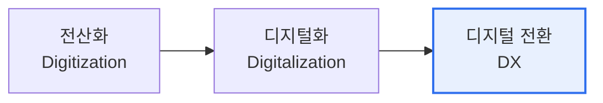

# 디지털 트랜스포메이션(Digital Transformation, DX)

## 1. 개요

### 가. 정의
> 디지털 기술을 활용해 **비즈니스 모델·프로세스·조직문화·고객경험을 근본적으로 혁신**하여 새로운 가치를 창출하는 총체적 전환. 단순 전산화(Digitization)나 디지털화(Digitalization)를 넘어선다.

DX의 본질은 '기술 도입'이 아니라 '**기술을 통한 비즈니스의 재정의**'다. 아날로그를 디지털로 바꾸는 전산화, 프로세스를 디지털로 개선하는 디지털화를 넘어, 기업이 돈 버는 방식(비즈니스 모델) 자체를 바꾸는 것이 DX다. 예컨대 자동차 제조사가 차를 파는 회사에서 모빌리티 서비스를 파는 회사로 전환하는 것이 대표적이다.

### 나. 등장 배경
클라우드·AI·빅데이터 등 기술 성숙, 고객 기대 수준 상승, 디지털 네이티브 기업(플랫폼)의 시장 파괴가 맞물리며, 기존 기업도 생존을 위해 전환이 불가피해졌다.

## 2. 단계 및 구성요소

| 구성요소 | 내용 |
|---|---|
| **비즈니스 모델** | 제품 중심 → 서비스·플랫폼·구독 모델 |
| **프로세스** | 데이터 기반 자동화·최적화 |
| **고객경험(CX)** | 옴니채널·개인화 |
| **조직·문화** | 애자일·데이터 기반 의사결정 |
| **기술(기반)** | 클라우드·AI·빅데이터·IoT |

## 3. 성공 요인 및 고려사항

| 요인 | 내용 |
|---|---|
| **리더십·비전** | 경영진 주도의 명확한 전환 목표 |
| **데이터·플랫폼** | 데이터 거버넌스, 클라우드 네이티브 |
| **인재·문화** | 디지털 역량, 실패 허용·실험 문화 |
| **고객 중심** | 고객 가치에서 출발한 혁신 |

## 4. 시사점
- 기술이 아닌 **비즈니스·고객 가치**에서 출발해야 성공
- 조직문화·일하는 방식의 변화가 기술 도입보다 어렵고 중요
- 생성형 AI가 DX의 새로운 촉매(초개인화·자동화)로 부상

---

> **한 줄 요약**: DX는 *전산화→디지털화→디지털 전환* 의 진화로, 디지털 기술로 **비즈니스 모델·프로세스·고객경험·조직문화를 근본 혁신**해 새로운 가치를 창출하는 전략적 전환이다.
