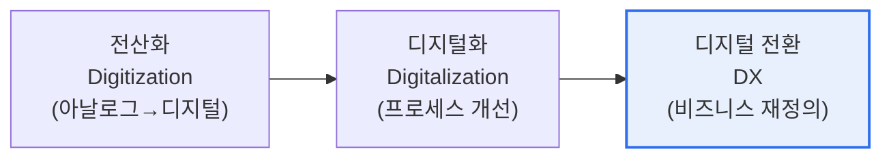

# 디지털 트랜스포메이션(Digital Transformation, DX)

## 1. 개요

### 가. 정의
> 디지털 기술을 지렛대로 삼아 **비즈니스 모델·프로세스·고객경험·조직문화를 근본적으로 재설계**하여 새로운 가치를 창출하는 총체적 전환. 단순 전산화(Digitization)나 부분적 디지털화(Digitalization)를 넘어선다.

DX의 본질을 이해하려면 세 단어를 구분해야 한다. **전산화(Digitization)** 는 종이를 스캔해 PDF로 바꾸듯 아날로그를 디지털 데이터로 변환하는 것이고, **디지털화(Digitalization)** 는 그 데이터로 기존 업무 프로세스를 개선하는 것이다. 그러나 **DX(Transformation)** 는 여기서 한 걸음 더 나아가, 기업이 **돈을 버는 방식(비즈니스 모델) 자체를 다시 정의**한다. 예를 들어 어떤 중장비 제조사가 굴착기를 파는 대신 '가동 시간당 요금'을 받는 서비스 모델로 전환하고, 장비에 부착한 IoT 센서로 고장을 예측해 다운타임을 줄여주는 서비스를 판다면, 이것이 전형적인 DX다. 제품이 아니라 성과(Outcome)를 파는 것이다.

### 나. 등장 배경 및 필요성
DX가 선택이 아닌 생존의 문제가 된 배경에는 세 가지 압력이 있다. 첫째, **기술의 성숙**이다. 클라우드로 인프라 비용의 진입장벽이 사라지고, AI·빅데이터로 데이터에서 가치를 뽑아낼 수 있게 되었다. 둘째, **고객 기대의 상승**이다. 스마트폰에 길들여진 소비자는 모든 산업에서 즉각적·개인화된 경험을 요구한다. 셋째, **디지털 네이티브 기업의 시장 파괴**다. 넷플릭스가 비디오 대여점을, 우버가 택시 산업을 재편했듯, 플랫폼 기업은 기존 산업의 경계를 무너뜨린다. 이 압력 앞에서 전통 기업은 스스로를 바꾸지 않으면 도태된다.

## 2. DX의 진화 단계

세 단계는 단절이 아니라 연속선이지만, 앞의 둘이 '효율화(더 잘하기)'라면 DX는 '**혁신(다르게 하기)**'이라는 질적 차이가 있다. 많은 기업이 전산화·디지털화를 DX로 착각하는데, ERP를 도입하고 업무를 자동화한 것만으로는 낡은 사업 방식을 빠르게 만든 것일 뿐 전환이 아니다. 진짜 DX는 그 과정에서 얻은 데이터로 **새로운 수익원과 고객 관계를 창출**할 때 비로소 완성된다.

## 3. DX의 구성요소

DX는 특정 기술 도입이 아니라 여러 축의 동시 변화다. **비즈니스 모델**은 제품 판매에서 서비스·구독·플랫폼으로 이동하고, **프로세스**는 경험과 직관 대신 데이터에 기반해 자동화·최적화된다. **고객경험(CX)** 은 채널이 단절된 형태에서 온·오프라인을 넘나드는 옴니채널·초개인화로 진화하며, 이 모든 것을 떠받치는 **조직·문화**는 위계적 지시 구조에서 애자일하고 실험을 허용하는 데이터 기반 문화로 바뀐다. 그리고 이 변화들의 **기술적 기반**이 클라우드·AI·빅데이터·IoT다.

| 구성요소 | 전환 방향 | 예시 |
|---|---|---|
| **비즈니스 모델** | 제품 → 서비스·구독·플랫폼 | 소프트웨어 패키지 판매 → SaaS 구독 |
| **프로세스** | 경험 기반 → 데이터 기반 자동화 | 수요예측·재고 최적화 |
| **고객경험(CX)** | 단절 채널 → 옴니채널·초개인화 | 앱·매장·웹 통합 여정 |
| **조직·문화** | 위계·지시 → 애자일·실험 | 스쿼드 조직, 데이터 기반 의사결정 |
| **기술 기반** | 온프레미스·수작업 | 클라우드·AI·빅데이터·IoT |

## 4. 성공 요인 및 실패 요인

DX 프로젝트의 다수가 실패하는데, 그 원인은 대개 기술이 아니라 **사람과 전략**에 있다. 성공하는 조직은 경영진이 명확한 비전을 갖고 주도하며(리더십), 데이터를 신뢰할 수 있는 자산으로 관리하고(데이터 거버넌스), 실패를 학습으로 받아들이는 문화를 가진다. 반대로 실패하는 조직은 '경쟁사가 하니까' 식으로 목적 없이 기술만 도입하거나, 현업의 저항을 관리하지 못하거나, 단기 성과에 집착해 전환을 중단한다.

| 구분 | 내용 |
|---|---|
| **성공 요인** | 경영진 비전·주도, 데이터 거버넌스, 애자일 문화, 고객 가치 중심 |
| **실패 요인** | 목적 없는 기술 도입, 조직 저항, 단기 성과 집착, 사일로 |

## 5. 고려사항 및 시사점 (기술사 관점)

1. **기술이 아니라 가치에서 출발**해야 한다. "무슨 기술을 도입할까"가 아니라 "고객에게 어떤 새로운 가치를 줄까"를 먼저 정의하고, 그에 맞는 기술을 선택하는 역방향 설계가 성공 확률을 높인다.
2. **문화 변화가 가장 어렵고 중요하다.** 기술은 사면 되지만, 데이터 기반으로 일하고 실패를 용인하는 문화는 오랜 시간이 걸린다. CDO(최고디지털책임자)·전담 조직으로 변화를 관리한다.
3. **레거시와의 공존 전략**이 필요하다. 핵심 시스템을 한 번에 바꾸는 빅뱅은 위험하므로, 마이크로서비스·API로 점진 전환하는 스트랭글러(Strangler) 패턴이 현실적이다.
4. **생성형 AI가 새로운 촉매**로 부상했다. 초개인화 마케팅, 업무 자동화, 지식 검색 등에서 DX를 가속하며, 향후 AI 네이티브 비즈니스 모델이 확산될 전망이다.

---

> **한 줄 요약**: DX는 *전산화→디지털화→디지털 전환* 의 진화에서 비즈니스 모델 자체를 재정의하는 단계로, 비즈니스·프로세스·고객경험·조직문화를 동시에 혁신하며 성공의 관건은 기술이 아니라 **고객 가치 중심 전략과 문화 변화**에 있다.
