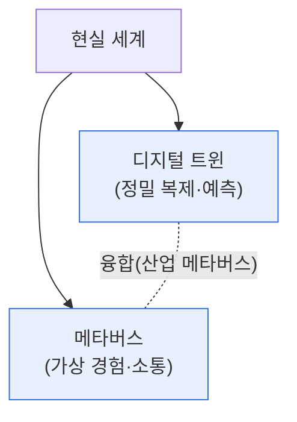

# 디지털 트윈(Digital Twin)과 메타버스(Metaverse)

## 1. 개요

### 가. 정의
> **디지털 트윈**은 현실의 물리적 대상(설비·건물·도시)을 **디지털 공간에 똑같이 복제하고 실시간 데이터로 동기화**하여 시뮬레이션·예측·최적화하는 기술이고, **메타버스**는 현실과 융합된 **가상의 3차원 공간에서 사람들이 아바타로 상호작용·활동**하는 세계다.

두 기술을 함께 이해하는 핵심은 '**둘 다 현실을 디지털로 옮기지만 목적이 다르다**'는 데 있다. 디지털 트윈은 '**현실을 정확히 반영해 문제를 예측·해결**'하는 것이 목적으로, 산업 현장의 실제 데이터로 가상 모델을 동기화해 고장을 예측하고 최적 운영을 찾는다. 즉 실용·산업 중심이다. 메타버스는 '**현실을 확장한 새로운 경험·소통 공간을 만드는**' 것이 목적으로, 사람이 아바타로 들어가 놀고·일하고·거래하는 사회적 공간이다. 즉 경험·소통 중심이다. 그러나 둘은 대립하지 않고 융합한다. 디지털 트윈이 정밀한 현실 복제를 제공하고 메타버스가 그 안에서 사람들이 협업·체험하는 인터페이스를 제공하면, '**산업 메타버스**'처럼 현실을 그대로 반영한 가상 공간에서 여러 사람이 함께 시뮬레이션·운영하는 강력한 결합이 가능하다.

### 나. 등장 배경
IoT·5G·AI·XR 기술의 성숙으로 현실을 정밀하게 디지털화하고 몰입적으로 상호작용하는 것이 가능해지면서, 디지털 트윈과 메타버스가 부상했다.

## 2. 비교

| 구분 | 디지털 트윈 | 메타버스 |
|---|---|---|
| **목적** | 현실 복제·예측·최적화 | 가상 경험·소통·활동 |
| **초점** | 실용·산업 | 경험·사회·소통 |
| **데이터** | 실시간 현실 동기화 | 콘텐츠·아바타 상호작용 |
| **핵심 가치** | 시뮬레이션·예지정비 | 몰입·연결·경제 |
| **예** | 스마트팩토리·스마트시티 | 가상 회의·게임·가상경제 |

## 3. 핵심 기술

| 기술 | 디지털 트윈 | 메타버스 |
|---|---|---|
| **공통** | 3D 모델링·렌더링, AI, 클라우드 | |
| **고유** | IoT 센서·실시간 동기화, 시뮬레이션 | XR(VR/AR)·아바타·블록체인 경제 |

## 4. 고려사항 및 시사점

1. **융합으로 시너지가 커진다**. 디지털 트윈의 정밀한 현실 반영과 메타버스의 몰입적 협업이 결합한 '산업 메타버스'에서, 여러 전문가가 가상 공장을 함께 운영·시뮬레이션하는 활용이 확산되고 있다.
2. **데이터·상호운용성이 관건**이다. 현실을 정확히 반영하려면 대량의 실시간 데이터와 표준화된 3D·데이터 상호운용성이 필요하며, 이것이 실용화의 기술적 과제다.
3. **보안·프라이버시 대응**이 필요하다. 현실을 디지털화하고 사람이 활동하는 만큼, 데이터 유출·아바타 사칭·가상자산 탈취 등 새로운 위협에 대비해야 한다.

---

> **한 줄 요약**: 디지털 트윈은 *현실을 정밀 복제·동기화해 예측·최적화* 하고 메타버스는 *가상 공간에서 아바타로 경험·소통* 하며, 목적은 다르나 융합(산업 메타버스)해 현실 반영 가상 공간에서 협업·시뮬레이션하는 시너지를 낸다.
